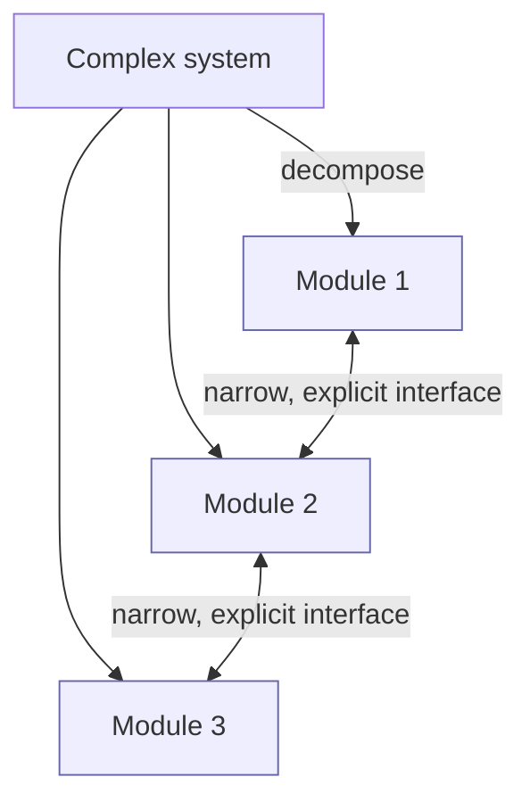
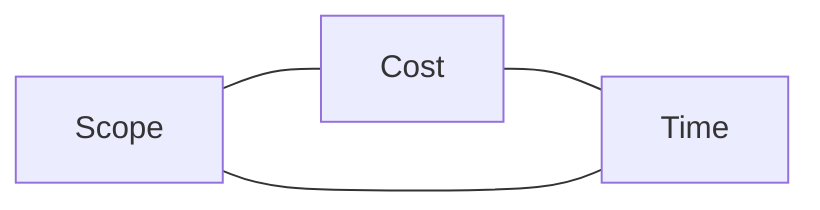

# Chapter 1 — Introduction

> **Where we are.** This opening chapter introduces the ideas that thread through the
> whole book: what software engineering *is*, why requirements are hard, why software is
> intrinsically complex, why defects are inevitable, how projects trade off scope, cost,
> and time, and why software professionals carry real social responsibility. Every later
> chapter is, in some sense, a response to one of these challenges.

Writing a program that works once, on your machine, for input you chose yourself, is
programming. **Software engineering** is what you need when *other people* depend on
that program — when it must keep working next year, after five other developers have
changed it, on inputs no one anticipated, at a scale no single person can hold in their
head. The gap between those two activities is the subject of this book.

## 1.1 What Is Software Engineering?

### 1.1.1 A working definition

A useful definition, adapted from decades of practice:

> **Definition.** *Software engineering* is the disciplined application of principles,
> methods, and tools to build and evolve software systems that are useful, correct
> enough, and economical to change — usually by a **team**, usually under **changing
> requirements**, usually at a **scale** that defeats ad‑hoc effort.

Three words in that definition do a lot of work:

- **Team.** Almost all real software is built by groups. Coordination, communication,
  and shared understanding become first‑class engineering concerns, not afterthoughts.
  This is why Chapter 2 is about *process* and why an entire team project runs alongside
  the concepts (Appendix A).
- **Changing.** Requirements are discovered, not handed down. They shift as users learn
  what they actually want. Methods that assume a frozen specification tend to fail; this
  is why the industry moved toward *iterative, agile* methods (Chapters 2–4).
- **Scale.** Beyond a few thousand lines, no one understands the whole system in detail.
  We manage that with **design and architecture** (Chapters 6–7): dividing the system so
  each part can be understood, changed, and tested in relative isolation.

What separates software engineering from mere coding is the focus on the **why**
behind the **how**. Any competent developer can be told "use dependency injection here."
An engineer understands *what problem it solves* (coupling), *when it helps*, and *when
it is overkill* — and can make the call on a design they have never seen before.

### 1.1.2 A tale of two companies

Consider two startups building the same product — a scheduling app for clinics.

**Company A** hires strong programmers and tells them to "just ship." They skip written
requirements ("we all know what a calendar does"), skip tests ("we'll test by using
it"), and let the architecture emerge by accretion. For three months they look *faster*
than anyone: demos appear weekly. Then the trouble starts. A change to time‑zone
handling breaks appointment reminders in a way no one notices for two weeks. Onboarding
a fourth engineer takes a month because only one person understands the booking logic.
Every new feature has a chance of resurrecting an old bug. Velocity collapses under the
weight of the system's own complexity.

**Company B** spends the first two weeks talking to clinic staff, writing a handful of
user stories, sketching a modular architecture, and setting up automated tests and code
review. Their first demo comes a week later than Company A's. But by the third month
the two teams look nothing alike: new engineers are productive in days, changes are
localized, and a failing test usually catches a regression before it reaches a user.

Neither team is smarter. The difference is **engineering discipline**: Company B paid a
small, early, *predictable* cost to avoid a large, late, *unpredictable* one. The rest
of this book is, in effect, a catalog of the disciplines that make a team behave like
Company B — and an honest account of when each is worth its cost.

### 1.1.3 Where the discipline came from

The phrase "software engineering" was not coined by a standards committee. In the 1960s,
**Margaret Hamilton** led the team at the MIT Instrumentation Laboratory that wrote the
flight software for the **Apollo Guidance Computer** — the code that flew astronauts to
the Moon. At the time, programming was widely seen as a clerical afterthought to the
"real" engineering of hardware. Hamilton pushed the term **software engineering** into
use deliberately, to insist that building flight software deserved — and required — the
same rigor and respect as the aerospace engineering around it.

Her team's discipline paid off in the most public way imaginable. Minutes before the
Apollo 11 lunar landing, the guidance computer was flooded with unexpected input and
began running out of capacity, throwing alarms. Because the software had been engineered
with **priority scheduling** — the ability to shed low-priority work and keep the tasks
that mattered most for landing — it recovered instead of crashing, and the landing
proceeded. A design decision made long before launch, against a failure no one could
fully predict, saved the mission. It remains one of the clearest early proofs that
disciplined software design is not overhead; it is what stands between a system and
catastrophe.

The rest of the industry was learning the same lesson the hard way. Through the 1960s,
hardware performance improved on the exponential curves we now describe with Moore's
Law, while large software projects ran chronically late, blew their budgets, and failed
outright in mission-critical settings — defense, aerospace, banking. Software, not
hardware, had become the bottleneck. In 1968, a NATO-sponsored conference in Garmisch,
Germany gave the problem a name — the **software crisis** — and proposed a remedy in its
very title: the *NATO Software Engineering* conference argued that software should be
developed like an engineering discipline, with deliberate methods, rather than by ad-hoc
programming and heroics.

What ultimately answered the crisis, though, was not a fixed body of rules like a
building code. Software turned out to be too changeable for that. The discipline's
mature answer is **empiricism**: work like an experimental scientist. Iterate in small
steps, seek fast **feedback**, prefer **incremental** progress you can evaluate, run
**experiments** when you are unsure, and let measured evidence — not opinion or
authority — settle the argument. Modern writers such as Dave Farley frame the effective
software engineer as exactly this kind of working scientist. Keep that framing in mind
in Chapter 2: every process you will meet there — Scrum's sprints, XP's tests, the
spiral's risk-driven loops — is an institutionalized version of the same iterate,
measure, and adjust cycle.

## 1.2 The Requirements Challenge

The hardest part of many projects is not building the system right, but figuring out
**which system to build**. Fred Brooks famously argued that the hardest single part of
software work is deciding precisely what to build, because it is the one part whose
mistakes most cripple the result and are hardest to fix later.

### 1.2.1 Identifying users and requirements

A **requirement** is a statement of something the software must do or a quality it must
have. The catch is that the people who *have* the need are usually not the people who
*build* the software, and they rarely state the need precisely. Users describe
solutions ("add a dropdown here") when what they have is a *problem* ("I can't tell
which appointments are unconfirmed"). Part of the engineer's job is to dig past the
requested solution to the underlying goal — because the underlying goal admits better
solutions.

Requirements also come from more than the obvious end user. A clinic scheduling app has:

- **End users** (front‑desk staff) who book appointments,
- **Secondary users** (clinicians) who view schedules,
- **Sponsors** who pay and care about cost and compliance,
- **Regulators** whose rules (privacy, accessibility) are non‑negotiable constraints.

Chapter 3 gives concrete techniques — user stories, features, scenarios, and goal
hierarchies — for eliciting and recording what all of these stakeholders actually need.

### 1.2.2 Dealing with requirements changes

Requirements *change*, and this is normal, not a failure. Users learn from early
versions; markets move; regulations update. The engineering question is not "how do we
prevent change?" but "how do we build so that change is cheap?"

Two broad answers appear throughout the book:

1. **Process‑level:** work in short iterations so that a change costs at most one
   iteration of rework, and so that you are always adapting to the *latest*
   understanding rather than a stale specification (Chapter 2).
2. **Design‑level:** structure the system so that a likely change touches one module,
   not twenty (Chapter 6). *Design for change* is not a slogan; it is a measurable
   property of an architecture.

> **Principle.** The cost of a change should be proportional to the *size* of the
> change, not to the *size* of the system. Achieving that is the central goal of good
> process and good architecture alike.

## 1.3 Software Is Intrinsically Complex

### 1.3.1 Sources of complexity

Some complexity is **essential** — it is inherent in the problem. A tax‑preparation
program is complicated because tax law is complicated; no cleverness removes that.
Other complexity is **accidental** — it comes from our tools, our choices, and our
mistakes: tangled dependencies, unclear names, duplicated logic, leaky abstractions.

Good engineering cannot eliminate essential complexity, but it relentlessly attacks
accidental complexity. Much of this book is about that fight: clear specifications
(Chapter 6), patterns that package proven solutions (Chapter 7), reviews that catch
needless complication (Chapter 8).

Software is also uniquely complex among engineered artifacts for structural reasons:

- It is **invisible** — you cannot see its shape, so you rely on models and diagrams.
- It is **discrete** — a one‑character change can flip behavior completely; there is no
  "small error → small effect" safety net that continuous physical systems enjoy.
- It is **changed constantly** — a bridge is designed once; software is redesigned every
  sprint.

### 1.3.2 Architecture: dealing with program complexity

The primary weapon against complexity is **decomposition**: split the system into parts
small enough to understand, with **well‑defined interfaces** between them, so that you
can reason about one part without holding the others in your head. When the parts and
their connections are chosen deliberately, we call the result the system's
**architecture** (Chapters 6–7).

A good decomposition has **high cohesion** (each module does one thing well) and **low
coupling** (modules depend on each other as little as possible, and only through their
interfaces). These two ideas — introduced here, developed in Chapter 6 — are perhaps the
most important in all of software design.

## 1.4 Defects Are Inevitable

Humans make mistakes; therefore software has defects. The engineering response is not to
pretend otherwise but to build **multiple, overlapping** nets that catch defects early,
when they are cheap to fix.

### 1.4.1 Fix faults to avoid failures

It helps to separate three ideas that everyday speech blurs into "bug":

- A **mistake** (or *error*) is a human action that produces an incorrect result — a
  developer misreads a spec.
- A **fault** (the "defect" in the code) is the resulting flaw in the software — an
  off‑by‑one in a loop.
- A **failure** is the observable event when the running system deviates from correct
  behavior — the report prints the wrong total.

A fault is *latent* until some execution triggers it into a failure. This chain —
mistake → fault → failure — explains why we attack defects at every stage: better
requirements and reviews reduce **mistakes**; static checking and inspection find
**faults** before they run; testing provokes **failures** in a safe setting before users
do. No single technique suffices, which is why Chapters 8 and 9 are complementary.

### 1.4.2 Introduction to testing

**Testing** runs the software on chosen inputs and checks the outputs against what we
expect. It cannot prove the absence of defects — as Dijkstra observed, testing shows the
*presence* of bugs, never their absence — but a well‑designed test suite makes it
*unlikely* that a serious fault survives, and it makes change safe by catching
regressions. Testing is important enough that Chapter 9 is devoted to it, including how
to decide when you have tested *enough* (coverage).

### 1.4.3 Black‑box and white‑box testing

Two complementary viewpoints run through all of testing:

- **Black‑box (specification‑based)** testing chooses inputs from the *specification*,
  ignoring the code. You test *what the system should do*: valid and invalid inputs,
  boundaries, and equivalence classes of behavior. Its strength is that it finds *missing*
  logic and stays valid when the code is rewritten.
- **White‑box (structure‑based)** testing chooses inputs by looking at the *code*,
  aiming to exercise its statements, branches, and paths. Its strength is finding code
  that the specification‑based tests never reach.

Neither subsumes the other, and Chapter 9 shows how to combine them and how to *measure*
their thoroughness with coverage criteria.

## 1.5 Balancing Constraints: The Iron Triangle

Every project runs under three linked constraints:

- **Scope** — how much it does (features, quality).
- **Cost** — how much effort/money it consumes.
- **Time** — when it must ship.

### 1.5.1 Scope. Cost. Time. Pick any two!

These constraints are coupled: you cannot freely fix all three. Want more **scope** at
the same **time**? Pay more **cost** (people, tools). Want to ship sooner without more
cost? Cut **scope**. The classic quip — *"good, fast, cheap: pick two"* — captures the
reality that **quality is not free**, and that a manager who demands more scope, sooner,
for less, is not being ambitious but innumerate.

Agile methods make a deliberate choice here: they **fix time and cost** (a fixed‑length
iteration with a fixed team) and let **scope flex** — you always ship *something* valuable
on the date, even if not everything. Plan‑driven methods more often fix scope and flex
time. Chapters 2 and 4 return to this trade‑off with concrete estimation and
prioritization techniques (story points, MoSCoW, value/cost/risk). And modern software
increasingly ships as a **continuously updated service** rather than a boxed product —
Chapter 12 examines how that reshapes the triangle, when releasing becomes a routine
decision instead of a once‑a‑year event.

> **Pitfall.** Silently absorbing a scope increase by working nights ("crunch") hides
> the trade‑off instead of resolving it. It borrows against future quality — the debt is
> repaid, with interest, as defects and burnout.

## 1.6 Social Responsibility

Software runs medical devices, cars, elections, and financial systems. Engineering
decisions are therefore **ethical** decisions, and "I was just implementing the spec" is
not a defense. This section grounds that claim in three cases.

### 1.6.1 Case study: the Volkswagen emissions scandal

In 2015, regulators discovered that Volkswagen diesel vehicles contained a **defeat
device**: software that detected when the car was being emissions‑tested (from steering,
speed, and time patterns) and switched to a cleaner, lower‑performance mode *only during
the test*. On the road, the cars emitted many times the legal limit of nitrogen oxides.

The software worked *exactly as designed* — which is precisely the problem. This was not
a defect to be fixed by better testing; it was a *requirement* that should never have
been implemented. Engineers wrote that code. The lesson: **correctness is not the same
as rightness.** A professional must sometimes refuse to build what they are asked to
build.

### 1.6.2 The ACM code

The profession has written norms. The **ACM Code of Ethics and Professional Conduct**
and the joint **ACM/IEEE‑CS Software Engineering Code of Ethics** state, among other
principles, that software engineers shall act in the **public interest**, produce work of
**high quality**, be **honest** about their work and its limitations, and maintain
**competence**. These are not decoration: they give an engineer a shared, citable basis
for saying *no*, and for raising concerns without it being merely personal opinion.

### 1.6.3 Case study: the Therac‑25 accidents

Between 1985 and 1987, a radiation‑therapy machine, the **Therac‑25**, delivered
massive radiation overdoses to at least six patients, several fatally. The causes were
a textbook of engineering failures: a **race condition** in concurrent control software
that surfaced only when an operator typed quickly; **removal of the hardware interlocks**
that earlier models used as a safety backstop, leaving software as the sole safeguard;
**reused code** never designed for this configuration; misleading error messages; and a
development culture that assumed the software was correct and dismissed early field
reports.

The Therac‑25 is the canonical warning that in safety‑critical systems, software defects
kill, and that **process, testing, and honest incident response are matters of life and
death** — not bureaucratic overhead.

### 1.6.4 Lessons for software projects

Across these cases, recurring lessons:

1. **Build the right thing, not just the thing right** — question requirements that harm
   users or the public.
2. **Don't rely on a single safeguard** — defense in depth (interlocks *and* software
   checks; reviews *and* tests).
3. **Take field reports seriously** — a dismissed anomaly is a failure waiting to recur.
4. **Concurrency and reuse are risk multipliers** — treat them with extra rigor.
5. **You are accountable for what you ship**, regardless of who asked for it.

## 1.7 Conclusion

Software engineering exists because software is built by teams, for changing needs, at a
scale and complexity that defeat improvisation, with defects that are inevitable and
sometimes dangerous. The rest of this book is organized as a set of responses to exactly
those pressures:

- **Process** (Ch. 2) coordinates the team and embraces change.
- **Requirements** (Ch. 3–5) discover and pin down *what to build*.
- **Design and architecture** (Ch. 6–7) tame complexity so change stays cheap.
- **Static checking and testing** (Ch. 8–9) catch the inevitable defects early.
- **Metrics** (Ch. 10) tell us, with evidence rather than opinion, how we are doing.
- **A team project** (Appendix A) puts it all into practice.

Keep the four cross‑cutting principles in view as you read: *software is complex;
requirements change; defects are inevitable; teams need coordination.* Nearly every
technique in this book earns its place by answering one of them.

---

- **Key takeaways** are summarized above in §1.7.
- Continue to the [Exercises](exercises.md).
- Go deeper with the [Open Resources](resources.md) for this chapter.
