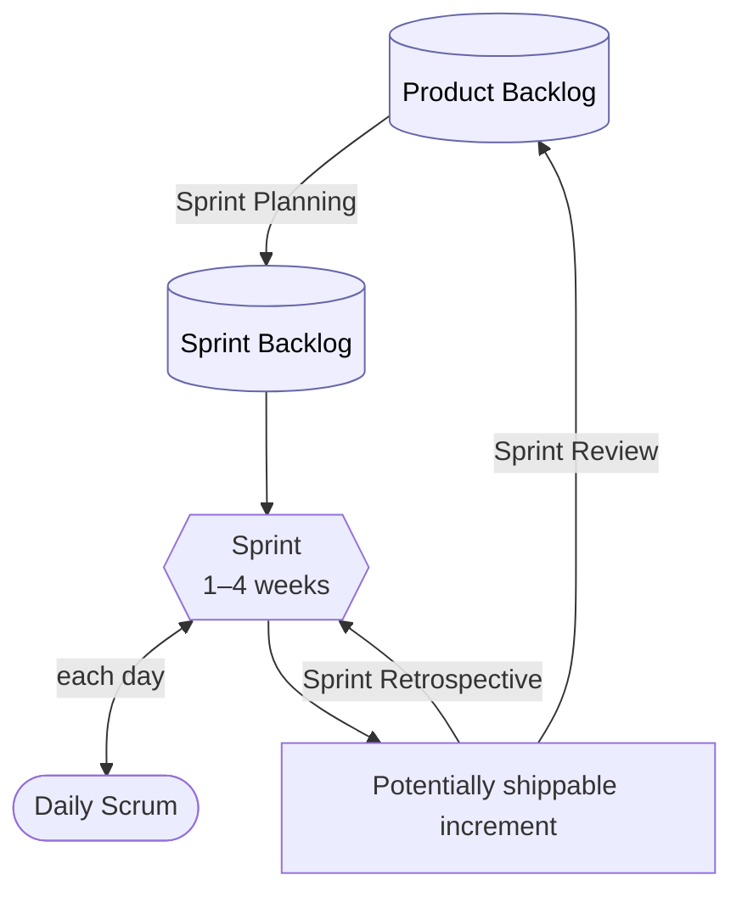
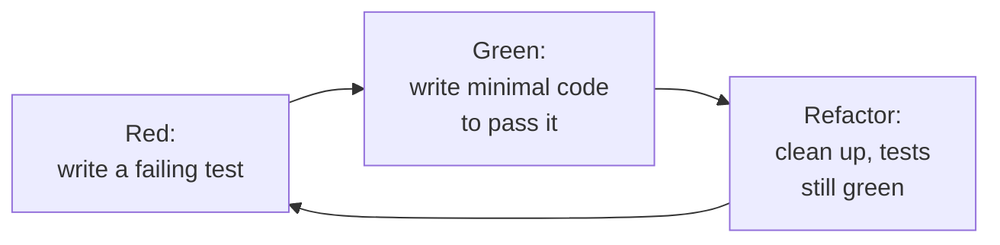
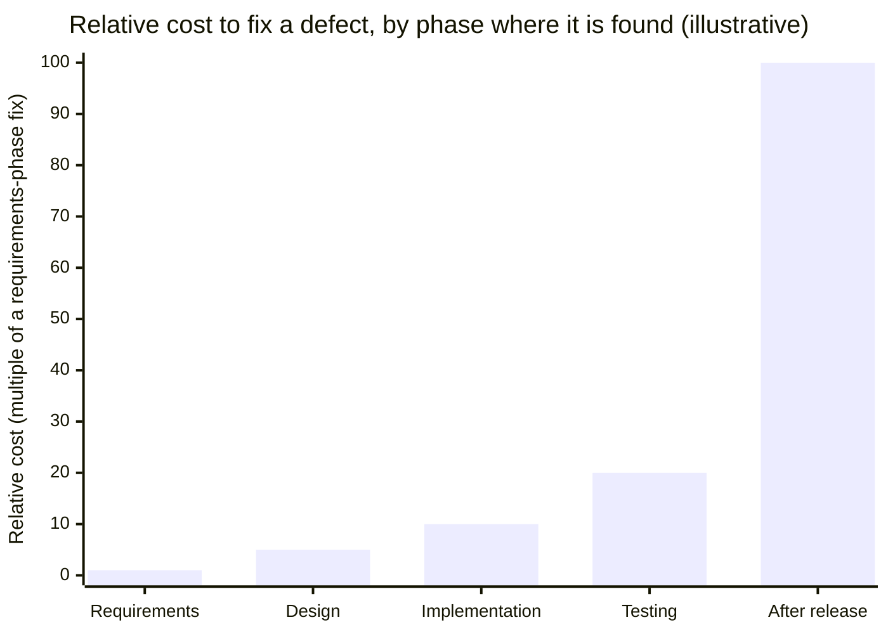
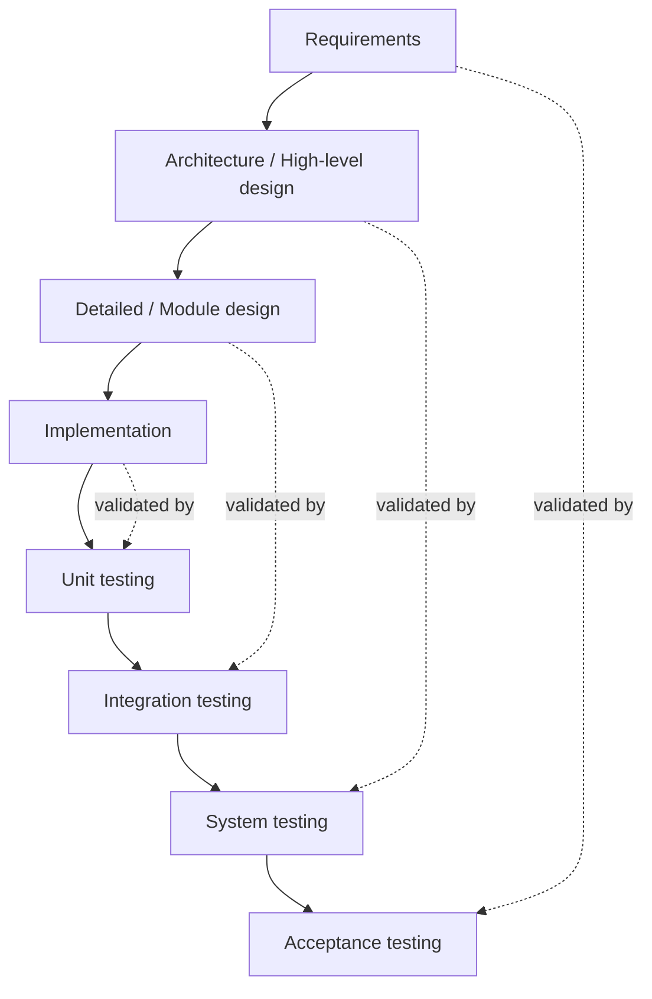
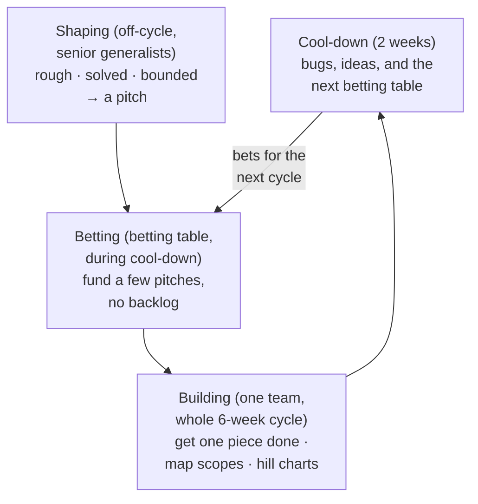

# Chapter 2 — Software Development Processes

> **Where we are.** Chapter 1 argued that software engineering is what you need when
> *other people* depend on your program: a team must coordinate, requirements will
> change, complexity will accumulate, and defects are inevitable. A **development
> process** is the team's standing answer to all four pressures at once — the agreed way
> you turn ideas into working, changeable software without stepping on each other. This
> chapter surveys the main families of process, from lightweight agile frameworks to
> heavier plan-driven models, and gives you a way to *choose* rather than cargo-cult.

A process is not paperwork. It is the set of habits that decides, on an ordinary
Tuesday, who talks to the customer, when code gets reviewed, how a half-finished feature
gets integrated, and what happens when someone finds a bug. Teams that never *choose* a
process still *have* one — an accidental, undocumented one — and it is usually the most
expensive kind. This chapter gives you named, deliberate alternatives and, more
importantly, the judgment to pick among them.

## 2.1 Processes and Values Guide Development

### 2.1.1 What Is a Process?

A **software development process** is a repeatable way of organizing the activities that
turn an idea into deployed, maintained software: understanding what to build, designing
it, writing it, checking it, releasing it, and changing it. Every process has to account
for the same core activities — the differences are in their *order*, their *size*, and
how often you revisit them.

It helps to separate two things that beginners conflate. A **process model** is the
abstract shape: "work in two-week iterations, each producing shippable software" or "gather
all requirements, then design, then build." A **process** — the real one your team lives —
is that model plus a thousand local decisions: which chat channel bugs go in, how long a
code review may sit, whether Friday afternoon is for demos. The model is the skeleton;
your team supplies the flesh.

> **Principle.** A good process makes the *right thing* the *easy thing*. If your process
> only works when everyone is disciplined and heroic, it is not a process — it is a wish.

Why bother naming and choosing a process at all? Because the alternative is that every
recurring decision gets re-litigated every time it comes up, and because a shared process
is how a team of people acts like a single competent engineer instead of a crowd. A
process also encodes *feedback loops* — the points at which you find out you were wrong.
As you will see repeatedly in this chapter, the single biggest thing distinguishing
strong processes from weak ones is **how early and how often they expose mistakes**.

### 2.1.2 Two Development Cultures: Plan versus Grow

Underneath the alphabet soup of methods lie two genuinely different philosophies about
how software should come into being. It is worth naming them plainly.

The **plan-driven** culture treats software like a building. You decide what you are going
to build, in detail, *before* you build it. Requirements are elicited and frozen, a design
is drawn, and construction follows the design. Correctness means "conforms to the spec."
This culture prizes predictability, documentation, and up-front analysis; it is strongest
when the problem is well understood, the cost of a mistake is high, and change is rare —
avionics, medical devices, contracts with fixed deliverables.

The **grow-it** culture treats software like a garden or an organism. You start something
small that works, then evolve it through many small changes, each validated against
reality before the next. Requirements are *discovered* through working software, not
frozen in advance. Correctness means "does something useful for a real user, and can keep
changing." This culture prizes feedback, working code over documents, and adaptability; it
is strongest when the problem is poorly understood, the market is moving, and the cost of
being wrong for two weeks is low.

Neither culture is "right." They are tuned for different risk profiles. Most of this
chapter's methods — Scrum, XP, the spiral — are attempts to get the *feedback* benefits of
growing while keeping *enough* of the discipline of planning. The waterfall and V models
sit at the plan-driven end; you will study them not because you should copy them wholesale
but because understanding *why* they struggle is the fastest route to appreciating what
the agile methods are for.

### 2.1.3 Role Models: Unix Culture and Agile Values

Two well-documented value systems shaped modern practice, and both are worth internalizing
because they are *values*, not procedures — they tell you what to prefer when the manual
runs out.

The **Unix philosophy**, distilled from the culture that built the Unix operating system,
values small tools that each do one thing well and compose through clean interfaces. Its
maxims — *write programs that do one thing well; expect the output of one program to become
the input of another; build a prototype as soon as possible; prefer clarity over
cleverness* — are really a philosophy of **decomposition and iteration**.[^1] The connection to
process is direct: build small, integrate through narrow interfaces, and get something
running early so reality can correct you. Those instincts reappear in every good modern
process.

The **Agile Manifesto** (2001) crystallized the grow-it culture into four value
statements.[^2] In each, both sides have worth, but the left is valued *more*:

- **Individuals and interactions** over processes and tools.
- **Working software** over comprehensive documentation.
- **Customer collaboration** over contract negotiation.
- **Responding to change** over following a plan.

Read carefully: this is a statement about what to trust when the two sides conflict, not
a case against planning or documentation. If your beautiful plan and your working software
disagree, believe the software. If a document and a conversation with the customer
disagree, have the conversation. The manifesto's twelve supporting principles push
further: deliver working software frequently, welcome changing requirements even late,
maintain a sustainable pace, and reflect regularly on how to improve.[^3] Every agile framework
in this chapter is one concrete way to live those values.

> **Principle.** Values outrank rules. A team that follows Scrum's ceremonies to the letter
> while ignoring "responding to change" has missed the point more completely than a team
> that improvises but keeps the feedback loops tight.

### 2.1.4 Selecting a Process Model

There is no universally best process, only a best process *for this project, this team,
this risk profile*. A handful of questions will steer you most of the way:

- **How well is the problem understood?** Poorly understood problems reward iteration and
  early feedback; well-understood ones tolerate up-front planning.
- **How likely and how costly is change?** Volatile requirements favor short iterations;
  stable ones favor plan-driven flow.
- **What does a mistake cost?** A pacemaker's software and a marketing microsite live at
  opposite ends; the former justifies heavy verification, the latter does not.
- **How big and how distributed is the team?** Small co-located teams can lean on
  conversation; large or scattered teams need more explicit coordination.
- **What does the customer relationship allow?** Fixed-price contracts push toward
  plan-driven scope; ongoing partnerships enable collaboration and change.

Most real teams end up **hybrids**: agile iterations wrapped in enough up-front
architecture and enough documentation to satisfy their domain. The goal is not purity but
*fit*. Keep the four pressures from Chapter 1 in view — complexity, change, defects,
coordination — and pick the process that best answers the ones that dominate your project.

## 2.2 Structuring Teamwork: The Scrum Framework

### 2.2.1 Overview of Scrum

**Scrum** is one of the most widely used frameworks for organizing agile teamwork. It is
deliberately minimal: it does not tell you how to write code, design modules, or test. It
tells you how to *organize the team's time and decisions* so that you deliver working
software in short, regular cycles and improve as you go. You supply the engineering
practices (Section 2.3 covers a strong set); Scrum supplies the rhythm.

The heartbeat of Scrum is the **sprint**: a fixed-length iteration, usually one to four
weeks, that produces a potentially shippable increment of the product.[^4] Everything else in
Scrum exists to plan a sprint, keep it on track, ship its result, and learn from it.



The diagram shows the loop you repeat every sprint: pull the highest-value items from the
product backlog into a sprint backlog, work them through the sprint with a daily check-in,
produce an increment, review it with stakeholders (which reshapes the backlog), and reflect
on the process itself. The loop is the point. Each turn gives you a fresh chance to correct
course based on real, working software.

### 2.2.2 Scrum Accountabilities

The 2020 *Scrum Guide* defines three **accountabilities** — the Product Owner, the Scrum
Master, and the Developers — within a single Scrum Team.[^4] (Earlier versions called these
"roles"; the 2020 edition prefers *accountabilities* to stress that they describe
responsibility, not job titles.)[^5] Confusing them is a common source of dysfunction.

The **Product Owner** owns *what* and *why*. They represent the customer and stakeholders,
maintain the product backlog, and — crucially — decide priority. When two features compete,
the Product Owner breaks the tie. A single person holds this accountability so that the team
gets one coherent voice about value, not a committee.

The **Developers** (the people building the product — programmers, testers, designers, and
anyone else doing the work) own *how*. They estimate, design, build, and test. In Scrum they
are **self-managing**: no one outside the group assigns tasks to individuals within it.[^4]
The team collectively commits to a sprint goal and figures out how to meet it.

The **Scrum Master** owns *the process itself*. They are not a project manager who assigns
work; they are a coach and an obstacle-remover. They help the team live the framework,
facilitate the events, and clear the impediments the team cannot clear alone — a flaky test
environment, an unresponsive stakeholder, an unrealistic external deadline. A good Scrum
Master's success is measured by the team needing them less over time.

> **Pitfall.** When the Scrum Master or a manager starts assigning tasks to individuals and
> tracking their personal output, self-organization dies and Scrum degrades into
> micromanagement with extra meetings. The team's *collective* ownership of the sprint goal
> is what makes the framework work.

### 2.2.3 Scrum Events

Scrum's events are the framework's feedback loops made concrete. Each has a purpose; running
them as empty ritual is a classic failure.

- **Sprint Planning** opens the sprint. The team and Product Owner agree on a **sprint goal**
  and select backlog items the team believes it can complete, breaking them into a plan of
  work — the sprint backlog. The output answers two questions: *what* will we deliver, and
  *how* will we approach it.
- The **Daily Scrum** (or standup) is a short, time-boxed check-in — fifteen minutes — where
  the Developers synchronize and re-plan the next day's work toward the sprint goal.[^4] It is
  for the *team*, not a status report to a manager. The useful frame is "are we still on
  track for the goal, and what is in our way?" rather than "what did I do yesterday" theater.
- The **Sprint Review** closes the sprint's *product* loop. The team demonstrates the working
  increment to stakeholders and gathers feedback, which flows back into the product backlog.
  This is where requirements get corrected by contact with reality.
- The **Sprint Retrospective** closes the sprint's *process* loop. The team reflects on how it
  worked — what to keep, what to change — and commits to one or two concrete improvements for
  next sprint. A team that skips retrospectives stops getting better.

### 2.2.4 Scrum Artifacts

Scrum has three artifacts, each paired with a commitment that keeps it honest.[^4]

The **Product Backlog** is the single, ordered list of everything that might be worth doing
to the product — features, fixes, improvements. It is never "done"; it evolves as you learn.
Its commitment is the **Product Goal**, the longer-term objective the backlog serves.

The **Sprint Backlog** is the subset the team pulls in for the current sprint, plus the plan
for delivering it. It is owned by the Developers and updated daily. Its commitment is the
**Sprint Goal**.

Some teams — especially XP-influenced ones — keep a third scope between those two: the
**release backlog**, the subset of the product backlog targeted at a specific release. It
sits between the product backlog (everything the product might ever do) and the sprint
backlog (what the team is doing *this* iteration), and it is the natural artifact of
release planning: you group stories by the release that will carry them, so everyone can
see what "version 2.0" actually means without wading through the whole product backlog.

The **Increment** is the sum of completed backlog items — actual working software that meets
the team's **Definition of Done**, a shared, explicit checklist of what "finished" means
(compiled, reviewed, tested, documented, integrated). The Definition of Done is what stops
"done" from meaning "done on my machine, probably, mostly."

> **Principle.** A backlog item is not done because someone wrote the code. It is done when
> it meets the Definition of Done. A weak Definition of Done is how teams accumulate a pile
> of "finished" work that does not actually ship.

### 2.2.5 Summary

Scrum is a lightweight scaffold for teamwork: three accountabilities, a handful of events,
three artifacts, all serving one idea — deliver working software in short cycles and use each
cycle's feedback to steer. It says nothing about engineering technique, which is both its
flexibility and its danger: Scrum with weak engineering practices produces increments that
*look* done but rot. The next section supplies the practices that make each increment
genuinely solid.

## 2.3 Agile Development: Extreme Programming

Where Scrum organizes the team's *time*, **Extreme Programming (XP)** prescribes the team's
*engineering discipline*. XP takes practices that are known to be good — testing, code
review, integration, simple design — and turns their dials up to "extreme": if testing is
good, test constantly; if review is good, review continuously by programming in pairs; if
integration is good, integrate many times a day.[^6] The two frameworks are complementary, and
teams often combine them.

### 2.3.1 Listening to Customers: User Stories

XP captures requirements as **user stories**: short descriptions of a feature told from the
user's point of view, written to fit on an index card. A common template is *"As a
&lt;role&gt;, I want &lt;capability&gt; so that &lt;benefit&gt;."* For example: *"As a
front-desk clerk, I want to see unconfirmed appointments highlighted so that I can call
those patients before the day fills up."*

A story is deliberately *not* a specification. It is, in the well-worn phrase, a *promise to
have a conversation*.[^7] The card is a placeholder for a discussion between the developers and
the customer about the details — details you will understand far better once you build the
first version and show it. Stories keep requirements small, concrete, and grounded in user
value, and their size makes them easy to prioritize, estimate, and slot into a sprint.

Good stories are often summarized by the acronym **INVEST**: Independent, Negotiable,
Valuable, Estimable, Small, and Testable (each unpacked in
[§3.4.1](../03-user-requirements/#341-guidelines-for-effective-user-stories)).[^8] That last property matters most for the next
section: if you cannot state how you would *test* that a story is satisfied, you do not yet
understand it well enough to build it.

### 2.3.2 Testing: Make It Central to Development

XP's most influential idea is that testing is not a phase that happens *after* development —
it is *part of* development, written continuously, run constantly, and used as a design tool.

The signature practice is **test-driven development (TDD)**, a tight loop often summarized as
**red–green–refactor**:



You write a small automated test for behavior that does not exist yet and watch it fail
(*red*) — proving the test can fail and pinning down what "done" means for this slice. Then
you write the least code that makes it pass (*green*). Then you improve the design while the
test guards against breakage (*refactor*). Repeat in minutes-long cycles.[^9]

One turn of this loop on the clinic app's appointment slots starts *red* — running these
tests fails with a `NameError`, because `slots_overlap` does not exist yet:

```go
func TestOverlappingSlotsConflict(t *testing.T) {
	if !slotsOverlap([2]string{"09:00", "09:30"}, [2]string{"09:15", "09:45"}) {
		t.Error("want overlapping slots to conflict")
	}
}

func TestBackToBackSlotsDoNotConflict(t *testing.T) {
	if slotsOverlap([2]string{"09:00", "09:30"}, [2]string{"09:30", "10:00"}) {
		t.Error("want back-to-back slots not to conflict")
	}
}
```

```java
import static org.junit.jupiter.api.Assertions.*;
import org.junit.jupiter.api.Test;

class SlotsOverlapTest {
  @Test void overlappingSlotsConflict() {
    assertTrue(slotsOverlap("09:00", "09:30", "09:15", "09:45"));
  }

  @Test void backToBackSlotsDoNotConflict() {
    assertFalse(slotsOverlap("09:00", "09:30", "09:30", "10:00"));
  }
}
```

```javascript
const test = require("node:test");
const assert = require("node:assert/strict");

test("overlapping slots conflict", () => {
  assert.ok(slotsOverlap(["09:00", "09:30"], ["09:15", "09:45"]));
});

test("back-to-back slots do not conflict", () => {
  assert.ok(!slotsOverlap(["09:00", "09:30"], ["09:30", "10:00"]));
});
```

```python
def test_overlapping_slots_conflict():
  assert slots_overlap(("09:00", "09:30"), ("09:15", "09:45"))

def test_back_to_back_slots_do_not_conflict():
  assert not slots_overlap(("09:00", "09:30"), ("09:30", "10:00"))
```

```ruby
require "minitest/autorun"

class TestSlotsOverlap < Minitest::Test
  def test_overlapping_slots_conflict
    assert slots_overlap(["09:00", "09:30"], ["09:15", "09:45"])
  end

  def test_back_to_back_slots_do_not_conflict
    refute slots_overlap(["09:00", "09:30"], ["09:30", "10:00"])
  end
end
```

The least code that makes both tests pass turns the run *green*:

```go
func slotsOverlap(a, b [2]string) bool {
	return a[0] < b[1] && b[0] < a[1]
}
```

```java
static boolean slotsOverlap(String aStart, String aEnd, String bStart, String bEnd) {
  return aStart.compareTo(bEnd) < 0 && bStart.compareTo(aEnd) < 0;
}
```

```javascript
function slotsOverlap(a, b) {
  return a[0] < b[1] && b[0] < a[1];
}
```

```python
def slots_overlap(a, b):
  return a[0] < b[1] and b[0] < a[1]
```

```ruby
def slots_overlap(a, b)
  a[0] < b[1] && b[0] < a[1]
end
```

Why work this way? Three reasons. First, tests written *first* are honest — they cannot be
quietly shaped to match whatever the code happens to do. Second, the growing suite is a
**regression net**: it lets you change code fearlessly, because a break announces itself
immediately, which is what makes continuous refactoring safe. Third, writing the
test first forces you to use your own interface before you build it, which surfaces awkward
designs early. Testing, in XP, is less about catching bugs at the end and more about
*driving* the design and *enabling* change — the very properties Chapter 1 said good
engineering is for.

### 2.3.3 When to Design?

Plan-driven cultures design everything up front. XP takes the opposite stance: **design a
little, all the time.** Because requirements are discovered, a comprehensive up-front design
is largely a guess about a future you do not yet understand — and guesses about the future
are where accidental complexity comes from.

XP's answer rests on three habits. **Simple design**: build the simplest thing that could
possibly work for the stories you have *now*, not the ones you imagine you might have later
(resisting speculative generality is sometimes captured as YAGNI — *you aren't gonna need
it*).[^10] **Refactoring**: continuously improve the design of existing code
without changing its behavior, so the structure keeps pace with your growing understanding.
And the **test suite** that makes refactoring safe. Together these let the design *emerge*:
it is always as good as your current understanding, and it improves as your understanding
does, instead of being frozen at the moment you understood least.

This does not mean *no* thinking ahead. Architectural decisions that are expensive to reverse
— the shape of your data, a choice of framework, a security model — still deserve deliberate
up-front thought, a point the spiral and V models (Sections 2.5 and 2.7) take seriously. The
XP claim is narrower and correct: do not *elaborate* a detailed design for requirements you
have not yet validated.

> **Pitfall.** "Emergent design" is not a license to skip thinking. Without disciplined
> refactoring and a strong test suite, "we'll design as we go" becomes "we'll never design,"
> and the codebase collapses into the tangle Chapter 1 called accidental complexity.

### 2.3.4 A Scrum+XP Hybrid

In practice, many strong teams run **Scrum for the process and XP for the engineering**.
Scrum gives the cadence — sprints, backlog, review, retrospective — and the roles that keep
priorities and impediments owned. XP fills the sprint with the discipline that makes each
increment genuinely done: TDD, pair or peer review, refactoring, and **continuous
integration**, in which everyone merges into a shared mainline many times a day and an
automated build-and-test pipeline verifies each merge.[^11] (Chapter 12 dissects that pipeline
stage by stage and follows it all the way to production.)

The combination is more than the sum of its parts. Scrum without engineering practice
produces increments that pass the demo and fail in maintenance; XP without a coordinating
rhythm can drift without clear priorities or stakeholder feedback. Together, Scrum's *what
and when* meets XP's *how well*, and the Definition of Done can honestly include "tested,
reviewed, integrated" because the engineering practices actually deliver those properties.

### 2.3.5 Summary

XP treats testing, review, integration, and design as continuous activities rather than
phases, turning known-good practices up to the point where they reshape how you work.
Requirements arrive as user stories — promises to converse — and design emerges under the
protection of an automated test suite. Paired with Scrum's cadence, XP's practices are how a
team keeps each short increment both *valuable* and *solid*.

## 2.4 Limitations of Waterfall Processes

To appreciate why the industry moved toward iteration, you have to understand what it moved
*away from*. The **waterfall** model runs the project as a single pass through a strict
sequence of phases — requirements, design, implementation, verification, maintenance — with
each phase completed and signed off before the next begins, like water flowing down a series
of steps and never back up. (One historical note before we critique it: this strict,
single-pass model is the *textbook* waterfall. Royce's 1970 paper — the usual citation —
presented the strict sequence and then argued it was risky and needed feedback and
iteration.[^12] The industry largely adopted the diagram and skipped the warning; this section
critiques the model as it was actually practiced.)

Its appeal is real: it is simple to explain, easy to plan and bill against, and it front-loads
the thinking. For well-understood problems with stable requirements, a waterfall-ish
flow can work fine. The trouble is that most software is *not* well understood up front, and
waterfall's structure hides that trouble until the most expensive possible moment.

### 2.4.1 The Perils of Big-Bang Integration and Testing

Waterfall's deepest flaw is *when* it finds out it is wrong. Because verification is a late
phase, the pieces built in isolation are first brought together — **integrated** — near the
end, and the system is first exercised as a whole near the end. This is **big-bang
integration**: months of separately developed components meeting for the first time at once.

Two bad things happen at once. Integration surfaces every mismatched assumption between
components simultaneously — module A expected meters, module B produced feet; A assumed the
list was sorted, B never promised it — and untangling many interacting failures at once is
far harder than fixing them one at a time. Meanwhile, testing at the end means that
requirements mistakes made in month one — the truly expensive kind — are discovered in month
ten, after everything built on them must be unwound. The project can look healthy right up to
the integration phase, then fall apart, because *all* the risk was deferred to the end.

> **Pitfall.** In a strict waterfall, the moment you first learn whether the system actually
> works is also the moment you have the least time and money left to fix it. Deferring
> integration and testing does not remove risk; it concentrates it where it does the most
> damage.

The agile answer is precisely the opposite: **continuous integration** merges constantly so
that at most one small change's worth of mismatch surfaces at a time, and **continuous
testing** exercises the system every day so mistakes are caught while they are cheap. Both
are direct reactions to the big-bang pathology.

### 2.4.2 The Waterfall Cost-of-Change Curve

The economic argument against waterfall is captured by the **cost-of-change curve**. Studies
of real projects have long observed that the cost of fixing a defect or accommodating a change
rises steeply the later it is discovered — a requirements error caught during requirements is
nearly free to fix; the same error caught after release can cost orders of magnitude more,
because so much work has been built on top of the mistake.[^13]



The exact multipliers vary by study and context, and modern tooling flattens the curve
considerably — automated tests and fast deploys make late fixes cheaper than they once were.
But the *shape* is robust and it drives process design: if late changes are dramatically more
expensive than early ones, then a process that *defers* discovery of problems to the end is
economically backwards. Every iterative method is, in part, a strategy for sliding discovery
leftward — finding your mistakes while they are still cheap.

### 2.4.3 Managing the Risks of Waterfall Processes

Waterfall is not always the wrong choice, and when constraints force something waterfall-like
— a fixed-scope contract, a regulatory sign-off gate — you can blunt its risks:

- **Prototype the risky parts first.** Build a throwaway prototype of the hardest or least
  understood piece before committing to the full design, so you learn early.
- **Review at every phase boundary.** Since you cannot rely on late testing to catch early
  mistakes, inspect requirements and designs rigorously before building on them (Chapter 8).
- **Integrate incrementally even within a plan.** You can keep the phased structure while
  still bringing components together in stages rather than all at once.
- **Keep the phases short and iterate the whole thing.** A series of small waterfalls is much
  safer than one giant one — which is, in effect, how iterative development was born.

Notice that every mitigation pulls waterfall *toward* iteration. That is the tell: the fixes
for waterfall's problems are the defining features of the methods that replaced it.

### 2.4.4 Summary

Waterfall's simplicity is seductive and its structure is treacherous: by deferring
integration and testing to the end, it concentrates risk exactly where you can least afford
it, and the cost-of-change curve makes late discovery of mistakes brutally expensive. The
model is defensible only when requirements are genuinely stable and well understood — and even
then, incremental integration and phase reviews are cheap insurance.

## 2.5 Levels of Design and Testing: V Processes

### 2.5.1 Overview of V Processes

The **V-model** is a refinement of waterfall that fixes one specific complaint: it makes
testing a first-class citizen and ties every level of design to a matching level of testing.
Draw the phases descending on the left and ascending on the right, forming a "V." The left
arm is decomposition — from broad requirements down to detailed design; the right arm is
integration and verification — from small units back up to the whole system.



The dashed lines carry the model's central insight: each design activity has a corresponding
test activity that checks *whether that design was right*. The implementation is verified by
unit tests; detailed module design by integration tests, which check that the pieces fit
together the way the design claimed; the architecture by system tests; and the original
requirements by acceptance tests. This pairing means you plan the tests *while*
you do the design, not as an afterthought — and it makes explicit that different mistakes are
caught at different levels.

### 2.5.2 Levels of Testing from Unit to Acceptance

The right arm of the V names four levels of testing, each with a distinct question and scope.
Getting these distinct is one of the most useful mental models in all of software
engineering, and every level maps back to a decision made on the left arm.

- **Unit testing** checks the smallest pieces — a single function, class, or module — in
  isolation, usually by the developer who wrote them. Its question: *does this piece do what
  its detailed design says?* Unit tests are fast, numerous, and the backbone of TDD.
- **Integration testing** checks that units work *together* — that the interfaces and
  assumptions between modules actually line up. Its question: *do these pieces fit?* This is
  precisely the risk that big-bang integration mishandles; doing it incrementally is how you
  find interface mismatches one at a time.
- **System testing** exercises the *whole* integrated system against its specified behavior,
  including non-functional qualities like performance, security, and reliability. Its
  question: *does the complete system meet its specification?*
- **Acceptance testing** checks the system against the *customer's* needs, ideally with the
  customer involved. Its question: *did we build the right thing?* Passing system tests proves
  you built the system right; passing acceptance tests proves you built the right system — and
  the two can diverge when the specification itself was wrong.

These levels are not tied to waterfall; agile teams run all four, just continuously rather
than in a final phase. The V-model's lasting contribution is its *vocabulary*: it gives you
the ladder of testing levels that every process, iterative or not, has to climb.

### 2.5.3 Summary

The V-model repairs waterfall's neglect of testing by pairing each level of design with a
matching level of verification, from unit up to acceptance. Its schedule is still essentially
sequential and inherits waterfall's late-integration risks, but its ladder of testing levels —
unit, integration, system, acceptance — is a permanent part of every engineer's toolkit,
whatever process you adopt.

## 2.6 Additional Project Risks

Process choice is really **risk management** in disguise, so it pays to think directly about
risk. A **risk** is a potential future problem: something that has not gone wrong yet but
could, with some probability, cause some loss. Good teams do not just react to problems; they
enumerate the likely ones in advance and attack the biggest first.

### 2.6.1 Rough Risk Assessment

You do not need a heavy methodology to reason about risk usefully. A rough assessment ranks
risks by **exposure** — roughly, *probability × impact* — so you spend your limited attention
where it matters.[^14] A defect that is very likely but trivial ranks below one that is unlikely
but catastrophic.

Common risk categories on software projects include:

- **Requirements risk:** you are building the wrong thing, or requirements will churn.
- **Technical risk:** an unproven technology, algorithm, or integration might not work.
- **Schedule and estimation risk:** the work is larger than estimated.
- **People risk:** key contributors leave, or the team lacks a needed skill.
- **External risk:** a dependency, vendor, or regulator behaves unexpectedly.

The value of the exercise is not the list but the *response*. For each significant risk you
choose a strategy — **avoid** it (change the plan so it cannot occur), **mitigate** it
(reduce its probability or impact, e.g. prototype the risky component early), **transfer** it
(insurance, a vendor SLA), or knowingly **accept** it. The single most powerful risk-reduction
technique in software is the one this whole chapter has been circling: **iterate**, so that
you confront each risk early and cheaply instead of late and expensively.

### 2.6.2 An Iterative Project That Succeeded

Consider how iteration handles risk in practice. Imagine a team building a new patient-portal
feature that lets people book their own clinic appointments — a genuinely uncertain project,
since no one is sure patients will use self-service or that it will integrate cleanly with the
existing scheduling system.

An iterative team attacks the uncertainty head-on. In the first two-week sprint they build a
deliberately thin slice: one appointment type, no payments, booking against a copy of the real
schedule, shown to a dozen real patients. That tiny increment answers the project's two biggest
questions almost immediately — *will patients use it?* and *does the integration work?* — while
the cost of being wrong is two weeks, not two quarters. Each subsequent sprint adds a slice
(more appointment types, reminders, cancellations), and each sprint review lets real usage
reshape the backlog. Requirements that looked important on paper get dropped when usage data
contradicts them; unforeseen needs get added. The project succeeds not because the team guessed
right up front — they didn't — but because the process let them be *wrong cheaply and often*,
converging on the right system through feedback. This is the grow-it culture paying off exactly
as advertised.

### 2.6.3 A Troubled Project

Now a cautionary tale, drawn from a widely discussed episode in the history of web browsers. In
the mid-1990s, a leading browser maker shipped a hugely successful early version of its product.
For the next major version, rather than evolving the working codebase, the organization
undertook a sweeping rewrite of large parts of the system at once — a big, ambitious, mostly
up-front effort to build the successor.[^15]

The rewrite proved far harder and slower than planned. Because so much was rebuilt
simultaneously, the familiar big-bang pathology appeared: integration was painful, the new
system was unstable for a long stretch, and the release slipped badly while competitors kept
shipping steady improvements to their own products. By the time the ambitious successor
stabilized, the organization had bled schedule, quality, and market position. Commentators
later treated the episode as a textbook argument against throwing away working software for a
grand rewrite — you discard hard-won knowledge embedded in code that already handles a thousand
edge cases, and you take on enormous integration and schedule risk all at once.[^15]

The contrast with Section 2.6.2 is the lesson. The successful project reduced risk by evolving a
working system in small, validated steps. The troubled one *concentrated* risk into a single
large leap — the same mistake, structurally, as big-bang integration and strict waterfall.
Whether the risk is technical, schedule, or requirements, the pattern repeats: large,
late-validated bets are dangerous; small, early-validated ones are safe.

> **Principle.** Prefer evolving working software to rewriting it wholesale. A rewrite throws
> away embedded knowledge and takes on all its risk at once — exactly the concentration of risk
> that good process exists to avoid.

## 2.7 Risk Reduction: The Spiral Framework

### 2.7.1 Overview of the Spiral Framework

The **spiral model** is an explicitly **risk-driven** process framework.[^16] Its central claim is
that the *risks* of your particular project — not a fixed schedule — should decide what you do
next. It is best understood as a meta-framework rather than a rival to waterfall or agile: at
each turn it tells you *which* approach to apply based on where your biggest uncertainties lie.

You proceed in a series of loops, each spiraling outward as the project grows more concrete and
more expensive. Every loop passes through four kinds of activity:

1. **Determine objectives, alternatives, and constraints** for this round — what are we trying
   to achieve, and how might we achieve it?
2. **Evaluate alternatives and identify and resolve risks** — this is the heart of the model.
   Find the biggest current risk and attack it, often by building a **prototype** or running an
   experiment to turn an unknown into a known.
3. **Develop and verify** the deliverable for this round.
4. **Plan the next round** — and, critically, decide whether to continue at all.

Because each loop starts by confronting the biggest remaining risk, the spiral front-loads
learning about whatever is most likely to sink the project. A wildly uncertain project spends
early loops on prototypes and feasibility studies; a maturing one settles into more
waterfall-like build-and-verify loops. The model also builds in explicit *go/no-go* decisions:
after each loop you may decide the risks are too high and stop, having spent only that loop's
budget rather than the whole project's.

The spiral's spirit and the agile spirit are close cousins. Both iterate, both prize early
feedback, both refuse to bet everything on an up-front plan. The spiral emphasizes *explicit
risk analysis and prototyping* and suits larger, higher-stakes projects; agile methods
emphasize *frequent working software and customer collaboration* and suit smaller, faster ones.
Both are answers to the same question the whole chapter has asked: how do you find out you were
wrong while it is still cheap to be wrong?

### 2.7.2 Summary

The spiral model makes risk the steering wheel: each loop identifies the biggest current
uncertainty, resolves it (often by prototyping), delivers and verifies a piece, and decides
whether to keep going. It generalizes both plan-driven and agile instincts into a single
risk-first frame, and it is the clearest statement of this chapter's core idea — that a good
process is, above all, a machine for reducing risk early.

## 2.8 Shape Up: Fixed Time, Variable Scope

Scrum, XP, and the spiral all iterate in short cycles and carry unfinished work forward on
a backlog. **Shape Up** — the method Basecamp published as a free online book — keeps the
fixed cadence but makes three sharp bets that set it apart: it fixes *time* and flexes
*scope*, it refuses to keep a backlog, and it hands a team a whole shaped problem rather
than a list of tasks.[^17] It belongs in this chapter because it questions assumptions the
other models share.

Shape Up runs in three phases that overlap across the calendar:



**Shaping (what to build, and how much it's worth).** Before any team is committed, senior
people *shape* the work: they set an **appetite** — the fixed time the problem is worth
(see [§4.2.4](../04-requirements-analysis/#424-appetite-fixed-time-variable-scope))
— and design a solution that is deliberately **rough** (leaves room for the builders'
judgment), **solved** (the main elements are worked out, not vague), and **bounded** (it
says explicitly what is *out* of scope). The output is a **pitch**: problem, appetite,
solution sketch, rabbit holes to avoid, and no‑gos. Shaping is where **rabbit holes** —
unsolved design problems or untested technical assumptions — get found and removed *before*
anyone commits.[^18]

Appetites come in two standard batch sizes. A **small batch** is a designer and one or two
programmers for one to two weeks; a **big batch** is that same small team for the full
six‑week cycle. An idea that will not fit even a big batch is not given more time — it is
narrowed until it fits, because the appetite, not the idea, is fixed.[^18]

Shaping itself follows four steps, in order:

1. **Set boundaries.** Decide how much time the raw idea is *worth* — the appetite — and
   what the problem actually is.
2. **Rough out the elements.** Sketch a solution at a level higher than wireframes, moving
   fast and exploring alternatives while the drawing is still cheap.
3. **Find risks and rabbit holes.** Hunt for holes and unanswered questions, then amend
   the solution and spell out the tricky spots before they can swallow a team.
4. **Write the pitch.** A formal write‑up of problem, appetite, solution, rabbit holes,
   and no‑gos, ready for the betting table.

Who does this work? A **shaper** is a technically literate generalist doing strategic
design work. They need not be the team's best programmer — they may not write production
code at all — but they must know what is cheap and what is expensive to build, or their
sketches will make promises the appetite cannot keep.

**Betting (deciding, without a backlog).** During the two‑week **cool‑down** between
cycles, a small **betting table** of senior people reviews the shaped pitches and *bets* on
a few for the next cycle. A **bet** commits one team to one project for the whole cycle,
uninterrupted, with the expectation of finishing.[^19]

> **Principle — bets, not backlogs.** Shape Up keeps *no backlog*. Unchosen ideas simply
> lapse; if one really matters, it comes back and gets re‑pitched. This trades the comfort
> of a tracked list for freedom from the "always behind" guilt and the grooming overhead of
> a backlog that only ever grows.

No backlog also implies an etiquette for new **raw ideas**. The default answer to any raw
idea is a soft *"interesting — maybe someday,"* never an on‑the‑spot yes or no, because
the real gate is not approval but *shaping*: only shaped work can be bet on, and a raw
idea has not yet earned that. Do not shut down an idea you do not understand, and keep a
poker face even about ideas you love — visible enthusiasm commits you before anyone has
checked for rabbit holes. Bugs get no privileged lane either; Shape Up handles them three
ways: fix them during cool‑down (that slack time exists partly for this), pitch a big
bug at the betting table like any other project, or run an occasional dedicated
**bug‑smash** cycle where the whole team pays down accumulated defects.[^19]

**Building (hand over the whole problem).** The team gets the pitch, *not* a task
breakdown — "splitting the project into tasks up front is like putting the pitch through a
paper shredder."[^20] They define their own tasks and own how the pieces fit. Three building
practices are worth borrowing regardless of your process:

- **Get one piece done.** Finish one *vertically integrated* slice early — front end wired
  to back end so *something works* in week one — instead of building all of one layer then
  all of the next (where nothing works until the end). Pick a first slice that is **core,
  small, and novel** so it proves the concept and kills the biggest uncertainty first.
- **Map the scopes.** Organize the project into **scopes** — parts that can be built,
  integrated, and finished *independently* — named by function, not by layer or person.
  Scopes become the shared language for status.
- **Hill charts for progress.** Track each scope as a dot on a hill: **uphill** is
  *figuring it out* (unknowns remain), **downhill** is *just execution* (all unknowns
  solved). A dot that stops moving is a raised hand. This exposes uncertainty in a way a
  to‑do list cannot — see [§10.3](../10-quality-metrics/#103-graphical-displays-of-data-sets).

**The circuit breaker.** When the cycle ends, the project ships or it is *dropped* — it does
**not** automatically get an extension. The most you can lose is one cycle. Extending is
allowed only if what remains is genuine must‑have work that is *entirely downhill*; any
remaining uphill work means the shaping was wrong, so the project goes back to shaping
rather than dragging on.[^21]

**Shape Up vs. Scrum.** The contrast sharpens both. Scrum re‑plans every 1–4‑week sprint
and rolls unfinished stories forward on a *backlog*; Shape Up makes a *one‑shot bet* over a
longer six‑week cycle with *no* backlog and *no* auto‑extension. Scrum layers daily
standups, reviews, and retrospectives; Shape Up gives one integrated team full autonomy for
the whole cycle and reads status from hill charts instead of ceremonies. Neither is
universally right — but Shape Up is a clean demonstration of this chapter's theme that a
process is a set of *bets about where your risk lives*.

## 2.9 Conclusion

Strip away the terminology and every process in this chapter is answering one question:
**how do you find out you were wrong while being wrong is still cheap?** Plan-driven models —
waterfall and the V — bet on getting the answer right up front and pay dearly when the bet
fails, because they defer integration and testing to the end where the cost-of-change curve is
steepest. Agile frameworks — Scrum for cadence, XP for engineering discipline — bet instead on
short cycles that expose mistakes constantly, while the spiral makes that same instinct
explicit by steering each loop toward the biggest remaining risk.

The practical takeaways connect straight back to Chapter 1's four pressures:

- **Coordination:** a named, deliberate process lets a team of people act like one competent
  engineer instead of a crowd; Scrum's accountabilities, events, and artifacts are one proven
  scaffold.
- **Change:** short iterations make change cheap by ensuring any rework costs at most one
  iteration, and by always adapting to your *latest* understanding.
- **Defects:** continuous testing and integration, structured by the V-model's levels of
  verification, catch faults while they are cheap instead of concentrating them in a final
  big bang.
- **Complexity:** simple design plus disciplined refactoring under a strong test suite lets
  structure keep pace with understanding, instead of freezing it at the moment you knew least.

There is no universally best process — only a best process for *this* project's risks, team,
and constraints. Your job as an engineer is not to pledge allegiance to a methodology but to
read the risks in front of you and choose, and adapt, the process that confronts them earliest
and most cheaply.

---

### Sources

[^1]: M. D. McIlroy's Unix maxims (1978), as collected in Eric S. Raymond, *The Art of Unix Programming*, ch. 1 (2003). [catb.org](http://www.catb.org/esr/writings/taoup/html/ch01s06.html).
[^2]: Kent Beck et al., *Manifesto for Agile Software Development* (2001). [agilemanifesto.org](https://agilemanifesto.org/).
[^3]: *Principles behind the Agile Manifesto* (2001). [agilemanifesto.org](https://agilemanifesto.org/principles.html).
[^4]: Ken Schwaber and Jeff Sutherland, *The Scrum Guide* (2020). [scrumguides.org](https://scrumguides.org/scrum-guide.html).
[^5]: Ken Schwaber and Jeff Sutherland, *Scrum Guide Revisions* (2020). [scrumguides.org](https://scrumguides.org/revisions.html).
[^6]: Kent Beck with Cynthia Andres, *Extreme Programming Explained: Embrace Change*, 2nd ed. (2004). [informit.com](https://www.informit.com/store/extreme-programming-explained-embrace-change-9780321278654).
[^7]: Ron Jeffries, *Essential XP: Card, Conversation, Confirmation* (2001); the phrase "a promise for a conversation" is Alistair Cockburn's. [ronjeffries.com](https://ronjeffries.com/xprog/articles/expcardconversationconfirmation/).
[^8]: Bill Wake, *INVEST in Good Stories, and SMART Tasks* (2003). [xp123.com](https://xp123.com/articles/invest-in-good-stories-and-smart-tasks/).
[^9]: Kent Beck, *Test-Driven Development: By Example* (2002). [informit.com](https://www.informit.com/store/test-driven-development-by-example-9780321146533).
[^10]: Martin Fowler, *Yagni* (2015). [martinfowler.com](https://martinfowler.com/bliki/Yagni.html).
[^11]: Martin Fowler, *Continuous Integration* (2024 revision). [martinfowler.com](https://martinfowler.com/articles/continuousIntegration.html).
[^12]: Winston W. Royce, *Managing the Development of Large Software Systems*, Proceedings of IEEE WESCON (1970). [cs.umd.edu](https://www.cs.umd.edu/class/spring2003/cmsc838p/Process/waterfall.pdf).
[^13]: Barry Boehm and Victor R. Basili, *Software Defect Reduction Top 10 List*, IEEE Computer 34(1) (2001), summarizing data reported in Barry W. Boehm, *Software Engineering Economics* (Prentice-Hall, 1981). [cs.umd.edu](https://www.cs.umd.edu/projects/SoftEng/ESEG/papers/82.78.pdf).
[^14]: Barry W. Boehm, *Software Risk Management: Principles and Practices*, IEEE Software 8(1) (1991). [cs.virginia.edu](https://www.cs.virginia.edu/~sherriff/papers/Boehm%20-%201991.pdf).
[^15]: Joel Spolsky, *Things You Should Never Do, Part I* (2000). [joelonsoftware.com](https://www.joelonsoftware.com/2000/04/06/things-you-should-never-do-part-i/).
[^16]: Barry W. Boehm, *A Spiral Model of Software Development and Enhancement*, IEEE Computer 21(5) (1988). [cse.msu.edu](https://www.cse.msu.edu/~cse435/Homework/HW3/boehm.pdf).
[^17]: Ryan Singer, *Shape Up: Stop Running in Circles and Ship Work that Matters* (Basecamp, 2019). [basecamp.com/shapeup](https://basecamp.com/shapeup).
[^18]: Ryan Singer, *Shape Up*, Part One: Shaping, chs. 2–6 (2019). [basecamp.com](https://basecamp.com/shapeup/1.1-chapter-02).
[^19]: Ryan Singer, *Shape Up*, Part Two: Betting, chs. 7–9 (2019). [basecamp.com](https://basecamp.com/shapeup/2.1-chapter-07).
[^20]: Ryan Singer, *Shape Up*, Part Three: Building, chs. 10–13 (2019). [basecamp.com](https://basecamp.com/shapeup/3.1-chapter-10).
[^21]: Ryan Singer, *Shape Up*, ch. 14, "Decide When to Stop" (2019). [basecamp.com](https://basecamp.com/shapeup/3.5-chapter-14).

---

- **Key takeaways** are summarized above in §2.9.
- Continue to the [Exercises](exercises.md).
- Go deeper with the [Open Resources](resources.md) for this chapter.
