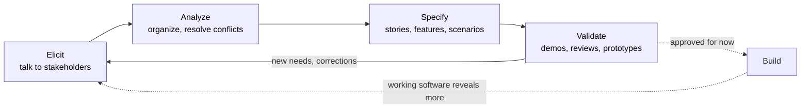
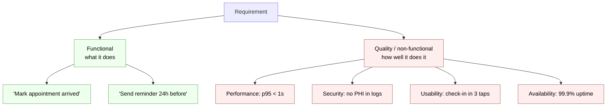
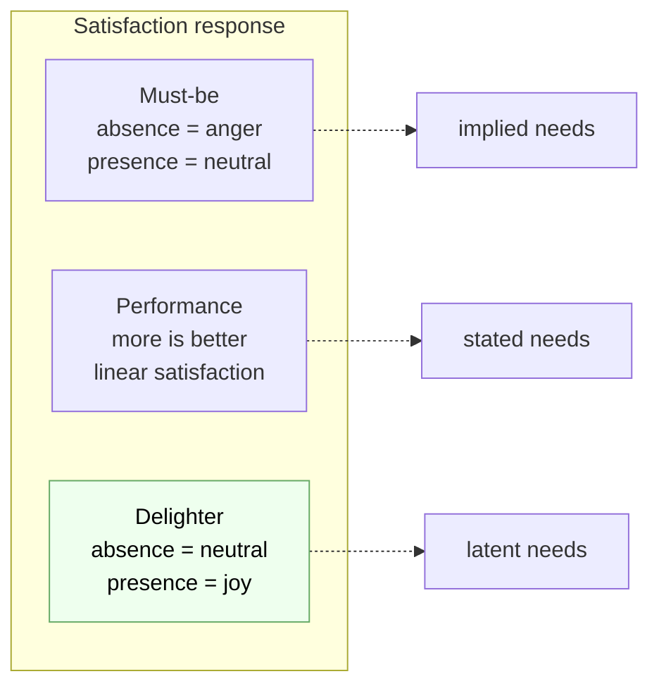
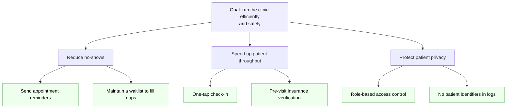
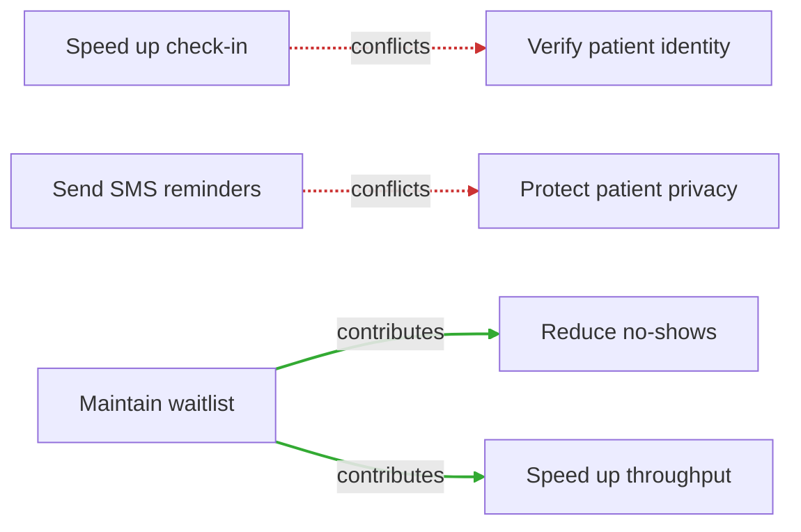
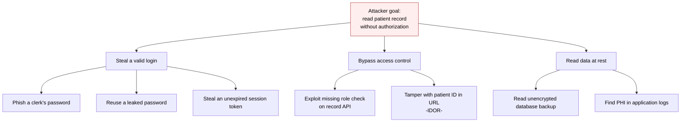

# Chapter 3 — User Requirements

> **Where we are.** Chapter 1 argued that the hardest part of many projects is deciding
> *which* system to build, and Chapter 2 gave you a process to build it in short, adaptive
> iterations. This chapter zooms in on the front of that process: how you discover what
> real people need, how you write it down so a team can act on it, and how you keep those
> written needs honest as understanding shifts. Everything downstream — design, tests,
> metrics — inherits the quality of the requirements you produce here. Get this wrong and
> you will build a beautiful, well‑tested answer to the wrong question.

A **requirement** is the bridge between a person with a problem and a team with the skill
to solve it. That bridge is where most projects quietly succeed or fail. You can recover
from a bad database choice; you refactor it. You rarely recover cheaply from having built
the wrong feature for six months, because the cost is not just the wasted code — it is the
wasted *time*, the eroded trust of the people who told you what they wanted and watched
you miss it. This chapter is about narrowing that gap between what people need and what you
believe they need, and doing so continuously, because the gap never fully closes.

## 3.1 What Is a Requirement?

A requirement is a statement of something the software must **do** for its users, or a
**quality** it must have while doing it. That sounds simple, and the trouble hides in the
simplicity. Requirements are written in natural language, by and for humans, about needs
that the humans themselves often cannot articulate. They are simultaneously the most
important artifact in a project and the least precise. Learning to work skillfully in that
tension — to extract precision from ambiguity without pretending the ambiguity is gone — is
the core skill of this chapter.

> **Definition.** A *requirement* is an agreed statement of a need that a stakeholder has
> of the system: either a **behavior** the system must exhibit or a **property** it must
> possess. A requirement is *not* a design; it says *what* and *why*, not *how*.

That last sentence matters more than it looks. When a user says "add a dropdown," they
have handed you a design dressed up as a need. Your job is to reach past it to the need
underneath — "I need to pick one clinic from a short list without typos" — because the need
admits *better* designs than the one the user happened to imagine. Requirements work is
largely the discipline of not accepting the first solution offered as if it were the
problem.

### 3.1.1 The Basic Requirements Cycle

Requirements are not gathered once and filed away. They move through a repeating cycle,
and the health of a project is largely the health of this loop. You **elicit** needs from
stakeholders, **analyze** and organize them into something coherent, **specify** them in a
form the team can act on, and **validate** that what you specified is actually what people
need — which surfaces new needs and misunderstandings, sending you around again.



Notice two things about this diagram. First, the loop never terminates during an active
project; it merely *slows* as understanding stabilizes. Second, **Build** feeds back into
**Elicit**. Users learn what they want by using something, so the most powerful
requirements‑elicitation tool you own is often a working (or even fake) version of the
product. This is why Chapter 2's iterative process and this chapter's requirements work are
the same activity viewed at two zoom levels: each iteration is one trip around this cycle.

> **Principle.** Requirements are *discovered*, not *collected*. You do not walk into a
> room and receive a complete list; you co‑create understanding with stakeholders over
> time, and the earliest versions are always partly wrong. Plan for that, don't resent it.

### 3.1.2 Requirements Challenges

Why is this hard? Because every step of the cycle fights human nature and the limits of
language. A handful of recurring challenges account for most requirements failures:

- **Tacit knowledge.** Experts cannot fully articulate what they know. A nurse triaging
  patients follows rules she has never written down and would struggle to state. Ask "how
  do you decide?" and you get a simplified, partly fictional answer. The real rules live in
  practice, not in interviews.
- **The unstated obvious.** Stakeholders omit what is obvious *to them*. "Of course the
  system must handle two clinicians sharing a patient" goes unsaid — until it breaks.
- **Solutions masquerading as needs.** As above, users hand you designs. Accept them
  uncritically and you inherit their blind spots.
- **Conflicting stakeholders.** The front desk wants speed; compliance wants audit trails;
  the sponsor wants low cost. These pull in different directions, and no phrasing makes the
  conflict disappear. Someone must *decide*, and requirements work makes the conflict
  visible enough to decide well.
- **Ambiguous language.** "The report should load quickly." How quickly? For whom? Under
  what load? "Quickly" is not a requirement; it is a placeholder for an argument no one has
  had yet.
- **Change.** Even a perfectly captured requirement expires. Regulations update, markets
  move, users mature. A frozen specification is a specification that is slowly going stale.

None of these are solved by working harder at the same technique. They are managed by
*combining* techniques — interviews plus observation plus prototypes plus review — so that
each one's blind spot is covered by another's strength.

### 3.1.3 Kinds of Requirements

It helps enormously to sort requirements into two families, because they are elicited,
written, and tested in different ways.

A **functional requirement** describes a *behavior*: something the system does in response
to input. "When a patient checks in, the system marks their appointment as *arrived* and
notifies the assigned clinician." You can usually test a functional requirement with a
concrete example: given this input, expect this output. Most user stories (§3.4) capture
functional requirements.

A **non‑functional requirement** — better called a **quality requirement** — describes a
*property* the system must have while it behaves: how fast, how secure, how available, how
usable, how maintainable. "Check‑in must complete in under one second for 95% of requests
when 200 clinics are active." Quality requirements are the ones teams most often botch,
because they are easy to state vaguely ("it should be fast") and hard to state testably
("p95 latency under 1s at 200 concurrent clinics"). The discipline is to attach a
**measurable fit criterion** to every quality requirement, so that "done" is a fact and not
an argument.



> **Pitfall.** Quality requirements are frequently *invisible* until violated. No one
> writes a story titled "the app should not leak patient data," so no one budgets for it,
> and it surfaces only as an incident. Make quality requirements explicit and measurable,
> or they will be discovered by your users on your worst day.

## 3.2 Developing Requirements and Software

How you handle requirements depends on how you build software, and the two dominant
philosophies — agile and plan‑driven — take genuinely different stances. Neither is
universally right. Understanding *why* each makes sense in its context lets you choose
deliberately rather than by fashion.

### 3.2.1 Agile Methods Validate Working Software

Agile methods treat requirements as a hypothesis to be tested by shipping. Rather than try
to specify everything up front — which the challenges in §3.1.2 say you cannot do reliably
— agile teams specify a *little*, build it, put it in front of users, and let their
reaction correct the next round. The unit of truth is **working software**, not a document.
If the demo delights the clinic staff, the requirement was right; if they frown, you learn
cheaply and adjust before you have built a mountain on a bad foundation.

This is a bet, and the bet is that *feedback is more reliable than foresight*. In domains
where users cannot tell you what they want until they see it — which is most consumer and
business software — the bet usually pays off. The cost is that you must be genuinely
willing to change: an agile team that treats its first backlog as fixed has adopted the
ceremony without the substance.

### 3.2.2 An Agile Emphasis on Requirements

A common misreading is that agile means "no requirements." The opposite is true. Agile
teams do *more* requirements work than plan‑driven teams — they just do it in small,
continuous doses rather than one large batch. Every iteration begins with refining and
selecting requirements (the backlog), and ends with validating them against a running
system. Requirements conversations happen constantly, at the moment they are needed, with
the person who has the answer in the room.

The agile move is to shift requirements from a *document* to a *conversation plus a thin
written reminder*. A user story (§3.4) is deliberately too short to be a full
specification; it is a **promise to have a conversation** later, when the team is about to
build it and knows the most it will ever know. This defers the detailed decisions to the
last responsible moment, when they are cheapest and best‑informed.

> **Principle.** In agile work, the written requirement is a placeholder for a
> conversation, not a substitute for it. The story reminds you *what* to talk about; the
> value is created when the developer, the customer, and the tester talk it through
> together — the "three amigos."

### 3.2.3 Plan-Driven Methods Validate a Specification

Plan‑driven (sometimes called "specification‑first" or, historically, "waterfall")
methods invest heavily in writing a complete, precise, agreed specification *before*
significant building begins. Validation happens against the *document*: reviews, sign‑offs,
and traceability checks confirm that the specification is complete and consistent, and
later that the built system matches it.

This looks old‑fashioned next to agile, and for a scheduling app it usually is. But there
are domains where it is exactly right. When the cost of a late change is enormous or the
system is safety‑critical — avionics, medical devices, spacecraft, systems bound by a
regulatory certification — you *cannot* "ship and see." You must reason carefully about the
requirements up front, because a failure in the field is catastrophic and a change after
certification is ruinously expensive. In those worlds, a rigorous specification is not
bureaucracy; it is the cheapest place to catch a life‑threatening mistake.

Most real projects blend the two: a stable, carefully specified core (the things that must
not be wrong) surrounded by an agile, iterative shell (the things you will learn by trying).
Choosing where to draw that line is an engineering judgment, and the right cut depends on
the cost of being wrong.

## 3.3 Eliciting User Needs

**Elicitation** is the active work of drawing out needs that stakeholders cannot simply
hand you. The word is chosen carefully: you *elicit* needs the way a good teacher elicits
an answer — with questions, prompts, and situations that help people discover what they
know but had not stated.

### 3.3.1 A Classification of Needs

Not all needs are equal, and it helps to classify them by how the user relates to them.
A useful three‑way split:

- **Stated needs** — what the user explicitly asks for. "I want to search appointments by
  patient name." These are the easiest to collect and the most likely to be
  half‑solutions.
- **Implied needs** — what the user assumes without saying, because it is obvious to them.
  "Of course the search shouldn't show patients from other clinics." Miss these and users
  feel the system is broken even though it does everything they *said*.
- **Latent needs** — what the user does not know they want until they see it, but which
  delights them when they do. "Oh — it can flag patients who haven't confirmed? I didn't
  know I needed that, but now I can't live without it."

The gap between stated and implied needs is where most "the software technically works but
everyone hates it" failures live. The latent needs are where competitive advantage lives.
A team that only satisfies stated needs builds something adequate; a team that uncovers
implied and latent needs builds something people love.

### 3.3.2 Accessing User Needs

There is no single technique that reaches all three kinds of needs, so skilled teams
triangulate. Each of the main methods has a characteristic strength and a matching blind
spot:

- **Interviews.** Direct and flexible; great for stated needs and stakeholder goals. Blind
  spot: people rationalize and misremember what they actually do. What people *say* they do
  and what they *do* often differ.
- **Observation (contextual inquiry).** Watch users do the real task in their real
  environment. Superb for tacit and implied needs — you see the sticky note on the monitor,
  the workaround, the double‑entry no one mentioned. Blind spot: expensive, and observation
  can change behavior.
- **Surveys.** Cheap at scale; good for prioritizing among *known* options and quantifying
  how common a need is. Blind spot: useless for discovering needs you did not already think
  to ask about.
- **Prototypes and demos.** Show something concrete and watch the reaction. The single best
  tool for latent needs, because a person who cannot describe what they want can almost
  always react to what is in front of them. Blind spot: users may fixate on the prototype's
  incidental choices.
- **Brainstorming (blue-sky sessions).** Gather many stakeholders and think big: during
  the session, *no idea is ruled out or criticized*, and everything is captured — the goal
  is quantity first, judgment second, because premature filtering kills the unusual idea
  that turns out to matter. Keep the focus on the core of what the software is supposed to
  do, then reconvene later, with cooler heads, to filter and prioritize what the session
  produced. Blind spot: without that second, critical pass, a brainstorm yields a wish
  list, not requirements.
- **Role play.** A developer *pretends to be the software* while the customer walks
  through using it: "I'd click here… no, it should already show today's schedule." The
  customer's instructions — and especially their corrections — are requirements spoken
  aloud. Write everything down during the session, then split the notes afterward into
  requirements and open questions. Blind spot: you only exercise the workflows the
  customer thinks to perform.
- **Studying existing systems and data.** Support tickets, competitor products, and usage
  logs are elicitation gold — they are records of real needs and real friction, unfiltered
  by anyone's memory.

The lesson is not to pick the "best" method but to *combine* them so each covers another's
weakness: interview to form hypotheses, observe to correct them, prototype to discover what
you missed, and survey to prioritize what you found.

> **Case study.** A team building the clinic scheduler interviewed front‑desk staff, who
> asked for faster search. Only when the team *watched* a morning rush did they see the
> real problem: staff kept a paper list of "difficult" patients beside the keyboard because
> the system had no way to flag them. No interview surfaced this — it was too normal to
> mention. Observation found in one hour what interviews had missed for weeks.

**Frame the problem before the solution.** Users — and stakeholders — hand you *solutions*
("add a dropdown," "redesign the reports page"). A useful habit from Basecamp's *Shape Up*
is to flip every such request from *"what should we build?"* back to **"what's really going
wrong?"** — the specific moment in the workflow where today's experience fails. Two ideas
sharpen that:

- **The baseline** is what users do *today* without the feature. Stated plainly ("right now
  they keep a paper list beside the keyboard"), it both proves the problem is real and
  becomes the reference for judging any solution: a fix only has to beat the baseline, not
  reach perfection.
- A **grab‑bag** is the anti‑pattern — a vague mandate ("do something about scheduling")
  with no driving problem, so no one can tell where it starts or ends. Grab‑bags are how
  scope explodes; the cure is to narrow to one concrete pain point before designing.

> **Pitfall.** A requirement phrased as a solution smuggles in an unexamined assumption
> about *how*. Trace it back to the problem and you often find a smaller, cheaper, better
> answer than the one you were asked for.

Whatever mix of techniques you use, there will always be a gap between what the customer
said and what you understood — and that gap fills itself with **assumptions**. Every
unstated assumption buried in a story is untracked risk: you will build on it, and if it
is wrong, everything on top of it is wrong too.

> **Technique — track your assumptions.** Write assumptions down *explicitly*, the moment
> you notice yourself making one ("we assume clinicians never edit each other's
> appointments"). Then convert each into a question for the customer at the next meeting —
> an assumption is just a question you have not asked yet. If an assumption cannot be
> clarified yet, treat that as a prioritization signal: deprioritize the work that depends
> on it until it can be, and spend the iteration on stories that stand on firmer ground
> (see the prioritization techniques in Chapter 4,
> [§4.4](../04-requirements-analysis/#44-balancing-priorities)).

### 3.3.3 Design for Delight

Satisfying stated needs makes a product *acceptable*. Delighting users — meeting latent
needs they did not know to ask for — makes a product *loved*, and loved products win. A
useful mental model here — the **Kano model**, developed fully in
[§4.5](../04-requirements-analysis/#45-customer-satisfiers-and-dissatisfiers) —
distinguishes categories of features by how user satisfaction responds to them:

- **Must‑be features** (basic expectations). Their presence is unnoticed; their absence is
  a dealbreaker. A scheduler that loses appointments has failed no matter how pretty it is.
  These map to *implied* needs. You get no credit for them, but you cannot skip them.
- **Performance features** (the more, the better). Satisfaction scales with how well you do
  them: faster search, more report options. These map to *stated* needs. This is where
  users compare products, so doing them well matters.
- **Delighters** (unexpected value). Their absence is not missed, because no one expected
  them — but their presence produces disproportionate delight. These map to *latent* needs.
  The patient‑confirmation flag above is a delighter.



> **Pitfall.** Delighters decay into expectations. The first scheduler with automatic
> reminders delighted users; today a scheduler *without* reminders feels broken. What was a
> delighter becomes a must‑be. This is why elicitation never stops: the bar keeps rising,
> and yesterday's magic is today's baseline.

Two practical consequences. First, spend your must‑be budget ruthlessly but seek no glory
there — just don't fail. Second, invest deliberately in one or two delighters per release,
because they are where love and loyalty are earned, and they are precisely the needs your
competitors also failed to ask about.

## 3.4 Writing Requirements: Stories and Features

Having elicited needs, you must write them down in a form the whole team can act on.
Two complementary formats dominate modern practice: **user stories** (small, user‑centered,
conversational) and **system features** (larger capabilities that group related stories).

### 3.4.1 Guidelines for Effective User Stories

A **user story** is a short statement of a need from a user's point of view, written to
provoke a conversation rather than to settle every detail. The most widely used template,
often called the **Connextra format** after the company that popularized it, is:

> **As a** *&lt;role&gt;*, **I want** *&lt;capability&gt;*, **so that** *&lt;benefit&gt;*.

For example:

> *As a* front‑desk clerk, *I want* to flag a patient as "needs interpreter," *so that*
> the clinician is prepared before the visit begins.

Each clause earns its place. The **role** keeps you honest about *who* benefits, and forces
you to notice when a story serves no real user. The **capability** states the behavior. The
**so that** clause is the most important and most often omitted: it captures the *why*, the
underlying goal, which is exactly what §3.1 said you must reach past the solution to find.
When a story's benefit clause is vague or circular ("...so that I can flag patients"), it is
a warning that no one understands why the feature exists — and a feature no one can justify
is a feature to cut.

To judge whether a story is *ready* to build, teams use the **INVEST** checklist. A good
story is:

- **I — Independent.** It can be built and shipped without depending on other stories being
  done first. Dependencies make planning and prioritizing brittle.
- **N — Negotiable.** It is a starting point for a conversation, not a fixed contract. The
  details are worked out with the customer, not dictated by the card.
- **V — Valuable.** It delivers something a user or customer can perceive as valuable.
  "Refactor the database layer" is real work but is not a user story — it has no user‑facing
  value on its own.
- **E — Estimable.** The team can roughly size it. If they can't, the story hides too much
  uncertainty and needs to be split or researched first (a *spike*).
- **S — Small.** It fits comfortably within a single iteration. Big stories ("epics") are
  split until each piece is small enough to finish and demo.
- **T — Testable.** You can state, in advance, how you will know it works. If you can't
  write an acceptance test, you don't yet understand the story well enough to build it.

> **Principle.** If a story fails INVEST, don't force it into the sprint — *fix the story*.
> An unestimable story means you need a spike; an untestable one means the requirement is
> still ambiguous; a huge one means you should split it. INVEST is a diagnostic, not a
> bureaucratic gate.

Attach **acceptance criteria** to each story — concrete conditions that must hold for the
story to count as done. These are the seed of the tests you will write (Chapter 9) and the
answer to "how will we know?"

#### Given / When / Then: writing acceptance criteria as scenarios

A widely used, highly readable form for acceptance criteria is **Given / When / Then**:
you name the starting context (**Given**), the action or event (**When**), and the
expected, observable outcome (**Then**). Each such triple is a **scenario** — one concrete
example of the story working:

> **Given** a checked‑in patient flagged for an interpreter,
> **When** the clinician opens the visit,
> **Then** an interpreter‑needed banner is shown.

This structured‑English format is called **Gherkin**, and it comes from **Behavior‑Driven
Development (BDD)** — an approach that writes requirements as concrete examples of
behavior, in language a customer can read. In a BDD workflow the scenarios live in plain
`.feature` files and look like this:

```gherkin
Feature: Interpreter alerts
  So that clinicians are prepared, staff want a visible interpreter flag.

  Scenario: Patient needs an interpreter
    Given a checked-in patient flagged for an interpreter
    When the clinician opens the visit
    Then an "interpreter needed" banner is shown

  Scenario: Patient does not need an interpreter
    Given a checked-in patient with no interpreter flag
    When the clinician opens the visit
    Then no interpreter banner is shown
```

> **Why it matters.** The same words that specify the requirement can *run* as an
> automated test. Tools such as **Cucumber**, **behave** (Python), **SpecFlow**/**Reqnroll**
> (.NET), and **Jest‑Cucumber** map each `Given`/`When`/`Then` step to code, turning the
> scenario into an **executable specification**. Write the scenarios with the customer,
> and they double as your **acceptance tests** (Chapter 9, [§9.2.3](../09-testing/#923-functional-system-and-acceptance-testing)).

A few guidelines for good scenarios: keep them **declarative** (describe *what*, not which
buttons to click); use **one** `When` per scenario (multiple actions usually means you have
multiple scenarios); cover the **happy path and the important alternatives** (mirroring the
alternative flows of a use case, Chapter 5); and reuse a shared `Given` with a `Background`
when several scenarios start the same way. Keep the vocabulary in the **problem domain** —
"interpreter needed," not "row 7 turns yellow."

### 3.4.2 Guidelines for System Features

Stories are small by design, which makes them wonderful for building and terrible for
seeing the forest. A **system feature** is a larger, coherent capability that a stakeholder
would recognize and value as a unit — "appointment reminders," "insurance verification,"
"waitlist management." Features group related stories and give the product a shape that
executives, marketers, and users can talk about.

Good features share several properties:

- **User‑meaningful.** A feature names something a stakeholder cares about, not an internal
  component. "Caching layer" is not a feature; "instant search" might be.
- **Independently valuable.** Shipping the feature (even partially) delivers value on its
  own, so it can be prioritized against other features honestly.
- **Decomposable into stories.** A feature that cannot be broken into small, INVEST‑able
  stories is probably too vague to plan.
- **Traceable to a goal.** Every feature should map to a stakeholder goal (§3.6). A feature
  with no goal behind it is a candidate for the cut list.

Features and stories form a two‑level hierarchy: features answer "what capabilities does the
product have?" for planning and communication, while stories answer "what do we build this
week?" for execution. Keeping both views lets you zoom between the roadmap and the sprint
without losing either.

### 3.4.3 Perspective on User Stories

User stories are a tool, not a religion, and it is worth being honest about their limits.
A story is deliberately incomplete — that is its virtue for conversation and its vice for
anything requiring precision. Stories are excellent for the flexible, discoverable parts of
a system. They are *poor* at capturing:

- **Cross‑cutting quality requirements.** "The system shall never log patient identifiers"
  does not fit "as a…I want…so that." Quality requirements often need their own explicit
  statements with fit criteria (§3.1.3).
- **Complex flows.** A multi‑step interaction with branches and error cases overflows a
  story card. That is what **scenarios** (§3.5) are for.
- **Regulatory or contractual precision.** When wording is legally binding, a
  conversational placeholder is not enough; you need a specification (§3.2.3).

The mature view is that stories are one instrument in an ensemble. Reach for them when the
need is user‑facing, discoverable, and best refined by conversation. Reach for features
when you need a roadmap, scenarios when you need to show a flow, explicit quality
requirements when you need a testable property, and a specification when the cost of
ambiguity is unacceptable. Using the right form for each need is itself a skill.

## 3.5 Writing User-Experience Scenarios

A **scenario** tells a concrete story of a specific person using the system to accomplish a
goal, step by step, in a specific situation. Where a user story is a one‑line promise, a
scenario is a narrative — and that narrative form is exactly what you need to expose the
gaps, branches, and human realities that terse formats hide.

### 3.5.1 Guidelines for User-Experience Scenarios

Scenarios earn their keep because they are *concrete*. Abstract requirements ("the system
supports check‑in") let everyone imagine a different thing; a scenario with a named person,
a real goal, and specific steps forces the vagueness into the open, where you can argue
about it productively. Good scenarios follow a few guidelines:

- **Use a concrete persona, not "the user."** Give them a name, a role, a level of skill,
  and a motivation. "Dana, a new front‑desk clerk two weeks into the job" behaves very
  differently from "an experienced office manager," and the difference drives design.
- **Start from a trigger and a goal.** What situation begins the scenario, and what is the
  person trying to achieve? A scenario without a goal is just a click‑by‑click script.
- **Walk the happy path first, then the exceptions.** Write the smooth case, then
  deliberately branch: what if the patient isn't in the system? what if the network drops
  mid‑check‑in? Exceptions are where most requirements are missing.
- **Stay in the problem, mostly.** A scenario should describe the *experience* and the
  *need*, leaning away from prescribing exact UI. Some interface detail is unavoidable and
  useful, but a scenario dictating pixel positions has stopped being a requirement and
  become a design.
- **Include the person's emotional and situational context.** "Dana is being watched by an
  impatient patient and three people in line" is a requirement in disguise: it tells you the
  interaction must be fast and forgiving under stress.

Scenarios pair naturally with stories: a scenario reveals the *flow* and the missing steps;
each step then becomes one or more INVEST‑able stories to build. Together they give you both
the narrative whole and the buildable parts.

### 3.5.2 A Medical Scenario Example

Here is a scenario for the clinic scheduler, written to the guidelines above:

> **Scenario: Priya checks in an arriving patient during the morning rush.**
>
> Priya is an experienced front‑desk clerk. It is 8:55 a.m., the waiting room is filling,
> and she has a line of five patients. Her goal is to check each one in quickly and make
> sure the clinician has what they need before the visit.
>
> Mr. Alvarez arrives for a 9:00 appointment. Priya greets him and searches by last name.
> Two Alvarezes appear; she confirms the date of birth and selects the right one. The
> system shows his appointment and a reminder that his insurance verification is *pending*.
> With one tap she marks him *arrived*; the assigned clinician's screen updates, and the
> pending‑insurance flag is passed along so the clinician isn't surprised. Total time: under
> fifteen seconds. Priya moves to the next patient.
>
> **Exception A — patient not found.** The next arrival, Ms. Okafor, does not appear in
> search. She has an appointment but her name was misspelled at booking. Priya needs to find
> her by phone number and correct the record without leaving the check‑in flow, because the
> line is growing.
>
> **Exception B — patient needs an interpreter.** Behind her, a patient is flagged
> *needs‑interpreter*. The system must surface this prominently at check‑in *and* on the
> clinician's screen, early enough that an interpreter can be arranged before the visit
> starts, not discovered inside the exam room.

Read what this one scenario produced. The happy path yields stories about search,
disambiguation by date of birth, one‑tap arrival, and clinician notification. Exception A
reveals a whole missing capability — *correcting a mis‑booked record inline* — that no
one had put in the backlog. Exception B surfaces a cross‑cutting need (interpreter flags
that travel with the patient) and a quality requirement (surfaced *early enough* to act).
And the context — the growing line, the fifteen‑second budget — is a performance requirement
stated as human reality rather than as a number, which you then make testable. A single
well‑written scenario routinely uncovers more real requirements than a day of abstract
brainstorming, because it refuses to let anything stay vague.

### 3.5.3 Storyboards: Drawing the Scenario

A scenario is a story told in prose; a **storyboard** is the same story told in pictures —
a short sequence of rough sketches, one frame per step, showing what the user sees and
does at each moment. Borrowed from film, storyboarding earns its place in requirements
work because a drawing forces decisions that a sentence lets you dodge: what is actually
*on* the screen when Priya searches? Where does the *pending‑insurance* flag appear? What
does she tap? If you cannot draw the frame, you have not yet imagined the requirement.

Storyboards at this stage are **lo‑fi** (low fidelity) on purpose: boxes, arrows, stick
figures, and hand lettering, drawn in minutes on paper or a whiteboard. The roughness is a
feature twice over. It keeps *you* from sliding into visual design when the question is
still *what happens*, and it signals to stakeholders that everything is still changeable —
people freely correct a scribble but hesitate to criticize something that looks finished.
This is the same right‑fidelity discipline as the fat‑marker sketches and breadboards of
[§6.1.2](../06-design-and-architecture/#612-design-includes-architecture); a storyboard is
essentially a breadboard with time running left to right.

> **Technique — storyboard an exception.** Storyboard the *unhappy* paths, not just the
> demo path. Drawing §3.5.2's Exception A frame by frame — Ms. Okafor at the desk, the
> empty search result, Priya switching to phone‑number lookup, the inline correction, the
> line still moving — immediately raises the questions that matter: where does the
> correction happen? does Priya lose her place in check‑in? what does the system show the
> *next* patient while she fixes it? Each frame you cannot draw is a requirement you have
> not discovered yet.

A practical rhythm for a team: write the scenario (§3.5.1), storyboard its key flows in
four to eight frames, walk the storyboard with a real user while they narrate what they'd
expect, then convert what you learned into stories and acceptance criteria (§3.4). The
storyboard itself becomes a cheap, durable artifact — teams pin them up and check designs
against them for the rest of the project.

## 3.6 Clarifying User Goals

Beneath every feature and story lies a **goal** — a state of the world a stakeholder wants
to bring about. "Reduce patient no‑shows," "protect patient privacy," "get patients seen
faster." Goals are the *why* that stories' "so that" clauses gesture at, and working
explicitly with goals is how you keep a backlog coherent, spot conflicts early, and know
what to cut. If requirements are the bridge, goals are the far bank you are trying to reach.

### 3.6.1 Properties of Goals

Good goals share properties that make them useful for reasoning:

- **A goal describes an end, not a means.** "Send SMS reminders" is a means; "reduce
  no‑shows" is the end. Stating the end keeps your options open — maybe email or a phone
  call serves the goal better for some patients.
- **A goal can be satisfied to a degree.** Unlike a functional requirement (done or not),
  many goals — especially quality goals like "fast" or "secure" — are matters of *more or
  less*. These are sometimes called **soft goals**, and you satisfy them by argument and
  measurement, not by a checkbox.
- **A goal is measurable, at least in principle.** "Reduce no‑shows to under 8%" can be
  checked against reality. A goal you cannot measure even in principle is a slogan, and it
  will not help you decide anything.
- **A goal has an owner.** Someone cares about it and can speak for it. Ownerless goals
  drift and get traded away silently.

### 3.6.2 Asking Clarifying Questions

Stakeholders state goals vaguely, and your job is to sharpen them without putting words in
their mouth. A few reliable moves:

- **Ask "why?" to go up.** "Why do you want SMS reminders?" → "So fewer patients miss
  appointments." Now you have the real goal, and reminders are just one candidate solution.
- **Ask "how?" to go down.** "How would we reduce no‑shows?" → reminders, overbooking,
  waitlists, deposits. Now you have candidate sub‑goals and features.
- **Ask "how much?" to make it measurable.** "How much would count as success?" turns
  "faster check‑in" into "under fifteen seconds per patient."
- **Ask "for whom?" and "when?"** to expose hidden context. "Fast — for the experienced
  clerk or the new one? During the morning rush or midday?"
- **Ask "what would go wrong if we didn't?"** to test whether the goal is real. If nothing
  bad happens without it, it may not be a goal worth funding.

These questions do more than clarify; the "why" and "how" chains literally build the goal
hierarchy of the next section.

### 3.6.3 Organizing Goals into Hierarchies

Asking "why" moves you toward broader goals; asking "how" moves you toward narrower ones.
Do this systematically and goals organize into a **goal hierarchy** (or goal tree): a
high‑level goal at the top, refined downward into sub‑goals, and finally into concrete
features and stories at the leaves. The tree makes the *rationale* of your backlog visible
— every leaf traces up to a goal someone owns, and every goal traces down to work that
serves it.



The hierarchy is a working tool, not decoration. When someone proposes a feature, you ask
which goal it serves; if it fits nowhere, either you have found a missing goal or an
unjustified feature. When you must cut scope, you cut from the least important *goal*, which
tells you which whole *cluster* of stories can go — a far better conversation than arguing
story by story.

### 3.6.4 Contributing and Conflicting Goals

The hierarchy above is tidy, but real goals interact, and the interactions are where the
hard decisions live. Two relationships matter most:

- **Contribution.** One goal *helps* another. A waitlist both reduces no‑shows' impact
  (empty slots get filled) *and* speeds throughput. Features that serve multiple goals are
  high‑value and should rise in priority — you get more for the same cost.
- **Conflict.** One goal *works against* another. "Speed up check‑in" pushes toward fewer
  confirmation steps; "protect patient privacy" and "avoid mis‑identification" push toward
  *more* verification. You cannot maximize both. This is not a failure of analysis; it is
  the real tension the stakeholders live with, now made visible.



The value of naming conflicts is that it turns an implicit, unwinnable tug‑of‑war into an
explicit *trade‑off decision* that the right person can make on the record. "We will require
date‑of‑birth confirmation even though it adds three seconds, because a mis‑identified
patient is a safety event and the sponsor accepts the speed cost." That sentence — a goal
conflict, resolved deliberately, with an owner and a rationale — is worth more than any
amount of vague agreement. Unresolved conflicts do not disappear; they get resolved by
accident, in code, by whoever happens to write the feature, usually badly.

> **Principle.** Surface goal conflicts *before* you build, and resolve them *explicitly*
> with the stakeholder who owns the trade‑off. A conflict resolved on purpose is a decision;
> a conflict resolved by default is a bug with a backstory.

## 3.7 Identifying Security Attacks

Everything so far has asked "what do users *want* the system to do?" Security requirements
demand the opposite question: "what do *adversaries* want the system to do, and how do we
stop them?" This inversion is why security is so often missed — it does not show up when you
ask cooperative users what they need. You have to deliberately adopt the mindset of someone
trying to break your system.

### 3.7.1 Attack Trees: Think Like an Attacker

An **attack tree** is a goal hierarchy for the enemy. The root is the attacker's goal —
"read a patient's medical record without authorization." The branches are the ways to
achieve it, refined downward into ever more concrete attacks, exactly as a goal tree refines
a user goal into stories. The power of the technique is that it forces *systematic*
thinking: instead of imagining a random hack, you decompose the attacker's goal and make
sure every branch is defended.



Read the leaves as a to‑do list of defenses. Each one becomes a security requirement:
enforce multi‑factor auth (defeats B1/B2), expire and bind session tokens (B3), check
authorization on *every* record access server‑side (C1/C2), encrypt backups (D1), and keep
identifiers out of logs (D2 — which you may recognize as a quality requirement from §3.1.3,
now justified by a concrete threat). The tree connects each defense to the attack it stops,
which is exactly the justification a skeptical sponsor asks for when you request time to
build security.

### 3.7.2 Finding Possible Attacks

Building the tree is a skill, and a few systematic prompts help you find branches you would
otherwise miss:

- **Enumerate the assets.** What is worth stealing, corrupting, or denying? Patient records,
  credentials, availability of the system itself. Each valuable asset is the root of a tree.
- **Walk the trust boundaries.** Every place data crosses from less‑trusted to
  more‑trusted — a browser to your API, a third‑party integration, an admin console — is a
  place to attack. Draw them and ask what could cross that shouldn't.
- **Use a threat checklist.** A common one groups threats as **STRIDE**: *Spoofing*
  (pretending to be someone), *Tampering* (altering data), *Repudiation* (denying an
  action), *Information disclosure* (leaking data), *Denial of service* (blocking access),
  and *Elevation of privilege* (gaining rights you shouldn't have). Walking each category
  against each asset surfaces branches brainstorming misses.
- **Attack the humans and the process, not just the code.** The cheapest attack is often a
  convincing phone call to the front desk. Social engineering, weak password‑reset flows,
  and over‑broad admin rights are attack branches too.
- **Prune by feasibility, then defend the rest.** Not every leaf is worth defending equally.
  Estimate each attack's *cost to the attacker* and *damage to you*, and invest where cheap
  attacks meet high damage first.

> **Pitfall.** Security is not a feature you add at the end; it is a set of requirements you
> discover by asking a different question. A team that only elicits from cooperative users
> will ship a system that does exactly what good people want — and exactly what bad people
> want, too. Build one attack tree per critical asset *while* you write your user stories,
> not after your first breach.

## 3.8 Conclusion

Requirements are where a project decides whether it is solving a real problem, and this
chapter has been a catalog of ways to make that decision well. You saw that a requirement is
a bridge from a person's need to a team's action, and that the need is rarely handed over
clean: it is tacit, partial, dressed as a solution, and always changing. The **requirements
cycle** — elicit, analyze, specify, validate — is how you close the gap between believed and
real needs, and it never fully terminates, because working software teaches users what they
actually want.

The techniques compound. You **classify** needs (stated, implied, latent) and **elicit**
them by triangulating interviews, observation, prototypes, and data — because each method's
blind spot is another's strength. You **write** them in the right form for each job: user
stories with the *as a…I want…so that* template and the INVEST qualities for discoverable,
user‑facing behavior; features for the roadmap; scenarios when a concrete narrative is the
only thing that exposes the missing steps; explicit, measurable statements for quality
requirements. You **clarify** the *why* by building goal hierarchies, and — crucially — you
surface **conflicting goals** so the right owner resolves the trade‑off on purpose rather
than by accident in the code. And you **invert** the whole exercise for security, using
attack trees to ask what an adversary wants, because cooperative users will never tell you.

None of this produces certainty, and it is not meant to. The point is to be *less wrong,
sooner, and on purpose* — to spend a small, early, deliberate effort so you don't spend a
large, late, accidental one building the wrong thing. That is the same bargain Chapter 1
called engineering discipline, applied to the hardest question a project faces: not *how* to
build it, but *what* to build. The next chapters take these requirements and turn them into
plans, designs, and tests — but each of those inherits the quality of the understanding you
build here.

---

- **Key takeaways** are summarized above in §3.8.
- Continue to the [Exercises](exercises.md).
- Go deeper with the [Open Resources](resources.md) for this chapter.
