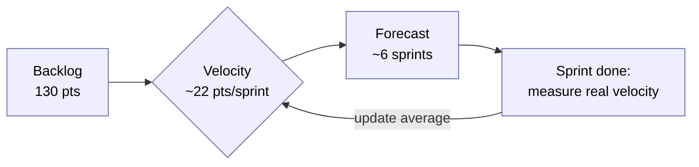
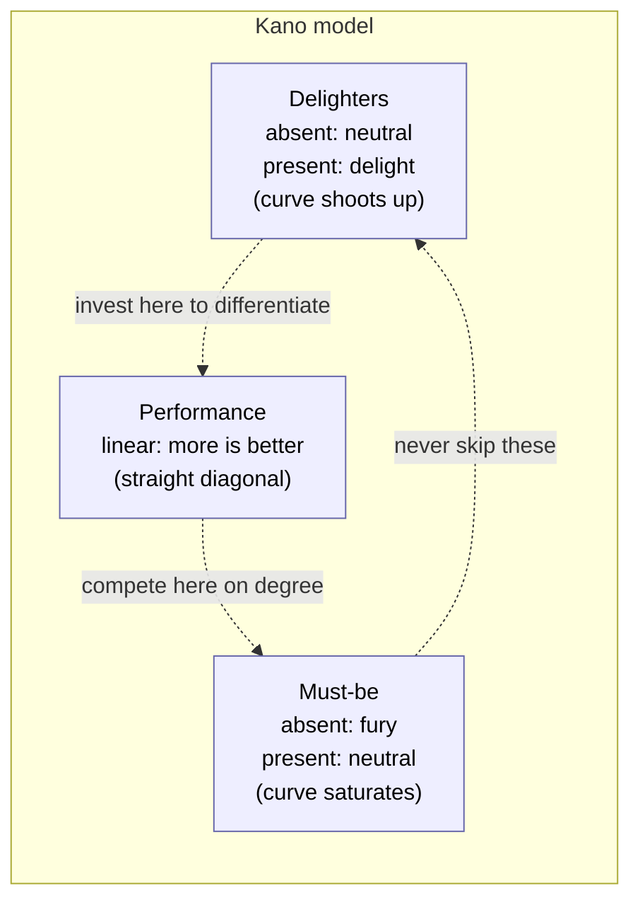

# Chapter 4 — Requirements Analysis

> **Where we are.** Chapter 3 taught you to *elicit and record* what stakeholders need —
> user stories, features, scenarios. But a backlog of good stories is not a plan. Now
> comes the harder question every team faces on Monday morning: *given more work than we
> can possibly do, in what order, and how long will it take?* This chapter is about
> **requirements analysis** — sizing work, estimating effort, ranking by value, cost, and
> risk, and turning a pile of wishes into a defensible plan. These are the skills that let
> you promise a date and keep it.

You have talked to users, and the whiteboard is full. There are forty things the clinic
scheduling app "must" do, six people who each want theirs first, and a sponsor asking a
question you cannot yet answer: *when will it be done, and what will it cost?* Guessing
feels dishonest; refusing to answer feels unprofessional. The discipline in this chapter
sits exactly in that gap. It will not give you certainty — nothing can — but it will give
you **estimates you can defend, revise as you learn, and use to make trade-offs in the
open** rather than in a manager's head at midnight.

## 4.1 A Checklist Approach

The simplest analysis technique is also the most underrated: before you estimate or build
anything, walk the requirement against a **checklist** of questions you have learned, the
hard way, to ask. Checklists convert hard-won experience into a procedure that a tired
person can follow at 4 p.m. without heroics. Atul Gawande's surgeons and Boeing's pilots
rely on them for the same reason engineers should: not because the steps are difficult,
but because *skipping* one is easy and expensive.[^1]

A requirement is ready to be estimated only when you can answer questions like these:

- **Who** asked for it, and who else is affected? (A change to appointment reminders
  touches front-desk staff, patients, *and* the SMS-cost line item.)
- **Why** — what underlying goal does it serve? If you cannot state the goal, you cannot
  tell whether a cheaper solution would do.
- **How will we know it works?** What is the acceptance test? A requirement with no
  acceptance criterion is not a requirement; it is a hope.
- **What does it depend on?** Does it assume a login system, a payment gateway, a data
  migration that does not exist yet?
- **What could go wrong?** Privacy, performance, edge cases, regulatory limits.

> **Principle.** A requirement you cannot *test* you cannot *estimate*, because you do not
> yet know what "done" means. The first job of analysis is to make each item concrete
> enough that reasonable people would agree when it is finished.

The payoff is twofold. First, the checklist surfaces hidden work early — the "small"
reminder feature secretly requires a patient-consent flag, which requires a database
column, a migration, and a privacy review. Second, it makes estimates *comparable*: when
every story has been run through the same questions, the team is sizing like-for-like
rather than comparing a well-understood task to a vague one. Keep your checklist short
(five to ten questions), specific to your domain, and *living* — every nasty surprise in a
retrospective is a candidate for a new line.

## 4.2 Relative Estimation: Iteration Planning

Humans are notoriously bad at estimating absolute quantities — ask people how many
minutes a task will take and the answers vary widely. But we are surprisingly good
at **relative** judgments: *this task is about twice as big as that one.*[^2] Relative
estimation exploits that strength. Instead of asking "how many hours?", you ask "how big
is this compared to something we already understand?" This is the foundation of agile
iteration planning.

### 4.2.1 Anchoring Can Bias Decisions

Before we use numbers, respect how easily they mislead. **Anchoring** is a cognitive bias:
the first number mentioned drags every subsequent estimate toward it, even when it is
arbitrary.[^3] In a famous demonstration, people asked whether Gandhi died before or after age
140 later guessed a much higher age at death than people asked about age 9 — the absurd
anchor still pulled them.[^4]

On a team, anchoring is everywhere. The lead says "this should take about three days," and
suddenly no one estimates two or eight; the whole discussion orbits three. The sponsor
writes "$50k" in an email, and every proposal mysteriously lands near it. The danger is
that the anchor carries the *authority* of a number without any of the *analysis* behind
one.

> **Pitfall.** Never let a loud voice or an early figure set the anchor before the team has
> thought independently. The estimation methods later in this chapter — Planning Poker,
> Wideband Delphi — are *specifically engineered* to defeat anchoring by having people
> commit to a private estimate before anyone speaks.

### 4.2.2 Agile Story Points

A **story point** is a unit of *relative size*, not time.[^2] When you say a story is 5 points
and another is 2, you are claiming the first is about two-and-a-half times as much work —
accounting for effort, complexity, and uncertainty together. Points deliberately hide the
hours, which frees the team from false precision and from the anchoring trap of committing
to a clock.

Most teams draw point values from a restricted scale — commonly a Fibonacci-like sequence:

> **1, 2, 3, 5, 8, 13, 20, 40, 100**[^5]

The gaps widen on purpose. You can tell a 2 from a 3, but no one can honestly tell a 21
from a 22, so the scale refuses to offer that false choice. A large gap also sends a
signal: if a story looks like a 20, it is probably too big to plan confidently and should
be **split** into smaller stories you understand better.

Points are calibrated against a **reference story** — a small, well-understood item the
whole team agrees to call, say, a 2. Every other estimate is "bigger or smaller than the
reference, by how much?" Because points are relative to *your* team's reference, a 5 on one
team is not comparable to a 5 on another, and that is fine: points are an internal
currency, not an industry constant.

Consider four stories for the clinic app, already run through the §4.1 checklist:

| Story                                             | Points |
|---------------------------------------------------|-------:|
| Show a read-only daily schedule (reference)       |      2 |
| Book a new appointment with conflict detection    |      5 |
| Send SMS reminders (needs consent flag + gateway) |      8 |
| Export a schedule to PDF                           |      3 |
| **Total**                                          | **18** |

It is worth knowing what points *replaced*. The traditional approach is **bottom-up,
time-based estimation**: estimate each story in ideal days across its activities —
design, code, test, deliver — then sum the story estimates into a total for the whole
project. It is a perfectly logical two-step process, and teams moved away from it for
three empirical reasons: the day-level numbers carry **false precision** (nobody can
distinguish a 21-day story from a 22-day one, but the arithmetic pretends they can);
ideal days ignore interruptions, meetings, and the sheer variance of real work, so the
sums are systematically optimistic; and every number stated in days is an **anchor**
(§4.2.1) that hardens into a commitment the moment a manager hears it. The approach is
not dead, though — where a contract demands a full up-front bid, plan-driven teams still
estimate bottom-up, usually with the formal models of §4.6.

### 4.2.3 Velocity of Work

Points become a *forecasting* tool the moment you measure **velocity** — the number of
points a team actually completes in one iteration (sprint).[^2] Velocity is measured, not
decreed: you finish a sprint, add up the points of the stories that met the definition of
done, and that sum is your velocity for that sprint. Only *completed* work counts; a story
that is 90% done contributes zero, because 90%-done software delivers 0% of its value and
you cannot bank a partial point.

Because a single sprint is noisy — someone was sick, the API was down — you smooth it. Take
a rolling average of the last few sprints. Suppose your team's last three sprints closed:

> Sprint 1: **22** points  Sprint 2: **18** points  Sprint 3: **26** points

The average velocity is (22 + 18 + 26) / 3 = **22 points per sprint**. Now you can forecast.
Imagine the whole clinic-app backlog totals **130** points. At 22 points per sprint:

> 130 ÷ 22 ≈ **5.9 sprints**, so you round up to **6 sprints** of work remaining.

If a sprint is two weeks, that is 12 weeks, and with a start date you can name a completion
range. Honest teams forecast a *range*, not a point: use your slowest recent sprint (18)
for the pessimistic case and your fastest (26) for the optimistic one.

> Optimistic: 130 ÷ 26 ≈ 5.0 → **5 sprints** (10 weeks)
> Pessimistic: 130 ÷ 18 ≈ 7.2 → **8 sprints** (16 weeks)

So you tell the sponsor "10 to 16 weeks, most likely 12" — a defensible statement backed by
data, not a heroic promise of an exact day. As sprints complete, velocity data accumulates,
the range narrows, and the forecast sharpens. That is estimation in one sentence: **plan with what you
know now, and re-plan every iteration as reality corrects you.**

> **Pitfall.** Velocity is a *planning* measure, never a *performance* target. The moment a
> manager rewards higher velocity, teams inflate their point estimates — a 3 quietly becomes
> a 5 — and the number stops meaning anything. Points are a ruler; do not bribe people to
> report longer inches.



### 4.2.4 Appetite: Fixed Time, Variable Scope

Everything so far *estimates* work: you look at a feature and ask "how big is this?" There
is a provocative alternative from **Shape Up** (Basecamp's product‑development method):
don't estimate at all — set an **appetite**.[^6]

An estimate and an appetite point in opposite directions:

- An **estimate** starts from a *design* and produces a *number*: "this feature, as
  specified, is about 13 points / three weeks."
- An **appetite** starts from a *number* and constrains the *design*: "this problem is
  worth about two weeks — now what solution fits in two weeks?"

An appetite is a **budget, not a prediction.** It flips the iron triangle (Chapter 1):
instead of fixing scope and letting time flex, you **fix time and let scope flex**. The
deadline is a **circuit breaker** — when the budget runs out, you ship what you have or
drop the project; you do *not* automatically extend it.[^6] That hard stop is what forces the
important trade‑offs to happen *early* instead of in a panic at the end.

> **Principle.** Fixed time, variable scope. A budget you cannot exceed turns "how long
> will it take?" into the far more useful question "what is the best thing we can build in
> the time this is worth?"

Making that work requires two disciplines:

- **Scope hammering.** Because time is fixed, you continually attack scope: for each use
  case and each piece of implementation, ask *is this essential? can we ship without it?
  is this a pre‑existing problem we don't have to solve now?* This is sharper than the
  passive "cut if we have time" — you go looking for things to cut. Mark genuinely
  optional work as **nice‑to‑haves** (Shape Up prefixes them with a "~") and let them fall
  off the edge of the budget without guilt.[^6] It connects directly to MoSCoW
  prioritization (§4.4.1): the appetite is the box, and MoSCoW decides what goes in it.
- **Judge against the baseline, not the ideal.** "Is it good enough to ship?" has no
  answer against a perfect vision — software is never done by that standard. Ask instead:
  *is it better than what users have today* (the **baseline**, introduced in
[§3.3.2](../03-user-requirements/#332-accessing-user-needs))? That reframes an endless
  "not yet" into a shippable "yes, this beats the status quo."

**Appetite and risk.** An appetite is only trustworthy if the work reliably *fits* it.
Shape Up's insight is to reduce the *variance* of a project before committing: a
well‑understood project has a **thin‑tailed** duration (it lands near its appetite),
while one hiding an unsolved design problem or an untested technical assumption — a
**rabbit hole** — has a **fat tail** (it can run 3× over).[^6] You de‑risk *before* betting by
finding those rabbit holes and either solving them or ruling them out of scope. (This is
the shaping work discussed as a process in Chapter 2, [§2.8](../02-software-development-processes/#28-shape-up-fixed-time-variable-scope).)

**When appetites fit — and when they don't.** Appetites shine for **discretionary,
shapeable** features where "how good?" is negotiable and you'd rather have *something*
valuable on a known date. They fit poorly where scope is essentially fixed and
non‑negotiable — a tax calculation must be *complete and correct*, not "80% of it by
Friday." Much real work is discretionary, which is why fixed‑time/variable‑scope is a
powerful default; the estimation techniques earlier in this chapter remain the right tool
when scope truly cannot flex.

## 4.3 Structured Group Consensus Estimates

An estimate from one person is a guess. An estimate from a group *if you gather it well* is
markedly better, because different people see different risks: the database expert knows
about the migration, the front-end developer knows the UI is fiddly, the tester knows the
edge cases. The trick is to combine their knowledge **without** letting the loudest or most
senior person anchor everyone else. The following techniques are built to do just that.

### 4.3.1 Wideband Delphi and Planning Poker

**Wideband Delphi** (Barry Boehm's adaptation of the classic Delphi method for software) is
a structured cycle: experts estimate privately, the estimates are revealed together, the
outliers *explain their reasoning*, and everyone re-estimates.[^7] The magic is in that middle
step — the person who guessed 13 when everyone else guessed 3 usually knows something the
others don't ("that feature needs a HIPAA audit log"), or has misunderstood the story.
Either way, surfacing the *reason* — not splitting the difference — is what improves the
estimate.

**Planning Poker** is Wideband Delphi made fast and fun for agile teams.[^8] Each estimator
holds a deck of cards printed with the point scale (1, 2, 3, 5, 8, 13, …). For each story:

1. The product owner reads the story and answers questions.
2. Everyone privately picks a card, face down. *This defeats anchoring:* you commit before
   you hear anyone else.
3. On a count, all cards flip at once.
4. If the cards agree, record the number and move on.
5. If they diverge, the **highest and lowest** estimators explain their thinking. Then the
   team re-votes.

Repeat until the estimates converge — usually in two or three rounds.[^5] Here is a walkthrough
for the SMS-reminders story:

> **Round 1.** Cards flip: 3, 5, 5, **13**. The 13 is an outlier. The developer who played
> it explains: "Reminders need a patient-consent flag, and legally we can't text someone who
> opted out — that's a new database field, a migration, *and* a compliance check." The 3
> player, who had only pictured calling an SMS API, says, "I hadn't thought about consent."
>
> **Round 2.** Now that everyone shares the same picture, cards flip: 8, 8, 8, 13. Close. The
> 13 player admits the compliance check might be reused from an existing module, so it may be
> smaller than feared.
>
> **Round 3.** Cards flip: 8, 8, 8, 8. **Consensus: 8 points.**

Notice what happened. The final number matters less than the *conversation* it forced: the
team discovered hidden work (consent) and a hidden opportunity (reuse) that a single
estimator would have missed. That shared understanding is the real product of the session;
the point value is a by-product.

### 4.3.2 The Original Delphi Method

Planning Poker's ancestor is the **Delphi method**, developed at the RAND Corporation in
the 1950s to forecast the effects of technology on warfare — questions with no data and no
experts who could be safely gathered in one room.[^9] Its designers, Olaf Helmer and Norman
Dalkey, identified a real problem with panels: face-to-face groups are distorted by
seniority, volume, and the bandwagon effect.[^10] People converge on the boss's view, or on
whoever spoke first and loudest — the anchoring bias of §4.2.1, weaponized by social
pressure.

Delphi's answer was **anonymity plus iteration plus feedback**:

- A facilitator poses the question to experts *separately*; no one knows who said what.
- Responses are collected, summarized statistically (often just the median and the range),
  and fed back to the whole panel.
- Experts revise their answers in light of the summary, and the cycle repeats until the
  spread stabilizes.

Anonymity strips out status and volume; iteration lets people change their minds without
losing face; statistical feedback replaces "the CEO thinks X" with "the median is X, and
here is why the outliers disagree." The result is a group judgment that reflects *knowledge*
rather than *dominance*. Every consensus-estimation technique in this chapter — Wideband
Delphi, Planning Poker — is a descendant of that insight, tuned for the tempo of a software
team.

## 4.4 Balancing Priorities

Estimation tells you what work *costs*. It says nothing about what work is *worth*. A
90-point feature that three users want is a worse investment than a 5-point feature every
user needs daily. Prioritization is the discipline of ordering the backlog so that you build
the *most valuable* things first — which matters enormously, because if you run out of time
or money (and you will), you want the *unfinished* work to be the *least* important.

### 4.4.1 Must-Should-Could-Won't (MoSCoW) Prioritization

**MoSCoW** — from the DSDM agile framework — sorts requirements into four blunt but
powerful buckets.[^11] The capital letters spell the name; the lowercase o's are filler.

- **Must have.** Non-negotiable. Without it the release is useless or illegal. If a Must
  slips, you slip the release.
- **Should have.** Important and painful to omit, but the product works without it. You will
  fight for these, but they can wait for the next release if forced.
- **Could have.** Desirable, low-cost, nice — the first to be dropped when time runs short.
  These are your *scope buffer*.
- **Won't have (this time).** Explicitly out of scope *for now*. Writing these down
  prevents scope creep and records a promise to revisit them later.

| Requirement                          | MoSCoW      | Why                                        |
|--------------------------------------|-------------|--------------------------------------------|
| Book/cancel an appointment           | Must        | The app's entire reason to exist           |
| Detect double-booking conflicts      | Must        | Wrong data is worse than no app            |
| SMS appointment reminders            | Should      | Big value, but staff can call if needed    |
| Export schedule to PDF               | Could       | Nice for reporting; a workaround exists    |
| Multi-language UI                    | Won't (yet) | No current demand; revisit next quarter    |

A healthy release is mostly *Should* and *Could*, with *Musts* held to roughly **60% or
less** of the total effort — a rule of thumb, not a law.[^11] Why the cap? Because if every item is a Must, you have no
flexibility — the first delay forces a broken promise. The *Coulds* are the shock absorber
that lets you hit the date with something shippable. A backlog with no Coulds is a plan with
no margin.

> **Principle.** Prioritization is only real if it can *hurt*. If you are not willing to move
> something you like into "Won't," you have not prioritized — you have made a wish list, and
> a wish list cannot survive contact with a deadline.

### 4.4.2 Balancing Value and Cost

MoSCoW is fast but coarse. To order work *within* a bucket, weigh **value against cost**. A
useful heuristic is the ratio:

> **priority score = value ÷ cost**

Estimate value on a simple scale (say 1–10, from stakeholder input) and cost in the story
points you already have. Rank by the ratio and you get the most "bang per point" first —
the classic strategy behind agile's preference for small, high-value slices. Here is the
clinic backlog ranked:

| Feature              | Value (1–10) | Cost (pts) | Value ÷ Cost | Rank |
|----------------------|-------------:|-----------:|-------------:|-----:|
| Conflict detection   |            9 |          5 |     **1.80** |    1 |
| PDF export           |            4 |          3 |     **1.33** |    2 |
| SMS reminders        |            8 |          8 |     **1.00** |    3 |
| Multi-language UI    |            5 |         13 |     **0.38** |    4 |

The ranking is instructive. SMS reminders have the *highest raw value* (8), yet they place
third, because they cost as much value as they deliver. Humble PDF export, worth only 4,
outranks them: it is cheap enough that its value-per-point is higher. **This is the core
insight of value/cost analysis — the best next thing to build is the one with the best
return on effort, and it is rarely the flashiest.**

### 4.4.3 Balancing Value, Cost, and Risk

Value and cost still miss a third dimension: **risk** — the probability that a story blows
up in ways your estimate did not capture. A brand-new payment integration might be high
value and modest cost, but if it depends on a bank's flaky sandbox API you have never
touched, it carries real risk of overrunning or failing outright.

Risk cuts two ways, and *both* argue for tackling risky work early:

- **Threat.** A risk that could sink the project should be confronted early, while you still
  have time and budget to react — the *fail-fast* principle. Discovering in week two that
  the payment gateway can't do refunds is survivable; discovering it in week eleven is not.
- **Learning.** Risky stories are where you *learn the most*. Doing them early retires
  uncertainty and makes every later estimate more accurate.

A common technique is to fold risk into the score. Rate risk 1–10 (10 = most dangerous) and
compute a **weighted priority**. One transparent formula rewards value, penalizes cost, and
adds a *bonus* for retiring risk early:

> **weighted priority = (value + risk) ÷ cost**

Adding risk to the numerator deliberately *pulls dangerous work forward* — you want to face
it now, not last. Re-ranking the backlog with a risk column — the low-value multi-language
row has dropped off the short list, and a new payment-integration request has arrived:

| Feature             | Value | Risk | Cost | (V+R) ÷ Cost | Rank |
|---------------------|------:|-----:|-----:|-------------:|-----:|
| Conflict detection  |     9 |    2 |    5 |     **2.20** |    1 |
| Payment integration |     7 |    9 |    8 |     **2.00** |    2 |
| PDF export          |     4 |    1 |    3 |     **1.67** |    3 |
| SMS reminders       |     8 |    5 |    8 |     **1.63** |    4 |

Recompute carefully: conflict detection scores (9+2)/5 = **2.20**, payment (7+9)/8 = **2.00**,
PDF (4+1)/3 = **1.67**, SMS (8+5)/8 = **1.63**. So the order becomes **conflict detection,
payment integration, PDF export, SMS reminders.** The risky payment work leaps from the
middle of the pack to near the top — exactly the intent. Conflict detection still leads
because it is both valuable *and* cheap, but risk has promoted the payment work above two
safer, comfier features.

> **Pitfall.** Do not let these formulas masquerade as objective truth. The inputs are
> judgments, and the formula's shape encodes a *strategy* (here, "confront risk early"). Use
> the number to *structure the conversation*, then let the team override it when they know
> something the model doesn't. A spreadsheet is a thinking aid, not an oracle.

Industry has named two widely used variants of this same idea. **WSJF (Weighted Shortest
Job First)** prioritizes by *cost of delay ÷ job size* — how much you lose per unit time
by not having the feature, divided by how big it is.[^12] The (value + risk) ÷ cost ranking
above is a WSJF-family scheme: value and risk stand in for cost of delay, and story
points for job size. The **risk–value matrix** trades the arithmetic for a 2×2 quadrant
view: plot each feature by value and risk, then read the strategy off the quadrants —
high-value/high-risk items go *first*, to burn off risk early; high-value/low-risk items
can be scheduled with confidence; and low-value/high-risk items are candidates to drop
outright. Both are the same principle you saw in the risk-first sequencing of
[§2.6](../02-software-development-processes/#26-additional-project-risks) and the spiral
framework of
[§2.7](../02-software-development-processes/#27-risk-reduction-the-spiral-framework):
face the dangerous work while you can still afford to be wrong about it.

## 4.5 Customer Satisfiers and Dissatisfiers

So far we have treated "value" as a single number. But not all value behaves the same way.
Some features earn no praise yet cause fury if missing; others delight when present yet are
never missed. Confusing the two wastes effort on the wrong things. The **Kano model** —
whose three categories you first met in
[§3.3.3](../03-user-requirements/#333-design-for-delight) — gives us the vocabulary to
tell them apart.

### 4.5.1 Kano Analysis

In the 1980s, Noriaki Kano challenged the assumption that customer satisfaction rises
linearly with how much you deliver.[^13] He showed that satisfaction depends on the *kind* of
feature, and that you learn the kind by asking customers **two** questions about each one:

- The **functional** question: "How do you feel if this feature is *present*?"
- The **dysfunctional** question: "How do you feel if this feature is *absent*?"

The *pair* of answers classifies the feature. Someone who is neutral about a feature being
present but *furious* about its absence is describing a Must-be. Someone delighted by its
presence but indifferent to its absence is describing a Delighter. A single question could
never distinguish these; the two-question structure is Kano's central methodological move.

### 4.5.2 Classification of Features

Kano's questions sort features into categories.[^13] The three that matter most for planning:

- **Must-be (basic) qualities.** Expected, unspoken, taken for granted. Their presence earns
  *nothing* — no one thanks you — but their absence causes strong dissatisfaction. For the
  clinic app: the schedule shows the *correct* date. No patient praises correct dates; every
  patient is enraged by a wrong one.
- **Performance (one-dimensional) qualities.** Satisfaction rises *linearly* with them, and
  customers will name them when asked. "How fast does search return?" More is better,
  proportionally. These are the features people comparison-shop on.
- **Attractive (delighter) qualities.** Unexpected features that *delight* when present but
  are not missed when absent — customers don't know to ask for them. A one-tap "add this
  appointment to my phone calendar" button might delight. Their absence costs nothing; their
  presence differentiates you.

Two lesser categories round out the model: **Indifferent** (customers don't care either way
— a warning sign that a feature is wasted effort) and **Reverse** (some customers actively
*dislike* it — one person's helpful automation is another's loss of control).



Read the diagram as three curves on the same axes: the horizontal axis is *how well the
feature is delivered* (absent → fully present), the vertical axis is *customer satisfaction*
(dissatisfied → delighted). **Must-be** features trace a curve that starts deep in
dissatisfaction and merely rises to neutral — you can never make a customer happy with them,
only avoid making them miserable. **Performance** features are the straight diagonal: deliver
more, get more satisfaction, proportionally. **Delighters** hug the bottom (their absence
does not hurt) then curve sharply upward (their presence thrills).

The planning lesson writes itself: **fund every Must-be first (they are the price of
admission), compete on Performance features, and sprinkle in a Delighter or two to stand
out** — but never chase Delighters while a Must-be is still broken.

### 4.5.3 Life Cycles of Attractiveness

Kano's subtlest insight is that categories **decay over time**.[^14] Yesterday's delighter is
today's expectation and tomorrow's basic requirement. A front-facing camera on a phone was
once an *attractive* surprise; then, as every phone had one, it became a *performance*
feature (megapixels mattered); now it is a *must-be* — ship a phone without one and customers
will call it a defect.

The clinic app's SMS reminders followed the same arc. A decade ago, an automated text was a
delighter. Today patients *expect* it; its absence generates complaints. It has aged from
Delighter to Must-be.

> **Principle.** Because attractiveness decays, a product that stops innovating slides
> downhill even if it never changes. Yesterday's delighters silently become today's
> obligations, so you must keep discovering *new* delighters just to stay in place. Your
> Kano classification is a *snapshot*, not a permanent truth — re-survey periodically.

### 4.5.4 Degrees of Sufficiency

Kano also reframes the meaning of "enough." For **Must-be** qualities there is a *threshold*
of sufficiency, and past it, more effort is wasted: a schedule that shows the correct date
is sufficient; making it "extra correct" is meaningless. Over-investing in a basic quality
buys you nothing, because it saturates at neutral.

**Performance** qualities have no hard ceiling — faster search is often better, until the
gain drops below what users can perceive or what the improvement costs — so "sufficiency"
here is an economic decision: keep investing while the marginal satisfaction exceeds the
marginal cost, and stop when it doesn't. **Delighters** are
all-or-nothing in a different sense: a half-built delighter often delights no one, so either
fund it enough to actually thrill or don't start.

This is why Kano and value/cost analysis are partners. Kano tells you the *shape* of a
feature's payoff curve; value/cost tells you *where on that curve to stop spending*. Together
they answer the question a raw priority ranking cannot: not just *what* to build next, but
*how much of it is enough*.

## 4.6 Plan-Driven Estimation Models

Story points and velocity work beautifully *once a team has history*. But what if you have
none — a brand-new team, a fixed-bid contract, a proposal that must name a cost before a
single sprint has run? For decades before agile, and still today for large or contractual
projects, engineers used **algorithmic, plan-driven models** that estimate effort from the
predicted *size* of the software. They are cruder in some ways and more rigorous in others,
and every engineer should understand how they work.

### 4.6.1 How Are Size and Effort Related?

The intuitive guess is that effort scales *linearly* with size: twice the code, twice the
work. Decades of project data say otherwise.[^7] Effort grows **faster than linearly** —
*super-linearly* — because of communication and integration overhead. A program twice as
big has more than twice as many interactions between its parts, and a team twice as big has
*far* more than twice as many communication paths (recall Brooks: *n* people have *n(n−1)/2*
channels).[^15] Complexity compounds.

Models capture this with a **power law**:

> **Effort = a × Size^b**

where **Size** is measured in thousands of lines of code (**KLOC**) or function points, and
*a* and *b* are constants fitted to historical projects. The exponent **b** is the crucial
term. If *b* = 1, effort is linear. Real projects show **b slightly greater than 1**
(typically 1.05–1.2), which is the mathematical signature of *diseconomy of scale*: unlike
building identical widgets, where bigger batches get cheaper per unit, bigger software costs
*more* per line.[^7] Doubling the size more than doubles the effort. That single fact — that
software exhibits diseconomies of scale — is the reason "just add more code" and "just add
more people" both disappoint.

### 4.6.2 The Cocomo Family of Estimation Models

The best-known plan-driven model is **COCOMO** (the COnstructive COst MOdel), published by
Barry Boehm in 1981[^7] and revised as **COCOMO II** in the 1990s.[^16] It is a family of power-law
equations calibrated on real project data, and it makes the abstract "Effort = a × Size^b"
concrete.

The original **Basic COCOMO** used three settings for *a* and *b* depending on project
type:[^7]

| Project type   | Description                                     |    a |    b |
|----------------|-------------------------------------------------|-----:|-----:|
| Organic        | Small team, familiar problem, stable reqs       | 2.4  | 1.05 |
| Semi-detached  | Medium size, mixed experience                   | 3.0  | 1.12 |
| Embedded       | Tight constraints, hardware, high complexity    | 3.6  | 1.20 |

Effort comes out in **person-months** (one person working one month). Let us work the clinic
scheduling app. Suppose your design suggests roughly **20,000 lines of code**, i.e.
**KLOC = 20**, and it is a straightforward business app with a small experienced team —
**organic** (a = 2.4, b = 1.05):

> Effort = 2.4 × 20^1.05
> 20^1.05 = 20 × 20^0.05. Now 20^0.05 = e^(0.05 × ln 20) = e^(0.05 × 3.00) = e^0.150 ≈ 1.16.
> So 20^1.05 ≈ 20 × 1.16 = 23.2.
> **Effort ≈ 2.4 × 23.2 ≈ 55.7 person-months.**

Now watch the diseconomy of scale bite. Double the size to **KLOC = 40**:

> Effort = 2.4 × 40^1.05
> 40^1.05 = 40 × 40^0.05 = 40 × e^(0.05 × ln 40)
> = 40 × e^(0.05 × 3.69) = 40 × e^0.184 ≈ 40 × 1.202 = 48.1.
> **Effort ≈ 2.4 × 48.1 ≈ 115.4 person-months.**

The code redoes the arithmetic at full precision:

```go
// full precision: the hand math rounded 20^0.05 to 1.16, so its 55.7 prints as 55.8
package main

import (
	"fmt"
	"math"
)

func effort(kloc float64) float64 { return 2.4 * math.Pow(kloc, 1.05) } // organic
func schedule(e float64) float64  { return 2.5 * math.Pow(e, 0.38) }    // calendar months

func main() {
	e20, e40 := effort(20), effort(40)
	fmt.Printf("20 KLOC: %5.1f person-months, %.1f months\n", e20, schedule(e20))
	fmt.Printf("40 KLOC: %5.1f person-months, %.1f months\n", e40, schedule(e40))
	fmt.Printf("doubling factor: %.2f\n", e40/e20)
}
```

```java
// full precision: the hand math rounded 20^0.05 to 1.16, so its 55.7 prints as 55.8
public class CocomoBasic {
  static double effort(double kloc) {          // Basic COCOMO, organic
    return 2.4 * Math.pow(kloc, 1.05);
  }

  static double schedule(double e) {
    return 2.5 * Math.pow(e, 0.38);            // calendar months
  }

  public static void main(String[] args) {
    double e20 = effort(20), e40 = effort(40);
    System.out.printf("20 KLOC: %5.1f person-months, %.1f months%n", e20, schedule(e20));
    System.out.printf("40 KLOC: %5.1f person-months, %.1f months%n", e40, schedule(e40));
    System.out.printf("doubling factor: %.2f%n", e40 / e20);
  }
}
```

```javascript
// full precision: the hand math rounded 20^0.05 to 1.16, so its 55.7 prints as 55.8
const effort = (kloc, a = 2.4, b = 1.05) => a * kloc ** b; // Basic COCOMO, organic
const schedule = (e) => 2.5 * e ** 0.38;                   // calendar months

const row = (kloc, e) =>
  `${kloc} KLOC: ${e.toFixed(1).padStart(5)} person-months, ` +
  `${schedule(e).toFixed(1)} months`;

const [e20, e40] = [effort(20), effort(40)];
console.log(row(20, e20));
console.log(row(40, e40));
console.log(`doubling factor: ${(e40 / e20).toFixed(2)}`);
```

```python
# full precision: the hand math rounded 20^0.05 to 1.16, so its 55.7 prints as 55.8
def effort(kloc, a=2.4, b=1.05):          # Basic COCOMO, organic
  return a * kloc ** b

def schedule(e):
  return 2.5 * e ** 0.38                # calendar months

e20, e40 = effort(20), effort(40)
print(f"20 KLOC: {e20:5.1f} person-months, {schedule(e20):.1f} months")
print(f"40 KLOC: {e40:5.1f} person-months, {schedule(e40):.1f} months")
print(f"doubling factor: {e40 / e20:.2f}")
```

```ruby
# full precision: the hand math rounded 20^0.05 to 1.16, so its 55.7 prints as 55.8
def effort(kloc, a: 2.4, b: 1.05) # Basic COCOMO, organic
  a * kloc**b
end

def schedule(effort)
  2.5 * effort**0.38 # calendar months
end

e20, e40 = effort(20), effort(40)
puts format('20 KLOC: %5.1f person-months, %.1f months', e20, schedule(e20))
puts format('40 KLOC: %5.1f person-months, %.1f months', e40, schedule(e40))
puts format('doubling factor: %.2f', e40 / e20)
```

```text
20 KLOC:  55.8 person-months, 11.5 months
40 KLOC: 115.4 person-months, 15.2 months
doubling factor: 2.07
```

Doubling the code (20 → 40 KLOC) raised effort from ~56 to ~115 person-months — a factor of
**2.07**, not 2.0. The extra 7% is the exponent *b* = 1.05 at work; on an *embedded* project
(b = 1.20) the same doubling would cost a factor of 2^1.20 ≈ **2.30**, a 30% penalty. The
model has turned "bigger software costs disproportionately more" from a slogan into a number
you can put in a proposal.

COCOMO also estimates **schedule** (calendar months) from effort, again as a power law
(roughly Time ≈ 2.5 × Effort^0.38 for the basic organic case), which lets you derive team
size: dividing effort by schedule gives the average staff needed.[^7] **COCOMO II** refines all
of this with size in function points, *scale factors* for team maturity and requirements
volatility, and seventeen *effort multipliers* for things like personnel skill and tool
support — but the beating heart is still Effort = a × Size^b.[^16]

> **Pitfall.** A COCOMO estimate is only as good as its *size* input, and estimating KLOC
> before you have written the code is itself hard and error-prone — you have pushed the
> uncertainty from "effort" onto "size," not removed it. Treat algorithmic estimates as *one
> input*, ideally cross-checked against expert judgment (Delphi) and, once available, real
> velocity. The best forecasts triangulate multiple methods that fail in different ways.

## 4.7 Conclusion

Requirements analysis is where a heap of stakeholder wishes becomes a plan you can defend.
You met a toolkit, and its parts fit together:

- A **checklist** (§4.1) makes each requirement concrete enough to estimate at all — no
  acceptance test, no estimate.
- **Relative estimation** with **story points and velocity** (§4.2) turns a team's history
  into a forecast, and taught you to report a *range* and re-plan every sprint.
- **Consensus techniques** — Planning Poker and its ancestor, the **Delphi method** (§4.3) —
  combine many experts' knowledge while defeating anchoring and the bandwagon effect.
- **Prioritization** — MoSCoW, then value/cost, then value/cost/risk (§4.4) — orders the
  backlog so that whatever goes unfinished is the *least* important, and pulls risky work
  early.
- **Kano analysis** (§4.5) explains *why value is not one number*: must-bes, performance
  features, and delighters pay off in different shapes, and those shapes decay over time.
- **Plan-driven models** like **COCOMO** (§4.6) estimate effort from size via a power law
  when you have no velocity yet — and make the diseconomy of scale a number, not a hunch.

No single method is trustworthy alone. Points assume history; COCOMO assumes you can guess
size; Kano assumes you can survey users; every formula rests on human judgment. The mature
engineer uses several, watches where they *disagree*, and treats that disagreement as a
signal to go learn more. Above all, remember the through-line from Chapter 1: estimates
exist to make trade-offs **visible and negotiable** — scope, cost, and time argued in the
open, with data, rather than settled by whoever talks loudest. That is the difference
between a promise and a hope.

---

### Sources

[^1]: Atul Gawande, *The Checklist Manifesto: How to Get Things Right* (Metropolitan Books, 2009). [atulgawande.com](https://atulgawande.com/book/the-checklist-manifesto/).
[^2]: Mike Cohn, *Agile Estimating and Planning* (Prentice Hall, 2005). [mountaingoatsoftware.com](https://www.mountaingoatsoftware.com/books/agile-estimating-and-planning).
[^3]: Amos Tversky and Daniel Kahneman, "Judgment under Uncertainty: Heuristics and Biases," *Science* 185(4157) (1974). [science.org](https://www.science.org/doi/10.1126/science.185.4157.1124).
[^4]: Fritz Strack and Thomas Mussweiler, "Explaining the Enigmatic Anchoring Effect: Mechanisms of Selective Accessibility," *Journal of Personality and Social Psychology* 73(3) (1997). [doi.org](https://doi.org/10.1037/0022-3514.73.3.437).
[^5]: Mountain Goat Software (Mike Cohn), "Planning Poker: An Agile Estimating and Planning Technique." [mountaingoatsoftware.com](https://www.mountaingoatsoftware.com/agile/planning-poker).
[^6]: Ryan Singer, *Shape Up: Stop Running in Circles and Ship Work that Matters* (Basecamp, 2019). [basecamp.com/shapeup](https://basecamp.com/shapeup).
[^7]: Barry W. Boehm, *Software Engineering Economics* (Prentice-Hall, 1981). [dl.acm.org](https://dl.acm.org/doi/10.5555/539425).
[^8]: James Grenning, "Planning Poker or How to Avoid Analysis Paralysis While Release Planning" (2002). [wingman-sw.com](https://wingman-sw.com/papers/PlanningPoker-v1.1.pdf). Popularized by Mike Cohn in *Agile Estimating and Planning* (2005).
[^9]: RAND Corporation, "Delphi Method" (topic overview). [rand.org](https://www.rand.org/topics/delphi-method.html).
[^10]: Norman Dalkey and Olaf Helmer, "An Experimental Application of the Delphi Method to the Use of Experts," *Management Science* 9(3) (1963); RAND memorandum RM-727/1. [rand.org](https://www.rand.org/pubs/research_memoranda/RM727z1.html).
[^11]: Agile Business Consortium, "MoSCoW Prioritisation," *DSDM Agile Project Framework Handbook* (2014). [agilebusiness.org](https://www.agilebusiness.org/dsdm-project-framework/moscow-prioritisation.html).
[^12]: Donald G. Reinertsen, *The Principles of Product Development Flow: Second Generation Lean Product Development* (Celeritas, 2009); the cost-of-delay ÷ job-size form follows Scaled Agile's WSJF. [scaledagile.com](https://framework.scaledagile.com/wsjf).
[^13]: Noriaki Kano, Nobuhiko Seraku, Fumio Takahashi, and Shinichi Tsuji, "Attractive Quality and Must-Be Quality," *Journal of the Japanese Society for Quality Control* 14(2) (1984). [doi.org](https://doi.org/10.20684/quality.14.2_147).
[^14]: Noriaki Kano, "Life Cycle and Creation of Attractive Quality," *Proceedings of the 4th International QMOD Conference* (2001). [semanticscholar.org](https://www.semanticscholar.org/paper/Life-Cycle-and-Creation-of-Attractive-Quality-Kano/488788f1b49e92ee9ffb3bae6164c24374e1b2e4).
[^15]: Frederick P. Brooks, Jr., *The Mythical Man-Month: Essays on Software Engineering* (Addison-Wesley, 1975; anniversary ed. 1995). [informit.com](https://www.informit.com/store/mythical-man-month-essays-on-software-engineering-anniversary-9780201835953).
[^16]: Barry Boehm et al., *COCOMO II Model Definition Manual, version 2.1* (USC Center for Software Engineering, 2000). [rose-hulman.edu mirror](https://www.rose-hulman.edu/class/csse/csse372/201410/Homework/CII_modelman2000.pdf).

---

- **Key takeaways** are summarized above in §4.7.
- Continue to the [Exercises](exercises.md).
- Go deeper with the [Open Resources](resources.md) for this chapter.
