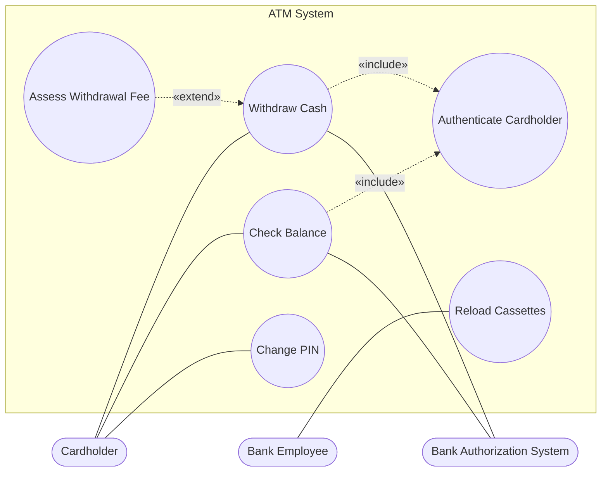

# Chapter 5 — Use Cases

> **Where we are.** Chapter 3 gathered raw needs as user stories and features, and
> Chapter 4 sized and prioritized them into a plan. Those artifacts are
> deliberately small and fragmented — a story fits on an index card. But a card tells you
> *that* a user wants to withdraw cash; it does not tell you what the machine says when
> the account is overdrawn, what happens if the network drops mid-transaction, or in what
> order the card and the money come out. A **use case** fills that gap. It tells the whole
> story of one goal, start to finish, including everything that can go wrong along the
> way. This chapter shows you how to write use cases that are precise enough to design and
> test against, yet readable enough that a nurse, a cashier, or a bank teller can confirm
> you understood them.

A user story says *who*, *what*, and *why* in a single sentence. That compression is a
feature when you prioritize a backlog and a liability when you build. The moment a
developer sits down to implement "As a customer, I want to withdraw cash so that I have
money on hand," a swarm of questions appears: How does the customer prove who they are?
What if the amount exceeds the balance? What if the machine is out of bills? Who gets the
card back, and when? A **use case** answers exactly these questions by narrating a
complete interaction between a user and the system, from the user's opening move to the
moment their goal succeeds — or fails in a controlled, understood way.

Use cases occupy a sweet spot in the requirements toolkit: more structured and complete
than a story, but cheaper and more readable than a formal specification. They are written
in the language of the domain, not of code, so the people who have the need can validate
them. And because a use case enumerates its own failure modes, it doubles as a checklist
for design and a source of test scenarios — one artifact that pays rent in three later
chapters.

## 5.1 Elements of a Use Case

Before writing one, you need the vocabulary. A use case is built from a small, fixed set
of parts: **actors** who interact with the system, a **goal** those actors are trying to
reach, and one or more **flows** — sequences of steps that describe how the interaction
unfolds. Get these three ideas straight and the rest is largely a matter of disciplined
writing.

### 5.1.1 Actors and Goals Outline a System

An **actor** is any entity *outside* the system that interacts with it to accomplish
something. The most important word in that sentence is *outside*. An actor is a role
played by someone or something that sits across the system's boundary and exchanges
information with it; nothing inside your own software qualifies. When you name the actors, you are
implicitly drawing that boundary — deciding what is "the system" and what is the world it
serves.

Actors are **roles, not people**. The same human being may be a `Cardholder` when
withdrawing cash and a `Bank Employee` when reconciling the till at day's end; those are
two actors even though it is one person. Conversely, many different people play the single
role `Cardholder`. Naming the *role* rather than the *person* keeps the use case stable
when the org chart changes.

Actors come in two broad kinds, and the distinction matters:[^1]

- **Primary actors** initiate a use case to reach a goal *of their own*. The `Cardholder`
  wants money; that desire is why the use case exists. Every use case should have one.
- **Supporting actors** (sometimes called secondary actors) are external systems or
  people the system calls on to get the job done, but whose *own* goals are not the point.
  When the ATM asks the `Bank Authorization System` to approve a withdrawal, that back-end
  service is a supporting actor: essential to the flow, but not the one whose goal drives
  the story.

A **goal** is what the primary actor wants the interaction to achieve — stated as a
result in the world, not as a feature of the software. "Withdraw cash" is a goal.
"Click the withdraw button" is merely a step toward one, and phrasing goals as UI
actions bakes premature design decisions into requirements. A good test: a goal should
still make sense if you replaced the entire user interface. People withdrew cash from
human tellers long before ATMs existed; the goal outlived the implementation, and so
should your phrasing.

> **Principle.** Name actors by the *role* they play and goals by the *result* they seek.
> Both should survive a complete redesign of the user interface. If a change of buttons
> would force you to reword the goal, you have described a screen, not a requirement.

Listing the actors and their goals — before writing a single flow — gives you a
lightweight outline of the whole system.[^2] It is often the first thing a team produces,
and it fits on one page. The **actor–goal list** is simply a table: each row a goal,
tagged with its primary actor.[^3] For the ATM:

| Primary actor | Goal (use case)            |
| ------------- | -------------------------- |
| Cardholder    | Withdraw cash              |
| Cardholder    | Check account balance      |
| Cardholder    | Deposit funds              |
| Cardholder    | Change PIN                 |
| Bank Employee | Reload cash cassettes      |
| Bank Employee | Retrieve captured cards    |

That table is worth an afternoon of meetings. It surfaces goals nobody mentioned (who
refills the machine?), reveals which actors matter, and gives the team a unit of work to
estimate and schedule — one use case at a time.

### 5.1.2 Flows and Basic Flows

A **flow** is a numbered sequence of steps describing an interaction. Each step is a
single, complete exchange: either the actor does something the system can perceive, or the
system responds. The steps alternate like a conversation, and each one moves the goal
forward.

The most important flow is the **basic flow** — also called the *main success scenario*
or the *happy path*.[^3] It describes what happens when everything goes right: the card is
valid, the PIN is correct, the account has funds, the machine has cash, and the network
stays up. The basic flow is deliberately optimistic. It is the shortest, cleanest story of
the goal being achieved, and it should read as a smooth narrative with nothing branching
off it.

Why start with the optimistic path? Because it defines the *spine* of the use case.
Every complication you handle later is a deviation from some specific step of the basic
flow, so you cannot describe the deviations until the spine exists — and writing the happy
path first forces agreement on the essential shape before anyone gets lost in edge cases.

Here is the basic flow for *Withdraw Cash from ATM*, written the way a use case wants it:

1. The Cardholder inserts a bank card.
2. The system reads the card and prompts for a PIN.
3. The Cardholder enters a PIN.
4. The system validates the PIN with the Bank Authorization System.
5. The system displays the menu of services and the Cardholder selects **Withdraw Cash**.
6. The system prompts for an amount.
7. The Cardholder enters an amount.
8. The system confirms with the Bank Authorization System that the account holds
   sufficient funds and that the amount is within limits.
9. The system dispenses the requested cash.
10. The system returns the card.
11. The system prints a receipt and records the completed transaction.

Read those steps and notice their properties. Each is a whole interaction (not "the system
sends a byte to the card reader" — that is design). Each names *who* acts. None mentions a
screen layout, a database table, or a programming language. And the sequence tells a story
a bank customer could read and confirm: *yes, that is how I withdraw money.* That
confirmability is the point — a basic flow the domain expert cannot follow is one they
cannot correct.

> **Pitfall.** Steps that describe the system's *internals* ("the controller polls the
> dispenser queue") make a use case impossible for stakeholders to validate and tie your
> requirements to one implementation. Keep every step at the level of *observable behavior
> at the system boundary* — what an actor sends in and what they get back.

## 5.2 Alternative Flows: Conditional Behaviors

The basic flow is a lie of omission. In reality PINs are mistyped, accounts run dry, and
machines run out of twenties. The parts of a use case that make it genuinely useful — and
genuinely hard — are the **alternative flows** that describe what happens when the happy
path is interrupted. This is where use cases earn their keep over user stories: a story
hides these conditions; a use case drags every one into the light and decides, on the
record, what the system will do.

An alternative flow always attaches to a specific point in another flow. It answers: "At
step *N*, if condition *C* holds instead, then this happens." Because each alternative
names the step it branches from and the condition that triggers it, the reader sees
exactly where reality departs from the happy path and where — if anywhere — it rejoins.

### 5.2.1 Specific Alternative Flows

A **specific alternative flow** branches at one identified step, handles a particular
condition, and then either rejoins the basic flow or ends the use case. "Specific" means
it is tied to a single step: the condition can only arise there, so the alternative lives
next to that step and nowhere else.

Continuing the ATM example:

**A1. Incorrect PIN** *(at step 4)*
> If the Bank Authorization System reports the PIN is invalid:
> 1. The system tells the Cardholder the PIN was not recognized and how many attempts
>    remain.
> 2. The system prompts for the PIN again.
> 3. The Cardholder re-enters a PIN, and the flow resumes at **step 4**.
> After three failed attempts, the flow continues at alternative **A2**.

**A3. Insufficient funds** *(at step 8)*
> If the account balance is below the requested amount:
> 1. The system informs the Cardholder that the account lacks sufficient funds.
> 2. The system re-prompts for an amount, resuming at **step 6**.

Notice how each alternative states its trigger step, its condition, its steps, and its
*resumption point* — the step number where control returns to the basic flow. That
resumption point is not bookkeeping; it is the seam that spares the alternative from
re-narrating the rest of the transaction. "Resume at step 6" is a promise that everything
from step 6 onward behaves exactly as already written.

### 5.2.2 Extension Points

Sometimes you want to say "at this moment, additional behavior *may* occur" without
committing, in the basic flow, to what that behavior is. An **extension point** is a named
location in a flow where such optional behavior can be attached.[^4] It is a labeled hook: the
basic flow declares "here is a place where things may branch," and one or more extending
use cases (§5.5.3) plug in at that label.

Extension points shine when the extra behavior is optional and conceptually
separate. In the ATM, after the amount is confirmed but before cash is dispensed, you
might declare an extension point named `AmountConfirmed`. A separate use case, *Assess
Withdrawal Fee* — relevant only for out-of-network cards — hooks onto that point. The core
withdrawal flow stays clean; the fee logic lives in its own use case and attaches only
where and when it applies.

The value is *separation of concerns in the requirements themselves*. The moment you find
yourself writing "and if this is a premium customer, also do X, unless it's a holiday, in
which case Y," you are overloading one flow. An extension point lets you name the hook and
move the conditional story elsewhere, so each flow stays about one thing.

### 5.2.3 Bounded Alternative Flows

Some conditions are not tied to a single step — they can strike almost anywhere. A
**bounded alternative flow** applies across a *range* of steps rather than at one point.
The bound tells the reader "this can happen at any step from *i* to *j*," which is far more
honest, and far more compact, than copying the same alternative under every step in that
range.

The canonical example is a resource that can vanish at any time. Suppose the network link
to the Bank Authorization System can drop during any of the steps that talk to it:

**B1. Authorization link lost** *(at any step from 4 through 8)*
> If the connection to the Bank Authorization System is lost:
> 1. The system cancels the pending transaction.
> 2. The system displays an "out of service" message.
> 3. The system returns the card and ends the use case; no cash is dispensed.

Without the bound, you would repeat this handling under steps 4, 5, 6, 7, and 8 — five
copies that drift out of sync the first time someone edits one. The bounded flow states
the shared behavior once and names its scope. Use bounded flows for cross-cutting failures
— timeouts, cancellation, loss of power, a user who walks away — that are indifferent to
exactly which step you were on.

> **Principle.** Choose the *narrowest* structure that fits the condition. A condition
> that can arise at exactly one step is a specific alternative; one that ranges over
> several is a bounded alternative; optional behavior you would rather describe elsewhere
> gets an extension point. Matching the structure to the condition keeps each flow short
> and keeps duplication out.

## 5.3 Writing Use Cases

Vocabulary in hand, the practical question is how to produce good use cases. The
answer has two parts: a **template** that gives every use case the same skeleton, and a
**discipline** for filling that skeleton in — writing steps at the right level and building
the document up in the right order.

### 5.3.1 A Template for Use Cases

A template is a checklist wearing the costume of a document. Its job is to make sure you
never forget the preconditions, never leave the postconditions implicit, and never ship a
use case whose failure modes went unconsidered. Teams differ on the fields, but a solid,
widely used template contains the following — shown here fully filled in for the ATM
example, so you see a complete artifact rather than an empty form:[^3]

---

> **Use case: Withdraw Cash from ATM**
>
> **Primary actor:** Cardholder
>
> **Supporting actors:** Bank Authorization System, Cash Dispenser
>
> **Scope:** The ATM terminal software.
>
> **Level:** User goal — a single sitting at the machine.
>
> **Brief:** A cardholder authenticates at an ATM, requests an amount of cash, and — if
> the account and machine can satisfy the request — receives the cash, their card, and a
> receipt.
>
> **Stakeholders and interests:**
> - *Cardholder* — wants correct cash quickly, and their card back.
> - *Bank* — wants every disbursement authorized and accurately recorded; no money out
>   without a matching debit.
> - *Regulator* — wants an auditable record of each transaction.
>
> **Preconditions:**
> - The ATM is in service and has cash available.
> - The Cardholder possesses a valid bank card.
>
> **Trigger:** The Cardholder inserts a card into the ATM.
>
> **Basic flow (main success scenario):**
> 1. The Cardholder inserts a bank card.
> 2. The system reads the card and prompts for a PIN.
> 3. The Cardholder enters a PIN.
> 4. The system validates the PIN with the Bank Authorization System.
> 5. The system displays the service menu; the Cardholder selects **Withdraw Cash**.
> 6. The system prompts for an amount.
> 7. The Cardholder enters an amount.
> 8. The system confirms sufficient funds and within-limit amount with the Bank
>    Authorization System.
> 9. The system dispenses the cash.
> 10. The system returns the card.
> 11. The system prints a receipt and records the completed transaction.
>
> **Alternative flows:**
> - **A1. Incorrect PIN** *(step 4)* — inform the Cardholder, re-prompt; resume at step 4.
> - **A2. Three incorrect PINs** *(step 4)* — retain the card, end the use case.
> - **A3. Insufficient funds** *(step 8)* — inform the Cardholder, re-prompt; resume at
>   step 6.
> - **A4. Amount exceeds machine cash on hand** *(step 9)* — inform the Cardholder, offer
>   a smaller amount; resume at step 6.
> - **B1. Authorization link lost** *(steps 4–8)* — cancel, show "out of service", return
>   the card, end the use case.
>
> **Postconditions (on success):**
> - The requested amount has been debited from the account exactly once.
> - The Cardholder holds the cash, the card, and a receipt.
> - The transaction is recorded in the bank's ledger.
>
> **Postconditions (on failure):**
> - No money has left the machine and no debit has been recorded.
> - The Cardholder holds the card, unless it was retained under **A2**.

---

Study the two *postcondition* sections, because they are where beginners are weakest.
Every use case has both a success guarantee and a failure guarantee, and the failure
guarantee is often the more important: "no money out without a matching debit" is a promise
the bank cares about far more than the happy path. Writing both forces you to decide, in
advance, what must remain true even when things go wrong — precisely the invariant your
error handling and your tests will have to enforce.

The failure guarantee is testable before any real bank or dispenser exists — drop the
authorization link at step 8 and assert the postcondition word for word:

```go
package main

import "errors"

type LostLinkBank struct{ debits []int }           // the fake — the link drops at step 8
func (b *LostLinkBank) authorize(amount int) error { return errors.New("link lost") }

type Atm struct{ dispensed int }   // cash actually dispensed
func (a *Atm) dispense(amount int) { a.dispensed += amount }

func withdraw(atm *Atm, bank *LostLinkBank, amount int) { // steps 8–11 of the basic flow
	if err := bank.authorize(amount); err != nil {
		return // B1 — cancel, return the card
	}
	atm.dispense(amount)
	bank.debits = append(bank.debits, amount)
}

func main() {
	atm, bank := &Atm{}, &LostLinkBank{}
	withdraw(atm, bank, 200)
	if atm.dispensed != 0 || len(bank.debits) != 0 { // the failure postcondition, verbatim
		panic("failure postcondition violated")
	}
}
```

```java
public class FailureGuarantee {
  static class LostLinkBank {               // the fake — the link drops at step 8
    java.util.List<Integer> debits = new java.util.ArrayList<>();
    void authorize(int amount) { throw new IllegalStateException("link lost"); }
  }
  static class Atm {
    int dispensed = 0;
    void dispense(int amount) { dispensed += amount; }
  }
  static void withdraw(Atm atm, LostLinkBank bank, int amount) {  // steps 8–11
    try { bank.authorize(amount); }
    catch (IllegalStateException e) { return; }  // B1 — cancel, return the card
    atm.dispense(amount);
    bank.debits.add(amount);
  }
  public static void main(String[] args) {  // run with java -ea (assertions on)
    Atm atm = new Atm();
    LostLinkBank bank = new LostLinkBank();
    withdraw(atm, bank, 200);
    // the failure postcondition, verbatim
    assert atm.dispensed == 0 && bank.debits.isEmpty();
  }
}
```

```javascript
const assert = require("node:assert");

class LostLinkBank {                        // the fake — the link drops at step 8
  debits = [];
  authorize(amount) { throw new Error("link lost"); }
}

class Atm {
  dispensed = 0;
  dispense(amount) { this.dispensed += amount; }
}

function withdraw(atm, bank, amount) {      // steps 8–11 of the basic flow
  try { bank.authorize(amount); }
  catch { return; }                         // B1 — cancel, return the card
  atm.dispense(amount);
  bank.debits.push(amount);
}

const atm = new Atm(), bank = new LostLinkBank();
withdraw(atm, bank, 200);
// the failure postcondition, verbatim
assert(atm.dispensed === 0 && bank.debits.length === 0);
```

```python
class LostLinkBank:                         # the fake — the link drops at step 8
  debits = []
  def authorize(self, amount): raise ConnectionError("link lost")

class Atm:
  dispensed = 0
  def dispense(self, amount): self.dispensed += amount

def withdraw(atm, bank, amount):            # steps 8–11 of the basic flow
  try: bank.authorize(amount)
  except ConnectionError: return          # B1 — cancel, return the card
  atm.dispense(amount)
  bank.debits.append(amount)

atm, bank = Atm(), LostLinkBank()
withdraw(atm, bank, 200)
assert atm.dispensed == 0 and bank.debits == []  # the failure postcondition, verbatim
```

```ruby
class LostLinkBank                          # the fake — the link drops at step 8
  attr_reader :debits
  def initialize = @debits = []
  def authorize(amount) = raise(IOError, "link lost")
end

class Atm
  attr_reader :dispensed
  def initialize = @dispensed = 0
  def dispense(amount) = @dispensed += amount
end

def withdraw(atm, bank, amount)             # steps 8–11 of the basic flow
  bank.authorize(amount)
  atm.dispense(amount)
  bank.debits << amount
rescue IOError                              # B1 — cancel, return the card
end

atm, bank = Atm.new, LostLinkBank.new
withdraw(atm, bank, 200)
# the failure postcondition, verbatim
raise "postcondition violated" unless atm.dispensed == 0 && bank.debits.empty?
```

### 5.3.2 From Actor Intentions to System Interactions

A use case is a translation. On one side is the actor's **intention** — a goal expressed
in human terms: "I want cash." On the other side is a sequence of **interactions** at the
system boundary: insert card, enter PIN, select service, and so on. Writing a use case is
the act of turning the first into the second without leaking implementation on the way.

The reliable technique is to alternate between two questions as you write each step:

1. *What does the actor intend here?* — This keeps the step goal-directed. The Cardholder
   does not "enter digits into field two"; they *identify themselves* so the bank will
   trust them.
2. *What is the smallest observable interaction that serves that intention?* — This keeps
   the step concrete and testable. Identifying oneself becomes "enters a PIN," a real
   exchange at the boundary.

Hold each step at this **intention level**: concrete enough to be an observable exchange,
abstract enough to avoid dictating the interface. Compare three ways to write the same
step:

- *Too abstract:* "The Cardholder authenticates." (What actually happens? Untestable.)
- *Too concrete:* "The Cardholder types four digits into the PIN field and taps ENTER,
  and the system SHA-256-hashes them and compares against the stored hash." (This is
  design; it forbids a PIN of other lengths, a keypad, biometrics — decisions requirements
  should leave open.)
- *Just right:* "The Cardholder enters a PIN; the system validates it with the Bank
  Authorization System." (Observable, testable, implementation-free.)

The middle level survives contact with design. It tells the builders *what must happen* and
leaves them free to decide *how* — the whole point of separating requirements from design.

### 5.3.3 How to Build Use Cases

Do not try to write a use case top to bottom in one pass. That way lies analysis
paralysis — you will be arguing about a rare timeout before you have agreed on the main
story. Build each use case **incrementally**, in three passes, widening your focus each
time:

**Pass 1 — Actors and goals.** Before any prose, list the actors and their goals as in
§5.1.1. Decide which goals are worth a full use case (user-goal level) and which are
merely steps. Output: the actor–goal table. This pass is about *breadth* — the whole
system at a glance — and it is cheap enough to redo daily as understanding shifts.

**Pass 2 — The basic flow.** Pick one goal and write only its happy path: the numbered
main success scenario, assuming everything cooperates. Resist every temptation to handle
errors here. Output: a spine of 3–10 steps that a domain expert can read and confirm. If
the basic flow runs past a dozen steps, your use case is probably two use cases wearing a
trench coat — split it.

**Pass 3 — The alternatives.** Now walk the basic flow step by step and, at each one, ask:
*what else could happen here?* Wrong PIN at step 4. Empty account at step 8. Empty machine
at step 9. Dead network across steps 4–8. Each answer becomes a specific, bounded, or
extended alternative flow (§5.2). This pass is where the use case becomes trustworthy,
because it is a systematic sweep for failure rather than a hope that you thought of
everything.

This order is not arbitrary. It moves from *breadth* (all goals) to *depth on one goal*
(the spine) to *robustness* (every deviation) — and at each pass you have something
complete and reviewable, so you can stop, get feedback, and adjust before investing in the
next layer. It is the same iterative instinct that runs through the whole book: reach a
coherent whole early, then refine it, rather than perfecting one corner before you know
the shape.

> **Pitfall.** Writing alternatives before the basic flow is stable is wasted work. Every
> time you reorder or reword a main-flow step, its attached alternatives shift with it.
> Stabilize the spine, *then* hang the exceptions on it.

## 5.4 Use-Case Diagrams

Everything so far has been text, because the *content* of a use case is a story and
stories are made of words. But a project may have dozens of use cases and many actors, and
at that scale you want a map. A **use-case diagram** is that map: a one-glance picture of
who the actors are, what goals the system offers them, and how those goals relate.

### 5.4.1 Diagrams Highlight Goals and Actors

A use-case diagram uses a tiny visual vocabulary. **Actors** are drawn as stick figures
(or labeled boxes for non-human systems). **Use cases** are ovals labeled with a goal.
A plain line — an **association** — connects an actor to each use case it participates
in.[^4] That is nearly the whole notation, and its minimalism is the point: the diagram is meant
to show *scope and relationships*, not to reproduce the flows. The story stays in the
text; the diagram shows the forest.



Read that diagram as an index, not a specification. It tells you the `Cardholder` has
three goals (`Deposit Funds`, the fourth goal in §5.1.1's actor–goal list, is omitted
here to keep the diagram readable), that `Withdraw Cash` and `Check Balance` both depend on `Authenticate
Cardholder` (the dashed `«include»` arrows), and that `Assess Withdrawal Fee` optionally
attaches to `Withdraw Cash` (the `«extend»` arrow). It does *not* tell you what happens on
a wrong PIN — for that you read the text. A common and costly mistake is to encode control
flow, loops, and conditions into the diagram with dozens of arrows; the result is an
unreadable tangle that says less than the plain list of use cases it replaced.

> **Pitfall.** A use-case diagram is not a flowchart and not a data-flow diagram. If your
> diagram has arrows showing the *order* steps happen in, you are misusing the notation.
> Order lives in the numbered flows; the diagram shows only *which actors reach which
> goals* and *how goals relate*.

## 5.5 Relationships between Use Cases

As a system grows, its use cases start to share material. Two goals both require login;
five flows all contain the same three-step payment ritual; one goal is really the base
goal plus an optional twist. Left unmanaged, this shared material gets copied, and copies
drift. The last piece of the toolkit is a small set of **relationships** that let use
cases share behavior without duplicating it: subflows, `«include»`, and `«extend»`.

### 5.5.1 Subflows

Within a single use case, a **subflow** is a named, reusable chunk of steps that the main
flow can invoke by name. It is the use-case equivalent of a local helper function: purely
an organizing device *inside* one document, going nowhere else. When the basic flow would
otherwise spell out the same five steps in three places, you factor them into a subflow —
say, `Print Receipt` — and refer to it by name where needed.

Use a subflow when a flow gets long or repeats itself. "Then perform *Print
Receipt*" reads better than five inlined steps, and if the receipt process changes you edit
it in one spot. But keep subflows *local*: the moment a chunk of behavior is wanted by a
*different* use case, a subflow is the wrong tool and you reach for `«include»` instead.

### 5.5.2 Inclusion of Use Cases «include»

An **include** relationship factors shared behavior out into its own use case that other
use cases invoke. When use case A `«include»`s use case B, it means "at this point, A
performs all of B, then continues."[^4] It is textual composition across use-case boundaries —
the same idea as calling a shared function, raised to the level of requirements.

Use `«include»` when several use cases share the same stretch of behavior. Both
`Withdraw Cash` and `Check Balance` begin by authenticating the cardholder; rather than
copy the PIN-entry-and-validation steps into each, you extract them into an
`Authenticate Cardholder` use case and have both includers invoke it:

- In *Withdraw Cash*, steps 2–4 become: "**Include** *Authenticate Cardholder*."
- In *Check Balance*, the same line appears.

Now the authentication rules — retry limits, card capture, lockout — live in exactly one
place. Change them once and every including use case inherits the change. The tell-tale
sign that you want `«include»` is duplication you must maintain in parallel: the same
behavior, needed *unconditionally* by two or more base use cases. The included use case
runs every time the base one reaches that point; inclusion is not optional.

### 5.5.3 Extensions of Use Cases «extend»

An **extend** relationship is the mirror image of include. Where include is
*mandatory behavior pulled out of* a base use case, extend is *optional behavior added
onto* one — and the base use case does not know its extender exists. When use
case E `«extend»`s use case A at extension point P, it means "*if* E's condition holds when
A reaches point P, then E's steps run; otherwise A proceeds unchanged."[^4] The base flow is
complete and sensible on its own; the extension is an optional overlay.

This is the `AmountConfirmed` extension point from §5.2.2. `Withdraw Cash` is a
complete, correct use case with no fee logic in it at all. The *Assess Withdrawal Fee*
use case extends it at `AmountConfirmed`, contributing its steps only when the card is
out-of-network. If tomorrow the bank drops all fees, you delete one extending use case and
never touch `Withdraw Cash`.

The direction of dependency matters enough to state plainly:[^4]

- With **include**, the *base* names the *included* use case ("Withdraw includes
  Authenticate"). The base depends on the shared part.
- With **extend**, the *extending* use case names the *base* ("Assess Fee extends
  Withdraw"). The base is oblivious; the extension depends on it.

That difference decides which relationship you want. If the base flow would be *incomplete
or wrong* without the behavior, it is essential — use `«include»`. If the base flow is
*complete on its own* and the behavior is an optional, conditional, or specialized
add-on you would like to keep separable, use `«extend»`. Choosing correctly keeps your
common cases readable and your rare cases out of the way.

> **Principle.** Reach for a relationship only to remove real duplication or to isolate
> genuinely optional behavior — never for its own sake. Three well-chosen `«include»`s
> can clarify a system; twenty speculative ones bury it. If a relationship does not save
> you from maintaining the same steps in two places, delete it and inline the steps.

## 5.6 Conclusion

A use case is the bridge between *what a user wants* and *what a system must do*. It takes
the compressed intent of a user story and unfolds it into a complete, validated narrative:
the actors and their goals, the happy path that reaches each goal, and — most valuably —
the alternative flows that say exactly what happens when reality refuses to cooperate.
Along the way you met a template that guarantees you consider preconditions,
postconditions, and failure guarantees; a discipline for writing steps at the intention
level, neither too vague to test nor too concrete to design against; and an incremental
build order — actors and goals, then the basic flow, then the alternatives — that keeps
something reviewable in front of you at every stage.

Three ideas are worth carrying forward. First, **the failure modes are the requirements**;
anyone can describe the happy path, but the value of a use case is its honest catalog of
what can go wrong and what the system promises anyway. Second, **keep every step at the
system boundary** — observable behavior in the language of the domain — so stakeholders can
validate it and designers stay free to build it well. Third, **structure only to remove
duplication**: use subflows, `«include»`, and `«extend»` to share behavior, and use the
diagram only to map the terrain, never reaching for a mechanism you do not need.

Use cases are the handoff from requirements work to design. Because a
use case names its actors, its data, and its every branch, it feeds directly into the
domain model and architecture of Chapter 6, and its alternative flows and postconditions
become ready-made scenarios for the tests of Chapter 9. Written well, a use case is the
same artifact that lets a bank teller confirm you understood them, lets an architect
decompose the system, and lets a tester know when it is done — which is a great deal of
value from one disciplined story.

---

### Sources

[^1]: Ivar Jacobson and Alistair Cockburn, *Use-Case Foundation*, v1.1 (2024). [alistaircockburn.com](https://alistaircockburn.com/Use%20Case%20Foundation.pdf).

[^2]: Alistair Cockburn, "Structuring Use Cases with Goals," *Journal of Object-Oriented Programming* (1997). [web.archive.org](https://web.archive.org/web/20170620145208/http://alistair.cockburn.us/Structuring+use+cases+with+goals).

[^3]: Alistair Cockburn, *Writing Effective Use Cases* (Addison-Wesley, 2001). [informit.com](https://www.informit.com/store/writing-effective-use-cases-9780201702255).

[^4]: Object Management Group, *OMG Unified Modeling Language (UML)*, v2.5.1, clause 18 "UseCases" (2017). [omg.org](https://www.omg.org/spec/UML/2.5.1).

---

- **Key takeaways** are summarized above in §5.6.
- Continue to the [Exercises](exercises.md).
- Go deeper with the [Open Resources](resources.md) for this chapter.
