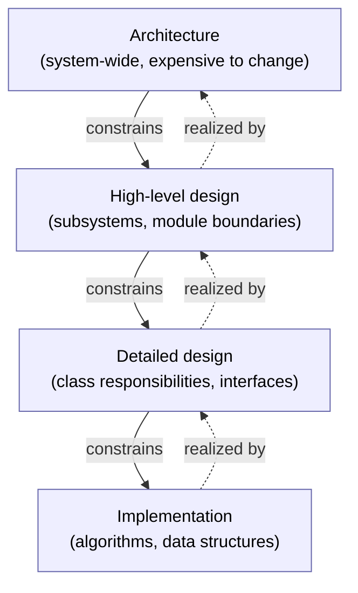
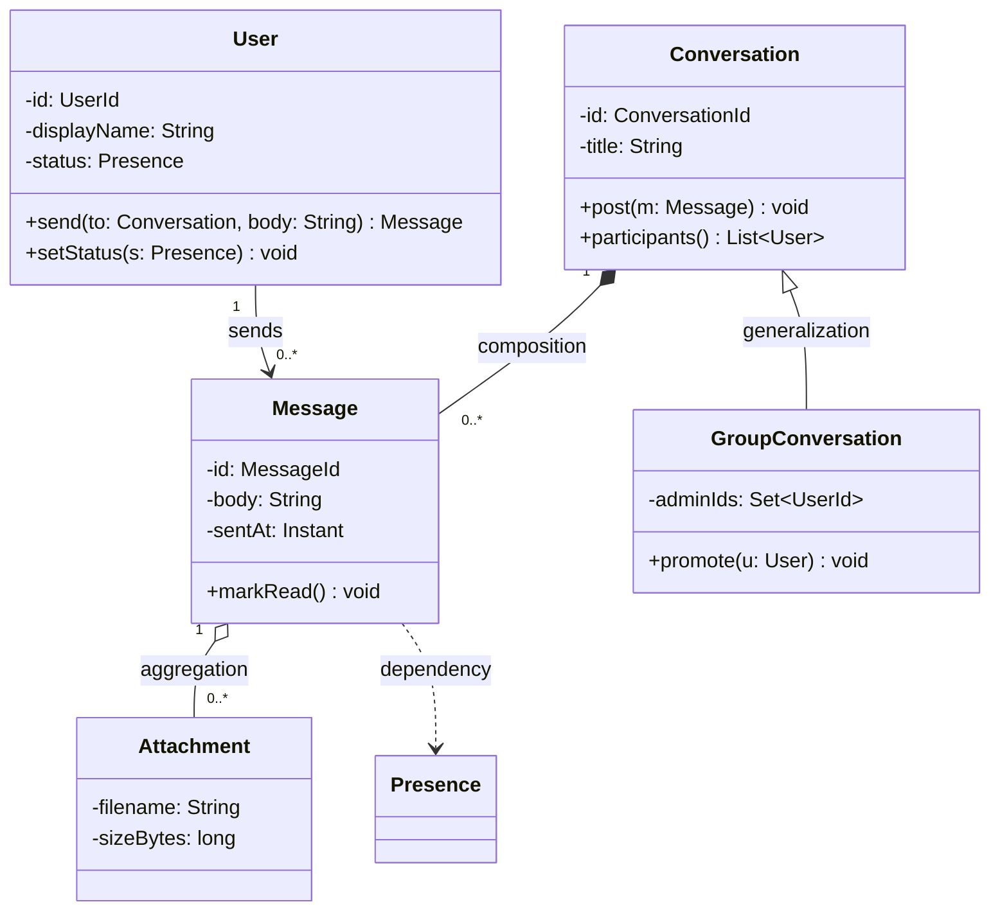
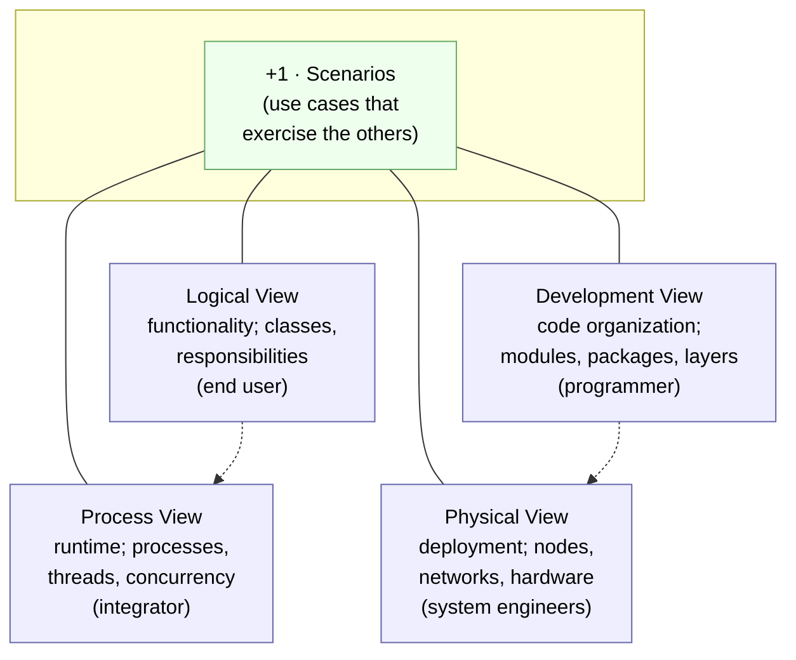
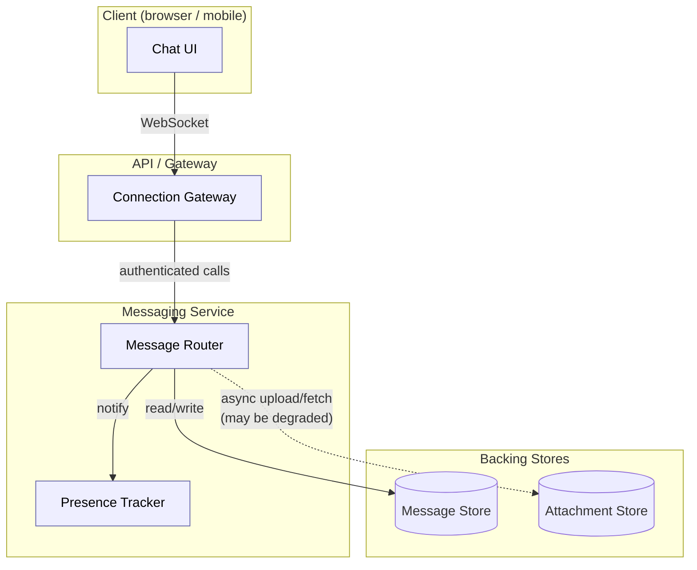
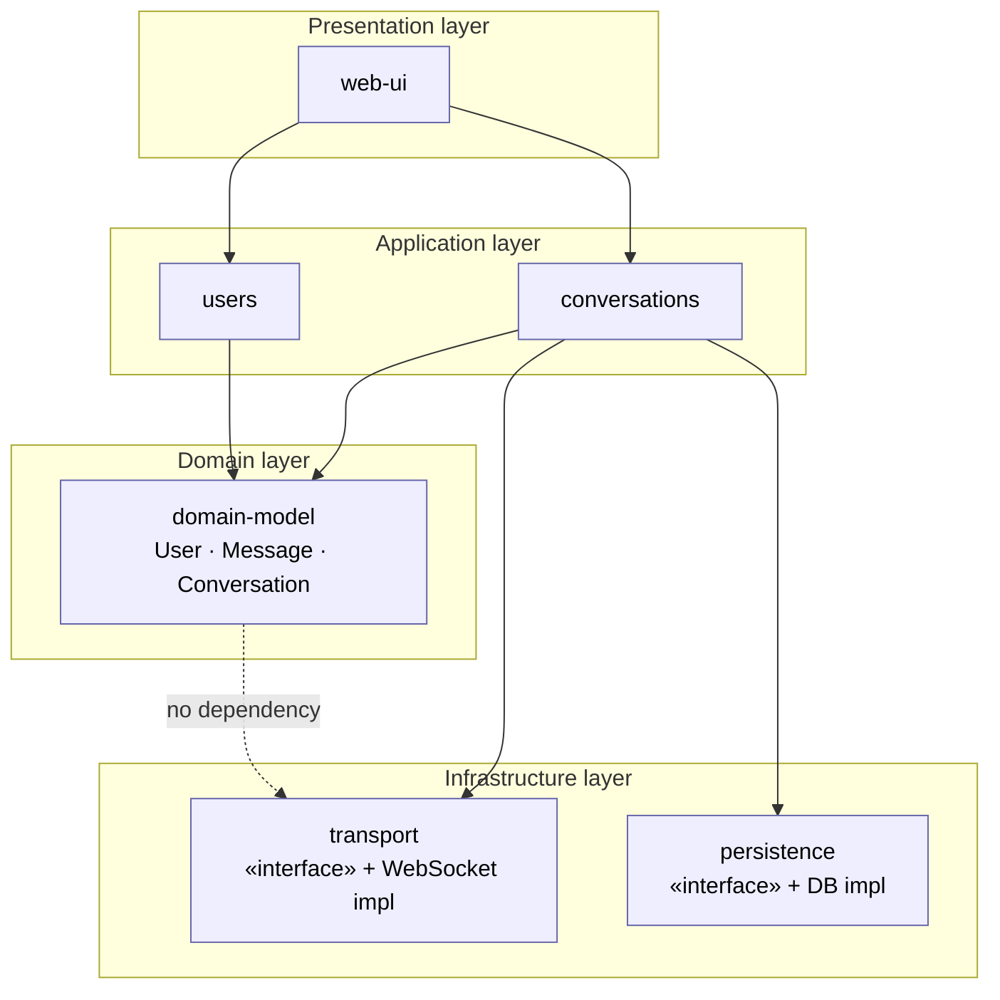

# Chapter 6 — Design and Architecture

> **Where we are.** Chapters 3 through 5 answered *what* to build: you elicited user
> requirements, analyzed them, and captured behavior as use cases. This chapter is the
> hinge where the project turns from problem to solution. Before anyone writes a line of
> production code, someone decides how the system will be carved into parts, how those
> parts will talk to one another, and which qualities the whole must exhibit. That set of
> decisions is the system's **architecture**, and living with it — well or badly — is
> most of what "maintaining software" means. Chapter 7 will catalog reusable
> architectural *patterns*; here you learn the underlying vocabulary and judgment.

A house can be built without blueprints. People do it — a room added here, a porch
bolted on there — and for a while it works. Then someone wants to move a load-bearing
wall, and it turns out no one knows which walls are load-bearing. Software accretes the
same way, except that its "walls" are invisible, so the discovery that you cannot safely
change something usually arrives as a production incident rather than a sagging roof.
**Architecture is the discipline of deciding, on purpose and in advance, where the walls
go** — and of writing that decision down so the next person can respect it.

## 6.1 The Role of Architecture

### 6.1.1 What Is Architecture?

Ask five engineers to define software architecture and you will get five answers, but
they cluster around a single idea. The architecture of a system is the set of
**structures** needed to reason about it: the parts it is made of, the externally visible
properties of those parts, and the relationships among them.[^1] Two phrases in that
sentence carry the weight.

First, **externally visible properties.** Architecture is deliberately about the *outside*
of each part — what it offers, what it requires, what guarantees it makes — and not about
the private machinery inside. When you say "the payments module talks to the ledger only
through a documented interface," you have made an architectural statement. When you say
"the ledger sorts its entries with quicksort," you have made an implementation statement.
The line between them is exactly the line between what other parts can depend on and what
they must not.

Second, **structures.** A system has more than one architecture depending on which
structure you look at. The way code is grouped into files and packages is one structure.
The way running processes communicate at runtime is another. The way software is deployed
onto machines is a third. All three are "the architecture," and confusing them is a
common source of muddled design discussions (§6.4 gives you a way to keep them straight).

> **Definition.** A system's **architecture** is the set of significant design decisions
> about how it is structured — its components, their responsibilities and interfaces, and
> the relationships and constraints among them — chosen to satisfy the system's most
> important quality requirements.

The word *significant* is doing real work. Not every decision is architectural. Whether a
helper function takes two arguments or three is a local matter you can change on a Tuesday
afternoon and no one else will notice. Whether the system stores state in a single shared
database or gives each service its own store is a decision that, once made and built upon,
may take a year and a rewrite to reverse. **Architectural decisions are the ones that are
expensive to change** — and that is why they deserve thought before, not after.

### 6.1.2 Design Includes Architecture

People sometimes talk as though "design" and "architecture" name two different
activities, or two different phases separated by a fence. They do not. **Design is a
continuum of decisions at different scales**, and architecture is simply its coarsest,
most consequential end.



At the top, you decide that the system is a web client, an API server, and a background
worker sharing a database — a handful of decisions that shape everything else. In the
middle, you decide how the API server divides into modules: authentication, messaging,
user profiles. Lower still, you decide that the messaging module exposes a `Conversation`
class with certain operations. At the bottom, you choose the data structure that stores
messages in memory. Each level *constrains* the levels below it and is *realized by* them.
A brilliant sorting algorithm cannot rescue an architecture that put the sort in the wrong
process; a clean architecture cannot survive detailed code that ignores its boundaries.

The practical consequence is that you cannot fully separate "the architects" from "the
programmers." The people writing code make micro-architectural decisions constantly, and
if those decisions ignore the intended structure, the real architecture drifts away from
the drawn one. Good teams keep the two aligned by writing the architecture down (§6.5) and
by reviewing changes against it.

**Designing at the right fidelity.** If design is a continuum, one recurring mistake is
working at the *wrong* level of detail for the decision at hand. Jump to pixel‑perfect
mockups or fully fleshed‑out classes too early and you make expensive commitments before
you understand the problem — and you rob the people downstream of the judgment that is
their job. Stay too vague ("redesign the reports section") and there is no shared object to
reason about, so scope balloons unnoticed. Basecamp's *Shape Up* names a useful target
between these failures: a design should be **rough** (visibly unfinished, so it invites
change), **solved** (the main elements and their connections are worked out, not hand‑waved),
and **bounded** (it states what is explicitly *out* of scope).[^2]

> **Technique — breadboards and fat‑marker sketches.** To design at that level, work in
> deliberately low‑fidelity forms. A **breadboard** (borrowed from electronics) captures
> only *places* (screens, states), *affordances* (things a user can act on — a button, a
> field), and *connection lines* between them — the functional wiring, with no visual
> styling. A **fat‑marker sketch** is drawn with strokes so thick that fine detail is
> *impossible*, which forces attention onto layout and relationships rather than polish.[^3]
> The same instinct applies to system design: a boxes‑and‑arrows component sketch (§6.4)
> is the architectural breadboard — enough to reason about structure, not so much that you
> have secretly written the code in a diagram.

### 6.1.3 What Is a Good Software Architecture?

There is no single "correct" architecture for a problem, only architectures that serve
some goals better than others. So we judge an architecture the way we judge a plan: by how
well it delivers the qualities that matter for *this* system, at an acceptable cost.
Concretely, a good architecture tends to have these properties.

- **It fits the important quality requirements.** If the system must handle ten thousand
  concurrent users, the architecture must have an answer for load and failure. If it must
  keep working while individual parts are redeployed, the architecture must isolate those
  parts. Architecture exists mainly to satisfy the *non-functional* requirements —
  performance, availability, security, modifiability — because functional requirements can
  usually be met by many structures, but quality requirements rule most of them out.
- **It makes likely changes cheap.** No architecture makes *every* change cheap; that is
  impossible, because reducing the cost of one kind of change usually raises the cost of
  another. The trick is to predict which changes are likely and arrange the walls so those
  changes stay local. An architecture that isolates the parts most likely to change — the
  user interface, the tax rules, the payment provider — earns its keep for years.
- **It can be understood.** An architecture that no one on the team can hold in their head
  is, for practical purposes, no architecture at all: people will violate boundaries they
  cannot see. Conceptual integrity — a small number of consistent ideas applied
  throughout — is worth more than local cleverness.[^4]
- **It is buildable and testable.** A structure that looks elegant on a diagram but forces
  every test to spin up the entire system is a bad architecture, because it makes the
  feedback loop that catches defects slow and expensive (Chapter 9).

> **Principle.** You cannot maximize all qualities at once. Good architecture is the art
> of *trading off* consciously — buying the qualities this system needs and knowingly
> paying for them in the qualities it does not — rather than stumbling into whichever
> trade-offs the code happens to make for you.

## 6.2 Designing Modular Systems

The single most powerful idea in software design is **modularity**: build the system out
of parts that can each be understood, built, tested, and changed largely on their own. The
whole of §6.2 unpacks what makes a decomposition into modules good rather than merely
present. (Every non-trivial program *has* modules; the question is whether they are the
*right* ones.)

### 6.2.1 The Modularity Principle

A **module** is a unit of software with a boundary: a set of things it provides to the
rest of the system and a set of things it keeps to itself. The value of a module comes
almost entirely from what it *hides*.

**Information hiding** is the practice of designing each module around a decision — often
a design decision likely to change — and hiding that decision behind an interface, so that
the rest of the system depends on the *interface* and not on the decision.[^5] The classic
example: a module that stores user records should expose operations like `find(id)` and
`save(record)` while hiding whether the records live in a SQL database, a file, or a
remote service. Because callers never learned how records are stored, you can switch from
files to a database without touching a single caller. The hidden decision was free to
change because it was, in fact, hidden.

Here is that module, its secret — how the records are laid out on disk — behind the
interface. (Each listing names its exact secret in a comment.)

```go
type User struct{ ID, Name string }
type UserStore interface { // the promise, spelled out as a type
	Find(id string) User
	Save(record User)
}

type FileStore struct{ dir string } // the secret: one small file per user
func (s FileStore) Find(id string) User {
	name, _ := os.ReadFile(s.dir + "/" + id)
	return User{id, string(name)}
}
func (s FileStore) Save(record User) {
	os.WriteFile(s.dir+"/"+record.ID, []byte(record.Name), 0o644)
}

// MemStore never says "implements UserStore" — Go interfaces are satisfied implicitly.
type MemStore map[string]User          // the new secret: an in-memory table
func (s MemStore) Find(id string) User { return s[id] }
func (s MemStore) Save(record User)    { s[record.ID] = record }

for _, store := range []UserStore{FileStore{os.TempDir()}, MemStore{}} {
	store.Save(User{ID: "u7", Name: "Dana"})
	fmt.Println(store.Find("u7").Name) // Dana — the identical caller, untouched
}
```

```java
interface UserStore {                          // the promise, spelled out as a type
  User find(String id);
  void save(User record);
}
record User(String id, String name) {}
record FileUserStore(Path dir) implements UserStore { // the secret: one file per user
  public User find(String id) {
    try { return new User(id, Files.readString(dir.resolve(id))); }
    catch (IOException e) { return null; }     // unknown id — no such file
  }
  public void save(User record) {
    try { Files.writeString(dir.resolve(record.id()), record.name()); }
    catch (IOException e) { throw new UncheckedIOException(e); }
  }
}

class MemoryUserStore implements UserStore {   // the new secret: an in-memory table
  private final Map<String, User> records = new HashMap<>();
  public User find(String id) { return records.get(id); }
  public void save(User record) { records.put(record.id(), record); }
}

UserStore store = new FileUserStore(dir);   // or new MemoryUserStore() — can't tell
store.save(new User("u7", "Dana"));         // the identical caller, untouched
System.out.println(store.find("u7").name()); // Dana
```

```javascript
const fs = require("node:fs"), assert = require("node:assert");

class UserStore {                       // the secret: a JSON file
  constructor(path) { this.path = path; }
  find(id) { return this.load()[id]; }
  save(record) {
    const users = { ...this.load(), [record.id]: record };
    fs.writeFileSync(this.path, JSON.stringify(users));
  }
  load() {
    if (!fs.existsSync(this.path)) return {};
    return JSON.parse(fs.readFileSync(this.path, "utf8"));
  }
}

class MemoryUserStore {                 // the new secret: an in-memory table.
  constructor() { this.records = {}; }  // No interface to declare — any object
  find(id) { return this.records[id]; } // shaped like find/save will do.
  save(record) { this.records[record.id] = record; }
}

for (const store of [new UserStore("users.json"), new MemoryUserStore()]) {
  store.save({ id: "u7", name: "Dana" });        // the identical caller, untouched
  assert.strictEqual(store.find("u7").name, "Dana");
}
```

```python
import json, os

class UserStore:
  def __init__(self, path):
    self._path = path                     # the secret: a JSON file

  def find(self, id):
    return self._load().get(id)

  def save(self, record):
    users = self._load()
    users[record["id"]] = record
    with open(self._path, "w") as f:
      json.dump(users, f)

  def _load(self):
    if not os.path.exists(self._path):
      return {}
    with open(self._path) as f:
      return json.load(f)
```

```ruby
require "json"

class UserStore                        # the secret: a JSON file
  def initialize(path) = @path = path
  def find(id) = load[id]
  def save(record)
    File.write(@path, JSON.dump(load.merge(record["id"] => record)))
  end
  private def load
    File.exist?(@path) ? JSON.parse(File.read(@path)) : {}
  end
end

class MemoryUserStore                  # the new secret: an in-memory table.
  def initialize = @records = {}       # There is no interface to declare or
  def find(id) = @records[id]          # implement — any object that answers
  def save(record) = @records[record["id"]] = record   # find/save will do.
end

[UserStore.new("users.json"), MemoryUserStore.new].each do |store|
  store.save({ "id" => "u7", "name" => "Dana" })  # the identical caller, untouched
  raise unless store.find("u7")["name"] == "Dana"
end
```

When disk storage becomes the bottleneck, the secret changes and the promise does not.

```go
// MemStore never says "implements UserStore" — Go interfaces are satisfied implicitly.
type MemStore map[string]User          // the new secret: an in-memory table
func (s MemStore) Find(id string) User { return s[id] }
func (s MemStore) Save(record User)    { s[record.ID] = record }
```

```java
class MemoryUserStore implements UserStore {   // the new secret: an in-memory table
  private final Map<String, User> records = new HashMap<>();
  public User find(String id) { return records.get(id); }
  public void save(User record) { records.put(record.id(), record); }
}
```

```javascript
class MemoryUserStore {                 // the new secret: an in-memory table.
  constructor() { this.records = {}; }  // No interface to declare — any object
  find(id) { return this.records[id]; } // shaped like find/save will do.
  save(record) { this.records[record.id] = record; }
}
```

```python
class UserStore:
  def __init__(self):
    self._records = {}                    # the new secret: an in-memory table

  def find(self, id):
    return self._records.get(id)

  def save(self, record):
    self._records[record["id"]] = record
```

```ruby
class MemoryUserStore                  # the new secret: an in-memory table.
  def initialize = @records = {}       # There is no interface to declare or
  def find(id) = @records[id]          # implement — any object that answers
  def save(record) = @records[record["id"]] = record   # find/save will do.
end
```

A caller that relied only on the promise runs unchanged against either version.

```go
store.Save(User{ID: "u7", Name: "Dana"})
fmt.Println(store.Find("u7").Name) // Dana
```

```java
store.save(new User("u7", "Dana"));
System.out.println(store.find("u7").name()); // Dana
```

```javascript
store.save({ id: "u7", name: "Dana" });
assert.strictEqual(store.find("u7").name, "Dana");
```

```python
store.save({"id": "u7", "name": "Dana"})
assert store.find("u7")["name"] == "Dana"
```

```ruby
store.save({ "id" => "u7", "name" => "Dana" })
raise unless store.find("u7")["name"] == "Dana"
```

**Encapsulation** is the mechanism that enforces information hiding: the language keeps
the private parts of a module unreachable from outside, so that clients *cannot* accidentally
depend on internals even if they wanted to. A field marked `private`, a function not
exported from its file, a class whose only public surface is a small set of methods — these
are encapsulation. Information hiding is the *intent* ("callers should not know how records
are stored"); encapsulation is the *enforcement* ("and the compiler will stop them").

The reason this matters is not tidiness. **A module's interface is a promise, and its
implementation is a secret.** As long as you keep the promise, you may change the
secret freely, and no one who relied only on the promise can break. The size of the promise
you make — the "surface area" of the interface — is therefore the size of the commitment
you can never quietly walk back. Small, deliberate interfaces are small, deliberate
commitments. This is why experienced designers fight to keep interfaces narrow: every
public method is a hostage to fortune.

> **Principle.** Design each module around a secret. Ask "what decision does this module
> hide, such that if that decision changed, only this module would change?" A module that
> hides nothing is just a place where code happens to sit.

### 6.2.2 Coupling and Cohesion

Two measures, introduced together decades ago, tell you whether a
decomposition is good: **coupling** between modules and **cohesion** within each.[^6]

**Coupling** is the strength of the dependency between two modules — how much one must know
about the other, and how badly a change to one ripples into the other. You want it **low**.
It also comes in kinds, and the kinds form a ladder from worst to best.[^7]
Knowing the ladder lets you diagnose *why* a dependency hurts, not just that it does.

- **Content coupling (worst).** One module reaches inside another and manipulates its
  internals directly — modifying its private data, or jumping into the middle of its code.
  Any change to the target's internals can break the intruder without warning. This is the
  coupling encapsulation exists to prevent.
- **Common coupling.** Modules share global mutable state — a global variable, a shared
  singleton. Now any module can change data any other module reads, so behavior depends on
  execution order and no module can be understood alone. Bugs here are notoriously
  non-local.
- **Control coupling.** One module passes a flag that tells another *what to do* — a
  control signal — so the caller must understand the callee's internal logic and branches.
  A function called `process(data, mode)` where `mode` selects between unrelated behaviors
  couples caller to callee's internal structure.
- **Stamp coupling.** A module passes a whole compound record when the callee needs only a
  field or two. The callee is now needlessly coupled to the shape of the whole record, and
  changing that record's structure can ripple into modules that never used the changed part.
- **Data coupling (best).** Modules communicate only through simple parameters — the exact
  data the callee needs, and nothing more. This is the loosest, most honest form of
  connection, and the one to aim for.

**Cohesion** is how well the elements *inside* a single module belong together — how
focused the module is on one job. You want it **high**. It, too, comes in kinds, from worst
to best:[^7]

- **Coincidental (worst):** the parts are grouped for no real reason — a "utils" grab-bag.
- **Logical:** parts are grouped because they are the same *category* of thing (all the
  input routines) though they do unrelated jobs.
- **Temporal:** parts are grouped because they run at the same *time* (everything done "at
  startup"), not because they relate.
- **Procedural / communicational:** parts share a flow of control, or operate on the same
  data.
- **Functional (best):** every part contributes to one well-defined task, and the module
  does that task completely and does nothing else.

Coupling and cohesion pull in the same direction, which is why they are always taught
together: **when you raise cohesion, coupling tends to fall, and vice versa.**[^7] If each
module does exactly one thing (high cohesion), related logic sits together and does not need
to reach across boundaries (low coupling). If a module does five unrelated things (low
cohesion), pieces of those five jobs inevitably entangle with five other modules (high
coupling). Chasing one gets you the other.

> **Pitfall.** A "utility" or "helpers" module is usually a cohesion failure wearing a
> friendly name. Because it has no single responsibility, everything ends up depending on
> it, and it ends up depending on everything — the worst of both measures. When you notice
> a module you cannot describe in one sentence without saying "and," split it.

### 6.2.3 Design Guidelines for Modules

The two measures above become actionable through a handful of guidelines. Treat them as
heuristics rather than laws: each pays off far more often than not.

1. **Give each module one responsibility.** You should be able to state a module's job in a
   single sentence with no "and." This is the *single responsibility* idea, and it is
   really "high cohesion" restated as a design rule.
2. **Make interfaces small and explicit.** Expose the fewest operations that let clients do
   their job. Every additional public operation is another promise you must keep forever
   (§6.2.1).
3. **Depend on interfaces, not implementations.** When module A needs a service, let it
   depend on an abstract description of that service, so that any conforming implementation
   can be substituted. This keeps coupling at the data/interface level and makes testing
   (with fakes) and change (with new providers) cheap.
4. **Push details down and out.** Keep policy — the important, stable decisions — in the
   core, and push volatile details (the specific database, the specific UI toolkit) to the
   edges where they can be swapped. Stable things should not depend on volatile things.
5. **Avoid cyclic dependencies.** If A depends on B and B depends on A, they are not two
   modules; they are one module with a line drawn through it, and you can no longer build,
   test, or reason about either alone. Break the cycle by introducing an interface one side
   owns.
6. **Design for the changes you expect.** You cannot isolate everything, so spend your
   modularity budget on the decisions most likely to change: external providers, business
   rules, presentation. Do not pay for flexibility you have no reason to expect (that is
   over-engineering, its own kind of accidental complexity).

Several of these guidelines circulate in industry under memorable names, and you should
recognize them when colleagues use them. The best-known bundle is **SOLID** — five
object-oriented design principles Robert C. Martin catalogued,[^8] later named for their
initials:

- **S — Single responsibility:** guideline 1 above — one stateable job per module.
- **O — Open-closed:** a module should be **open for extension, closed for
  modification** — you add behavior by adding new code (a new implementation of an
  interface, a new subclass), not by editing code that already works and that other
  modules already depend on.[^9]
- **L — Liskov substitution:** a subtype must be usable anywhere its supertype is
  expected, with no surprises.[^10] If code that works on every `Conversation` breaks when
  handed a `GroupConversation`, the generalization arrow (§6.3.2) is a lie.
- **I — Interface segregation:** many small, client-specific interfaces beat one fat
  one — guideline 2 taken seriously. A client forced to depend on operations it never
  calls is coupled to changes it never needed to see.
- **D — Dependency inversion:** guidelines 3 and 4 above — depend on abstractions, not
  implementations, and never let stable policy depend on volatile detail.

A companion rule with its own name is **DRY — Don't Repeat Yourself**: every piece of
knowledge in the system should have a single, authoritative representation.[^11] With
duplicated logic, the wasted keystrokes are the least of it: a future change must now be
found and fixed in two places, and eventually someone will fix only one.

> **Comments deserve design too.** Write comments *with* the code, not afterward — a
> comment added later is a guess. Never restate what a line obviously does (`i += 1  # add
> one to i` helps no one). Use comments to raise the level of abstraction above the code:
> the *why* behind a non-obvious choice, the constraint being honored, the units of a
> value. And prune them ruthlessly during maintenance, because a wrong comment is worse
> than none — comments rot faster than the code they describe.

## 6.3 Class Diagrams

To design and discuss modular structure, you need a notation. The **class diagram** from
the Unified Modeling Language (UML) is the lingua franca for describing the static
structure of object-oriented systems: the classes, what each holds and does, and how they
relate.[^12] You will not draw every class; you draw the ones whose relationships someone needs
to understand.

### 6.3.1 Representing a Class

A class is drawn as a box with up to three compartments: the **name** on top, the
**attributes** (data each object holds) in the middle, and the **operations** (what each
object can do) at the bottom. A **visibility** marker precedes each member:

- `+` **public** — visible to everyone (part of the interface, the promise),
- `-` **private** — visible only inside the class (the secret),
- `#` **protected** — visible to the class and its subclasses,
- `~` **package** — visible within the same package.

The convention is `visibility name : type` for attributes and
`visibility name(parameters) : returnType` for operations. Here is a small messaging model
you can read at a glance.



Read the boxes first: a `User` hides its `id` and `status` (private, the `-`) but promises
a public `send` operation (the `+`). The relationships — the lines between boxes — are the
real content of the diagram, and they are the subject of the next section.

### 6.3.2 Relationships between Classes

The lines in a class diagram carry precise meanings — each *shape* tells you how two
classes are connected and how tightly.[^12] Getting them right is how a diagram
communicates coupling.

- **Association** (a plain solid line) says two classes are connected: objects of one
  refer to objects of the other. "A `User` *sends* `Message`s" is an association. It is the
  most general relationship; the others are associations with extra meaning.
- **Aggregation** (a solid line with a *hollow* diamond at the "whole" end) is a
  "has-a / part-of" relationship where the part can outlive the whole and can be shared. A
  `Message` aggregates `Attachment`s: the same attachment could be referenced elsewhere, and
  deleting the message need not destroy the file. Aggregation is a weak, informal grouping.
- **Composition** (a solid line with a *filled* diamond at the "whole" end) is a stronger
  "part-of" where the part's lifetime is bound to the whole and the part is not shared. A
  `Conversation` is *composed of* its `Message`s: destroy the conversation and its messages
  go with it; a message belongs to exactly one conversation. Composition encodes ownership.
- **Generalization** (a solid line with a *hollow triangle* pointing at the parent) is
  inheritance: "a `GroupConversation` *is a* `Conversation`." The subclass inherits the
  parent's interface and can be used wherever the parent is expected.
- **Dependency** (a *dashed* arrow) is the weakest link: one class *uses* another
  transiently — as a parameter type, a return type, or a local — without holding a
  long-lived reference. `Message` depends on `Presence` if one of its methods takes a
  `Presence` argument. Dependencies are the couplings you most want to keep few and
  one-directional.

**Multiplicity** annotates the ends of a line with how many objects participate: `1`
(exactly one), `0..*` or `*` (zero or more), `1..*` (one or more), `0..1` (optional). In
the diagram above, `Conversation "1" *-- "0..*" Message` reads "one conversation is composed
of zero or more messages, and each message belongs to exactly one conversation."
Multiplicities matter: `1` versus `0..1` versus `0..*` is often the difference
between a null-pointer bug, a missing foreign key, and a correct schema.

> **Pitfall.** Do not agonize over aggregation versus composition in every diagram — even
> the UML specification leaves the precise semantics of aggregation open.[^12] What matters is the *lifetime and ownership*
> question the distinction forces you to ask: "if I delete the whole, does the part die,
> and can two wholes share one part?" Answer that; the diamond follows.

## 6.4 Architectural Views

A single diagram cannot capture a whole system any more than a single photograph captures
a building. Stakeholders ask different questions — "what are the responsibilities?", "how
does it perform under load?", "how do I check out and build the code?", "which server runs
what?" — and each question is best answered by a different picture. A **view** is a
representation of the system from one such perspective.[^13]

### 6.4.1 The 4+1 Grouping of Views

A widely used way to organize views, introduced by Philippe Kruchten, groups them into four
plus one.[^14] The four cover distinct concerns; the "+1" ties them together.



- **Logical view** — the *functionality* the system offers to end users, expressed as the
  key abstractions: classes, their responsibilities, their relationships. Class diagrams
  (§6.3) live here. It answers "what are the concepts and what can they do?"
- **Process view** — the system *at runtime*: the processes and threads, how they
  communicate, and how concurrency, performance, and availability are handled. It answers
  "what is executing, and how do the running pieces coordinate?" This is where you reason
  about deadlocks, throughput, and failover.
- **Development view** — the *code as organized for building*: the modules, packages,
  libraries, and layers, and their dependency structure. It is the programmer's map (§6.5.3)
  and answers "where does this code live and what may depend on what?"
- **Physical view** (also called the *deployment* view) — the *software mapped onto
  hardware*: which components run on which nodes, and how those nodes are networked. It
  answers "what do we actually deploy, and where?"
- **+1: Scenarios** — a handful of important **use cases** (Chapter 5) that thread through
  all four views. Scenarios are the glue: walking a use case through the logical, process,
  development, and physical views is how you check that the four are *consistent* with one
  another and that, together, they actually deliver the behavior. They also make the views
  discoverable — a reader follows a familiar story and sees each view play its part.

The power of the 4+1 grouping is that it *separates concerns among readers*. An operations
engineer reads the physical view and ignores the logical one; a new programmer reads the
development view. Nobody has to understand everything at once, which is the same complexity
argument that motivated modularity — applied now to the documentation.

### 6.4.2 Structures and Views

It helps to distinguish a **structure** from a **view**. A structure is something real in
the system — the actual set of modules and their dependencies, the actual set of runtime
processes. A view is a *representation* of a structure, drawn for an audience. The three
big families of structure are worth naming because almost every architectural confusion is
a failure to keep them apart:[^1]

- **Module structures** — how the system is divided into units of *code*: modules,
  packages, classes, layers, and the "is-part-of," "depends-on," and "is-a" relations
  among them. (Development and logical views show these.)
- **Component-and-connector structures** — how the system is divided into units that have
  *runtime* presence: processes, services, clients, servers, and the connectors —
  channels, calls, message queues — through which they interact. (The process view shows
  these.)
- **Allocation structures** — how software elements *map onto* their environment: onto
  hardware nodes, onto teams that own them, onto files in a repository. (The physical view
  shows these.)

The reason to keep these straight is that a single box on one diagram can be several things
on another. A "messaging" module in the development view might, at runtime, be split across
three processes in the process view and deployed on two machines in the physical view. If
you try to force all of that into one diagram, you get a picture that is wrong from every
angle. **Draw one structure per view, name the view, and say who it is for.**

## 6.5 Describing System Architecture

Deciding an architecture is worthless if the decision lives only in the head of the person
who made it. Architecture must be *described* — written down in a form the team can read,
question, and hold changes accountable to. This section gives you a practical outline and a
worked example.

### 6.5.1 Outline for an Architecture Description

An architecture description need not be a book. For most systems, a living document of a few
pages, kept next to the code, does the job. A serviceable outline:

1. **Context and goals.** What the system is, who its stakeholders are, and — crucially —
   the *quality requirements* that drive the architecture (the target load, the availability
   goal, the security posture, the changes you expect). Everything after this section exists
   to satisfy this section.
2. **Constraints and decisions.** The fixed constraints (must run on the customer's cloud;
   must integrate with an existing identity provider) and the *significant decisions* you
   made, each with a one-line rationale. Recording *why* is what lets a future engineer
   safely revisit the *what*.
3. **The views.** One section per view you chose to document (§6.4): typically a logical
   view (a class or component diagram), a development view (the module hierarchy), a process
   view if concurrency matters, and a physical view if deployment is non-trivial.
4. **Key scenarios.** Two or three use cases walked through the views, showing how the
   parts cooperate to deliver behavior — the "+1" made concrete.
5. **Risks and open questions.** Honesty about what you are unsure of. An architecture
   document that admits its risks is far more useful than one that pretends to certainty.

### 6.5.2 System Overview of a Communications App

Make it concrete. Suppose you are building **a communications app** — one-to-one and group
messaging, with presence ("online / away") and file attachments. Its important quality
requirements are: messages should be delivered within a second under normal load; the
system should stay usable if the attachment storage is temporarily unavailable; and the
team expects to change the *transport* (today WebSockets, perhaps something else later) and
to add new *message types* often.

Those quality requirements dictate the shape. The need to swap transports says: hide the
transport behind an interface. The need to survive attachment-storage outages says: make
attachments a separate component the messaging core does not synchronously depend on. Here
is a component-and-connector (process) view for that overview.



Notice how the diagram *encodes the quality requirements*. The transport (WebSocket) is
confined to the edge between the UI and the Connection Gateway, so changing it touches two
boxes, not the whole system. The Attachment Store is reached by a *dashed, asynchronous*
connector, signaling that the Message Router does not block on it — if attachments are down,
text messages still flow, satisfying the "stay usable" requirement. The architecture is
readable *because* it makes the important decisions visible and hides the rest.

### 6.5.3 A Development View: Module Hierarchies

The process view above shows runtime pieces. The **development view** shows how the *code*
is organized and — most importantly — which modules are *allowed* to depend on which. The
usual discipline is a **layered** module hierarchy: higher layers may depend on lower ones,
never the reverse, and volatile details sit at the edges.



Two things stand out in this hierarchy. First, **the domain model depends
on nothing below it.** The `domain-model` module — the classes from §6.3 — knows nothing
about databases or WebSockets. That is deliberate: the domain is the most stable, most
valuable part of the system, so it must not be dragged along when a volatile detail changes.
The dashed "no dependency" line is a design *rule*, not an observation, and a good build
setup enforces it (Chapter 8's static checks can fail the build if `domain-model` ever
imports `transport`).

Second, **the infrastructure layer is where interfaces meet implementations.** The
`persistence` and `transport` modules each expose an interface that the application layer
depends on, while hiding a concrete implementation behind it. This is dependency inversion
in the concrete: the important, stable code (application and domain) depends on abstractions,
and the volatile code (the actual database driver, the actual socket library) depends on
those same abstractions from below. Swapping the database becomes a change confined to one
module — exactly the "make likely changes cheap" property from §6.1.3, realized in the code
structure rather than merely wished for on a slide.

In code, the inversion is small: the application layer owns the definition of what a
transport must do — deliver a body to a recipient — and the real transport and a test fake
both conform to it from below.

```go
type Transport interface { // owned by the application layer
	Deliver(to, body string)
}

type MessageRouter struct{ transport Transport } // sees only the interface
func (r MessageRouter) Route(message map[string]string) {
	r.transport.Deliver(message["to"], message["body"])
}

type WebSocketTransport struct{ sock io.Writer } // infrastructure, conforming from below
func (t WebSocketTransport) Deliver(to, body string) {
	t.sock.Write([]byte(to + ":" + body))
}

// FakeTransport never says "implements Transport" — satisfying it is enough.
type FakeTransport struct{ sent []string }       // a two-line test double
func (t *FakeTransport) Deliver(to, body string) { t.sent = append(t.sent, to+":"+body) }

fake := &FakeTransport{}
MessageRouter{fake}.Route(map[string]string{"to": "dana", "body": "you are on call"})
fmt.Println(fake.sent) // [dana:you are on call]
```

```java
interface Transport {                        // owned by the application layer
  void deliver(String to, String body);
}
record MessageRouter(Transport transport) {  // application code sees only the interface
  void route(Map<String, String> message) {
    transport.deliver(message.get("to"), message.get("body"));
  }
}
record WebSocketTransport(OutputStream socket) implements Transport { // infrastructure,
  public void deliver(String to, String body) {                      // from below
    try { socket.write((to + ":" + body).getBytes()); }
    catch (IOException e) { throw new UncheckedIOException(e); }
  }
}
class FakeTransport extends ArrayList<String> implements Transport { // a two-line double
  public void deliver(String to, String body) { add(to + ":" + body); }
}

var fake = new FakeTransport();
new MessageRouter(fake).route(Map.of("to", "dana", "body", "you are on call"));
System.out.println(fake); // [dana:you are on call]
```

```javascript
const assert = require("node:assert");

class MessageRouter {                  // application code sees only the deliver() shape
  constructor(transport) { this.transport = transport; }
  route(message) { this.transport.deliver(message.to, message.body); }
}

class WebSocketTransport {             // infrastructure, conforming from below.
  constructor(socket) { this.socket = socket; }      // No Transport type to declare —
  deliver(to, body) { this.socket.send(`${to}:${body}`); } // any deliver()-shaped
}                                                          // object will do.

class FakeTransport extends Array {    // a two-line test double
  deliver(to, body) { this.push([to, body]); }
}

const fake = new FakeTransport();
new MessageRouter(fake).route({ to: "dana", body: "you are on call" });
assert.deepStrictEqual([...fake], [["dana", "you are on call"]]);
```

```python
from typing import Protocol

class Transport(Protocol):                 # owned by the application layer
  def deliver(self, to: str, body: str) -> None: ...

class MessageRouter:                       # application code sees only the interface
  def __init__(self, transport: Transport):
    self._transport = transport

  def route(self, message: dict) -> None:
    self._transport.deliver(message["to"], message["body"])

class WebSocketTransport:                  # infrastructure, conforming from below
  def __init__(self, socket):
    self._socket = socket

  def deliver(self, to: str, body: str) -> None:
    self._socket.send(f"{to}:{body}".encode())

class FakeTransport(list):                 # a two-line test double
  def deliver(self, to, body): self.append((to, body))

fake = FakeTransport()
MessageRouter(fake).route({"to": "dana", "body": "you are on call"})
assert fake == [("dana", "you are on call")]
```

```ruby
class MessageRouter                    # application code sees only the deliver method
  def initialize(transport) = @transport = transport
  def route(message) = @transport.deliver(message["to"], message["body"])
end

class WebSocketTransport               # infrastructure, conforming from below.
  def initialize(socket) = @socket = socket        # No Transport type to declare —
  def deliver(to, body) = @socket.write("#{to}:#{body}")  # any object that answers
end                                                       # deliver will do.

class FakeTransport < Array            # a two-line test double
  def deliver(to, body) = push([to, body])
end

fake = FakeTransport.new
MessageRouter.new(fake).route({ "to" => "dana", "body" => "you are on call" })
raise unless fake == [["dana", "you are on call"]]
```

The `MessageRouter` can now be exercised in a test without opening a socket — the same
substitution that lets the team change transports later.

## 6.6 Conclusion

Architecture is what you get when you make the expensive decisions on purpose. Its core is a
single, endlessly applied idea — **decompose the system into modules with high cohesion and
low coupling, each hiding a decision behind a small, explicit interface** — and everything
else in this chapter is that idea seen from a different angle. Coupling and cohesion give
you a vocabulary to *diagnose* a decomposition; information hiding tells you *how to choose*
the boundaries; class diagrams and multiplicities let you *record* the static structure;
the 4+1 views let you *describe* the system to different audiences without drowning any of
them; and an architecture document makes the whole thing *durable* — a decision the team can
respect instead of a story only one person remembers.

Carry two ideas into the rest of the book. First, architecture serves *quality
requirements*: you choose a structure to buy performance, availability, security, or —
above all — cheap change, and you pay for it consciously in the qualities you did not
choose. Second, architecture is only real to the extent that the code obeys it; a drawn
boundary that the build does not enforce and the reviews do not defend will erode. Chapter 7
takes the next step, showing that you rarely invent these structures from nothing: recurring
problems have well-understood **architectural patterns** — layered, client-server,
pipe-and-filter, publish-subscribe, and more — that package hard-won decisions so you can
reuse the judgment, not just the diagram.

---

### Sources

[^1]: Len Bass, Paul Clements, and Rick Kazman, *Software Architecture in Practice*, 4th ed. (2021). [sei.cmu.edu](https://insights.sei.cmu.edu/library/software-architecture-in-practice-fourth-edition/).
[^2]: Ryan Singer, *Shape Up: Stop Running in Circles and Ship Work that Matters*, ch. "Principles of Shaping" (Basecamp, 2019). [basecamp.com](https://basecamp.com/shapeup/1.1-chapter-02).
[^3]: Ryan Singer, *Shape Up: Stop Running in Circles and Ship Work that Matters*, ch. "Find the Elements" (Basecamp, 2019). [basecamp.com](https://basecamp.com/shapeup/1.3-chapter-04).
[^4]: Frederick P. Brooks, Jr., *The Mythical Man-Month: Essays on Software Engineering* (1975; anniversary ed. 1995). [informit.com](https://www.informit.com/store/mythical-man-month-essays-on-software-engineering-anniversary-9780201835953).
[^5]: David L. Parnas, "On the Criteria To Be Used in Decomposing Systems into Modules," *Communications of the ACM* 15(12) (1972). [dl.acm.org](https://dl.acm.org/doi/10.1145/361598.361623).
[^6]: W. P. Stevens, G. J. Myers, and L. L. Constantine, "Structured Design," *IBM Systems Journal* 13(2) (1974). [dl.acm.org](https://dl.acm.org/doi/10.1147/sj.132.0115).
[^7]: Edward Yourdon and Larry L. Constantine, *Structured Design: Fundamentals of a Discipline of Computer Program and Systems Design* (1979). [archive.org](https://archive.org/details/Structured_Design_Edward_Yourdon_Larry_Constantine).
[^8]: Robert C. Martin, "Design Principles and Design Patterns" (2000). [objectmentor.com via web.archive.org](https://web.archive.org/web/20030416004136/http://www.objectmentor.com/resources/articles/Principles_and_Patterns.PDF).
[^9]: Bertrand Meyer, *Object-Oriented Software Construction* (1988; 2nd ed. 1997). [bertrandmeyer.com](https://bertrandmeyer.com/OOSC2/).
[^10]: Barbara H. Liskov and Jeannette M. Wing, "A Behavioral Notion of Subtyping," *ACM Transactions on Programming Languages and Systems* 16(6) (1994). [dl.acm.org](https://dl.acm.org/doi/10.1145/197320.197383).
[^11]: Andrew Hunt and David Thomas, *The Pragmatic Programmer* (1999; 20th-anniversary ed. 2019). [pragprog.com](https://pragprog.com/titles/tpp20/the-pragmatic-programmer-20th-anniversary-edition/).
[^12]: Object Management Group, *OMG Unified Modeling Language (OMG UML)*, version 2.5.1 (2017). [omg.org](https://www.omg.org/spec/UML/2.5.1/).
[^13]: ISO/IEC/IEEE, *ISO/IEC/IEEE 42010:2022 — Software, systems and enterprise — Architecture description* (2022). [iso.org](https://www.iso.org/standard/74393.html).
[^14]: Philippe Kruchten, "Architectural Blueprints — The 4+1 View Model of Software Architecture," *IEEE Software* 12(6) (1995). [cs.ubc.ca](https://www.cs.ubc.ca/~gregor/teaching/papers/4+1view-architecture.pdf).

---

- **Key takeaways** are summarized above in §6.6.
- Continue to the [Exercises](exercises.md).
- Go deeper with the [Open Resources](resources.md) for this chapter.
