# Chapter 7 — Architectural Patterns

> **Where we are.** Chapter 6 argued that the way to tame a large system is to decompose
> it into modules with high cohesion and low coupling. That advice is true but abstract:
> it tells you *what good structure looks like* without telling you *which structure to
> reach for* when you sit down to design a real system. This chapter closes that gap. An
> **architectural pattern** is a reusable, named arrangement of modules and connectors
> that has repeatedly solved a recurring design problem. Learning the catalog means you
> rarely start from a blank page — and, more importantly, that you can *reason about the
> trade-offs* of a structure before you commit code to it.

A pattern is not a library you install or a framework you inherit. It is a *shape* — a
recurring answer to a recurring question about how responsibilities and dependencies
should be arranged. When someone says "we'll put a message broker in the middle" or
"the UI is just a view over the model," they are naming a pattern, and everyone who
knows the vocabulary immediately shares a picture of the structure, its participants,
and the compromises it implies. That shared picture is the real payoff. Patterns give a
team a *design language* precise enough to argue in.

Every pattern in this chapter is presented the same way, so you can compare them fairly:
the **problem** it solves, its **structure** (with a diagram), the **participants** and
their responsibilities, the **trade-offs** you accept by adopting it, and a concrete
**example** from systems you have probably used. Read for the trade-offs above all. The
mark of an engineer, as Chapter 1 put it, is not knowing that a pattern exists but
knowing *when it earns its cost and when it is overkill.*

> **Principle.** A pattern is a *contract with consequences*. Adopting it buys you some
> qualities (flexibility, testability, scalability) and charges you others (indirection,
> latency, more moving parts). If you cannot name what you are buying and what you are
> paying, you are cargo-culting, not designing.

## 7.1 Software Layering

### 7.1.1 The Layered Pattern

Almost every substantial system you will build is organized, at the coarsest level, into
**layers**. The **layered pattern** stacks the system into horizontal tiers, where each
layer offers services to the layer directly above it and consumes services from the
layer directly below. A layer is a group of modules that operate at the same level of
abstraction: the top speaks the language of the user's problem, the bottom speaks the
language of the machine, and the middle layers translate progressively between them.

**Problem it solves.** A system spans a huge range of abstraction. At the top, you care
about "confirm the appointment"; at the bottom, you care about "write these bytes to a
socket." If every part of the code were free to talk to every other part, a change to
the database driver could ripple into the appointment-booking logic, and you could not
reason about either in isolation. Layering imposes order on that range of abstraction by
insisting that dependencies point *downward only*. High-level policy depends on
low-level mechanism through a stable interface, never the reverse.

**Structure.** A classic business application uses three or four layers. The
**presentation** layer renders the interface and interprets user input. The
**application** (or service) layer coordinates use cases and enforces workflow. The
**domain** layer holds the core business rules and entities. The **infrastructure** (or
persistence) layer talks to databases, message queues, and the outside world.

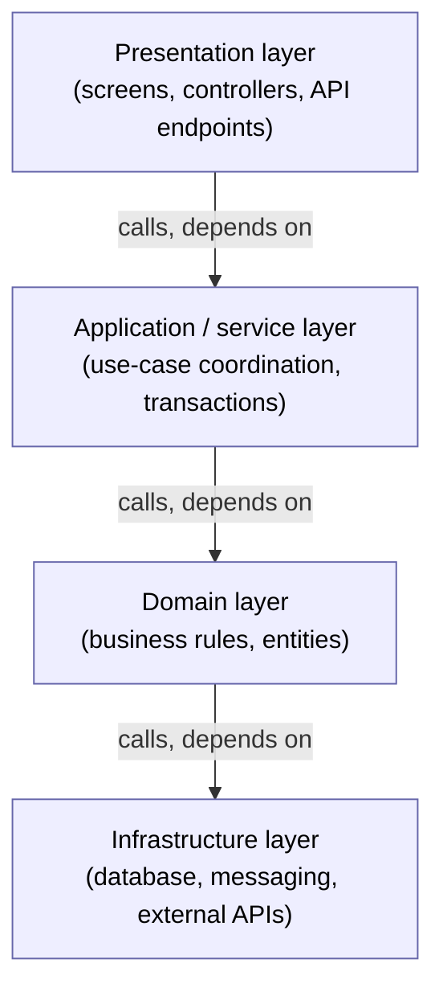

**Participants.** Each layer is a participant with one responsibility: to provide a
coherent set of services at its level of abstraction and to hide the layer beneath it.
The *interface* of a layer — the set of operations it exposes upward — is itself a
participant, because it is the contract that lets the upper layer stay ignorant of the
lower layer's internals.

A design decision you must make explicitly is whether layers are **strict** (a layer may
call *only* the layer immediately below it) or **relaxed** (a layer may call any layer
below it). Strict layering maximizes isolation — you could replace the domain layer's
notion of persistence without the presentation layer noticing — but it costs you
"pass-through" code, where a layer exposes an operation for no reason but to forward it
down. Relaxed layering removes that boilerplate but weakens the guarantee, because now
the presentation layer might reach past the application layer straight into
infrastructure, coupling the top of the stack to the bottom.

**A real example.** The seven-layer OSI model of network protocols is the textbook case:
your application code hands a message to the transport layer without knowing whether it
travels over copper, fiber, or radio, because each layer presents a clean service to the
one above. Closer to daily work, the standard three-tier web application — browser,
application server, database — is layering you already rely on, and any framework
organized as "controllers → services → repositories" is layering by another name.

### 7.1.2 Design Trade-offs

Layering is popular because its benefits are real and general. It gives you
**substitutability**: because a layer depends only on the *interface* below it, you can
swap one implementation for another — an in-memory store for a real database in tests, a
new payment provider for an old one — without touching the layers above. It gives you
**separation of concerns**, so a developer can work on presentation without understanding
persistence. And it gives you a **shared mental model**: new engineers can find their way
because "where does this code go?" usually has an obvious layered answer.

But the pattern is not free, and pretending otherwise is a common source of pain.

> **Pitfall.** *The pass-through tax.* In strict layering, a field the user enters at the
> top must often be threaded through every layer to reach the database — a change to add
> one field touches presentation, application, domain, and infrastructure. When most of
> your layers merely forward data without transforming it, the layering is buying you
> little and costing you edits in four files per change.

There is also a **performance** cost. Each layer boundary is a call, sometimes a
serialization, occasionally a network hop. For most applications this is negligible; for
a latency-critical inner loop it is not, and you may deliberately collapse layers in the
hot path. And layering says nothing about horizontal scaling — a beautifully layered
monolith is still one deployable unit.

The deeper trade-off is between **isolation and directness**. Strict layers isolate
change but add indirection; relaxed layers are direct but let coupling leak. The right
call depends on which changes you expect. If you expect to swap infrastructure often,
pay for strictness. If your layers are thin and stable, relax them. Notice that this is
exactly the Chapter 1 principle in action: *make likely changes cheap*, and accept a
small standing cost to do it.

## 7.2 Three Building Blocks

Before the larger architectures, you need three smaller patterns that appear *inside*
almost all of them. They are the mortar between the bricks: how modules share state
without becoming tangled (shared data), how they react to each other's changes without
tight coupling (the observer), and — implicit in both — how a stable interface lets
independent parts evolve. Master these and the big patterns become recombinations of
ideas you already understand.

### 7.2.1 The Shared-Data Pattern

**Problem it solves.** Many components need to read and write a common body of data:
several tools operate on the same document, several services on the same customer record.
If each component kept its own copy, you would face the impossible job of keeping the
copies consistent. The **shared-data** (or **repository**) pattern gives the components a
single, central data store that they all access through a defined interface, making the
store the authoritative source of truth.

**Structure.** A central **data store** sits at the hub. Around it, independent
**accessor** components read and write, but they do not talk to each other directly —
they communicate *through* the shared data. The store owns concerns that would otherwise
be duplicated: consistency, concurrency control, integrity constraints, and durability.

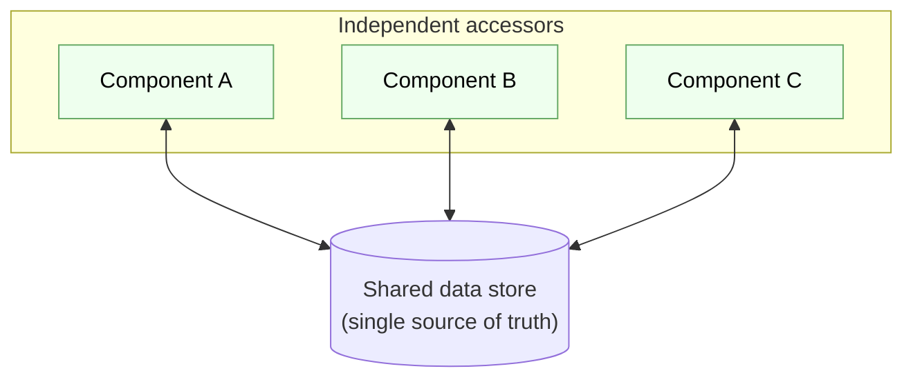

**Participants.** The **data store** is responsible for holding state and enforcing its
invariants. The **accessors** are responsible for the actual computation; they are
decoupled from each other because their only shared knowledge is the store's schema and
interface. Often one accessor's writes become another's inputs — a compiler's symbol
table, written by the parser and read by the type checker, is a shared-data design.

**Trade-offs.** The great advantage is that accessors are mutually independent: you can
add a new one without touching the others, because they coordinate only through the
store. The great danger is that the store becomes a **coupling magnet** and a
**bottleneck**. Because everyone depends on the schema, a schema change can break every
accessor at once — the store's interface is now a system-wide contract. And because
every access funnels through one place, the store can become the scalability limit and a
single point of failure. Relational databases, blackboard systems in AI, and the Redux
"single store" in front-end apps are all shared-data designs, and all of them live with
exactly this tension between convenient centralization and dangerous centralization.

### 7.2.2 Observers and Subscribers — the Observer Pattern

**Problem it solves.** One object holds state that others care about, and those others
must react when it changes — a spreadsheet cell changes and every chart derived from it
must redraw. The naive solution has the state-holder call each interested party directly,
but that means the state-holder must *know about* every interested party, hard-coding a
dependency on things that logically depend on *it*. The **observer** pattern inverts that
dependency: interested parties **subscribe**, and the state-holder notifies its
subscribers without knowing who or what they are.

**Structure.** A **subject** maintains a list of **observers** and offers `subscribe` and
`unsubscribe` operations. When the subject's state changes, it iterates its list and
calls a uniform `notify`/`update` operation on each observer. The subject knows only that
observers implement that operation; it knows nothing else about them.

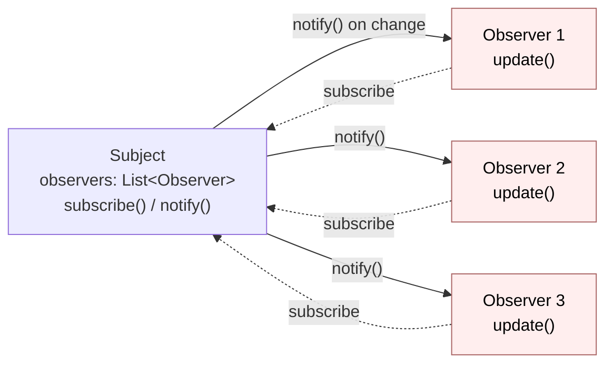

**Participants.** The **subject** (or *observable*) owns the state and the subscriber
list. The **observer** (or *subscriber*) implements the callback that runs on change. The
crucial property is the direction of the dependency: observers depend on the subject's
*notification interface*, and the subject depends on the observers' *update interface* —
neither depends on the other's concrete type. This is why you can add a new observer
without recompiling the subject.

At larger scale the same idea becomes **publish–subscribe**: publishers emit *events* to
named channels or topics, and subscribers register interest in topics rather than in a
specific subject. A message broker (§7.5.3) sits in the middle so that publishers and
subscribers need not even know the other exists or be running at the same time. Observer
is publish–subscribe in miniature, in one process; pub/sub is observer scaled across a
network.

**Trade-offs.** You gain **loose coupling** and **extensibility**: the subject is closed
to modification but open to new observers, which is precisely the flexibility a GUI
toolkit or an event system needs. You pay in **traceability** and **surprise**. Control
flow becomes implicit — reading the subject's code, you cannot see what happens when it
fires an event, because the reactions live elsewhere and are wired up at runtime. Bugs
hide in the ordering of notifications, in observers that trigger further changes (cascade
and cycles), and in **lapsed listeners** that forget to unsubscribe and leak memory. Use
the observer when the set of reactions is open-ended and you want the source to stay
ignorant of them; avoid it when a plain direct call would be clearer and the reactions
are fixed.

## 7.3 User Interfaces: Model-View-Controller

### 7.3.1 Design Decisions

Interactive applications share a hard problem: the same underlying information must be
*displayed* in one or more ways, *edited* through user gestures, and *stored* somewhere
durable — and each of those concerns changes on a different schedule and for different
reasons. Visual design changes when a designer redoes the look. Interaction changes when
you add a keyboard shortcut. Business rules change when the domain changes. If all three
concerns live in one tangled blob — the "smart widget" that draws itself, handles clicks,
*and* enforces business rules — every change risks breaking the others, and none of it
can be tested without a running screen.

The governing design decision, then, is a **separation of concerns**: keep the *data and
rules* apart from the *presentation* apart from the *input handling*. A second decision
follows: because one piece of data may drive several displays, the data should not depend
on any particular display — displays should depend on the data. That is exactly the
observer relationship of §7.2.2, and it is the engine inside every UI architecture in
this family.

### 7.3.2 The Basic Model-View-Controller Pattern

**Problem it solves.** How do you build an interactive application so that its appearance,
its input handling, and its core logic can each change independently and be tested
independently? **Model-View-Controller (MVC)** answers by splitting the application into
three roles.

**Structure and participants.**

- The **model** holds the application's data and business rules. It knows nothing about
  the screen. It is a plain, testable object that could run in a batch job with no UI at
  all. When its state changes, it announces the change to whoever is listening.
- The **view** renders the model for the user. It reads from the model and draws; it
  holds no business rules of its own. Several views may show the same model differently —
  a table and a chart of the same numbers.
- The **controller** interprets user input (clicks, keystrokes, gestures) and translates
  it into operations on the model. It contains the *interaction* logic that connects
  gestures to intentions.

The wiring is what makes MVC more than three boxes. The view **observes** the model: when
the model changes, it notifies its views, and each view re-reads the model and redraws.
This is why editing data in one place updates every view of it automatically.

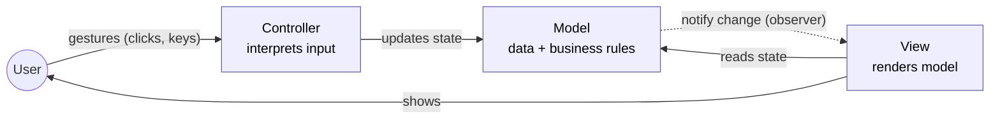

**A real example.** The pattern was born in desktop UI toolkits and now underlies most
web frameworks. In a server-side web app, an incoming request is dispatched to a
*controller* action, which manipulates *model* objects (and their database records) and
then selects a *view* (a template) to render the response. The exact division of labor
varies — front-end frameworks have spawned close cousins called **MVP**
(Model-View-Presenter) and **MVVM** (Model-View-ViewModel), which differ mainly in how
much logic sits between the view and the model and in which direction the wiring points.
What they share, and what you should carry away, is the core commitment: *the model does
not depend on the view*.

**Trade-offs.** MVC buys you **independent evolution and testability**. Because the model
has no UI dependencies, you can unit-test all your business rules without simulating a
screen — often the single biggest testability win available in an interactive app. You
can restyle the view or add a second view without touching the model. The cost is
**structure for its own sake in small cases**: a trivial screen split into three
collaborating objects is more indirection than a beginner expects, and the boundary
between "controller logic" and "model logic" is a perennial source of debate that spawns
those competing variants. As with layering, the pattern pays off in proportion to how
often, and how independently, the three concerns actually change.

### 7.3.3 Keep Views Simple

The single most valuable discipline within MVC is to keep views **thin** — sometimes
called the *humble view*. A view should contain as little logic as you can manage:
ideally it only reads values from the model (or a view-model prepared for it) and maps
them onto widgets. It should contain no business rules, no decisions that matter, and no
state that cannot be trivially reconstructed from the model.

Why so insistent? Because the view is the *one part you cannot easily test*. Automated
tests can exercise a model directly, but exercising a rendered screen requires slow,
brittle UI automation. Every branch, calculation, or rule you allow to creep into the
view is a branch that escapes your fast, reliable tests and hides where only a human
clicking around will find its bugs. Pushing that logic down into the model — or into a
dedicated **presenter/view-model** whose job is to pre-compute exactly what the view
should show — moves it back under test.

> **Principle.** *Put logic where it can be tested.* The humble-view rule is not about
> aesthetics; it is a testability strategy. Treat the boundary of your test coverage as a
> design constraint, and keep the untestable layer as thin as physically possible.

## 7.4 Dataflow Architectures

The patterns so far organize systems around *objects that call each other*. A different
family organizes systems around the *flow of data through transformations*. In a
**dataflow architecture**, you think first about the data — where it enters, how it is
transformed step by step, and where it exits — and the components fall out as the stages
that do the transforming. This inversion is powerful whenever the essence of a system is
"take this stream of stuff and progressively turn it into that stream of stuff."

### 7.4.1 Dataflow Pipelines — Pipes and Filters

**Problem it solves.** You must perform a *sequence* of independent transformations on a
body of data, and you want each transformation to be a self-contained unit you can build,
test, reuse, and reorder without knowing about its neighbors. The **pipes-and-filters**
pattern arranges the computation as a linear chain: each **filter** reads from an input
**pipe**, transforms what it reads, and writes to an output pipe that feeds the next
filter.

**Structure and participants.** A **filter** is a stateless-by-default component with one
job: consume input, produce output. A **pipe** is the connector that carries data from
one filter's output to the next filter's input — it is a buffer and a decoupler. Because
filters communicate *only* through pipes and share no other state, a filter knows nothing
about what comes before or after it; it only knows the shape of the data on its pipes.

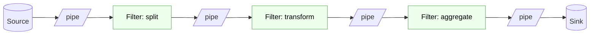

**A real example.** The Unix shell pipeline is the canonical case: `cat access.log | grep
404 | cut -d' ' -f1 | sort | uniq -c | sort -rn` chains six independent filters into a
"most frequent sources of 404 errors" report, and each command was written by someone who
never imagined this particular pipeline. Compilers are built the same way — lexer, parser,
optimizer, code generator — and so is any image or audio processing chain.

**Trade-offs.** The wins are **reuse and composability** (filters recombine into new
pipelines like Lego), **understandability** (each stage is simple in isolation), and
easy **parallelism** (adjacent filters can run concurrently, each working on data as it
arrives). The costs: pipes impose a **lowest-common-denominator data format** — often
plain text or byte streams — so filters spend effort parsing and re-serializing at every
boundary, and rich structure is awkward to pass through. A purely linear pipeline also
handles **errors** poorly: there is no natural place for a filter deep in the chain to
report a problem back upstream. And interactive, back-and-forth workloads simply do not
fit the one-directional flow.

### 7.4.2 Dataflow Networks

A strict pipeline is linear, but real transformations often **branch and merge**. A
**dataflow network** generalizes the pipeline into a directed graph: a filter may have
several inputs and several outputs, data may fan out to parallel branches and fan back
in, and the topology can express joins, splits, and conditional routing.

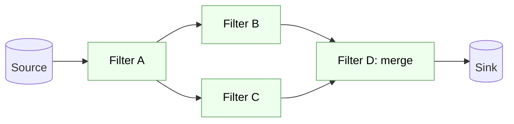

**Problem it solves and trade-offs.** Networks handle transformations whose natural shape
is a graph, not a line — enriching a record from two sources and combining the results,
or routing different record types down different processing paths. You keep the filters'
independence and composability, but you pay in **complexity of coordination**: a node
that merges two inputs must decide how to synchronize streams that arrive at different
rates, and the graph can deadlock if a cycle of full buffers waits on itself. Stream
processing frameworks, build systems (whose dependency graph *is* a dataflow network),
and spreadsheet recalculation engines are all dataflow networks. This is the structure
underneath modern **reactive** programming, where you declare how outputs are computed
from inputs and the runtime propagates changes through the graph for you.

### 7.4.3 Unbounded Streams

The pipelines above quietly assumed the data *ends* — a file has a last line, a document
a last page. Many important systems process data that never ends: sensor readings, user
clickstreams, financial ticks, log lines flowing in forever. An **unbounded stream**
changes the rules, because a filter can no longer "read all the input, then produce all
the output." It must produce results *incrementally*, from data it has seen so far,
without ever waiting for an end that will not come.

**Problem it solves and consequences.** Stream processing lets you compute continuously
and react in near-real-time instead of in nightly batches. But unboundedness forces
design decisions the batch world could ignore. You must reason in **windows** — "the
count of events in the last five minutes" — because "the total count" is never final. You
must handle **out-of-order and late data**, because events generated at one time may
arrive later, and you must decide how long to wait. You must bound memory, because you
cannot buffer an infinite stream, which means most computations must be *incremental* and
approximate. And **backpressure** becomes essential: when a downstream filter cannot keep
up, it must signal upstream to slow down, or buffers overflow and the system falls over.

> **Case study.** A fraud-detection system watches a never-ending stream of card
> transactions and must flag a suspicious one within seconds. It cannot wait for a "batch"
> to close; it maintains a sliding window of recent activity per account, updates running
> statistics as each event arrives, and applies backpressure to the ingestion feed when
> the scoring stage saturates. Every hard part of this design is a direct consequence of
> the stream being *unbounded*.

### 7.4.4 Big Dataflows — MapReduce-Style

When the data is not just endless but *enormous* — too large for one machine — dataflow
becomes a strategy for **distributing** computation across a cluster. The
**MapReduce** style captures a pattern that recurs across huge batch jobs: express the
computation as a **map** step that transforms each record independently, followed by a
**reduce** step that aggregates the mapped results by key. Because the map step treats
records independently, the framework can shard the data across hundreds of machines and
run the maps in parallel; because the reduce step aggregates by key, the framework can
route all records with the same key to the same reducer.

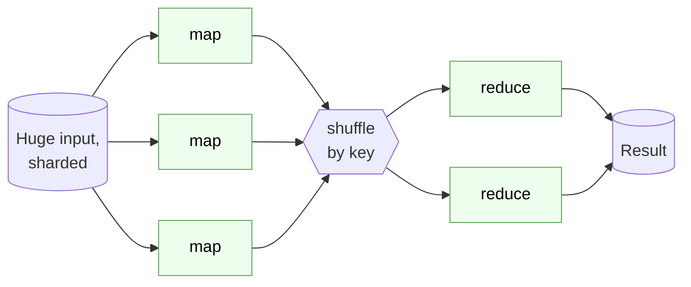

**Problem it solves and trade-offs.** The pattern's genius is that *you* write two small,
sequential functions — map and reduce — and the *framework* handles the hard distributed
concerns: partitioning the data, scheduling work, moving map outputs to the right
reducers (the **shuffle**), and re-running tasks that fail on a flaky machine. You get
massive parallelism and fault tolerance almost for free, provided your problem fits the
map-then-reduce shape. The costs are real: the rigid two-phase structure forces awkward
encodings for computations that are naturally iterative (many machine-learning
algorithms) or that need many stages, and the shuffle — moving data across the network
between phases — is often the dominant expense. Later engines generalize the idea into
arbitrary dataflow graphs of transformations to reduce that cost, but the core insight is
the same: *describe the dataflow, let the platform distribute it.*

## 7.5 Connecting Clients with Servers

The previous patterns mostly organize a single program. The next family organizes systems
that span **multiple machines**, where the fundamental questions become who initiates
contact, who holds the shared state, and how parties find one another across a network.

### 7.5.1 The Client-Server Pattern

**Problem it solves.** Many users, on many machines, need shared access to common data or
computation — a shared calendar, a bank ledger, a search index. You cannot put a copy on
every device and hope they agree. The **client-server** pattern designates one role, the
**server**, as the keeper of the shared resource, and another role, the **client**, as
the many requesters that ask the server to do work on their behalf. Clients initiate;
the server responds.

**Structure and participants.** The **server** owns the authoritative resource and waits
for requests, handling each according to a published **protocol** (the request/response
contract). The **client** knows the protocol and the server's address, sends requests,
and consumes responses; clients generally do not talk to each other. The protocol is the
interface that lets the two sides evolve independently, exactly as a layer's interface
does in §7.1.

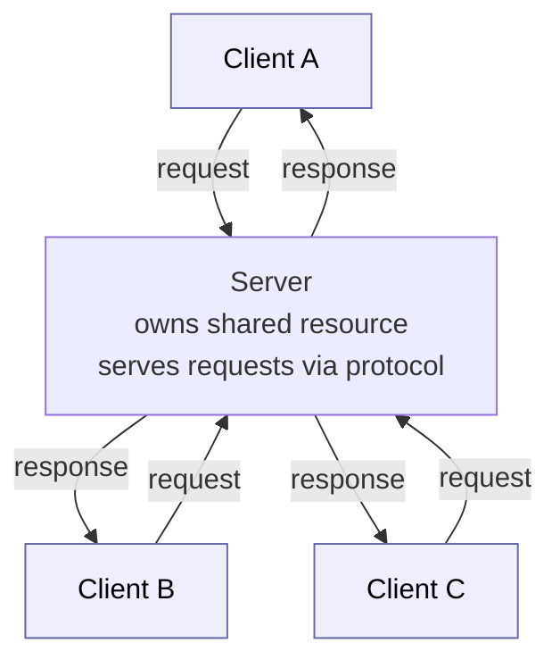

**A real example.** The web is client-server at planet scale: your browser (client) sends
HTTP requests to web servers that own the pages and data. A database server serving many
application instances, an email server, a game server — all follow the same shape.
**Trade-offs:** you gain a single authoritative source of truth and centralized control
of security and consistency, but the server is a **bottleneck and single point of
failure**, which is why real systems replicate and load-balance servers. The pattern also
raises the question of *how thick* the client should be — a thin client (just a display)
keeps logic central and easy to update but demands constant connectivity; a thick client
works offline and offloads the server but is harder to keep consistent and to upgrade.

### 7.5.2 Deploying Test Servers

A practical consequence of client-server structure is that you can *substitute the
server*. Because the client depends only on the **protocol**, not on any particular
server implementation, you can point the client at a stand-in server during development
and testing — a **test server** (often called a *mock*, *stub*, or *fake*).

**Why this matters.** Testing a client against the real production server is slow,
flaky, and dangerous: the real server may be unavailable, may hold irreplaceable data you
do not want to mutate, or may be a paid third-party API. A test server implements just
enough of the protocol to exercise the client's behavior — you can program it to return
specific responses, simulate errors and timeouts, and record what the client sent. This
lets you test client behavior that is nearly impossible to trigger against the real
thing, such as "what does the UI do when the server returns a 500?" It is the network-tier
echo of the layering benefit in §7.1.2: *depend on an interface, and you can swap the
implementation.* The trade-off is that a test server is only as faithful as you make it —
tests can pass against a fake that behaves differently from reality, so a smaller number
of full **integration tests** against a real server remain essential (Chapter 9).

### 7.5.3 The Broker Pattern

Plain client-server assumes the client knows *which* server to call and *where* it lives.
That assumption breaks down when there are many servers, when they come and go, or when
you want clients and servers to be ignorant of each other's location and identity. The
**broker** pattern inserts an intermediary — a **broker** — between clients and servers to
decouple them.

**Problem it solves.** As a system grows into many services, hard-wiring every caller to
every callee's address creates a brittle web of point-to-point dependencies: move or
rename a service and every caller breaks. A broker centralizes the connective tissue.
Clients send requests to the broker, which is responsible for *locating* an appropriate
server, *routing* the request to it, and *returning* the result — so clients address the
broker, not the server, and servers can be added, moved, or replaced without any client
knowing.

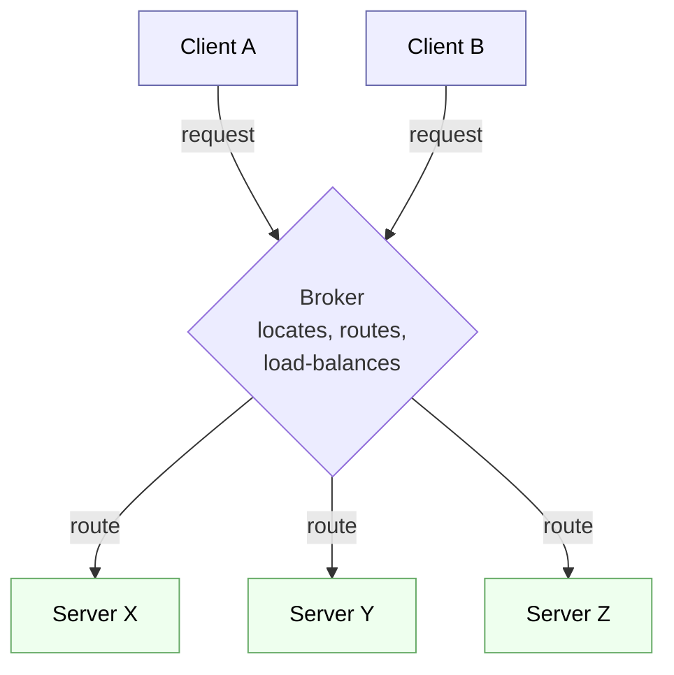

**Participants and examples.** The **broker** registers available servers, resolves each
request to a capable server, and may add load-balancing, retries, and monitoring. The
**client** and **server** are relieved of finding each other. Message brokers (the engine
behind publish–subscribe at scale, §7.2.2), API gateways, service meshes, and the classic
CORBA object request broker are all instances. **Trade-offs:** you gain **location
transparency**, dynamic membership, and a natural home for cross-cutting concerns like
load-balancing and observability. You pay in **latency** (an extra hop), in **complexity**
(the broker itself must be built, deployed, and scaled), and in **risk concentration** —
the broker can become the very single point of failure it was meant to help you avoid, so
in practice it too must be made redundant.

## 7.6 Families and Product Lines

Everything so far treats architecture as the design of *one* system. But organizations
rarely build one system in isolation; they build a *family* of related systems — the same
product for different platforms, tiers, or customers. A phone maker ships dozens of
handset models running variations of one software base. A car company runs related but
distinct control software across an entire fleet. Treating each as a from-scratch project
wastes the enormous overlap between them. **Software product-line engineering** is the
discipline of building a family of related products from a shared set of assets in a
planned way, and it changes what "architecture" is for.

### 7.6.1 Commonalities and Variabilities

The core analytical move is to separate what all family members share from what
distinguishes them. A **commonality** is a feature, behavior, or component present in
*every* product of the family — every handset has a dialer, every edition of the app
authenticates users. A **variability** is a point where products *differ* — one edition
has video calling and another does not; one region requires a different tax calculation.

**Why the distinction is the whole game.** Commonalities are built *once* and reused
without change across the family, so effort spent making them solid is amortized over
every product. Variabilities are the points you must design to *vary*, so each one needs
an explicit mechanism — a configuration flag, a plug-in slot, a swappable module, a
compile-time option — that lets a given product select its variant without modifying
shared code. The design work of a product line is largely the work of **enumerating the
variabilities and choosing a variation mechanism for each**. A **feature model** is the
common tool for recording this: it captures which features are mandatory, which are
optional, and which are mutually exclusive, so that each valid product is a permitted
selection of features.

> **Pitfall.** Guessing wrong about which axis will vary is expensive. If you hard-code
> something that later must differ across products, retrofitting variability into shared
> code is painful; if you build elaborate variation machinery for an axis that never
> varies, you paid for flexibility you never use. Product-line design lives or dies on
> predicting the right variabilities — which is why it rewards domains you understand
> deeply.

### 7.6.2 Software Architecture and Product Lines

A product line needs a special kind of architecture: a **reference architecture** (or
*platform*) that is shared by every product in the family and that makes the planned
variabilities easy to exercise. This raises the stakes on the patterns earlier in the
chapter. Every variation point is, in the end, an *interface behind which alternatives
plug in* — and the patterns you have learned are exactly the machinery for building such
interfaces:

- **Layering** lets you vary one layer (say, the platform-specific infrastructure) across
  products while the layers above stay identical.
- The **observer** and **broker** patterns let a product add or swap behavior by
  registering different components, without editing the shared core.
- **Plug-in** structures — a stable core that discovers and loads optional modules — are
  the workhorse variation mechanism, and they are just the open/closed discipline of the
  observer pattern applied at the scale of whole features.

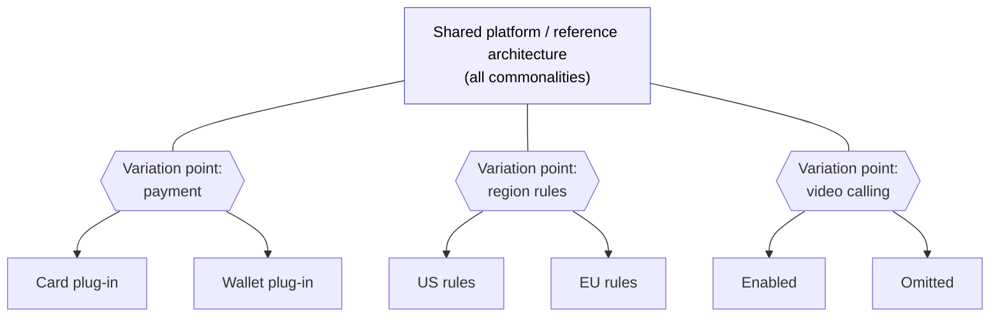

The organizational consequence is a split between two activities: **domain engineering**
builds the reusable platform and its variation points, and **application engineering**
assembles a specific product by selecting variants and adding only what is unique to it.
Getting this split right is what turns "we copy-pasted last year's product and hacked on
it" into a genuine, maintainable family.

### 7.6.3 Economics of Product-Line Engineering

Product lines are ultimately an *economic* bet, and it is worth being honest about the
arithmetic. Building a reusable platform with well-designed variation points costs
**more up front** than building a single product — you are engineering for change that
has not happened yet. That investment pays back only when you build *enough* products
from the platform that the per-product savings exceed the extra platform cost.

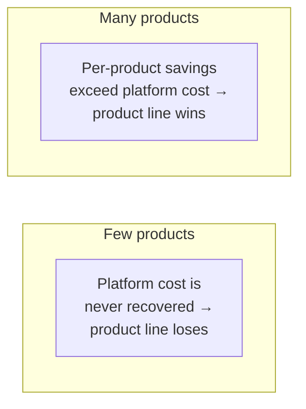

The break-even is often quoted as needing on the order of a handful of products before
the platform pays for itself; below that, you would have been better off building each
system directly. The savings, when they come, are not only in initial construction but in
**maintenance and quality**: fix a bug in a commonality once and every product inherits
the fix; a feature hardened in one product is available to all. The risks mirror the
rewards — an over-engineered platform, a mis-predicted variability (§7.6.1), or a domain
too unstable to have durable commonalities can leave you paying the up-front cost without
collecting the return. The engineering judgment is therefore the same one that governs
every pattern in this chapter: *invest in flexibility exactly where change is likely, and
not one place more.*

## 7.7 Conclusion

Architectural patterns are the vocabulary of large-scale design. Each is a named answer
to a recurring structural question, and each answer is a trade-off — you adopt it to buy
a quality you need and you pay for it in some other coin. The through-line of the whole
chapter is the Chapter 1 principle restated at every scale: *structure the system so that
the changes you expect are cheap, and do not pay for flexibility you will not use.*
Layering makes it cheap to swap an implementation behind an interface. The observer makes
it cheap to add a new reaction to a change. MVC makes it cheap to evolve appearance,
interaction, and rules on separate schedules. Dataflow makes it cheap to reorder and
parallelize transformations. Client-server, broker, and product lines push those same
ideas across machines and across whole families of products.

The table below is your quick-reference map. Use it the way an engineer uses any catalog:
not to pick the fanciest option, but to reach quickly for the *smallest* pattern that
solves the problem in front of you and to state out loud what it will cost.

| Pattern | Problem it solves | Key trade-off |
| --- | --- | --- |
| **Layering** | Span a wide range of abstraction without tangling high- and low-level code | Isolation vs. pass-through indirection and per-boundary cost |
| **Shared data** | Many components must operate on one authoritative body of data | Convenient central truth vs. coupling magnet and bottleneck |
| **Observer / pub-sub** | Parties must react to a change without the source knowing them | Loose coupling vs. hidden, hard-to-trace control flow |
| **Model-View-Controller** | Appearance, input, and rules must evolve and test independently | Testable separation vs. extra structure and boundary debates |
| **Pipes and filters** | Apply a sequence of reusable, recombinable transformations | Composability vs. lowest-common-denominator data format |
| **Dataflow network** | Transformations whose natural shape branches and merges | Expressive graph vs. coordination and deadlock complexity |
| **Unbounded streams** | Process never-ending data with near-real-time results | Continuous, incremental results vs. windowing, late data, backpressure |
| **MapReduce-style** | Batch-process data too large for one machine | Free parallelism/fault tolerance vs. rigid two-phase shape and shuffle cost |
| **Client-server** | Many users need shared access to one authoritative resource | Central control vs. bottleneck and single point of failure |
| **Broker** | Many services must find each other without hard-wired locations | Location transparency vs. extra hop, complexity, and risk concentration |
| **Product line** | Build a family of related products from shared assets | Reuse and consistency vs. up-front platform cost and misprediction risk |

No system uses one pattern. A real application layers presentation over domain over
infrastructure (layering), renders through MVC (which runs on the observer), talks to a
database (shared data) across the network (client-server, perhaps via a broker), ingests
events as a stream (dataflow), and — if the company is lucky enough to sell many editions
— does all of this on a shared platform (product line). Learning the patterns individually
is how you learn to *combine* them, and combining them well is what architecture is.

---

- **Key takeaways** are summarized in the pattern table in §7.7.
- Continue to the [Exercises](exercises.md).
- Go deeper with the [Open Resources](resources.md) for this chapter.
