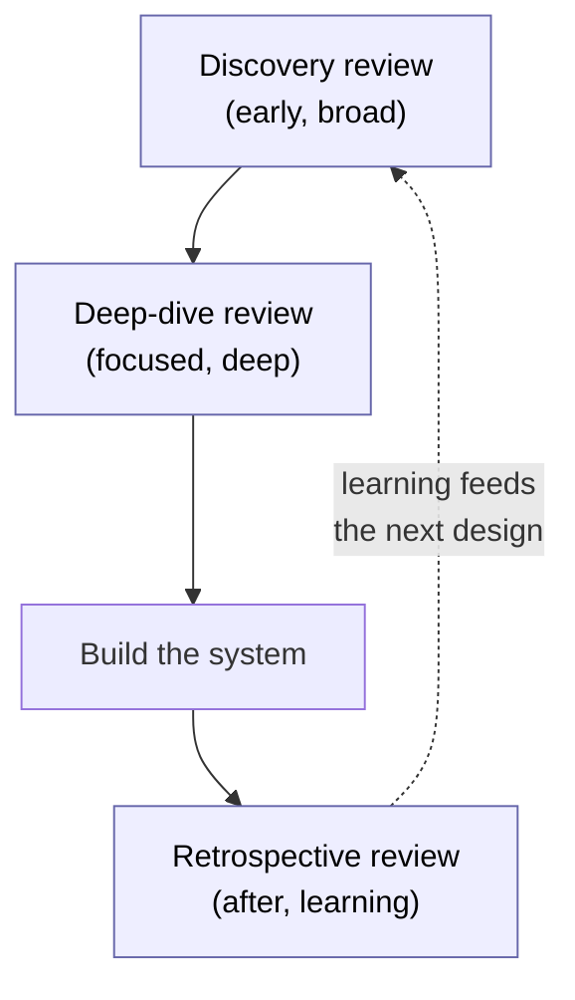
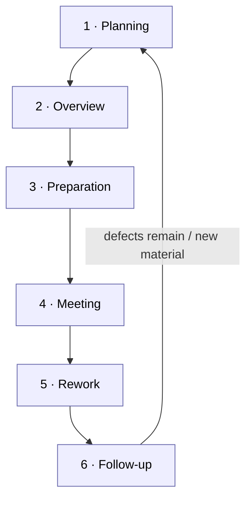

# Chapter 8 — Static Checking

> **Where we are.** Chapter 1 separated *mistakes*, *faults*, and *failures*, and promised
> that we attack defects at every stage. This chapter is about the family of techniques
> that find faults *without running the code*: architecture reviews, formal inspections,
> everyday code review, and automated static analysis. Chapter 9 covers the complementary
> half — *testing*, which finds defects by running the code. Neither replaces the other,
> and a mature team leans on both.

There is a persistent myth that the only way to know whether software works is to run it.
Running it certainly helps, and Chapter 9 is devoted to doing so well. But a great deal of
what is wrong with a program is visible *on the page* — a null that is never checked, a
lock acquired but never released, an interface that two teams understand differently, an
architecture that quietly assumes a database will never be slow. **Static checking** is the
discipline of finding those problems by *examining* the software — its design documents, its
source code, its types — rather than by *executing* it. The word "static" is the opposite of
"dynamic": nothing is running, no test input is chosen, no clock ticks.

Why bother, when we could just write tests? Three reasons, each of which this chapter
develops. First, **static techniques find defects earlier**, often before a single line of
code exists — an architecture review can catch a scalability flaw during a design meeting,
when fixing it costs an afternoon rather than a rewrite. Second, **static techniques find
defects testing cannot easily reach**: a race condition that surfaces once in ten thousand
runs, a security hole on an error path no test exercises, a misleading name that will cause a
*future* bug. Third, **static techniques transfer knowledge**: when a senior engineer reviews
your change, you both walk away understanding the system better, which no automated test can
do. The through-line of the chapter is that reviews, inspection, and static analysis are
*complementary to testing, not substitutes for it*, and that they operate on a spectrum from
slow-and-human to fast-and-automated.

## 8.1 Architecture Reviews

The earliest and cheapest place to catch a defect is before it is built. An **architecture
review** is a structured examination of a system's design — its major components, their
responsibilities, and the connections between them (Chapters 6–7) — conducted by people other
than the designers. The goal is to *stress* the diagram, not admire it: to ask the
questions that the design's authors, being close to their own work, have stopped asking.

Architecture reviews matter because architectural mistakes are the most expensive kind. A
poorly named variable is a five-minute fix in code review. A decision to route every request
through a single synchronous service, or to store money as a floating-point number, or to
couple two modules that should have been independent, can require months of rework once the
system is built around it. These decisions are made early, are hard to reverse, and constrain
everything downstream — so they deserve a dedicated review before code is written.

### 8.1.1 Guiding Principles for Architecture Reviews

A few principles keep an architecture review productive rather than performative.

- **Review against concrete scenarios, not in the abstract.** "Is this a good design?" has no
  answer. "How does this design handle a burst of 10,000 concurrent users?" or "What happens
  when the payment service is down for thirty seconds?" has an answer you can evaluate. Bring
  the system's quality requirements — its expected load, its latency budget, its failure
  modes — and walk the design through each one.
- **The authors should not run the room.** People defend their own decisions instinctively.
  A review where the designer both presents and judges is a monologue with extra steps.
  Someone else should facilitate, and the designer's job is to *explain and listen*, not to
  win.
- **Focus on the risky and the irreversible.** Review time is scarce. Spend it on the
  decisions that are hard to change and costly if wrong — data models, trust boundaries,
  concurrency, external dependencies — not on choices that a later refactor can fix cheaply.
- **Produce decisions and owners, not just discussion.** A review that ends with "good
  points, we'll think about it" has failed. Every significant concern should end as a
  recorded item with an owner and a disposition: fix now, accept the risk (and why), or
  investigate further by a date.

> **Principle.** The purpose of an architecture review is to surface *risks and
> assumptions* while they are still cheap to change. If your review only confirms what the
> designers already believed, you scheduled it too late or invited the wrong people.

> **Pitfall.** Reviewing an architecture with only its authors in the room. They share the
> same blind spots — that is precisely why they didn't catch the problem. Invite an engineer
> from a *different* team, someone who has operated a similar system in production, and
> someone who will have to *integrate* with this one.

### 8.1.2 Discovery, Deep-Dive, and Retrospective Reviews

Not all architecture reviews happen at the same time or ask the same questions. It helps to
distinguish three moments in a system's life, each with a different purpose.

A **discovery review** happens *early*, when the design is still forming. Its aim is breadth:
to map the problem space, name the major components, identify the big risks, and make sure no
whole category of requirement (security, privacy, cost, operability) has been forgotten. A
discovery review is exploratory and generative — you are trying to find the questions as much
as answer them. The right output is a prioritized list of concerns and a set of deeper
investigations to schedule.

A **deep-dive review** happens once the shape is settled but a *specific* area carries
outsized risk. Suppose the discovery review flagged the data-consistency model as the
scariest part of the design. A deep-dive review takes that one area and examines it
exhaustively: the exact failure scenarios, the concurrency interleavings, the migration path,
the edge cases. Where a discovery review is a mile wide and an inch deep, a deep-dive is the
reverse. You bring in specialists — a database expert, a security engineer — and you do not
leave until the risk is either resolved or explicitly accepted.

A **retrospective review** happens *after* the system is built and running, and asks a
different question entirely: *did the architecture actually deliver what we hoped?* Where did
reality diverge from the design? Which assumptions held and which broke? A retrospective
review is about *learning* rather than blame, both to guide the next iteration of this
system and to make the *team* better at designing. The Therac-25 disaster from Chapter 1 is,
among other things, a story of a team that never conducted an honest retrospective on its own
assumptions about software reliability.[^1]



The three are not mutually exclusive — a long-lived system will have all three, repeatedly.
The point is to know *which* review you are running, because a deep-dive that wanders into
discovery loses its focus, and a discovery that demands deep-dive rigor exhausts everyone
before the real risks are found.

## 8.2 Conducting Software Inspections

Where an architecture review examines a design, a **software inspection** examines a concrete
work product — most often source code, but also a specification, a test plan, or a design
document — line by line, with a defined process, for the explicit purpose of finding defects.
Inspection is the most formal member of the static-checking family. It is slow and it is
disciplined, and decades of data show that, done well, it is startlingly effective: teams
routinely find *more than half* of a document's defects in inspection, before any of that
code runs.[^2]

The formal version was pioneered by Michael Fagan at IBM in the 1970s, and a **Fagan
inspection** remains the archetype: a small group, a defined sequence of phases, assigned
roles, and — crucially — *measurement* of the process itself.[^3] What distinguishes an inspection
from someone "taking a look" is that it is repeatable and its effectiveness can be quantified.

### 8.2.1 The Phases of a Traditional Inspection

A traditional inspection moves through six phases.[^4] The discipline is in *not skipping any of
them*, because each guards against a specific way that informal review fails.



1. **Planning.** The author and moderator decide *what* will be inspected, confirm it meets
   entry criteria (it compiles, it is complete enough to review), choose the participants,
   and schedule the meeting. Planning also means keeping the chunk small — inspecting more
   than a few hundred lines in one sitting reliably degrades into skimming.[^5]

2. **Overview.** The author briefly educates the reviewers on the context: what this code is
   for, how it fits the larger system, any background they need. This phase is optional when
   reviewers already know the area, but omitting it when they don't guarantees shallow review.

3. **Preparation.** Each reviewer examines the work product *individually and in advance*,
   noting suspected defects and questions. This is the phase where most defects are actually
   found.[^6] The meeting exists to consolidate what individual, focused reading has already
   turned up, not to read the code for the first time.

4. **Meeting.** The group convenes. The reader walks through the material (see the roles
   below), reviewers raise the issues they found in preparation, and the scribe records each
   confirmed defect. The critical rule: the meeting *finds and records* defects; it does not
   *solve* them. Debating fixes in the meeting is the single most common way inspections run
   over time and lose their value — solutions are the author's job during rework.

5. **Rework.** The author takes the logged defect list away and fixes each item. Some
   "defects" turn out to be misunderstandings; the author notes the disposition of every one.

6. **Follow-up.** The moderator verifies that every logged defect was actually addressed —
   not just that the author *intended* to. If the rework was substantial, or too many defects
   remain, the material may re-enter the process for another pass.

> **Pitfall.** Turning the inspection meeting into a redesign session. The moment the group
> starts brainstorming *how to fix* a defect rather than *confirming that it is one*, the
> meeting balloons, most participants disengage, and you cover a fraction of the material.
> Log the defect, move on, let the author solve it in rework.

### 8.2.2 Case Study: Using Data to Ensure Effectiveness

The feature that separates inspection from informal review is that inspection *measures
itself*. Because the process is repeatable, you can collect numbers and use them to tell
whether the process is healthy — and the numbers are often surprising.

> **Case study.** *(A composite team, with illustrative numbers.)* A team inspecting a
> mission-critical module tracks two quantities for every
> inspection: the **preparation rate** (lines of code each reviewer read per hour before the
> meeting) and the **defect density** (defects found per thousand lines). Over twenty
> inspections they notice a strong pattern: when reviewers prepare at 500 lines per hour or
> less, they find roughly 8 defects per thousand lines. When the preparation rate climbs
> above 1,000 lines per hour — reviewers skimming, under time pressure — the yield collapses
> to 2 per thousand. The defects did not vanish; the reviewers simply moved too fast to see
> them. Armed with this data, the team sets a policy: no inspection meeting proceeds unless
> every reviewer's preparation rate was under 500 lines per hour. Their post-release defect
> rate on inspected modules drops by half.

The lesson generalizes. A too-high preparation or review rate means reviewers are skimming,
and a suspiciously *low* defect count is then bad news, not good — it usually means the
review was shallow, not that the code was clean.[^5] By recording review rates, defect densities,
and where in the lifecycle each defect was found, a team can answer questions that opinion
alone cannot: *Are our inspections worth the time? Which kinds of defects slip through? Should
we inspect this class of module at all?* Measurement turns inspection from a ritual into a
controllable process, and connects directly to Chapter 10's treatment of quality metrics.

> **Principle.** Slow down to speed up. In inspection, a *lower* review rate finds *more*
> defects, and finding a defect on the page is far cheaper than finding it in production.

### 8.2.3 Organizing an Inspection

An inspection works because the participants play *distinct roles*, not because more eyeballs
are inherently better.[^7] Assigning roles prevents the classic failure where everyone assumes
someone else is doing the careful reading.

- **Author.** The person who wrote the work product. Their job in the meeting is to *listen*,
  answer questions of fact, and take defects away for rework — *not* to defend the code or
  argue it is fine. An author who treats the inspection as a trial to be won destroys it.
- **Reviewer (inspector).** The people whose job is to find defects. They do the essential
  preparation work individually beforehand and raise issues in the meeting. A good inspection
  has two to four reviewers with relevant expertise; many more than that and the meeting bogs
  down without finding proportionally more.[^3]
- **Reader.** One reviewer designated to *paraphrase* the material aloud during the meeting —
  restating what each piece of code does in their own words, rather than reading it
  verbatim. This is subtly powerful: when the reader's paraphrase diverges from what the
  author intended, you have found a place where the code does not say what it means, which is
  a defect (or a clarity problem that will *cause* a future defect).
- **Moderator.** The facilitator who keeps the meeting on process: enforcing the "find, don't
  fix" rule, watching the pace, ensuring everyone prepared, and confirming follow-up. The
  moderator is deliberately *not* the author, so that no one is refereeing their own work.
- **Scribe (recorder).** The person who logs each confirmed defect precisely — location,
  description, severity — so that rework and follow-up have an unambiguous list to work from.
  A defect that isn't written down didn't happen.

One person can sometimes hold two roles (the moderator often also scribes in a small team),
but the *author should never* be the moderator or the reader of their own code — the entire
value comes from other people examining it. If your "inspection" is just the author walking
everyone through their own reasoning, you have recreated the very problem you were trying to
escape.

## 8.3 Code Reviews: Check Intent and Trust

Full Fagan inspection is heavyweight, and most teams do not inspect every change that way —
the cost is justified only for the riskiest material. What virtually every professional team
*does* do, on nearly every change, is a lighter-weight **code review**: before a change is
merged, at least one engineer other than the author reads it and must approve it. This is one
of the most widely practiced static-checking techniques in the industry, and it is the daily
face of everything the inspection literature discovered.[^8]

Modern code review through pull requests is less about hunting for every defect (automated
tools, §8.4, are better at the mechanical ones) and more about two human questions that no
tool can answer: **intent** and **trust**.[^8] *Intent*: does this change do what the author
*meant* it to do, and is what they meant actually the right thing? A reviewer who understands
the system can see that a change is technically correct but solves the wrong problem, or
introduces a subtle inconsistency with how the rest of the codebase works. *Trust*: code
review is how a team collectively takes responsibility for its codebase. Once your change is
approved and merged, it is not "your" code anymore — it is the team's, and the reviewer who
approved it has vouched for it. That shared ownership is the cultural payoff of review, and it
is why "the reviewer will catch it" and "I'm just approving to unblock them" are both
corrosive.

> **Principle.** The primary question in a code review is not "is this how *I* would have
> written it?" but "will this change make the codebase *healthier over time*?"[^9] A reviewer's
> job is to prevent decline, not to enforce personal style. If a change clearly improves the
> system, it should be approved even when the reviewer can imagine a marginally better
> version.

### 8.3.1 Invested Expert Reviewers

Not all reviewers are equal, and the difference is not raw skill — it is *investment* and
*context*. The most valuable reviewer for a change is usually someone who knows that part of
the system deeply and who has a stake in its long-term health: the person who will have to
maintain it, who was burned by the last bug in this area, who understands the invariants that
aren't written down anywhere. An **invested expert reviewer** brings knowledge that is not in
the diff — the history of why the code is shaped this way, the failure that a strange-looking
guard clause exists to prevent, the plan for where this module is heading.

This has practical consequences for how teams assign reviews. A change to the authentication
system should be reviewed by someone who understands the security model, not by whoever
happens to be free. Many teams encode this with **code ownership**: files or directories have
designated owners whose approval is required for changes there, precisely to guarantee that an
invested expert sees every change to sensitive code. It also means that as a reviewer, if you
*don't* have the context to evaluate a change — if you cannot tell whether it is correct —
the honest move is to say so and route it to someone who can, not to rubber-stamp it. An
approval from someone who didn't understand the change provides trust that isn't real, which
is worse than no approval at all.

### 8.3.2 Reviewing Is Done within Hours

The other thing modern practice has learned is that **review latency matters enormously**, and
the target is *hours, not days*.[^10] This surprises people who assume slower means more thorough,
but the reasoning is about the whole system's throughput, not one review's depth.

When a change sits unreviewed for days, several bad things happen. The author, blocked, either
switches to other work (incurring the cost of context-switching back later) or, worse, starts
building new changes on top of the unreviewed one, so a problem found in review now cascades.
The change itself drifts out of date as the codebase moves under it, creating merge conflicts.
And the author's own memory of *why* they made each decision fades, so their responses to
review comments get vaguer. Fast review keeps the author in flow, keeps changes small and
current, and keeps the feedback loop tight enough that the author actually learns from it.

"Within hours" does not mean "instantly and carelessly." The practice that squares speed with
quality is **small changes**: a reviewer can give a 50-line change a genuinely careful read in
minutes and turn it around the same day, whereas a 2,000-line change cannot be reviewed well
*or* quickly — the reviewer skims, approves out of fatigue, and the review becomes theater.[^5]
Small, frequently reviewed changes are the mechanism that makes fast, thorough review
possible at once. This is the everyday, industrialized descendant of the inspection data in
§8.2.2: keep the chunk small, keep the reviewer engaged, and the defects surface.

> **Pitfall.** The giant pull request. A change touching forty files with 1,500 lines of diff
> cannot be reviewed with care — the reviewer's attention is exhausted long before the end, so
> the last half gets a glance and a thumbs-up. If you want real review, break the work into
> small, independently reviewable changes. If you *receive* a giant PR, it is legitimate to
> ask for it to be split.

## 8.4 Automated Static Analysis

Human review is expensive and imperfect at mechanical checks — people are bad at reliably
noticing that *every* code path closes a file handle, but computers are excellent at it.
**Automated static analysis** is the use of tools that examine source code (or compiled
artifacts) *without running it* and report likely defects, style violations, or dangerous
patterns. These tools run in seconds on every change, never get tired, and never skip the
boring parts — which is why they complement human review rather than competing with it.
Let the machine catch the mechanical faults so the humans can spend their attention on
intent and design.

### 8.4.1 A Variety of Static Checkers

"Static analysis" is an umbrella over several distinct kinds of tools, each answering a
different question. It helps to know the categories so you can assemble the right set.

- **Type checkers** verify that operations are applied to compatible kinds of data — that you
  don't add a number to a string, call a method that doesn't exist, or pass an argument of the
  wrong type. In statically typed languages (Java, Rust, Go) the compiler *is* a type checker,
  and it rejects whole classes of defect before the program ever runs. Bolt-on type checkers
  bring the same guarantees to dynamically typed languages — for example, gradual type checkers
  for Python and JavaScript-family code. A type error caught at compile time is a failure that
  can never reach a user. Here a price arrives as a string and flows into arithmetic:

  ```go
  package main

  import "fmt"

  func lineTotal(price float64, quantity int) float64 {
  	return price * float64(quantity)
  }

  func main() {
  	price := "9.99" // read from a CSV row, still a string
  	total := lineTotal(price, 3)
  	fmt.Println(total) // never runs: go build rejects the call
  }

  // cannot use price (variable of type string) as float64 value in argument to lineTotal
  ```

  ```java
  public class LineTotal {
    static double lineTotal(double price, int quantity) {
      return price * quantity;
    }

    public static void main(String[] args) {
      String price = "9.99";  // read from a CSV row, still a string
      double total = lineTotal(price, 3);
      System.out.println(total);  // never runs: javac rejects the call
    }
  }
  // javac: argument mismatch; String cannot be converted to double
  ```

  ```javascript
  // @ts-check
  /**
   * @param {number} price
   * @param {number} quantity
   * @returns {number}
   */
  function lineTotal(price, quantity) {
    return price * quantity;
  }

  const price = "9.99";       // read from a CSV row, still a string
  const total = lineTotal(price, 3);
  console.log(total);         // no crash: JS coerces and prints 29.97
  // TS2345: Argument of type 'string' is not assignable to parameter of type 'number'.
  ```

  ```python
  def line_total(price: float, quantity: int) -> float:
    return price * quantity

  price = "9.99"              # read from a CSV row, still a string
  total = line_total(price, 3)
  print(total)                # no crash: prints 9.999.999.99
  # mypy: Argument 1 to "line_total" has incompatible type "str"; expected "float"
  ```

  ```ruby
  # typed: true
  extend T::Sig

  sig { params(price: Float, quantity: Integer).returns(Float) }
  def line_total(price, quantity)
    price * quantity
  end

  price = "9.99"              # read from a CSV row, still a string
  total = line_total(price, 3)
  puts total                  # untyped Ruby prints 9.999.999.99, no crash
  # srb tc: Expected `Float` but found `String("9.99")` for argument `price`
  ```

  In each fence, the trailing comment quotes its checker's actual verdict — the same fault,
  caught before the code ever runs.

- **Linters** flag stylistic issues, suspicious constructs, and small correctness hazards:
  unused variables, shadowed names, missing `break` in a switch, comparison that is always
  true. Individually minor, these findings keep a codebase consistent and readable, and they
  catch the occasional real bug hiding as a typo. Linters are the cheapest static analysis to
  adopt and usually the first a team turns on.
- **Data-flow analyzers** trace how values move through a program to find defects that span
  multiple lines: a variable used before it is assigned, a resource opened on one path but not
  closed on another, a value that can be null reaching a dereference, tainted user input
  flowing into a database query (a SQL-injection risk). These are the checks humans are worst
  at, because they require mentally simulating every execution path — exactly what a machine
  is built to do. This exporter closes its file on the normal path but leaks it on the error
  path:

  ```go
  func exportPrices(catalog map[string]float64, disc *Discounts, path string) string {
  	out, _ := os.Create(path)
  	out.WriteString("item,price\n")
  	for _, item := range slices.Sorted(maps.Keys(catalog)) {
  		pct := disc.PercentFor(item)
  		if pct < 0 || pct > 100 {
  			return "" // error path: `out` is never closed
  		}
  		final := math.Round(catalog[item]*(1-float64(pct)/100)*100) / 100
  		fmt.Fprintf(out, "%s,%g\n", item, final)
  	}
  	out.Close()
  	return path
  }

  // go vet has no unclosed-file check and stays silent; GoLand's resource-leak
  // inspection walks every path and flags the early return that skips Close.
  ```

  ```java
  static String exportPrices(Map<String, Double> catalog, Discounts discounts,
      String path) throws IOException {
    Writer out = new FileWriter(path);
    out.write("item,price\n");
    for (String item : new TreeMap<>(catalog).keySet()) {
      int pct = discounts.percentFor(item);
      if (pct < 0 || pct > 100) {
        return null;                // error path: `out` is never closed
      }
      double net = Math.round(catalog.get(item) * (1 - pct / 100.0) * 100) / 100.0;
      out.write(item + "," + net + "\n");
    }
    out.close();
    return path;
  }
  // SpotBugs: M B OS: exportPrices(Map, Discounts, String) may fail to close stream
  ```

  ```javascript
  const fs = require("node:fs/promises");

  async function exportPrices(catalog, discounts, path) {
    const out = await fs.open(path, "w");
    await out.write("item,price\n");
    for (const item of Object.keys(catalog).sort()) {
      const pct = discounts.percentFor(item);
      if (pct < 0 || pct > 100) {
        return null;                // error path: `out` is never closed
      }
      const final = Math.round(catalog[item] * (1 - pct / 100) * 100) / 100;
      await out.write(`${item},${final}\n`);
    }
    await out.close();
    return path;
  }
  // node, when the abandoned handle is finally garbage-collected:
  //   Warning: Closing file descriptor 20 on garbage collection
  ```

  ```python
  def export_prices(catalog, discounts, path):
    out = open(path, "w")
    out.write("item,price\n")
    for item, price in sorted(catalog.items()):
      pct = discounts.percent_for(item)
      if pct < 0 or pct > 100:
        return None                 # error path: `out` is never closed
      final = round(price * (1 - pct / 100), 2)
      out.write(f"{item},{final}\n")
    out.close()
    return path
  # pylint: R1732: Consider using 'with' for resource-allocating operations
  ```

  ```ruby
  def export_prices(catalog, discounts, path)
    out = File.open(path, "w")
    out.write("item,price\n")
    catalog.sort.each do |item, price|
      pct = discounts.percent_for(item)
      return nil if pct < 0 || pct > 100    # error path: `out` is never closed
      final = (price * (1 - pct / 100.0)).round(2)
      out.write("#{item},#{final}\n")
    end
    out.close
    path
  end
  # rubocop: C: Style/AutoResourceCleanup: Use the block version of File.open.
  ```

  The closing comment in each fence shows how the leak surfaces for that language — a linter
  flagging the fragile acquisition, a path-sensitive analyzer reporting the leaking path
  itself, or a runtime warning when the abandoned handle is finally collected. The acquisition
  and the early return are the guilty pair. They sit a few lines apart here and are often a
  screen or more apart in production code — a human tracing every path by eye misses the one
  that skips the `close`, while an analyzer walks each path mechanically.

- **Bug-pattern finders** encode a catalog of known-bad code shapes and scan for them:
  ignoring a method's return value that must be checked, comparing strings with reference
  equality, integer overflow in a size calculation, a lock acquired without a matching
  release. Each pattern is a mistake that has bitten enough programmers that someone wrote a
  detector for it. Security-focused variants (often called SAST tools) specialize in patterns
  that lead to vulnerabilities.

Most teams run several of these together in **continuous integration** (Chapters 2 and 12), so that
every proposed change is automatically type-checked, linted, and pattern-scanned before a
human reviewer ever looks at it. The tools handle the mechanical layer; the humans handle
judgment. That division of labor is the whole point.

### 8.4.2 False Positives and False Negatives

Static analyzers are not oracles. Because they reason about *all possible* executions without
running any of them, they must approximate, and approximation produces two kinds of error you
must understand to use these tools well.

A **false positive** is when the tool reports a defect that *is not actually a defect* — it
cries wolf. The code is fine, but the analyzer, unable to prove it is fine, flags it anyway.
A **false negative** is the opposite and more dangerous case: a *real* defect that the tool
*fails to report* — the wolf slips past. The code is genuinely broken, but the analysis missed
it, so you get false reassurance.

It is worth laying these out against the truth, in the same confusion-matrix form you will see
again for testing and classification:

| | **Tool reports a defect** | **Tool reports nothing** |
|-------------------------|-----------------------------------|------------------------------------|
| **Defect really exists** | True positive (correct alarm) | **False negative** (missed defect) |
| **No defect exists** | **False positive** (false alarm) | True negative (correctly quiet) |

The two error types trade off against each other, and this trade-off has names. **Precision**
is the fraction of the tool's alarms that are real: of everything it flagged, how much was an
actual defect? Low precision means many false positives — lots of noise. **Recall** is the
fraction of real defects the tool catches: of everything actually wrong, how much did it find?
Low recall means many false negatives — lots of misses. You generally cannot maximize both at
once. Make a tool more aggressive so it catches more real bugs (higher recall) and it will
also flag more innocent code (lower precision). Tune it to only report what it is sure about
(higher precision) and it will stay silent about defects it can't prove (lower recall).

Why does this trade-off decide whether a tool succeeds in practice? Because **false positives
have a human cost that compounds**. If a tool floods reviewers with false alarms, people stop
reading its output — and once ignored, it also misses the *real* defects buried in the noise.
A checker with 90% recall is worthless if its 60% false-positive rate trains the whole team to
click "dismiss" reflexively. This is why practical static-analysis tools often deliberately
sacrifice recall for precision: a tool that reports *fewer* defects but is *right* almost every
time earns the team's trust and gets acted upon, while a "thorough" tool that is frequently
wrong gets turned off. Google's experience with static analysis is explicit about this — they
target a false-positive rate low enough (roughly one in ten or better) that developers treat
warnings as worth fixing rather than as noise.[^11]

> **Principle.** For a static analyzer, *trust is the scarce resource*. A tool the team
> believes will get acted upon; a tool the team distrusts gets suppressed, and then even its
> true findings are lost. High precision buys trust; chasing recall at the cost of precision
> spends it.

> **Pitfall.** Treating a clean static-analysis report as proof of correctness. False
> negatives are real: the analyzer only finds the *categories* of defect it was built to find,
> and says nothing about whether the code does the *right thing*. "The linter is happy" is a
> floor, not a ceiling — it is why static analysis complements, and never replaces, review and
> testing.

## 8.5 Conclusion

Every technique in this chapter finds defects *without running the code*, and each occupies a
different point on a spectrum from slow-and-human to fast-and-automated. **Architecture
reviews** catch the most expensive defects earliest, while the design is still cheap to
change. **Inspections** apply disciplined, measured, role-based scrutiny to the riskiest work
products and reliably find a large share of their defects before release. **Code review** is
the everyday, industrialized version — fast, lightweight, focused on intent and shared
ownership, and effective in direct proportion to how small the changes are. **Automated static
analysis** handles the mechanical checks tirelessly and in seconds, freeing human attention
for judgment, as long as we manage its false positives so the team keeps trusting it.

These techniques are complementary to each other and, above all, complementary to *testing*
(Chapter 9). Static checking excels at finding defects that are visible on the page, that lurk
on rarely executed paths, and that concern design and intent — but it cannot tell you whether
the assembled system actually behaves correctly when it runs. Testing can, but only for the
inputs you think to try, and only after the code exists. The mistake → fault → failure chain
from Chapter 1 is best broken at every link at once: reviews and inspection reduce the faults
that reach the codebase, static analysis catches whole categories automatically, and testing
provokes the failures that slip through. No single net catches everything, which is exactly
why we cast several.

---

### Sources

[^1]: Nancy G. Leveson and Clark S. Turner, *An Investigation of the Therac-25 Accidents*, IEEE Computer 26(7) (1993). [ieeexplore.ieee.org](https://ieeexplore.ieee.org/document/274940).
[^2]: Barry Boehm and Victor R. Basili, *Software Defect Reduction Top 10 List*, IEEE Computer 34(1) (2001). [cs.umd.edu](https://www.cs.umd.edu/projects/SoftEng/ESEG/papers/82.78.pdf).
[^3]: Michael E. Fagan, *Design and Code Inspections to Reduce Errors in Program Development*, IBM Systems Journal 15(3) (1976). [dl.acm.org](https://dl.acm.org/doi/10.1147/sj.153.0182).
[^4]: Michael E. Fagan, *Advances in Software Inspections*, IEEE Transactions on Software Engineering SE-12(7) (1986). [research.ibm.com](https://research.ibm.com/publications/advances-in-software-inspections).
[^5]: SmartBear Software, *Best Practices for Peer Code Review* — findings from a study of a Cisco Systems team (2006). [smartbear.com](https://smartbear.com/learn/code-review/best-practices-for-peer-code-review/).
[^6]: Lawrence G. Votta, *Does Every Inspection Need a Meeting?*, ACM SIGSOFT Symposium on Foundations of Software Engineering (1993). [dl.acm.org](https://dl.acm.org/doi/10.1145/167049.167070).
[^7]: NASA, *Software Formal Inspections Standard*, NASA-STD-8739.9 (2013). [standards.nasa.gov](https://standards.nasa.gov/standard/NASA/NASA-STD-87399).
[^8]: Alberto Bacchelli and Christian Bird, *Expectations, Outcomes, and Challenges of Modern Code Review*, ICSE (2013). [microsoft.com](https://www.microsoft.com/en-us/research/publication/expectations-outcomes-and-challenges-of-modern-code-review/).
[^9]: Google, *The Standard of Code Review*, Engineering Practices documentation. [google.github.io](https://google.github.io/eng-practices/review/reviewer/standard.html).
[^10]: Google, *Speed of Code Reviews*, Engineering Practices documentation. [google.github.io](https://google.github.io/eng-practices/review/reviewer/speed.html).
[^11]: Caitlin Sadowski, Edward Aftandilian, Alex Eagle, Liam Miller-Cushon, and Ciera Jaspan, *Lessons from Building Static Analysis Tools at Google*, Communications of the ACM 61(4) (2018). [cacm.acm.org](https://cacm.acm.org/research/lessons-from-building-static-analysis-tools-at-google/).

---

- **Key takeaways** are summarized above in §8.5.
- Continue to the [Exercises](exercises.md).
- Go deeper with the [Open Resources](resources.md) for this chapter.
