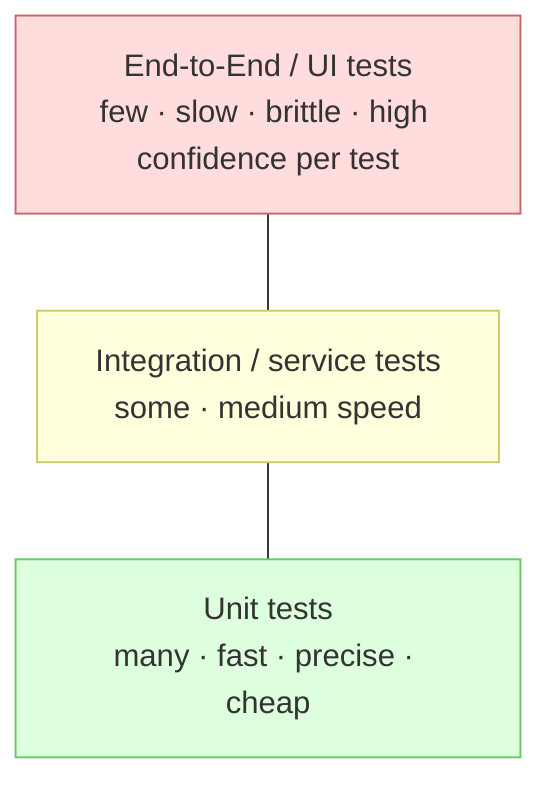
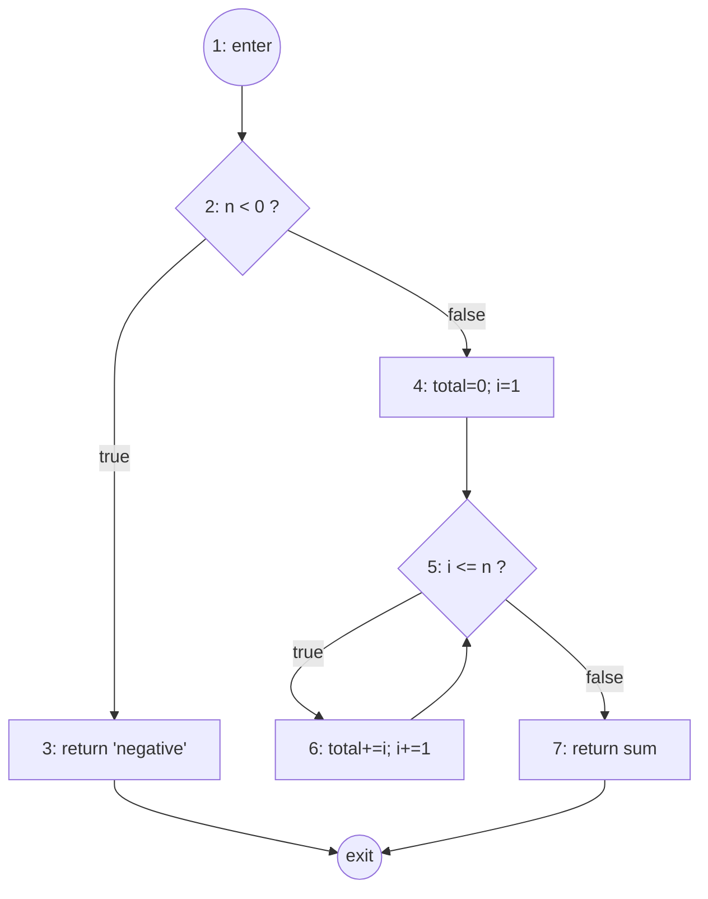

# Chapter 9 — Testing

> **Where we are.** Chapter 8 attacked defects *before* the program runs, with static
> checking, types, and review. This chapter attacks them by *running* the program on
> chosen inputs and comparing what it does against what it should do. Testing cannot
> prove a program correct, but it is the single most practical net for catching the
> defects that reviews miss — and, just as importantly, for catching the ones a future
> change will introduce. The central skill is not writing *a* test; it is deciding
> *which* tests to write and knowing when you have written *enough*.

You have already met testing in miniature: run the code, look at the output, decide if
it is right. The trouble is that a real program has more possible inputs than there are
atoms in the universe, so "run it and look" does not scale and does not tell you when to
stop. This chapter turns testing from an art into an engineering activity with
**criteria**: systematic ways to select inputs, to measure how thoroughly you have
exercised the code and its specification, and to justify — to yourself, your team, and
sometimes a regulator — the claim that the software has been tested well enough to ship.

## 9.1 Overview of Testing

A **test** is a triple: an *input* to the software, the *expected result*, and the
*actual result* observed when you run it. The test **passes** when actual equals
expected and **fails** otherwise. A **test suite** is a collection of tests run
together. This sounds trivial, and for one test it is; the engineering lives in the four
questions the rest of this section raises.

> **Principle.** Testing can reveal the *presence* of defects but never their *absence*.
> A passing suite means "no defect was triggered by these inputs," not "no defect
> exists." Everything in this chapter is about making that first statement as strong as
> it can practically be.

### 9.1.1 Issues during Testing

Four hard problems recur every time you test anything. Name them now, because the rest of
the chapter is a set of answers to them.

- **Selection.** The input space is astronomically large. Which handful of inputs should
  you actually run? (§9.1.2, and all of §9.3–9.6.)
- **Adequacy.** Having run some tests, how do you know whether you have run *enough*? What
  is the stopping rule? (§9.1.3.)
- **Oracle.** For each input, how do you decide whether the observed output is *correct*?
  Sometimes that is harder than producing the output. (§9.1.4.)
- **Automation and repeatability.** A test you cannot re-run cheaply is nearly worthless,
  because its main long-term value is catching *regressions* — old defects reintroduced by
  new changes. Manual "click around and see" testing fails this test.

Keep these four in view. A criticism like "your tests are weak" almost always resolves
into one of them: you picked the wrong inputs, you stopped too early, your oracle was too
lax, or your tests do not run automatically.

### 9.1.2 Test Selection

Because you cannot try every input, you must *sample* the input space — and a random or
lazy sample misses exactly the inputs most likely to break. Good selection is
**criterion-driven**: you choose a rule that partitions the space of possibilities and
then pick inputs to satisfy the rule. Two great families of criteria run through this
chapter, and they look at the program from opposite sides:

- **Black-box (specification-based)** selection reads the *spec* and ignores the code.
  You pick inputs that represent distinct required behaviors — valid and invalid classes,
  boundaries, combinations (§9.4, §9.6). Its virtue: it finds *missing* code and survives
  a rewrite.
- **White-box (structure-based)** selection reads the *code* and picks inputs that
  exercise its statements, branches, and paths (§9.3, §9.5). Its virtue: it finds code
  the spec-based tests never reached, and it *measures* thoroughness precisely.

Neither subsumes the other. A black-box suite can achieve 100% of every code-coverage
metric and still miss a feature that was never implemented (there is no code to cover). A
white-box suite can cover every branch of the code that *exists* and never notice the
branch that *should* exist. Mature teams use both and measure with both.

### 9.1.3 Test Adequacy: Deciding When to Stop

"We tested it" is not a stopping rule; "we covered every branch, every equivalence class,
and every boundary, and all tests pass" is. A **test-adequacy criterion** (also called a
**coverage criterion**) is a checkable condition that tells you whether a suite is done
*with respect to that criterion*. It converts the vague question "have we tested enough?"
into a countable one.

Most criteria have the shape: *there is a set of things to cover, and the suite is
adequate when it covers all of them.* The "things" might be statements, branches, paths,
equivalence classes, boundaries, or condition-outcome pairs. Coverage is then the
fraction covered:

$$\text{coverage} = \frac{\text{items exercised by the suite}}{\text{total items required by the criterion}}$$

Coverage is a *floor, not a ceiling*: 100% branch coverage means every branch ran, not
that every branch is correct. But low coverage is a genuine alarm — code that never ran
under any test is code you know nothing about empirically.

> **Pitfall.** Do not manage to a coverage number for its own sake. A team told "hit 90%"
> can write assertion-free tests that *execute* code without *checking* it, gaming the
> metric while learning nothing. Coverage is a diagnostic, not a goal; pair it always with
> meaningful oracles (§9.1.4).

### 9.1.4 Test Oracles: Evaluating the Response to a Test

An **oracle** is whatever decides, for a given input, whether the actual output is
correct. In a textbook example the oracle is obvious — you write `assert add(2, 3) == 5`,
and `5` is the oracle. In real systems it is often the hardest part of testing, a
difficulty known as the **oracle problem**. If you are testing a function that renders a
map, or ranks search results, or predicts weather, what exactly should you compare
against?

Several oracle strategies, from strongest to weakest:

- **Exact expected value.** You know the right answer and hard-code it: `assert
  reverse("abc") == "cba"`. Strongest, but only available when you can compute the answer
  independently.
- **Property / invariant oracle.** You cannot name the exact answer but you know a
  property it must satisfy. For a sort: the output is a permutation of the input and is
  non-decreasing. For encryption: `decrypt(encrypt(x)) == x` (a *round-trip* oracle). These
  power **property-based testing**, where a tool generates many random inputs and checks
  the property on each.
- **Cross-check / differential oracle.** Compare against an independent implementation —
  a slow reference version, a previous release, or a competitor. If they disagree, at
  least one is wrong.
- **Human judgment.** A person inspects the output. Necessary for look-and-feel, but slow,
  non-repeatable, and the enemy of automation — use it sparingly.

Consider a function `median(xs)`. An exact oracle requires you to know the median of each
test list. A cheaper property oracle: after sorting, the result equals the middle element;
and `median(xs) == median(reversed(xs))` (order independence). Property oracles let you
throw thousands of generated inputs at the function without hand-computing each answer —
often the difference between a suite that finds real defects and one that only confirms
the three cases you already thought of.

## 9.2 Levels of Testing

Testing happens at several *levels*, distinguished by how much of the system is under
test at once. Each level answers a different question and catches a different class of
defect, and the levels are complementary, not redundant.

### 9.2.1 Unit Testing

A **unit test** exercises the smallest independently testable piece — typically one
function, method, or class — *in isolation* from the rest of the system. Its dependencies
are replaced by **test doubles**: a **stub** returns canned answers, a **mock**
additionally records how it was called and lets you assert on those calls, and a **fake**
is a lightweight working implementation (an in-memory database standing in for the real
one).

Unit tests are the workhorses of a suite because they are *fast*, *precise*, and *stable*:
fast because they touch no network or disk, precise because a failure points at one unit,
and stable because they do not break when an unrelated part of the system changes. Here is
a unit under test and a small suite:

```python
def apply_discount(price, percent):
    """Reduce price by percent (0..100). Raises ValueError on bad input."""
    if price < 0:
        raise ValueError("price must be non-negative")
    if percent < 0 or percent > 100:
        raise ValueError("percent must be in 0..100")
    return round(price * (1 - percent / 100), 2)
```

```python
def test_no_discount():        assert apply_discount(100.0, 0)   == 100.0
def test_half_off():           assert apply_discount(100.0, 50)  == 50.0
def test_rounds_to_cents():    assert apply_discount(9.99, 10)   == 8.99
def test_full_discount():      assert apply_discount(40.0, 100)  == 0.0
def test_rejects_bad_percent():
    import pytest
    with pytest.raises(ValueError):
        apply_discount(100.0, 150)
```

Each test names a distinct behavior and carries its own oracle (the expected value or the
expected exception). Notice we are already thinking about selection: 0 and 100 are the
*boundaries* of the valid percent range (§9.4.2), and 150 is an invalid class.

### 9.2.2 Integration Testing

Units that each pass in isolation can still fail *together* — one returns meters where the
other expects feet, one returns `null` where the other never checks. **Integration
testing** exercises the *interfaces and interactions* between units, growing the scope from
a pair of collaborators up toward whole subsystems. This is where mismatched assumptions,
wrong data formats, and protocol errors surface.

```python
class PriceService:
    def __init__(self, catalog, discounts):
        self.catalog = catalog          # unit A: name -> base price
        self.discounts = discounts      # unit B: name -> percent off

    def quote(self, item):
        base = self.catalog.price_of(item)
        pct = self.discounts.percent_for(item)
        return apply_discount(base, pct)
```

A unit test of `PriceService.quote` would *mock* `catalog` and `discounts`. An
**integration test** instead wires the real (or fake) catalog and discount components
together and checks that their contract holds end to end:

```python
def test_quote_integrates_catalog_and_discounts():
    catalog = Catalog({"mug": 12.0})
    discounts = Discounts({"mug": 25})
    svc = PriceService(catalog, discounts)
    assert svc.quote("mug") == 9.0     # 12.0 * (1 - 0.25)
```

If `Discounts` returned a *fraction* (0.25) while `apply_discount` expects a *percentage*
(25), every unit test could pass while this integration test correctly fails. That
interface mismatch is exactly the defect class unit tests are blind to.

### 9.2.3 Functional, System, and Acceptance Testing

Higher levels test the assembled product against ever-broader notions of "correct":

- **Functional testing** checks that a complete feature behaves per its specification,
  treating the system as a black box: *given a shopping cart with these items and this
  coupon, the checkout total is X.* It spans many units but is scoped to one function of
  the product.
- **System testing** exercises the *entire, integrated* system in a production-like
  environment, including **non-functional** requirements — performance, security,
  reliability, usability. "The page loads in under 500 ms at 1,000 concurrent users" is a
  system-level test.
- **Acceptance testing** answers the customer's question, "will I sign for this?" It is
  run against the customer's own criteria, often *by* or *with* the customer.
  **User acceptance testing (UAT)** uses real users and realistic tasks; **alpha/beta**
  releases are acceptance testing in the wild.

A useful way to remember the difference: functional and system testing ask *"did we build
the product right?"* (verification), while acceptance testing asks *"did we build the
right product?"* (validation). Both matter, and passing one tells you nothing about the
other.

> **From acceptance criteria to acceptance tests.** The **Given / When / Then** scenarios
> you wrote as a story's acceptance criteria ([§3.4.1](../03-user-requirements/#341-guidelines-for-effective-user-stories))
> *are* your acceptance tests. In **Behavior‑Driven Development (BDD)**, those **Gherkin**
> `.feature` scenarios are made executable by tools like **Cucumber**, **behave**, or
> **SpecFlow/Reqnroll**: each `Given`/`When`/`Then` step binds to code, so the customer‑readable
> specification runs on every build. This is functional/acceptance testing whose oracle
> (§9.1.4) is the agreed scenario itself.

### 9.2.4 Case Study: Test Early and Often — the Testing Pyramid

The levels are not equally cheap. A unit test runs in milliseconds and never flakes; a
full end-to-end (E2E) test may spin up a browser, a database, and three services, take
minutes, and fail intermittently for reasons that have nothing to do with your code.
This cost gradient motivates the **testing pyramid**: have *many* fast unit tests, *fewer*
integration tests, and *only a handful* of slow end-to-end tests.



The pyramid is an economic argument. Suppose a defect in the discount logic could be
caught at any level. Caught by a unit test, the feedback arrives in seconds, on the exact
line, before you even commit. Caught by an E2E test in CI, it arrives twenty minutes
later as "checkout total was wrong," and you must *debug down* to the line. Caught in
production, it arrives as a customer complaint and a refund. The cost of a defect grows
by roughly an order of magnitude at each stage it survives — so you push detection as far
*down* and *early* as it will go.

> **Pitfall — the ice-cream cone.** Teams that skip unit tests and lean on a big pile of
> slow, flaky E2E tests invert the pyramid into an "ice-cream cone." Their CI is slow,
> failures are hard to localize, and developers learn to ignore red builds ("probably just
> flaky"). An ignored test suite protects nothing. Prefer the pyramid deliberately.

"Test early and often" also means testing *continuously*: run the fast tests on every
save, the full suite on every push, and treat a broken build as a stop-the-line event.
This is the testing half of **continuous integration** (Chapter 2) — the discipline that
keeps the "make change cheap" promise from Chapter 1 honest.

## 9.3 Code Coverage I: White-Box Testing

White-box testing selects inputs by looking at the code's *structure*. To talk about
structure precisely, we model a function as a graph.

### 9.3.1 Control-Flow Graphs

A **control-flow graph (CFG)** represents a function as a directed graph: **nodes** are
basic blocks (maximal straight-line sequences of statements), and **edges** are the
possible transfers of control between them. A branch (an `if`, a loop condition) is a node
with two outgoing edges; a merge is a node with two incoming edges. The CFG makes
"statements," "branches," and "paths" into things you can *count*.

Consider a function that classifies a number and, for positive numbers, sums 1..n:

```python
def classify_and_sum(n):        # node 1  (entry)
    if n < 0:                   # node 2  (decision)
        return "negative"       # node 3
    total = 0                   # node 4
    i = 1                       # node 4
    while i <= n:               # node 5  (decision)
        total += i              # node 6
        i += 1                  # node 6
    return f"sum={total}"       # node 7  (exit)
```

Its control-flow graph:



Two structural features matter for what follows. First, node 2 and node 5 are
**decisions**, each with a true edge and a false edge. Second, node 5's true edge loops
back — a **cycle** — which is why the number of *paths* through this function is unbounded
(you can go around the loop 0, 1, 2, … times), while the number of *edges* is finite.
That gap is the whole reason path coverage is usually impractical and weaker criteria
exist.

### 9.3.2 Control-Flow Coverage Criteria

Three classic criteria form a hierarchy of increasing strength. We work each one on
`classify_and_sum`.

**Statement coverage** requires every node (statement) to be executed by at least one
test. What set of inputs runs every node? Node 3 needs `n < 0`; nodes 4–7 need `n >= 0`;
node 6 (the loop body) needs `n >= 1`. So:

| Test | Input `n` | Nodes executed | New nodes |
|------|-----------|----------------|-----------|
| T1   | `-5`      | 1, 2, 3        | 1,2,3     |
| T2   | `3`       | 1,2,4,5,6,5,6,5,6,5,7 | 4,5,6,7 |

**Two tests** (`n=-5`, `n=3`) achieve 100% statement coverage — every node has run.

**Branch (decision) coverage** requires every *edge out of a decision* to be taken — both
the true and false outcome of each decision. List the four decision edges: node 2 true,
node 2 false, node 5 true, node 5 false. Check the tests above:

- `n=-5` takes node 2 **true**. (node 5 never reached.)
- `n=3` takes node 2 **false**, node 5 **true** (loop body runs), and node 5 **false**
  (loop exits).

Between them, all four edges are covered, so the *same* two tests also give 100% branch
coverage here. That is a coincidence of this function's shape; branch coverage is strictly
stronger than statement coverage in general. To see why, change the function so the loop
can be skipped entirely and a statement after it depends on the loop having run — a test
that covers every statement can still fail to take the "loop body never executes" edge.

> **Note — branch coverage subsumes statement coverage.** If every branch is taken, every
> node between branches must have run, so 100% branch ⇒ 100% statement. The converse
> fails: a single `if` with no `else` can reach 100% statement coverage with one test
> (condition true) while never taking the false edge. Whenever a team says "coverage,"
> ask *which* coverage — the gap between these two is where real defects hide.

**Path coverage** requires every *distinct path* from entry to exit to be executed. Count
the paths in `classify_and_sum`:

- The `n < 0` path (through node 3): **1** path.
- The `n >= 0` paths differ by how many times the loop runs: 0 iterations, 1 iteration, 2
  iterations, … — one path per possible value of `n >= 0`, i.e. **unbounded**.

So full path coverage is *impossible* here — a decisive illustration of why we settle for
branch coverage plus judgment about loops (commonly: test the loop 0 times, once, and
"many" times). Even in loop-free code, path count grows as roughly $2^d$ for $d$
independent decisions, so path coverage is exponential and reserved for tiny, critical
routines.

The hierarchy, then: **path ⇒ branch ⇒ statement** (each implies the ones to its right).
Strength costs test cases; the engineering choice is how far up the hierarchy a given
piece of code justifies climbing. A checkout total earns branch coverage; an autopilot
earns more (§9.5).

## 9.4 Input Coverage I: Black-Box Testing

Black-box testing turns the *specification* into a set of items to cover, without looking
at the code. The two most valuable criteria partition the input space and then probe its
edges.

### 9.4.1 Equivalence-Class Coverage

The insight is that inputs are not all different: a program usually treats whole *classes*
of inputs identically, so one representative of a class is (almost) as good as any other.
An **equivalence class (equivalence partition)** is a set of inputs the specification
implies should be handled the same way. You partition the input space into classes —
covering both *valid* and *invalid* classes — and pick one representative from each. This
slashes the number of tests from "every input" to "one per class" while keeping strong
coverage of *behaviors*.

Take a spec: *`set_volume(level)` accepts an integer `level` from 1 to 100 inclusive and
sets the volume; any other value is rejected.* The classes are:

| Class                     | Example representative | Expected behavior |
|---------------------------|------------------------|-------------------|
| C1: below range (`< 1`)   | `-3`                   | rejected          |
| C2: in range (`1..100`)   | `55`                   | accepted          |
| C3: above range (`> 100`) | `250`                  | rejected          |
| C4: non-integer type      | `"loud"`, `3.5`        | rejected          |

Four tests, one per class, cover every distinct *specified* behavior. Compare this to
testing 1, 2, 3, …, 100 (100 tests that all exercise the same behavior C2) — equivalence
partitioning gives you the same behavioral coverage for a fraction of the cost, and it
forces you to remember the *invalid* classes that ad-hoc testing skips.

### 9.4.2 Boundary-Value Coverage

Defects cluster at the *edges* of equivalence classes, because that is where programmers
write the fragile comparisons: `<` versus `<=`, an off-by-one in a loop bound, `>` versus
`>=`. **Boundary-value analysis** targets exactly those edges: for each boundary, test the
value just below it, at it, and just above it.

For `set_volume`, valid range 1..100, the two boundaries are 1 (lower) and 100 (upper).
The boundary values to test:

| Boundary | Values to test | Expected |
|----------|----------------|----------|
| lower = 1   | `0`   | rejected (just below) |
|             | `1`   | accepted (at)         |
|             | `2`   | accepted (just above) |
| upper = 100 | `99`  | accepted (just below) |
|             | `100` | accepted (at)         |
|             | `101` | rejected (just above) |

Six boundary tests. Watch them do their job. Suppose a developer wrote the guard as:

```python
def set_volume(level):
    if not isinstance(level, int) or level < 1 or level >= 100:   # BUG: >= should be >
        raise ValueError("level must be 1..100")
    _apply(level)
```

The equivalence-class test with representative `55` passes (it is happily accepted), and
so would `250` (rejected) and `-3` (rejected). The defect hides at the top edge. But the
boundary test `set_volume(100)` **fails** — the code rejects a value the spec says is
valid — pinpointing the `>=`/`>` mistake. This is the payoff: boundary values find the
single most common category of numeric defect, and they cost only a few extra tests on top
of equivalence classes.

> **Note.** Combine the two criteria: equivalence partitioning tells you *which regions*
> exist; boundary analysis tells you *where within and between regions* to probe. In
> practice you write one "interior" representative per class **plus** the below/at/above
> triples at each boundary. For `set_volume` that is roughly 4 + 6 = a handful of tests
> that together cover behavior far better than dozens of random ones.

## 9.5 Code Coverage II: MC/DC

Branch coverage checks that each *decision* comes out true and false at least once. But a
decision can be a **compound** boolean expression — `(A && B) || C` — and branch coverage
says nothing about the individual **conditions** inside it. A suite can flip the whole
decision true/false while some condition never actually influenced the outcome. For
safety-critical software (avionics runs under DO-178C, which *mandates* it), we need a
stronger criterion: **Modified Condition/Decision Coverage (MC/DC)**.

### 9.5.1 Condition and Decision Coverage Are Independent

First untangle two finer criteria:

- **Condition coverage** requires each individual condition (`A`, `B`, `C`) to be both
  true and false at least once — but says nothing about the decision's outcome.
- **Decision coverage** (= branch coverage) requires the whole decision to be both true
  and false — but says nothing about individual conditions.

Neither implies the other. Consider the decision `A || B` with just two tests:
`(A=true, B=false)` and `(A=false, B=true)`.

| Test | A | B | `A \|\| B` |
|------|---|---|-----------|
| t1   | T | F | T         |
| t2   | F | T | T         |

Every condition takes both values (A is T then F; B is F then T), so **condition coverage
is 100%**. Yet the decision is `true` in *both* tests — it never came out false — so
**decision coverage is only 50%**. Conversely, testing `(A=true, B=true)` and
`(A=false, B=false)` gives full decision coverage (T then F) but each condition only ever
equals the other, hitting neither the "A alone decides" nor "B alone decides" situation.
Because the two criteria can each be satisfied while the other is not, they are genuinely
independent — and *neither alone* guarantees that every condition can actually change the
result.

### 9.5.2 MC/DC Pairs of Tests

**MC/DC** demands the strongest practical property: **every condition must be shown to
independently affect the decision's outcome.** Concretely, for each condition you must
exhibit a **pair** of tests in which *only that condition changes*, everything else is
held fixed, *and the decision's result flips*. That pair proves the condition is not dead
weight — it really controls the outcome on its own.

MC/DC bundles four requirements: every decision takes both outcomes (decision coverage);
every condition takes both values (condition coverage); and each condition independently
flips the decision. Remarkably, for a decision with **N conditions** this can usually be
achieved with just **N + 1** tests — a linear number, versus $2^N$ for exhaustive testing
of the truth table. That is why MC/DC is the sweet spot for critical code: near-exhaustive
rigor at linear cost.

Let us fully work the decision from the section opener:

$$D = (A \land B) \lor C$$

It has N = 3 conditions, so we expect 4 tests. Start from the complete truth table (row
numbers will let us cite tests precisely):

| # | A | B | C | `A && B` | `D = (A&&B) \|\| C` |
|---|---|---|---|----------|---------------------|
| 1 | T | T | T | T        | **T** |
| 2 | T | T | F | T        | **T** |
| 3 | T | F | T | F        | **T** |
| 4 | T | F | F | F        | **F** |
| 5 | F | T | T | F        | **T** |
| 6 | F | T | F | F        | **F** |
| 7 | F | F | T | F        | **T** |
| 8 | F | F | F | F        | **F** |

Now find an **independence pair** for each condition — two rows differing *only* in that
condition, with different results for `D`.

**Condition A.** Hold B and C fixed, vary A, require `D` to flip. Compare rows 2 and 6:

| # | A | B | C | D |
|---|---|---|---|---|
| 2 | **T** | T | F | T |
| 6 | **F** | T | F | F |

Only A changed (T→F), B=T and C=F are held, and `D` flipped T→F. So **{2, 6}** is A's
independence pair. (Intuitively: with C false, the result is decided by `A && B`; holding
B true, A alone controls it.)

**Condition B.** Hold A and C fixed, vary B. Compare rows 2 and 4:

| # | A | B | C | D |
|---|---|---|---|---|
| 2 | T | **T** | F | T |
| 4 | T | **F** | F | F |

Only B changed (T→F), A=T and C=F held, `D` flipped T→F. So **{2, 4}** is B's pair.

**Condition C.** Hold A and B fixed, vary C. We need `A && B` to be *false* (otherwise the
`|| C` is short-circuited and C cannot matter). Compare rows 3 and 4:

| # | A | B | C | D |
|---|---|---|---|---|
| 3 | T | F | **T** | T |
| 4 | T | F | **F** | F |

Only C changed (T→F), A=T and B=F held, `D` flipped T→F. So **{3, 4}** is C's pair.

Now assemble the minimal suite by taking the **union** of the rows used:

$$\{2, 6\} \cup \{2, 4\} \cup \{3, 4\} = \{2, 3, 4, 6\}$$

Just **four tests** — exactly N + 1 = 3 + 1:

| Test | A | B | C | D | Proves independence of |
|------|---|---|---|---|------------------------|
| row 2 | T | T | F | T | A (with 6), B (with 4) |
| row 3 | T | F | T | T | C (with 4)             |
| row 4 | T | F | F | F | B (with 2), C (with 3) |
| row 6 | F | T | F | F | A (with 2)             |

Verify the bundle: A's pair {2,6} ✓, B's pair {2,4} ✓, C's pair {3,4} ✓ are all present.
Every condition is shown to independently drive the decision, the decision is both T (rows
2, 3) and F (rows 4, 6), and each condition takes both values across the suite. This
4-test set satisfies MC/DC for `(A && B) || C`, versus 8 tests for the full truth table —
the linear-vs-exponential saving that makes MC/DC affordable at scale.

> **Note — why "modified."** The name comes from the *modification* idea: for each
> condition, you *modify only it* and observe the decision change. The reused test (row 2
> here, which serves both A and B; row 4, which serves both B and C) is why the count lands
> at N + 1 rather than 2N — pairs share tests. When short-circuit operators or coupled
> conditions prevent sharing, you may need slightly more than N + 1, but never the full
> $2^N$.

> **Pitfall.** MC/DC is defined per *condition*, not per *decision*. If you rewrite
> `if (a > 0 && b > 0)` as two nested `if`s, tools may report "100% branch coverage" and
> lull you into thinking you are done — but you have not shown each condition's independent
> effect. When correctness is critical, measure MC/DC explicitly with a tool that
> understands compound conditions.

## 9.6 Input Coverage II: Combinatorial Testing

Many systems are configured by several parameters at once, and defects often lurk in
*combinations* rather than single values. Suppose a checkout page is parameterized by
browser, operating system, and locale, each with three options:

- **Browser** ∈ {Chrome, Firefox, Safari}
- **OS** ∈ {Windows, macOS, Linux}
- **Locale** ∈ {EN, FR, JP}

Testing *every* combination is **exhaustive** and costs $3 \times 3 \times 3 = 27$ runs —
and with more parameters it explodes multiplicatively (ten binary flags is already 1,024
combinations). That is infeasible, yet single-value testing ("try each browser once")
misses interaction bugs like "date format breaks *only* on Safari *with* the JP locale."

**Combinatorial testing** exploits an empirical regularity: the large majority of
interaction defects are triggered by the interaction of just **two** parameters, and
almost all of the rest by three. NIST studied fault databases across many domains and
found that testing all *pairs* of parameter values catches the bulk of interaction faults.
So instead of covering all *combinations*, we cover all *pairs* — **pairwise** (a.k.a.
**all-pairs**, or 2-way) testing.

The goal: choose a small set of test configurations such that for **every pair of
parameters, every pair of their values appears together in at least one test.** For our
three 3-valued parameters, all pairs can be covered in just **9** tests (not 27):

| Test | Browser | OS      | Locale |
|------|---------|---------|--------|
| 1 | Chrome  | Windows | EN |
| 2 | Chrome  | macOS   | FR |
| 3 | Chrome  | Linux   | JP |
| 4 | Firefox | Windows | FR |
| 5 | Firefox | macOS   | JP |
| 6 | Firefox | Linux   | EN |
| 7 | Safari  | Windows | JP |
| 8 | Safari  | macOS   | EN |
| 9 | Safari  | Linux   | FR |

Check the claim for one parameter pair, Browser × Locale. The (Browser, Locale)
combinations appearing are: (Chrome,EN), (Chrome,FR), (Chrome,JP), (Firefox,FR),
(Firefox,JP), (Firefox,EN), (Safari,JP), (Safari,EN), (Safari,FR) — all 9 possible pairs,
each at least once. The same holds for Browser × OS and OS × Locale (verify OS × Locale as
an exercise). So every 2-way interaction is exercised, and the "Safari + JP" bug from above
*cannot* slip through: test 7 pairs them. We reduced 27 runs to 9 — a 3× saving here, and
the saving grows dramatically with more parameters (pairwise coverage of ten 3-valued
parameters needs only a few dozen tests, not 59,049).

> **Note.** You rarely build these tables by hand. Tools — Microsoft's PICT, the NIST
> **ACTS** tool, or libraries in most languages — generate a minimal (or near-minimal)
> covering array for you, and can extend from pairwise to 3-way or higher when the risk
> justifies it. What you must supply is the *model*: the parameters, their meaningful
> values (use equivalence classes and boundaries from §9.4 to choose them), and any
> constraints ("Safari implies macOS"). Combinatorial testing composes with black-box
> input analysis; it does not replace it.

> **Pitfall.** Pairwise is a heuristic, not a guarantee. If a defect requires a *three-way*
> interaction (fails only on Firefox + Linux + JP together), a 2-way suite may miss it. Use
> higher-strength (3-way, 4-way) coverage for the most critical or most interaction-prone
> subsystems, and let the empirical fault-strength data — not habit — set the level.

## 9.7 Conclusion

Testing is how you earn the right to say "this software works," and this chapter turned
that claim from a hope into an engineering argument. The through-line is **criteria**:
every hard question about testing becomes tractable once you name a set of items to cover
and measure the fraction you have.

- The four issues — **selection, adequacy, oracles, automation** (§9.1) — are the
  questions every testing decision answers, explicitly or by accident. Answer them on
  purpose.
- Testing happens at **levels** — unit, integration, functional, system, acceptance
  (§9.2) — and the **pyramid** tells you to invest most where feedback is fastest and
  cheapest, catching defects early where they cost the least.
- **White-box** criteria (§9.3, §9.5) measure how thoroughly you exercised the code:
  statement ⇐ branch ⇐ path in strength, with **MC/DC** as the linear-cost, near-rigorous
  choice for critical compound decisions.
- **Black-box** criteria (§9.4, §9.6) measure how thoroughly you exercised the
  *specified behavior*: equivalence classes, boundary values, and pairwise combinations.

No single criterion is enough, and no amount of testing proves correctness. But a suite
built from these criteria — black-box *and* white-box, at the right level, with honest
oracles, run automatically on every change — is the most reliable, most economical net we
have for catching the defects Chapter 1 promised are inevitable. In Chapter 10 we turn to
measuring quality across a project as a whole; the coverage numbers you learned to compute
here are among the first metrics you will report.

---

- **Key takeaways** are summarized above in §9.7.
- Continue to the [Exercises](exercises.md).
- Go deeper with the [Open Resources](resources.md) for this chapter.
