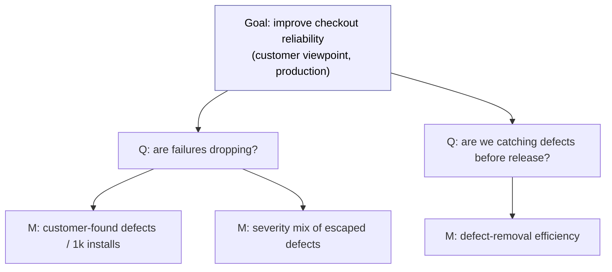
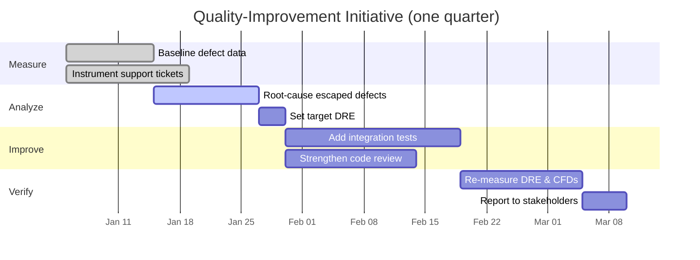
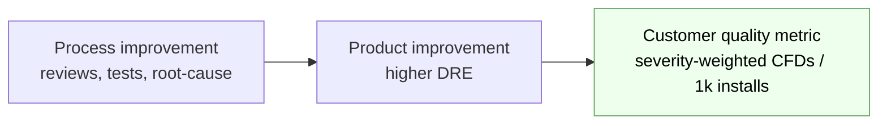

# Chapter 10 — Quality Metrics

> **Where we are.** Every earlier chapter asked you to *do* something well: elicit
> requirements, design for change, review code, test thoroughly. This chapter asks a
> different question: *how do you know whether it worked?* Opinions about quality are
> cheap and contradictory. Measurement replaces "I think the build got better" with "the
> defect-removal efficiency rose from 84% to 91%, and here is the confidence interval."
> This is the most quantitative chapter in the book. We build the statistical toolkit —
> scales of measurement, boxplots, variance, distributions, confidence intervals, and
> linear regression — and we ground every formula in a small dataset we carry from start
> to finish.

You cannot manage what you cannot see, and in software almost nothing is directly
visible. You cannot hold "maintainability" in your hand or point at a cubic centimeter
of "reliability." **Metrics** are how we make invisible attributes visible enough to
reason about, compare, and improve. But metrics are also dangerous: a badly chosen
number will be optimized at the expense of the very thing you cared about. So this
chapter is as much about *choosing* and *interpreting* metrics honestly as it is about
computing them. Get the statistics right, and get the humility right too.

Throughout, we carry one running dataset. A team runs code reviews and records, for a
set of releases, how many **customer-found defects** each release produced in its first
six months. Sorted, the eleven values are:

$$
2,\ 4,\ 5,\ 5,\ 7,\ 8,\ 9,\ 10,\ 12,\ 14,\ 23
$$

We will summarize this dataset with a boxplot and a histogram, compute its variance and
standard deviation, wrap a confidence interval around its mean, and — using a second,
paired dataset — fit a regression line. Keep these numbers in view; they anchor
everything abstract that follows.

## 10.1 Meaningful Metrics

### 10.1.1 Metrics Quantify Attributes

An **attribute** is a property of some entity you care about: the *size* of a module,
the *duration* of a build, the *effort* to fix a bug, the *satisfaction* of a customer.
A **metric** (more precisely, a *measure*) is a rule that assigns a number or symbol to
an attribute so that the assignment preserves something true about the world. Everything rides on
that last clause. If module A really is more complex than module B, then a valid
complexity metric must assign A a larger number than B. When the numbers stop tracking
the reality, the metric has failed, no matter how carefully it is computed.

Measurement theory names three entities you should keep distinct:

- The **entity** — the thing being measured (a file, a release, a review session).
- The **attribute** — the specific property of interest (its size, its defect count).
- The **metric** — the mapping from attribute to value (lines of code, defects per KLOC).

A single entity has many attributes, and one attribute admits many metrics. A source
file has size, age, complexity, and churn; "size" alone can be measured as bytes, lines,
statements, or tokens. Confusing these is the root of most measurement nonsense. "The
file is 400" is meaningless until you say *400 what, measuring which attribute.*

> **Definition.** A metric is **valid** if entities that differ in the attribute differ
> in the metric in the same direction (it *represents* the attribute), and **reliable**
> if repeating the measurement gives the same value. A metric can be reliable but
> invalid — counting lines of code is perfectly repeatable, yet it is a poor measure of
> "programmer productivity."

### 10.1.2 Selecting Useful Metrics

Because you can measure almost anything, the hard part is deciding what is *worth*
measuring. A useful metric passes several tests at once:

1. **Relevant.** It moves when the attribute you care about moves. Counting comments does
   not track code quality; if anything, heavy commenting can signal code so unclear it
   needs prose to explain it.
2. **Actionable.** When the number is bad, you know what to *do*. A metric you cannot act
   on is a spectator sport, not an engineering tool.
3. **Cheap enough.** The cost of collecting it is small relative to the value of the
   decision it informs. A metric that needs a week of manual effort per release will not
   survive contact with a deadline.
4. **Robust against gaming.** The moment a metric becomes a target for people's
   incentives, they optimize the metric rather than the goal. This is **Goodhart's Law** —
   the single most common way metrics programs go wrong.[^1]

> **Pitfall.** Reward developers for "lines of code written" and you will get more, longer,
> more duplicated code. Reward testers for "number of bugs found" and you will get a flood
> of trivial, low-severity reports. Reward "closing tickets fast" and hard tickets get
> closed *unfixed*. Every metric attached to an incentive is quietly redefined by the
> people it measures. Prefer metrics that are hard to game and pair each metric with a
> *counter-metric* that would degrade if someone cheated (pair "tickets closed" with
> "tickets reopened").

### 10.1.3 Goal-Directed Measurement: GQM

The antidote to measuring the merely convenient is to start from a goal, not from a tool.
The **Goal-Question-Metric (GQM)** method, introduced by Victor Basili and colleagues,
gives measurement a top-down discipline:[^2]

- **Goal** — a business or engineering objective, stated with an object, a purpose, a
  quality focus, a viewpoint, and a context. *"Improve (purpose) the reliability (focus)
  of the checkout service (object) from the customer's viewpoint (viewpoint) in
  production (context)."*
- **Question** — a concrete question whose answer would tell you whether you are meeting
  the goal. *"Are customers hitting fewer failures than last quarter?"*
- **Metric** — the data that answers the question. *"Customer-found defects per 1,000
  active installs, tracked monthly."*



The direction matters. If you start from the metric ("we have a dashboard of 40
numbers — what do they mean?"), you drown in data and act on none of it. If you start
from the goal, every number on the dashboard earns its place by answering a question you
actually asked. When a metric answers no live question, delete it: an unused metric still
costs collection effort and still tempts someone to game it.

## 10.2 Software Quality

### 10.2.1 The Many Forms of Software Quality

"Quality" is not one thing, and arguments about software quality usually turn out to be
people talking past each other because they mean different *forms* of it. It helps to
name them explicitly:

- **Functional quality** — does the software do what it is supposed to do, correctly?
  This is conformance to specification: the features work, the results are right, the
  edge cases are handled.
- **Process quality** — is the *way* the software is built repeatable, visible, and
  improving? A team that ships correct software by heroics has high functional quality
  and low process quality; next quarter's release is a coin flip.
- **Product quality** — the internal, structural health of the artifact: readability,
  modularity, low coupling, test coverage, absence of latent defects. Product quality is
  invisible to users but governs the *cost of change* (Chapter 6).
- **Operational quality** — how the system behaves in production: availability, latency,
  resource use, recoverability. A feature-complete service that is down two hours a week
  has poor operational quality.
- **Aesthetic quality** — the harder-to-quantify sense of a clean interface, a coherent
  API, a design that feels *right*. Real, but resistant to a single number.
- **Customer-satisfaction quality** — whether the people who use and pay for the software
  are actually happy with it. This is the form that ultimately pays the bills, and it is
  only loosely correlated with the others: users can love buggy software that solves
  their problem, and hate flawless software that does not.

The international standard **ISO/IEC 25010** organizes product quality into nine
characteristics — functional suitability, performance efficiency, compatibility,
interaction capability, reliability, security, maintainability, flexibility, and safety —
each subdivided further. (The widely cited 2011 edition had eight, with *usability* and
*portability* where the current edition has *interaction capability* and *flexibility*;
taxonomies get revised, which is itself a lesson about measurement.)[^3] Memorizing the
taxonomy matters less than the habit it encodes: *before you measure quality, say
which quality.*

> **Principle.** There is no single "quality score." Different stakeholders optimize
> different forms of quality, and improving one can degrade another (heavy security
> hardening can hurt usability). State which form you mean, whose viewpoint it takes, and
> why it matters — the discipline GQM enforces.

### 10.2.2 Measuring Customer Support

Customer support is where several forms of quality become visible at once, which makes it
a rich source of metrics — and a treacherous one. Common support metrics include:

- **Ticket volume** — how many support requests arrive per unit time (or per install).
- **Time to first response** and **time to resolution** — how quickly the team reacts and
  fixes.
- **Backlog** — how many open tickets, and how old the oldest are.
- **Reopen rate** — the fraction of "resolved" tickets the customer reopens (a
  counter-metric to resolution speed).
- **Customer satisfaction (CSAT)** and **Net Promoter Score (NPS)** — survey-based
  measures of how customers *feel*.[^4]

Notice how each metric, alone, misleads. Falling ticket volume might mean the software
improved — or that users gave up and left. Fast resolution might mean skillful support —
or tickets closed without really fixing anything (which the reopen rate would expose).
This is why support metrics travel in packs: you interpret any one of them only against
the others, and against the underlying goal of *keeping customers successful.* We will
return to support-driven quality improvement as a full case study in §10.5.

## 10.3 Graphical Displays of Data Sets

### 10.3.1 Data Sets

A **data set** is a collection of measured values. The simplest is **univariate** — one
attribute measured across many entities, like our eleven defect counts. A **bivariate**
data set pairs two attributes per entity (module size *and* defect count), which is what
regression needs. Before you compute a single statistic, look at the data. A number
summary can hide a shape; a picture reveals it. The rest of §10.3 covers displays for
*categorical* structure, *schedules*, and *uncertainty*; §10.6 covers displays for *dispersion*.

### 10.3.2 Scales of Measurement

Not all numbers carry the same information, and this determines which statistics and
charts are even *legal*. There are four classic **scales of measurement**, from least to
most informative:

| Scale | What is meaningful | Example | Legal operations |
|-------|-------------------|---------|------------------|
| **Nominal** | equality only; categories | defect type (UI, logic, data) | count, mode |
| **Ordinal** | order, but not distance | severity (low < med < high) | median, percentile |
| **Interval** | order *and* equal distances, no true zero | calendar date, °C | mean, standard deviation, difference |
| **Ratio** | all of the above *and* a true zero | defect count, time, KLOC | ratios, coefficient of variation |

The scale tells you what you may do:

- On a **nominal** scale, "the average defect type is 2.3" is nonsense — the categories
  have no order to average. You may only count and find the most frequent (the **mode**).
- On an **ordinal** scale, you may find a **median** ("the median severity is High") but
  *not* a mean, because the distance from Low to Medium need not equal Medium to High.
- On an **interval** scale, differences are meaningful (20°C is 10 degrees warmer than
  10°C) but ratios are not (20°C is *not* "twice as hot" as 10°C, because 0°C is not true
  zero). Means and standard deviations become legal.
- On a **ratio** scale, everything is legal, including ratios ("release B has twice the
  defects of release A"), because zero really means "none."

> **Pitfall.** Severity ratings and Likert survey scores ("rate 1–5") are *ordinal*, yet
> teams routinely average them. "Average severity 2.7" treats the gap between severities
> as if it were constant, which it is not — one critical defect is not "worth" three
> trivial ones. Report the *median* and the *distribution* of ordinal data, not the mean.

Our running defect counts are **ratio-scaled** (zero defects means none, and "twice as
many" is meaningful), so every statistic in this chapter is fair game for them.

### 10.3.3 Bar Charts Display Data by Category

A **bar chart** shows a numeric value for each category of a nominal or ordinal
attribute, using bar length to encode magnitude. It answers "how does this quantity break
down by category?" Suppose the 80 customer-found defects behind one release sort by
severity as: Critical 5, High 18, Medium 42, Low 15. A bar chart makes the shape
immediate:

```text
Severity mix of 80 escaped defects (bar length ∝ count)
  Critical  5  |█████
  High     18  |██████████████████
  Medium   42  |██████████████████████████████████████████
  Low      15  |███████████████
```

Two rules keep bar charts honest. First, **start the axis at zero** — a bar's *length*
encodes the value, so a truncated axis exaggerates differences. Second, keep the bars
categorical: a bar chart's horizontal axis has no continuous meaning, and reordering the
categories changes nothing about the data (unlike a histogram, §10.6.3, whose bins *are*
ordered and continuous). Confusing the two is a common error: bar charts are for
*categories*, histograms are for *ranges of a continuous variable*.

### 10.3.4 Gantt Charts Display Schedules

A **Gantt chart** displays a schedule: tasks on the vertical axis, time on the horizontal
axis, each task drawn as a horizontal bar spanning its start and end. It makes durations,
overlaps, dependencies, and the **critical path** (the chain of tasks that determines the
earliest possible finish) visible at a glance. Here is a quality-improvement initiative —
the one we develop in §10.5 — as a Mermaid Gantt chart:



Read it the way a manager does: the *Measure* tasks run in parallel at the start; nothing
in *Improve* can begin until *Set target DRE* finishes; and *Re-measure* cannot start
until *Add integration tests* is done, making the analyze-test-remeasure chain the
critical path. If any task on that chain slips, the whole quarter slips. Gantt charts are
about *time and dependency*, not quantity — which is what distinguishes them from bar
charts.

### 10.3.5 Hill Charts: Displaying Uncertainty, Not Just Quantity

The progress charts most teams use — a **burndown** of remaining tasks, or a "percent
done" bar — share a blind spot: they measure *quantity remaining* and silently assume you
already know all the work. But the riskiest work is the work you *haven't figured
out yet*, and a task list often *grows* as you discover what a problem really involves. A
burndown that ticks down looks reassuring right up until the unknown you never listed
blows up the schedule.

The **hill chart**, popularized by Basecamp's *Shape Up*, is a small chart designed to show
what a burndown hides: not how much is left, but *how much is still uncertain*.[^5] Picture
each piece of work as a dot climbing and descending a hill:

```text
                 . . . . .            <- crest: "we now know exactly what to do"
             .              .
          .                    .
       .                          .
   ___.______________________________.___
      UPHILL                    DOWNHILL
   "figuring it out"          "just execution"
   (unknowns remain)          (all unknowns solved)
```

- **Uphill** means *figuring it out* — open questions, unsolved design, unproven technical
  assumptions.
- **Downhill** means *just execution* — the unknowns are resolved and only the known,
  routine work remains.

Two properties make it a better *management* signal than a burndown. First, **a dot that
stops moving is a raised hand**: it flags a stuck piece before a missed deadline announces
it, and without interrogating anyone. Second, its language is about the work, not the
person — "what would get this scope *over the hill*?" depersonalizes a status conversation
that "why isn't this done?" would sour. Used well, teams push the *novel, risky* work
uphill first and leave routine "screw‑tightening" for last, so uncertainty falls fastest
early — the same risk‑first instinct behind the spiral model
([§2.7](../02-software-development-processes/#27-risk-reduction-the-spiral-framework))
and Shape Up's building phase
([§2.8](../02-software-development-processes/#28-shape-up-fixed-time-variable-scope)).

> **Principle.** Choose a progress metric that exposes your *uncertainty*, not just your
> *volume*. A number that only counts finished tasks will look healthiest right before the
> unknown you never measured comes due.

## 10.4 Product Quality: Measuring Defects

Defects are the most measurable face of quality, so they anchor most quality programs.
The trick is measuring them in a way that tracks the attribute you care about — usually
"how much pain reaches the customer" — rather than an artifact of how hard you looked.

### 10.4.1 Severity of Defects

Not all defects matter equally, so raw counts mislead. Teams classify each defect by
**severity**, an ordinal scale describing the *impact* of the failure it causes:

- **Critical (S1)** — data loss, security breach, or total outage; no workaround.
- **High (S2)** — a major feature is broken; a painful workaround may exist.
- **Medium (S3)** — a feature misbehaves but the user can proceed.
- **Low (S4)** — cosmetic or trivial; annoyance only.

Severity is distinct from **priority**, which is the business decision of *when* to fix.
A low-severity typo on the login page can be high-priority because everyone sees it; a
critical bug in a feature no one uses can be low-priority. Because severity is ordinal,
summarize it with counts per level and a median — not a mean (§10.3.2). A release with
one Critical and five Lows is *worse* than one with ten Mediums, even though the second
has more total defects; the severity distribution captures what the count destroys.

### 10.4.2 Defect-Removal Efficiency

The central product-quality metric is **defect-removal efficiency (DRE)**: of all the
defects that existed, what fraction did you catch *before* they reached the customer?

$$
\text{DRE} = \frac{D_{\text{before}}}{D_{\text{before}} + D_{\text{after}}} \times 100\%
$$

where $D_{\text{before}}$ is the number of defects found and removed before release (by
reviews, static analysis, and testing) and $D_{\text{after}}$ is the number the customer
finds after release. The denominator is the *total* defects that were ever present; DRE
is the share your internal nets caught.

> **Worked example.** During development of a release, code review, static analysis, and
> testing together found and removed **720** defects. In the first six months of
> production, customers reported **80** more.
> $$
> \text{DRE} = \frac{720}{720 + 80} \times 100\% = \frac{720}{800} \times 100\% = 90\%.
> $$
> The team caught nine of every ten defects before shipping. Some organizations use 95%
> DRE as an aspirational target; much lower values suggest that too many defects are
> escaping to users.[^6]

DRE can also be computed *per phase* to show where defects leak through. If a phase
receives defects, removes some, and passes the rest downstream, its **phase DRE** is
defects removed in the phase divided by defects present when the phase began. Low phase
DRE for, say, code review tells you *where* to invest. Two cautions keep DRE trustworthy.
First, you only know $D_{\text{after}}$ after enough time has passed — DRE for a release
is provisional until its defects have had time to surface (often you fix a measurement
window, like six months). Second, DRE rewards finding your own bugs, so it resists the
gaming that raw "bugs found" invites: inflating $D_{\text{before}}$ with trivial finds
barely moves the ratio unless real escapes drop too.

### 10.4.3 Customer-Found Defects

A **customer-found defect (CFD)** is exactly what it sounds like: a defect first reported
by a customer in production, i.e., the $D_{\text{after}}$ term above. CFDs are the most
*honest* defect metric in one sense — every one represents real pain that reached a real
user, defects that survived every net you built. That makes CFD count, and especially the
*severity mix* of CFDs, a direct measure of escaped quality. Our running dataset is a CFD
series: eleven releases with 2, 4, 5, 5, 7, 8, 9, 10, 12, 14, and 23 customer-found
defects respectively in their first six months.

### 10.4.4 CFDs Measure Installs, Not Quality

Here is the subtlety that trips up naive dashboards. **Raw CFD count is confounded by
usage.** A release installed on ten machines and a release installed on ten million
machines can have identical code quality, yet the second will generate vastly more
customer-found defects, simply because more users exercise more paths on more data. A
falling CFD count might mean the code got better — or that adoption cratered. A rising CFD
count might mean the code got worse — or that a hit feature tripled your install base.

The fix is **normalization**: divide by exposure. Report CFDs per 1,000 active installs,
or per million transactions, or per user-month. Only then does the metric track *quality*
rather than *popularity*. If the release with 23 raw CFDs had ten times the installs of
the release with 5, it is actually the *cleaner* release per user.

> **Principle.** Any count of production events — defects, crashes, support tickets — must
> be normalized by exposure before you compare across releases or over time. An unnormalized
> production count measures how many people used the software at least as much as it
> measures how good the software is. Raw CFDs measure installs; CFDs-per-install measure
> quality.

## 10.5 Ops Quality Improvement: A Case Study

### 10.5.1 How to Improve Software Quality

You improve what you measure, measure against a target, act, and re-measure — the loop the
Gantt chart in §10.3.4 lays out (Measure → Analyze → Improve → Verify). This is just the
scientific method wearing a hard hat, and it is the only reliable way to improve quality,
because it forces you to state a hypothesis ("more integration tests will cut escaped
defects") and then *check* it against data rather than declaring victory by feeling.

Concretely, a hosting company we will follow — call it Northwind — ships a document
service and is alarmed by rising support load. Leadership wants "better quality," which
means nothing until it is operationalized. The team applies GQM (§10.1.3) to turn the
wish into a measurable program.

### 10.5.2 The Customer Quality Metric

Northwind's goal is *"reduce the reliability pain customers feel in production."* The
question — *"how much pain reaches customers, per unit of usage?"* — points to a single
top-line **customer quality metric**:

$$
Q_{\text{cust}} = \frac{\text{severity-weighted CFDs in the quarter}}{\text{active installs (thousands)}}.
$$

Weighting by severity keeps the metric from treating a cosmetic typo like an outage
(Critical = 10, High = 5, Medium = 2, Low = 1, say), and normalizing by installs obeys
the principle of §10.4.4. This one number is what leadership tracks; it is deliberately
*outcome*-focused (what customers feel) rather than *activity*-focused (what engineers
do), so it cannot be gamed by working harder at the wrong thing.

### 10.5.3 Subgoals: Product and Process Improvement

A top-line outcome metric tells you *whether* you are winning but not *how* to win. So
Northwind decomposes the goal into two subgoals, each with its own metric:

- **Product improvement** — make each release intrinsically cleaner. Metric: **DRE**
  (§10.4.2). Raising DRE means fewer defects escape per release regardless of usage.
- **Process improvement** — make the *way* releases are built more effective, so that high
  DRE is repeatable rather than lucky. Metrics: **defect-injection rate** (defects
  introduced per KLOC), **review coverage** (fraction of changes reviewed), and
  **escaped-defect root-cause mix** (which lifecycle phase each escaped defect came from).

The relationship is a small hierarchy: process improvements *cause* product improvements
(better reviews inject and escape fewer defects), and product improvements *cause* the
top-line customer metric to fall.



### 10.5.4 Measuring Process Improvements

The dangerous move is to *assume* the process change worked. Northwind adds integration
tests and strengthens code review (the *Improve* phase), then re-measures. Before the
change, DRE was 84% and $Q_{\text{cust}}$ was 7.5 weighted CFDs per thousand installs.
After a quarter, DRE rose to 91% and $Q_{\text{cust}}$ fell to 4.8. That *looks* like a
win — but is the drop real, or just the noise of a naturally variable metric? A single
before/after pair cannot answer that. You need the *dispersion* of the metric (how much it
bounces release to release even with no real change) and a *confidence interval* around
the improvement. That is precisely why the second half of this chapter builds the
statistical machinery: without it, "quality improved" is a hope, not a finding. We now
develop that machinery on our running CFD dataset and return to the verdict in §10.8.

## 10.6 Data Dispersion: Boxplots and Histograms

A single number — the mean — hides how *spread out* and how *shaped* the data are. Two
release series can share a mean of 9 defects while one clusters tightly around 9 and the
other swings from 0 to 30. Dispersion is often the more important story, because it tells
you how *predictable* your process is. We now summarize our running dataset visually.

Recall the sorted CFD dataset (eleven releases):

$$
2,\ 4,\ 5,\ 5,\ 7,\ 8,\ 9,\ 10,\ 12,\ 14,\ 23
$$

### 10.6.1 Medians and Quartiles

The **median** is the middle value when the data are sorted — the 50th percentile. With
$n = 11$ (odd), it is the 6th value: **median = 8**. The median is resistant to outliers:
that lone 23 barely nudges it. The **quartiles** split the data into four parts:

- **Q1** (first quartile, 25th percentile) is the median of the lower half. Excluding the
  overall median, the lower half is $\{2, 4, 5, 5, 7\}$, whose median is **Q1 = 5**.
- **Q2** is the overall median, **8**.
- **Q3** (third quartile, 75th percentile) is the median of the upper half
  $\{9, 10, 12, 14, 23\}$, which is **Q3 = 12**.

The **interquartile range** measures spread using the middle 50% of the data, which is
why it too resists outliers:

$$
\text{IQR} = Q3 - Q1 = 12 - 5 = 7.
$$

### 10.6.2 Box Plots Summarize Data by Quartile

A **boxplot** (box-and-whisker plot) draws the five-number summary — minimum, Q1, median,
Q3, maximum — as a box from Q1 to Q3 with a line at the median, and "whiskers" reaching to
the most extreme non-outlier values. Points beyond the **outlier fences** are drawn
individually. The standard fences are:

$$
\text{lower fence} = Q1 - 1.5 \times \text{IQR}, \qquad
\text{upper fence} = Q3 + 1.5 \times \text{IQR}.
$$

For our data:

$$
\text{lower fence} = 5 - 1.5(7) = -5.5, \qquad
\text{upper fence} = 12 + 1.5(7) = 22.5.
$$

Nothing falls below $-5.5$, but **23 exceeds 22.5, so 23 is an outlier.** The upper
whisker therefore stops at the largest value *within* the fence, which is 14. Here is the
boxplot described numerically, drawn to scale on a 0–24 axis:

```text
   0    2    4    5    7    8   10   12   14        23
   |----[========|=========]----------------------o
        Q1=5    med=8    Q3=12   whisker→14      outlier
   min=2                 |<--- IQR = 7 --->|
```

Read at a glance: the box (5 to 12) holds the middle 50% of releases; the median sits at
8, a little left of the box's center, so the data are mildly **right-skewed** (a longer
tail toward high defect counts); and one release (23) is a genuine outlier worth
investigating on its own — maybe a spike in installs (§10.4.4) or a botched release.
Boxplots shine when you place several side by side: the "before" and "after" quarters of
Northwind's initiative, drawn as two boxplots, show at once whether the whole distribution
shifted down, not just the mean.

### 10.6.3 Histograms of Data Spread

A **histogram** shows the *shape* of a single continuous variable by dividing its range
into equal **bins** and drawing a bar whose height is the count of values in each bin.
Unlike a bar chart (§10.3.3), the horizontal axis is continuous and ordered, and bin width
is a real choice: too wide hides structure, too narrow turns the picture into noise. With
bin width 5, our data fall as:

```text
Customer-found defects per release (bin width = 5)
  [ 0,  5)   2  |██          (values 2, 4)
  [ 5, 10)   5  |█████       (values 5, 5, 7, 8, 9)
  [10, 15)   3  |███         (values 10, 12, 14)
  [15, 20)   0  |            (none)
  [20, 25)   1  |█           (value 23)
```

The shape confirms the boxplot: a hump in the single digits, a right tail, and an isolated
value far out at 23. Histograms and boxplots are complements — the boxplot gives a crisp
five-number summary and flags outliers, the histogram reveals multi-modality and gaps a
boxplot would smooth over. Look at both before trusting a mean.

## 10.7 Data Dispersion: Statistics

Pictures build intuition; numbers let you compute confidence intervals and regressions.
We now put dispersion on a precise footing, still using the running dataset.

### 10.7.1 Variance from the Mean

The **mean** of our data is

$$
\bar{x} = \frac{1}{n}\sum_{i=1}^{n} x_i = \frac{2+4+5+5+7+8+9+10+12+14+23}{11} = \frac{99}{11} = 9.
$$

The **variance** measures average squared distance from the mean. For a *sample* (data
drawn from a larger population you want to infer about), we divide by $n-1$, not $n$:

$$
s^2 = \frac{1}{n-1}\sum_{i=1}^{n} (x_i - \bar{x})^2.
$$

The $n-1$ (the *degrees of freedom*, and **Bessel's correction**) exists because you
estimated the mean *from the same data*, which uses up one degree of freedom and makes the
naive $\tfrac{1}{n}$ version systematically too small. Working the sum of squared
deviations term by term:

| $x_i$ | $x_i - \bar{x}$ | $(x_i-\bar{x})^2$ |
|------:|----------------:|------------------:|
| 2  | $-7$ | 49  |
| 4  | $-5$ | 25  |
| 5  | $-4$ | 16  |
| 5  | $-4$ | 16  |
| 7  | $-2$ | 4   |
| 8  | $-1$ | 1   |
| 9  | $0$  | 0   |
| 10 | $1$  | 1   |
| 12 | $3$  | 9   |
| 14 | $5$  | 25  |
| 23 | $14$ | 196 |
| **Σ** | **0** | **342** |

The deviations sum to zero (a useful check — they always do). So

$$
s^2 = \frac{342}{11 - 1} = \frac{342}{10} = 34.2,
\qquad
s = \sqrt{34.2} \approx 5.85.
$$

The **standard deviation** $s \approx 5.85$ is in the original units (defects) and says,
loosely, that a typical release lands about 5.85 defects away from the mean of 9. Notice
how heavily the outlier 23 dominates: its single term (196) is more than half the entire
sum of squares. Standard deviation is *not* resistant to outliers — another reason to look
at the boxplot's IQR alongside it. (If these eleven values were the entire population
rather than a sample, you would divide by $n = 11$ to get the population variance
$\sigma^2 = 342/11 \approx 31.1$.)

You can check the arithmetic with the standard library's `statistics` module:

```python
import statistics

cfds = [2, 4, 5, 5, 7, 8, 9, 10, 12, 14, 23]

s = statistics.stdev(cfds)       # divides by n - 1 (Bessel's correction)
sigma = statistics.pstdev(cfds)  # divides by n

print(f"s     = {s:.2f}")      # 5.85 — matches the hand computation
print(f"sigma = {sigma:.2f}")  # 5.58
```

```java
public class BesselStdev {
  public static void main(String[] args) {
    double[] cfds = {2, 4, 5, 5, 7, 8, 9, 10, 12, 14, 23};

    double mean = 0;
    for (double x : cfds) mean += x;
    mean /= cfds.length;
    double ss = 0;  // sum of squared deviations from the mean
    for (double x : cfds) ss += (x - mean) * (x - mean);

    double s = Math.sqrt(ss / (cfds.length - 1));  // divides by n - 1 (Bessel)
    double sigma = Math.sqrt(ss / cfds.length);    // divides by n

    System.out.printf("s     = %.2f%n", s);      // 5.85 — matches the hand computation
    System.out.printf("sigma = %.2f%n", sigma);  // 5.58
  }
}
```

```javascript
const cfds = [2, 4, 5, 5, 7, 8, 9, 10, 12, 14, 23];

const mean = cfds.reduce((sum, x) => sum + x, 0) / cfds.length;
const ss = cfds.reduce((sum, x) => sum + (x - mean) ** 2, 0);

const s = Math.sqrt(ss / (cfds.length - 1)); // divides by n - 1 (Bessel's correction)
const sigma = Math.sqrt(ss / cfds.length);   // divides by n

console.log(`s     = ${s.toFixed(2)}`);     // 5.85 — matches the hand computation
console.log(`sigma = ${sigma.toFixed(2)}`); // 5.58
```

```go
package main

import (
	"fmt"
	"math"
)

func main() {
	cfds := []float64{2, 4, 5, 5, 7, 8, 9, 10, 12, 14, 23}
	mean := 0.0
	for _, x := range cfds {
		mean += x
	}
	mean /= float64(len(cfds))
	ss := 0.0 // sum of squared deviations from the mean
	for _, x := range cfds {
		ss += (x - mean) * (x - mean)
	}

	s := math.Sqrt(ss / float64(len(cfds)-1)) // divides by n - 1 (Bessel)
	sigma := math.Sqrt(ss / float64(len(cfds)))

	fmt.Printf("s     = %.2f\n", s)     // 5.85 — matches the hand computation
	fmt.Printf("sigma = %.2f\n", sigma) // 5.58
}
```

```ruby
cfds = [2, 4, 5, 5, 7, 8, 9, 10, 12, 14, 23]

mean = cfds.sum.to_f / cfds.length
ss = cfds.sum { |x| (x - mean)**2 }

s = Math.sqrt(ss / (cfds.length - 1)) # divides by n - 1 (Bessel's correction)
sigma = Math.sqrt(ss / cfds.length)   # divides by n

puts format('s     = %.2f', s)      # 5.85 — matches the hand computation
puts format('sigma = %.2f', sigma)  # 5.58
```

One warning: NumPy's `np.std()` defaults to `ddof=0` and silently gives you the population
version (5.58 here); pass `ddof=1` when your data are a sample.

### 10.7.2 Discrete Probability Distribution

To reason about data you *have not yet seen*, you need a model of how values occur: a
**probability distribution**. A **discrete** distribution assigns a probability to each of
countably many outcomes, with the probabilities summing to 1. Suppose that, from history,
the number $X$ of *critical* defects in a release follows:

| $x$ (critical defects) | 0 | 1 | 2 | 3 |
|---|---|---|---|---|
| $P(X=x)$ | 0.50 | 0.30 | 0.15 | 0.05 |

The **expected value** (mean of the distribution) is the probability-weighted average:

$$
E[X] = \sum_x x\,P(X=x) = 0(0.50) + 1(0.30) + 2(0.15) + 3(0.05) = 0.75.
$$

Its variance uses $E[X^2] - (E[X])^2$:

$$
E[X^2] = 0^2(0.5)+1^2(0.3)+2^2(0.15)+3^2(0.05) = 1.35,
\qquad
\operatorname{Var}(X) = 1.35 - 0.75^2 = 0.7875.
$$

So you expect about 0.75 critical defects per release, with a standard deviation of
$\sqrt{0.7875}\approx 0.89$. This is the bridge from *describing* past data to *predicting*
future data.

### 10.7.3 Continuous Distributions

Many quantities — a build's duration, a request's latency, a review's length — are
**continuous**: they can take any value in a range, so the probability of *exactly* 42.0000
minutes is zero. Instead of a probability per outcome, a continuous distribution has a
**probability density function** $f(x)$, and probability is *area under the curve*:

$$
P(a \le X \le b) = \int_a^b f(x)\,dx, \qquad \int_{-\infty}^{\infty} f(x)\,dx = 1.
$$

You never read a probability off the height of the curve; you read it off the area over an
interval. This is the model behind the two distributions that dominate quality statistics:
the normal and the Student's $t$.

### 10.7.4 Introduction to Normal Distributions

The **normal (Gaussian) distribution** is the symmetric, bell-shaped curve defined by its
mean $\mu$ and standard deviation $\sigma$, written $N(\mu, \sigma^2)$. It matters for two
reasons. First, many natural measurements are approximately normal. Second, and far more
important, the **Central Limit Theorem** says that the *average* of many independent
measurements is approximately normal *regardless of the shape of the original data* — which
is why the normal shows up whenever you reason about sample means, even for lopsided data
like our right-skewed defect counts.

The **empirical rule** (68–95–99.7) captures its spread: about 68% of values lie within
$1\sigma$ of the mean, about 95% within $2\sigma$, and about 99.7% within $3\sigma$. Any
value is located by its **z-score**, the number of standard deviations from the mean:

$$
z = \frac{x - \mu}{\sigma}.
$$

> **Worked example.** Historical review durations are approximately normal with
> $\mu = 45$ minutes and $\sigma = 12$ minutes. A review that took 69 minutes has
> $z = (69 - 45)/12 = 2.0$ — two standard deviations above the mean. By the empirical
> rule, only about 2.5% of reviews run that long or longer, so 69 minutes is genuinely
> unusual and might warrant a look.

The **standard normal** is $N(0,1)$: the distribution of z-scores themselves. Converting
to z-scores lets you use one table (or the constants like 1.96 below) for every normal
distribution.

### 10.7.5 Introduction to Student's t-Distributions

There is a catch. The z-score formula needs the *true* population standard deviation
$\sigma$, which you almost never know — you only have the sample estimate $s$. Substituting
$s$ for $\sigma$ adds extra uncertainty, especially with small samples, and the
**Student's t-distribution** accounts for it. The $t$-distribution is also bell-shaped and
centered at zero, but it has **heavier tails** than the normal — it admits that extreme
values are a bit more likely when you had to estimate the spread from few data points.

Its shape depends on a single parameter, the **degrees of freedom**, $df = n - 1$. With
few degrees of freedom the tails are fat; as $df$ grows, the $t$-distribution steadily
approaches the standard normal (they are nearly identical past $df \approx 30$). The
practical rule follows directly:

- Population $\sigma$ known (rare): use the **normal** and its critical value (1.96 for
  95%).
- Population $\sigma$ unknown, estimated by $s$ (usual): use the **t-distribution** with
  $n-1$ degrees of freedom, whose critical value is a bit larger than 1.96 to pay for the
  extra uncertainty.

## 10.8 Confidence Intervals

### 10.8.1 Definition of Confidence Interval

A sample mean is a single guess; a **confidence interval** is a guess *with error
bars*. It is a range, computed from your sample, that is likely to contain the true
population mean. A **95% confidence interval** is built by a procedure that, over many
repeated samples, brackets the true mean 95% of the time.

> **Pitfall.** A 95% confidence interval does *not* mean "there is a 95% probability the
> true mean is in *this particular* interval." The true mean is a fixed (unknown) number;
> it is either in your interval or not. The 95% describes the long-run *success rate of the
> method*, not the odds for one interval. Speak of confidence in the procedure, not
> probability of the parameter.

Every confidence interval for a mean has the same shape:

$$
\bar{x} \pm (\text{critical value}) \times (\text{standard error}),
\qquad \text{standard error} = \frac{(\text{SD})}{\sqrt{n}}.
$$

The **standard error** shrinks as $\sqrt{n}$ grows: to halve your error bars you need four
times the data. The only question is which critical value — z or t — which depends on
whether you know the population standard deviation.

### 10.8.2 If the Population Standard Deviation Is Known: z-interval

When $\sigma$ is known (for instance, from long historical records of a stable process),
use the normal distribution's critical value. For 95% confidence that value is
$z^\* = 1.96$ (from the empirical rule; more precisely, 95% of a normal lies within 1.96
standard deviations). The interval is:

$$
\bar{x} \pm z^\* \cdot \frac{\sigma}{\sqrt{n}}.
$$

> **Worked example.** You time $n = 36$ code reviews and get a sample mean of
> $\bar{x} = 45$ minutes. From years of records the population standard deviation is known
> to be $\sigma = 12$ minutes. A 95% z-interval:
> $$
> 45 \pm 1.96 \cdot \frac{12}{\sqrt{36}} = 45 \pm 1.96 \cdot \frac{12}{6}
> = 45 \pm 1.96(2) = 45 \pm 3.92.
> $$
> The 95% confidence interval is $(41.08,\ 48.92)$ minutes. You are confident the *true
> average* review time lies in that band. (Note $\sqrt{36}=6$ made this clean; real
> samples rarely do.)

### 10.8.3 If the Population Standard Deviation Is Unknown: t-interval

Usually you do *not* know $\sigma$ and must estimate it with the sample standard deviation
$s$. Then use the t-distribution with $df = n-1$:

$$
\bar{x} \pm t^\*_{n-1} \cdot \frac{s}{\sqrt{n}}.
$$

Let us finish the story from §10.5.4 using our running CFD dataset. We have $n = 11$,
$\bar{x} = 9$, and $s \approx 5.848$ (from §10.7.1). For 95% confidence with
$df = 11 - 1 = 10$, the critical value is $t^\*_{10} = 2.228$ (larger than 1.96, paying for
the estimated spread and small sample). Then:

$$
\text{standard error} = \frac{s}{\sqrt{n}} = \frac{5.848}{\sqrt{11}} = \frac{5.848}{3.317}
\approx 1.763,
$$

$$
\text{margin} = t^\*_{10}\cdot\frac{s}{\sqrt{n}} = 2.228 \times 1.763 \approx 3.93,
$$

$$
\text{95\% CI} = 9 \pm 3.93 = (5.07,\ 12.93)\ \text{customer-found defects}.
$$

Now interpret Northwind's result. The "before" quarter's true mean CFD rate plausibly lies
anywhere from about 5 to 13 defects per release. If the "after" quarter's mean of, say, 4.5
raw defects per release falls *below* this interval — and the after-interval likewise excludes the before-mean —
the improvement is unlikely to be noise, and you can report it as real with quantified
confidence. If the intervals overlap heavily, the right conclusion is "we cannot yet
distinguish the improvement from ordinary release-to-release variation; collect more data."
That is what §10.5.4 demanded: a confidence interval turns "quality
improved" from a hope into a defensible finding — or an honest *not yet*.

> **Principle.** Never report a before/after change without a confidence interval or an
> equivalent test. Metrics vary release to release even when nothing changed; the interval
> is what separates a real improvement from a lucky quarter.

## 10.9 Simple Linear Regression

Confidence intervals summarize *one* variable. **Regression** models how one variable
depends on another — for example, how the number of defects in a module depends on its
size. It lets you *predict* (estimate defects for a new module from its size) and
*understand* (quantify how much each extra KLOC costs you in defects).

Our second, bivariate dataset pairs each module's size $x$ (in KLOC) with its
customer-found defects $y$:

| $x$ (KLOC) | 2 | 4 | 6 | 8 | 10 |
|---|---|---|---|---|---|
| $y$ (defects) | 5 | 9 | 10 | 13 | 18 |

### 10.9.1 The Simpler Case: Line through the Origin

Sometimes theory forces the line through the origin: zero size should mean zero defects,
zero effort for zero work. A one-parameter model $y = b\,x$ has the least-squares slope

$$
b = \frac{\sum x_i y_i}{\sum x_i^2}.
$$

For our data, $\sum x_i y_i = (2)(5)+(4)(9)+(6)(10)+(8)(13)+(10)(18) =
10+36+60+104+180 = 390$ and $\sum x_i^2 = 4+16+36+64+100 = 220$, so

$$
b = \frac{390}{220} \approx 1.77 \ \text{defects per KLOC}.
$$

The through-origin model predicts about 1.77 defects for every thousand lines. It is
simpler, but it *forces* the fit to pass through $(0,0)$ even if the data would prefer an
offset — which brings us to the general case.

### 10.9.2 Ordinary Least-Squares Fit

**Ordinary least squares (OLS)** fits the line $\hat{y} = b_0 + b_1 x$ that minimizes the
sum of squared vertical **residuals** $e_i = y_i - \hat{y}_i$. Squaring (rather than taking
absolute values) makes the problem smoothly solvable and penalizes large misses heavily.
Minimizing $\sum e_i^2$ by setting its partial derivatives with respect to $b_0$ and $b_1$
to zero yields the **normal equations**, whose solution is:

$$
b_1 = \frac{\sum (x_i - \bar{x})(y_i - \bar{y})}{\sum (x_i - \bar{x})^2} = \frac{S_{xy}}{S_{xx}},
\qquad
b_0 = \bar{y} - b_1 \bar{x}.
$$

The intercept formula guarantees the line passes through the point of averages
$(\bar{x}, \bar{y})$ — a useful sanity check. Work it through. The means are
$\bar{x} = (2+4+6+8+10)/5 = 6$ and $\bar{y} = (5+9+10+13+18)/5 = 11$. Then tabulate the
deviations:

| $x_i$ | $y_i$ | $x_i-\bar x$ | $y_i-\bar y$ | $(x_i-\bar x)(y_i-\bar y)$ | $(x_i-\bar x)^2$ |
|---:|---:|---:|---:|---:|---:|
| 2  | 5  | $-4$ | $-6$ | 24 | 16 |
| 4  | 9  | $-2$ | $-2$ | 4  | 4  |
| 6  | 10 | $0$  | $-1$ | 0  | 0  |
| 8  | 13 | $2$  | $2$  | 4  | 4  |
| 10 | 18 | $4$  | $7$  | 28 | 16 |
| **Σ** | | | | **60** | **40** |

So $S_{xy} = 60$ and $S_{xx} = 40$, giving:

$$
b_1 = \frac{60}{40} = 1.5, \qquad b_0 = 11 - 1.5(6) = 2.
$$

The fitted line is:

$$
\hat{y} = 2 + 1.5\,x.
$$

Interpret both coefficients. The slope $b_1 = 1.5$ says each additional KLOC brings about
1.5 more customer-found defects — a *rate*, the actionable number. The intercept
$b_0 = 2$ is the model's prediction at zero size; here it is a mathematical artifact (a
zero-size module cannot have 2 defects), a reminder not to extrapolate a regression outside
the range of your data. Check the fit by residuals:

| $x_i$ | $y_i$ | $\hat{y}_i = 2+1.5x_i$ | residual $e_i$ |
|---:|---:|---:|---:|
| 2  | 5  | 5  | 0  |
| 4  | 9  | 8  | $+1$ |
| 6  | 10 | 11 | $-1$ |
| 8  | 13 | 14 | $-1$ |
| 10 | 18 | 17 | $+1$ |

The residuals sum to zero (they always do with an intercept) and are small. The **sum of squared
errors** is $\text{SSE} = 0^2+1^2+(-1)^2+(-1)^2+1^2 = 4$. To judge fit, compare it to the
total variation $\text{SST} = \sum(y_i-\bar y)^2 = 36+4+1+4+49 = 94$. The
**coefficient of determination** is

$$
R^2 = 1 - \frac{\text{SSE}}{\text{SST}} = 1 - \frac{4}{94} \approx 0.957.
$$

So size explains about 96% of the variation in defect counts here — a strong linear
relationship. (Equivalently, the correlation is $r = S_{xy}/\sqrt{S_{xx}S_{yy}} =
60/\sqrt{40\cdot 94} \approx 0.978$, and $r^2 = R^2$.)

> **Pitfall.** Regression measures *association*, not *causation*. A high $R^2$ between
> size and defects does not prove that shrinking modules *causes* fewer defects — both
> might be driven by a third factor (rushed, complex features are both large *and*
> buggy). And never extrapolate: our model is fit on 2–10 KLOC and says nothing reliable
> about a 40-KLOC module or about zero. Regression describes the data you have, in the
> range you have it.

## 10.10 Conclusion

Metrics are how software engineering earns the word *engineering*: they replace assertion
with evidence. But the chapter's two halves carry one shared lesson. The measurement half
(§§10.1–10.5) insists that a number is only as good as the goal behind it — choose metrics
from goals (GQM), state *which* form of quality you mean, normalize production counts by
exposure so you measure quality and not popularity, and expect any metric tied to an
incentive to be gamed. The statistical half (§§10.6–10.9) insists that a number is only as
good as its uncertainty — a mean without a spread misleads, a boxplot and histogram reveal
shape and outliers a mean hides, and a before/after comparison without a confidence
interval cannot tell a real improvement from a lucky quarter.

We carried one dataset through the whole apparatus: eleven customer-found-defect counts
with mean 9, median 8, IQR 7, variance 34.2, standard deviation 5.85, one outlier at 23,
and a 95% t-interval of $(5.07, 12.93)$; and a paired dataset whose least-squares fit
$\hat y = 2 + 1.5x$ explains 96% of the variation in defects by size. Every one of those
numbers began as an invisible attribute and ended as something you can compare, defend,
and act on.

Used well, metrics close the loop that began in Chapter 1: they tell you, with evidence
rather than opinion, whether your requirements, design, reviews, and tests are actually
producing software that works — and whether it is getting better. Used badly, they become
theater: dashboards no one reads, targets everyone games, averages that hide the story.
The difference is discipline, not statistical sophistication: start from a goal, say
what you mean by quality, and never report a change without its error bars.

---

### Sources

[^1]: C. A. E. Goodhart, *Problems of Monetary Management: The U.K. Experience* (1975; reprinted in *Monetary Theory and Practice*, Palgrave, 1984). [link.springer.com](https://link.springer.com/chapter/10.1007/978-1-349-17295-5_4). The popular phrasing — "when a measure becomes a target, it ceases to be a good measure" — is Marilyn Strathern's, from "'Improving Ratings': Audit in the British University System," *European Review* 5(3) (1997).

[^2]: Victor R. Basili, Gianluigi Caldiera & H. Dieter Rombach, "The Goal Question Metric Approach," *Encyclopedia of Software Engineering* (Wiley, 1994). [cs.umd.edu](https://www.cs.umd.edu/users/mvz/handouts/gqm.pdf).

[^3]: ISO/IEC 25010:2023, *Systems and software engineering — SQuaRE — Product quality model* (2023) — nine characteristics; it revises ISO/IEC 25010:2011, whose product-quality model had eight. [iso25000.com](https://iso25000.com/index.php/en/iso-25000-standards/iso-25010); [iso.org](https://www.iso.org/standard/78176.html).

[^4]: Frederick F. Reichheld, "The One Number You Need to Grow," *Harvard Business Review* (December 2003). [hbr.org](https://hbr.org/2003/12/the-one-number-you-need-to-grow).

[^5]: Ryan Singer, *Shape Up: Stop Running in Circles and Ship Work that Matters*, ch. 13 "Show Progress" (Basecamp, 2019). [basecamp.com](https://basecamp.com/shapeup/3.4-chapter-13).

[^6]: Capers Jones, *Software Defect Removal Efficiency* (Capers Jones & Associates, 2011) — reports a U.S. average DRE near 85% and that combining inspections, static analysis, and testing is how projects top 95%. [ppi-int.com](https://www.ppi-int.com/wp-content/uploads/2021/01/Software-Defect-Removal-Efficiency.pdf).

---

- **Key takeaways** are summarized above in §10.10.
- Continue to the [Exercises](exercises.md).
- Go deeper with the [Open Resources](resources.md) for this chapter.
