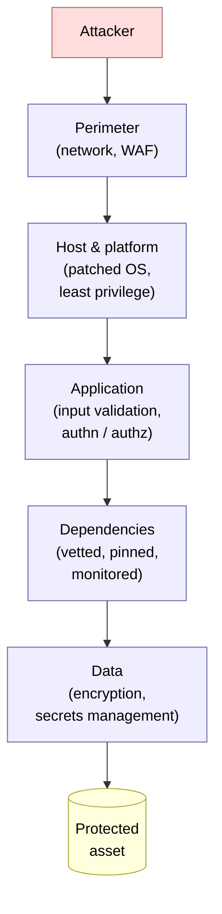
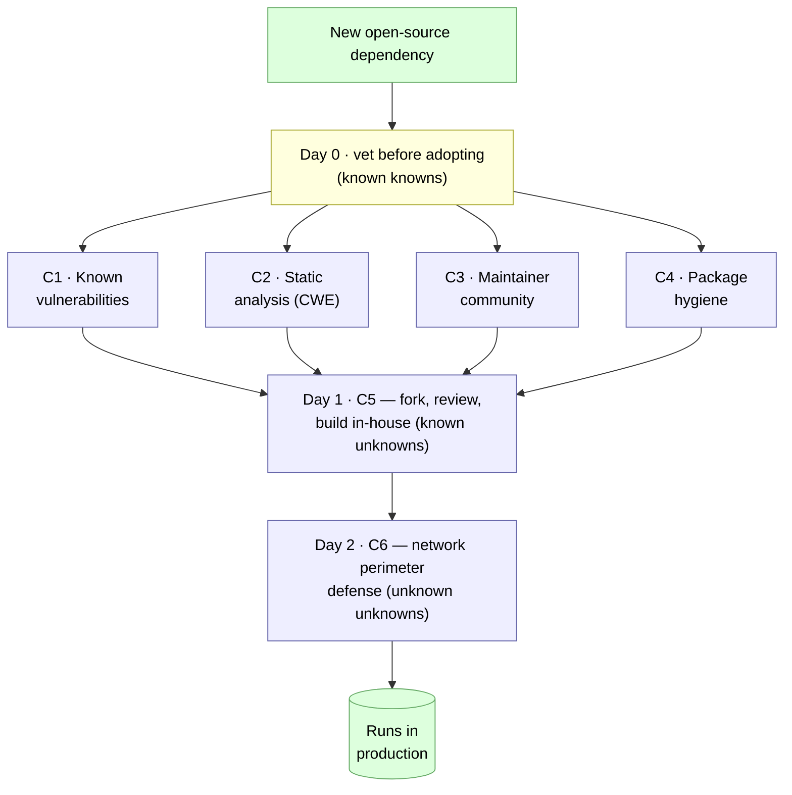

# Chapter 10 — Software Security

> **Where we are.** Security has surfaced in almost every chapter of this book, always as
> one concern among many. Chapter 3 had you draw **attack trees** and walk a STRIDE
> checklist to ask what an adversary wants
> ([§3.7](../03-user-requirements/#37-identifying-security-attacks)). Chapter 6 had you
> write security as a **quality-attribute scenario**, so "the system shall be secure"
> became something you could measure
> ([§6.1.4](../06-design-and-architecture/#614-quality-attribute-scenarios-making-good-testable)).
> Chapter 8's static analysis traced tainted input into a query, and Chapter 9's tests
> probed the error paths an attacker lives on — and Chapter 13 will turn many of these
> checks into automated pipeline gates. Security is a **cross-cutting
> concern** — a property of the whole lifecycle rather than a feature bolted on at the end —
> and this chapter gathers the threads the earlier chapters left loose and ties them into
> one discipline.

For most of this book, "does it work?" has meant "does it do what the user needs?" Security
asks a sharper question: does the system do *only* that, even when someone is actively
trying to make it do something else? Every other quality attribute assumes a cooperative
world — users who supply reasonable inputs, dependencies that behave, networks that deliver
what was sent. Security assumes the opposite: an intelligent adversary studying your system
for the one input, the one dependency, the one forgotten default that turns your feature
into their foothold. That adversarial framing is what makes security different, and it is
why the defenses in this chapter run from the first design sketch all the way to code you
have already shipped.

> **Principle.** Security is not a phase. A vulnerability can be designed in during
> requirements, coded in during implementation, imported through a dependency, or
> introduced by a deployment — so every earlier discipline in this book is also a security
> control. The cheapest defense is the one you made impossible by design; the most
> expensive is the one you patch after a breach.

## 10.1 Security Is a Lifecycle Property

### 10.1.1 The CIA Triad

The classic way to name what security protects is the **CIA triad** — three properties
every system holds in some measure:

- **Confidentiality** — only authorized parties can read data. A patient's diagnosis
  should be visible to their clinician and to no one else.
- **Integrity** — data and code are not altered by unauthorized parties, and unauthorized
  changes are detectable. An attacker who cannot read a record may still do real harm by
  silently *changing* it — a dosage, a balance, a build artifact.
- **Availability** — the system is up and responsive when legitimate users need it. This is
  the same availability Chapter 13 will trade against consistency in the CAP theorem; a
  denial-of-service attack is an availability attack, and downtime you did not choose is a
  security failure as much as a reliability one.

The triad is a lens for asking "secure against what?" A leaked mailing list is a
confidentiality failure; a tampered firmware update is an integrity failure; a ransomware
lockout is an availability failure. Naming the property under threat keeps a security
conversation concrete instead of a vague wish to "be secure."

### 10.1.2 Threat, Vulnerability, Exploit

Three words get used loosely in casual talk and must be kept distinct in engineering.

A **vulnerability** is a weakness in the system — a missing bounds check, an unescaped
query, an over-privileged account, a dependency with a known flaw. A **threat** is a
potential source of harm: the actor or event that might act against you — a criminal
crew, a disgruntled insider, an automated bot sweeping the internet. An **exploit** is the
concrete technique or code that turns a specific vulnerability into an actual compromise.

The distinction is practical. You rarely get to choose your threats — the internet supplies
a steady background of them — but you own every vulnerability in your system, and you can
retire one before any exploit for it exists. **Risk** is where the three meet: a
vulnerability that no threat can reach is low risk, and a severe threat aimed at a weakness
you have already closed is harmless. Security work is the ongoing business of shrinking the
overlap.

### 10.1.3 Defense in Depth and Shifting Left

No single control is perfect, so serious systems assume each one will eventually fail and
place several independent layers between an attacker and what matters. **Defense in depth**
is that layering: a network perimeter, a hardened host, an application that validates its
inputs and checks authorization on every request, and encrypted data with tightly held
keys. An attacker who slips past one layer meets another, and the layers are chosen to fail
*independently* — a flaw that defeats the firewall should not also defeat input validation.



The other structural idea is *when* security work happens. The same economics Chapter 8
gave for defects applies with force to vulnerabilities: the earlier you catch one, the
cheaper it is to fix. A trust-boundary mistake caught in a design review costs an
afternoon; the same mistake caught after a breach costs an incident, a disclosure, and
sometimes the company. **Shifting left** means moving security activity toward the start of
the lifecycle — threat modeling during requirements, secure design reviews before code,
static and dependency scanning on every commit — instead of leaving it to a penetration
test the week before launch. Everything in this chapter is arranged along that leftward
pull.

### 10.1.4 Security as a Quality Attribute

Because security is a system property you can reason about early, it belongs in the same
toolbox as the other quality attributes. Chapter 6 taught you to make a vague quality
testable by writing a **quality-attribute scenario**
([§6.1.4](../06-design-and-architecture/#614-quality-attribute-scenarios-making-good-testable)):
a source, a stimulus, and a measurable response. Security scenarios read the same way —
"an unauthenticated attacker submits ten thousand login attempts; the system locks the
account and alerts an operator within one minute" — and they turn "be secure" into
something a design can be checked against. Chapter 3's **attack trees**
([§3.7.1](../03-user-requirements/#371-attack-trees-think-like-an-attacker)) are the
adversary's half of the same practice: model the attacker's goal as a tree of sub-goals,
and each leaf is a scenario your design must answer. Threat modeling is the requirements and design work of Chapters 3
and 6, done with an adversary in the room.

## 10.2 The OWASP Top 10

Design thinking tells you *how* to reason about threats; it does not tell you *which*
threats are actually hurting real systems right now. For that, the field's most widely used
reference is the **OWASP Top 10**, published by OWASP, a nonprofit foundation devoted to
software security.[^1] The Top 10 is an *awareness document*: a ranked list of the ten most
critical categories of web-application security risk, assembled from empirical data —
hundreds of thousands of real reported vulnerabilities — combined with a survey of
practitioners. It is revised roughly every four years, and each revision is itself a
snapshot of how the industry's risk profile has moved.

The current edition is the **OWASP Top 10:2025**. It was first announced as a release
candidate at the OWASP Global AppSec conference in Washington, D.C., in November 2025[^2]
and finalized shortly afterward; as of this writing the canonical `owasp.org/Top10/` URL
points to the 2025 edition and OWASP lists it as the current released version.[^1] The ten
categories, in rank order, are:[^3]

- **A01:2025 — Broken Access Control**
- **A02:2025 — Security Misconfiguration**
- **A03:2025 — Software Supply Chain Failures**
- **A04:2025 — Cryptographic Failures**
- **A05:2025 — Injection**
- **A06:2025 — Insecure Design**
- **A07:2025 — Authentication Failures**
- **A08:2025 — Software or Data Integrity Failures**
- **A09:2025 — Security Logging and Alerting Failures**
- **A10:2025 — Mishandling of Exceptional Conditions**

Compared with the previous **OWASP Top 10:2021**,[^4] the changes tell a story.[^5] Two
categories are new. **A03:2025 Software Supply Chain Failures** is a broadened successor to
2021's "Vulnerable and Outdated Components" — the scope now covers breakdowns anywhere in
building, distributing, or updating software, not only components with a published CVE — and
its promotion to third place is the clearest signal in the document that the industry's
attention has moved to the supply chain (the subject of §10.4). **A10:2025 Mishandling of
Exceptional Conditions** is entirely new: it names the security bugs that hide in bad error
handling — fail-open logic, crashes, leaked stack traces — and it pairs naturally with
Chapter 13's CrowdStrike case study, where an unhandled condition inside kernel code took
down millions of machines
([§13.3.5](../13-delivery/#1335-when-deployment-goes-wrong-two-case-studies)).

The rest of the diff is renaming and reranking. Server-Side Request Forgery, a standalone
category in 2021, is no longer its own entry — it now lives *inside* A01 Broken Access
Control. A handful of categories were renamed for emphasis ("Identification and
Authentication Failures" became simply "Authentication Failures"; "Security Logging and
Monitoring Failures" became "…and Alerting Failures," to stress that a log nobody acts on is
worthless). And the ranks shifted: Security Misconfiguration rose to #2, while Injection —
long the archetypal web vulnerability — fell to #5, a sign of how much modern frameworks now
prevent it by default.

> **Pitfall.** Treating the Top 10 as a checklist to tick off. OWASP built it as an
> *awareness* document — the categories are broad groupings of many underlying weaknesses,
> and "we handled all ten" is not a security claim. Worse, memorizing the list encourages
> reasoning at the wrong altitude: SSRF moving under Broken Access Control and cross-site
> scripting living under Injection are reminders that categories are buckets of weaknesses,
> not one-bug-one-slot. Reason about the specific weakness in front of you, use the Top 10
> to make sure no whole *class* of risk has been forgotten, and expect the list itself to
> change with the next edition.

### 10.2.1 A01: Broken Access Control

**Access control** enforces the policy that users can only act within their intended
permissions. When it breaks, users read, modify, or destroy data that should be beyond
their reach — which is why OWASP ranks it #1.[^6] The failures are often mundane: an API
that returns another patient's record because it trusts an ID in the URL without checking
who is asking (an *insecure direct object reference*); an admin page reachable by anyone who
guesses its path; a permission check performed in the browser, where the attacker controls
everything, instead of on the server. The 2025 edition folds both Server-Side Request
Forgery and Cross-Site Request Forgery into this category, on the reasoning that both are
ultimately the system being tricked into acting outside its intended authority.

The defense is a design stance, not a patch: **deny by default**, decide authorization on
the server for *every* request, and derive the acting user's identity from an authenticated
session rather than from any value the client can set. Access control is also the security
attribute least visible to testing — a feature "works" perfectly while silently letting the
wrong people use it — which is exactly why it belongs in design review and in the
authorization scenarios of §10.1.4.

### 10.2.2 A05: Injection

**Injection** is what happens when untrusted input is handed to an interpreter and part of
that input gets executed as a command rather than treated as data.[^7] SQL injection is the
canonical case, and it remains the standard teaching example because it is easy to
demonstrate, historically devastating, and completely preventable. Cross-site scripting —
injecting attacker-controlled script into a page other users load — is classified here too:
same mechanism, a different interpreter (the browser).

Picture the clinic scheduler looking up a patient's appointments by name. The natural,
disastrous way to build the query is to paste the name straight into the SQL text:

```go
// UNSAFE: the name is concatenated into the SQL text, so an input like
//   Robert'); DROP TABLE appointments; --  is parsed as SQL, not as a name.
func findUnsafe(db *sql.DB, name string) (*sql.Rows, error) {
	q := fmt.Sprintf("SELECT * FROM appointments WHERE patient_name = '%s'", name)
	return db.Query(q) // A05:2025 Injection
}

// SAFE: the ? placeholder binds the name as a parameter; the database never
// parses it as SQL, so the same malicious input is just an unmatched name.
func findSafe(db *sql.DB, name string) (*sql.Rows, error) {
	return db.Query("SELECT * FROM appointments WHERE patient_name = ?", name)
}
```

```java
// UNSAFE: the name is concatenated into the SQL text, so an input like
//   Robert'); DROP TABLE appointments; --  is parsed as SQL, not as a name.
static ResultSet findUnsafe(Connection db, String name) throws SQLException {
  String q = "SELECT * FROM appointments WHERE patient_name = '" + name + "'";
  return db.createStatement().executeQuery(q); // A05:2025 Injection
}

// SAFE: the ? placeholder binds the name as a parameter; the database never
// parses it as SQL, so the same malicious input is just an unmatched name.
static ResultSet findSafe(Connection db, String name) throws SQLException {
  PreparedStatement ps =
      db.prepareStatement("SELECT * FROM appointments WHERE patient_name = ?");
  ps.setString(1, name);
  return ps.executeQuery();
}
```

```javascript
// UNSAFE: the name is concatenated into the SQL text, so an input like
//   Robert'); DROP TABLE appointments; --  is parsed as SQL, not as a name.
function findUnsafe(db, name) {
  const query =
    "SELECT * FROM appointments WHERE patient_name = '" + name + "'";
  return db.all(query); // A05:2025 Injection
}

// SAFE: the ? placeholder binds the name as a parameter; the database never
// parses it as SQL, so the same malicious input is just an unmatched name.
function findSafe(db, name) {
  const query = "SELECT * FROM appointments WHERE patient_name = ?";
  return db.all(query, [name]);
}
```

```python
# UNSAFE: the name is concatenated into the SQL text, so an input like
#   Robert'); DROP TABLE appointments; --  is parsed as SQL, not as a name.
def find_unsafe(db, name):
    query = "SELECT * FROM appointments WHERE patient_name = '" + name + "'"
    return db.execute(query).fetchall()  # A05:2025 Injection

# SAFE: the ? placeholder binds the name as a parameter; the database never
# parses it as SQL, so the same malicious input is just an unmatched name.
def find_safe(db, name):
    query = "SELECT * FROM appointments WHERE patient_name = ?"
    return db.execute(query, (name,)).fetchall()
```

```ruby
# UNSAFE: the name is concatenated into the SQL text, so an input like
#   Robert'); DROP TABLE appointments; --  is parsed as SQL, not as a name.
def find_unsafe(db, name)
  query = "SELECT * FROM appointments WHERE patient_name = '#{name}'"
  db.execute(query) # A05:2025 Injection
end

# SAFE: the ? placeholder binds the name as a parameter; the database never
# parses it as SQL, so the same malicious input is just an unmatched name.
def find_safe(db, name)
  db.execute("SELECT * FROM appointments WHERE patient_name = ?", name)
end
```

The two functions look almost identical, and that is the lesson. In the first, the boundary
between *code* (the query) and *data* (the name) is a string the attacker can rewrite; a
crafted name like `Robert'); DROP TABLE appointments; --` closes the quote, ends the
statement, and appends one of their own. In the second, the `?` placeholder is a
**parameterized query**: the SQL text is fixed and compiled first, and the name is bound in
afterward as pure data that can never change the query's structure. This is the mechanism
Chapter 8's data-flow analyzers hunt for — tainted input flowing into a query — and the fix
is the same everywhere, in every language and every interpreter.

> **Principle.** Never build a command by concatenating untrusted input into it. Keep code
> and data separate by construction — parameterized queries for databases, safe templating
> with output encoding for HTML, argument arrays rather than shell strings for
> subprocesses. Injection is a solved problem; it survives only where someone reached for
> string concatenation instead.

### 10.2.3 A06: Insecure Design

Some vulnerabilities cannot be coded away, because the flaw is in the design itself. OWASP
defines **Insecure Design** as "missing or ineffective control design" — a category for
weaknesses that a perfect implementation would faithfully preserve.[^8] A password-reset
flow that lets anyone reset an account by answering a question whose answer is public is not
a coding bug; every line may be correct, and the system is still insecure because the design
never included the control it needed. No amount of static analysis, code review, or testing
finds this, because there is no defect on any single line to find.

This is the category that binds security to the rest of software engineering. It says some
security problems are *requirements and architecture* problems, catchable only by the threat
modeling of Chapter 3 and the design review of Chapter 8 — before code exists. Insecure
Design is the standing argument against treating security as a coding-time concern: the
most expensive vulnerabilities are decided at the whiteboard.

### 10.2.4 Learning by Doing, for Free

Reading about vulnerabilities builds recognition; exploiting and then fixing them builds
understanding, and the best resources for that cost nothing. **OWASP Juice Shop** is a
deliberately insecure single-page web application, free and open source, with more than a
hundred hacking challenges spanning the whole Top 10 — you attack a realistic app in a safe
sandbox.[^9] **OWASP WebGoat** is a free, deliberately insecure application built around
*guided* lessons, walking you step by step through vulnerabilities like SQL injection in an
offline environment.[^10] And the **PortSwigger Web Security Academy** offers a large body
of free training material plus interactive labs, written by the team behind the Burp Suite
testing proxy.[^11]

These combine into a complete loop that costs a student nothing: read a category on the
OWASP site, exploit it in Juice Shop or WebGoat, fix it using the matching page from the
free **OWASP Cheat Sheet Series**,[^12] and confirm your fix against a requirement from the
**OWASP Application Security Verification Standard (ASVS)**, a free checklist of testable
security controls.[^13] Learn, attack, defend, verify — the same red-to-green rhythm
Chapter 9 taught, aimed at security.

## 10.3 Finding Vulnerabilities, from Manual to Autonomous

Knowing the categories, how do you find *your* instances of them? Chapter 13 will introduce the
three scanner families that automate the search
([§13.4.1](../13-delivery/#1341-sast-dast-and-sca)); this section previews them briefly and
then turns to what is genuinely new — security tools that use large language models to find,
confirm, and even fix vulnerabilities on their own.

### 10.3.1 SAST, DAST, and SCA

The three families divide the work by what they look at. **Static application security
testing (SAST)** is the security-focused end of the static analysis of Chapter 8
([§8.4](../08-static-checking/#84-automated-static-analysis)): it reads source code without
running it, hunting vulnerable *patterns* — injection sinks, unsafe deserialization, hard-
coded secrets. **Dynamic application security testing (DAST)** attacks the *running*
application from the outside, the way an adversary would, probing endpoints with hostile
inputs and knowing nothing of the source. **Software composition analysis (SCA)** examines
neither your code nor your running app but your *dependency manifest*, checking every third-
party package against databases of known vulnerabilities.

The three are complementary because each sees what the others cannot, and all three carry
Chapter 8's warning about **false positives and false negatives**
([§8.4.2](../08-static-checking/#842-false-positives-and-false-negatives)): a scanner that
floods developers with false alarms trains them to ignore it, and then its true findings are
lost in the noise. A security scanner earns action only by keeping its signal high enough to
be worth reading.

### 10.3.2 AI Enters the Loop

A wave of tools now applies large language models to security, and they occupy three
distinct points in the design space worth keeping apart.

The first *fixes* known findings. **GitHub Copilot Autofix** combines CodeQL code scanning
with LLM-generated fix suggestions: when the scanner flags an alert, the model proposes a
concrete patch for the developer to review. It became generally available in August 2024;
GitHub reported that it produced fixes for more than 90% of alert types across JavaScript,
TypeScript, Java, and Python, and that during the beta developers using it remediated
vulnerabilities roughly three times faster overall — about seven times faster for cross-site
scripting and twelve times faster for SQL injection — than by hand. It runs on all public
repositories on GitHub.com without a separate subscription; private repositories need a code-
security license.[^14] Autofix does not *find* new classes of bug; it shortens the distance
from a known alert to a merged fix.

The second *hunts* for unknown bugs. **Big Sleep**, a collaboration between Google Project
Zero and Google DeepMind that grew out of the earlier "Project Naptime" framework, is an AI
agent that searches real code for vulnerabilities. In late 2024 Google described it finding
an exploitable stack buffer underflow in the widely used **SQLite** database engine — a flaw
Google characterized as the first real-world vulnerability discovered by an AI agent, caught
in a development branch and fixed before it reached a release.[^15] In 2025 Google reported
that Big Sleep, combined with threat intelligence, helped identify and pre-empt in-the-wild
exploitation of a separate critical SQLite vulnerability, CVE-2025-6965, that had been known
only to attackers.[^16] These are early results, but they show AI moving from fixing
flagged bugs to discovering unknown ones.

The third *validates* by attacking. **Strix** is an open-source project (from the developer
UseStrix) that describes itself as "autonomous AI penetration testing agents that act just
like real hackers — they run your code dynamically, find vulnerabilities, and validate them
through actual proofs-of-concept."[^17] Its design is what makes it interesting for a
software-engineering course. Strix runs a *multi-agent* architecture — specialized agents
work different targets in parallel and share what they find — and it arms those agents with
real tooling: an HTTP interception proxy, browser automation for client-side attacks, shell
and Python environments for building exploits, plus static and dynamic analysis. It is
*model-agnostic*, driving whichever LLM provider you configure, and it ships as a pip-
installable command-line tool that sandboxes agent execution in Docker containers, with a
mode that scopes a scan to the diff in a pull request so it can run inside CI.[^17] Help Net
Security's coverage corroborated the graph-based multi-agent design when the project drew
attention in late 2025.[^18]

The critical design difference from a static linter is *validation*. A SAST tool reports a
"possible SQL injection"; Strix tries to actually exploit it and reports a working proof-of-
concept or nothing. That closes the false-positive gap from the other side — a confirmed
exploit is evidence, not a guess. It also opens a different set of hazards that a first
course must name plainly.

> **Pitfall.** *Autonomous attack tools are power tools, and they cut both ways.* Three
> rules are non-negotiable. **First, authorization.** Strix's own documentation is blunt:
> "Only test apps you own or have permission to test. You are responsible for using Strix
> ethically and legally." Running an autonomous exploit agent against a system you are not
> authorized to test can be a crime; scope, written permission, and rules of engagement come
> *before* any scan. **Second, validation is still yours.** A finding — even one with a
> proof-of-concept — is the start of triage, not the end: reproduce it, judge its real
> business impact, and remember that these agents can over-report, miss logic flaws, and
> hallucinate. **Third, they do not replace secure design.** An agent that finds a
> vulnerability late is far more expensive than a design decision that made the bug
> impossible; treat Strix, Big Sleep, and Autofix as authorized-testing and research tools
> that complement threat modeling, least privilege, and input validation — never as
> substitutes for them. Adopt any of them the way Chapter 8 said to adopt a static analyzer:
> as a tool whose output you must keep trusting, which means keeping it honest.

## 10.4 The Software Supply Chain: A World of Weak Links

Every technique so far assumes the code under review is *your* code. It mostly is not. The
single largest shift in what "your software" means is that a modern application is
overwhelmingly assembled from open-source components you did not write, chosen by people who
are not on your team, updated on a schedule you do not control. This section is the
intellectual center of the chapter, because it is where security stops being about the code
you can read and becomes about the trust you extend.

### 10.4.1 The Scale Problem

Start with your own habit. When you run `npm install` or `pip install`, you pull in not just
the package you named but everything *it* depends on, and everything those depend on, down
through a tree most developers never inspect. The numbers are stark. Hastings' 2024
dissertation on supply-chain attacks reports that open-source software is used in 99% of
software applications, that a simple "hello-world" Ruby on Rails application requires 966
packages across three package managers, and that a React project pulls in 1,213 — the vast
majority of them transitive dependencies nobody on the team ever chose.[^19] Black Duck's
2026 Open Source Security and Risk Analysis report, based on audits of hundreds of
commercial codebases, puts hard current figures on the same picture: as of the 2026 report,
open source appears in 98% of codebases, **64% of the components in a typical codebase are
transitive** — pulled in indirectly, selected by no one on the team — and 93% of codebases
contain components with no development activity in over two years.[^20] The same report found
an average of 581 known vulnerabilities per codebase, with 78% of codebases carrying at
least one high-risk vulnerability and 44% carrying a critical one.[^20]

The reframe for a student is immediate: the package manifest at the root of your sprint
project is a *trust decision*, not a convenience. Most of the code you ship is other
people's, and its vulnerabilities are your vulnerabilities.

> **Pitfall.** *Automatic updates are a supply-chain attack vector.* The same **semantic-
> versioning** ranges you learn as good practice — accept any compatible patch or minor
> release — mean your build silently pulls a poisoned version the moment an attacker
> publishes one, disguised as a routine patch. As Hastings' dissertation puts the inversion:
> "It used to be patch on a Friday to prevent a breach on Monday. Now, it is patch on Friday
> and a breach on Monday."[^19] The defenses are cultural before they are technical: pin
> exact versions with a lockfile, review dependency-update pull requests like any other
> change, and treat a new dependency as an engineering decision with a threat model attached.

### 10.4.2 Weak Links

Why is the open-source supply chain so exposed? Because trust in it flows through people, and
people are the weakest link. The dissertation adopts the term **weak links** from research
by Zahan and colleagues, who studied the npm ecosystem and identified structural weaknesses
in how packages are maintained — including maintainers whose account-recovery email ran
through *expired domains* anyone could re-register — and found, strikingly, that compromising
about twenty high-profile developer accounts could poison roughly half of the npm
ecosystem.[^21] A tiny number of overextended, under-supported maintainers hold up an
enormous amount of the world's software.

The dissertation's blunt summary of the adoption mindset is worth keeping: open-source
components "might be free, but they are free as in puppy."[^19] A package is an ongoing responsibility to vet, monitor, and patch — a living thing you
have taken into your home. OWASP recognized the whole problem in 2025 by promoting it to a
dedicated Top 10 category, **A03:2025 Software Supply Chain Failures**, whose scope
deliberately spans dependencies, build systems, and distribution infrastructure — the entire
attack surface from *source* to *build* to *distribution* to *dependency*.[^22] The two case
studies below are opposite failure modes on that same surface.

There is a subtler weak link worth naming, because it attacks the *incentives* that keep
the commons healthy rather than any one package. Open source works as a bargain: you may
use this code freely, and in return you honor its license — you keep the attribution, you
share alike where the license says so, you give something back. A satirical site called
**MALUS** dramatizes what happens when that bargain is abandoned. It advertises, deadpan, a
service that feeds your dependency manifest to an AI, "recreates" each library as
"legally distinct" code stripped of every attribution and copyleft obligation, and hands it
back under a proprietary license — *"finally, liberation from open source license
obligations."*[^23] The site is a joke; the pressure it names is not. If firms could
launder away the reciprocity that open source runs on — taking the value while shedding the
obligation — the volunteers who maintain the world's dependencies would have even less
reason to keep doing unpaid, thankless work, and the pool of overextended maintainers you
just met in the xz story would only thin further. Security tooling can verify a component's
provenance; it cannot, by itself, sustain the human ecosystem that produces components worth
verifying. That sustainability is a supply-chain security concern too.

> **Pitfall.** Treating open-source components as a free resource to extract rather than a
> commons to sustain is a slow-acting supply-chain risk. Every dependency you take on rests
> on a maintainer's continued willingness to maintain it; honoring licenses, reporting
> bugs, upstreaming fixes, and — where you can — funding the projects you depend on are how you
> keep the components you rely on alive and watched, not charity.

### 10.4.3 Two Case Studies

> **Case study.** *Log4Shell (CVE-2021-44228), December 2021.* Apache Log4j is a logging
> library so common that it sits, usually as a transitive dependency, inside a large fraction
> of the Java software on earth. On December 10, 2021, a vulnerability was published with the
> maximum possible CVSS base score of **10.0**.[^24] The cause was a feature almost nobody
> knew was on: Log4j versions from 2.0-beta9 through 2.14.1 would, by default, interpret
> special lookup syntax *inside the strings they logged*, and one lookup type (JNDI) could be
> pointed at an attacker-controlled server to download and execute arbitrary code. Because
> applications log untrusted input all the time — a username, a search term, a User-Agent
> header — an attacker could trigger remote code execution simply by getting a malicious
> string logged, with no privileges and no user interaction.[^24]
>
> Log4Shell was catastrophic for a supply-chain reason: the dangerous behavior lived in a
> *ubiquitous transitive dependency*, so countless teams were vulnerable through software
> they never realized contained Log4j at all. Remediation was staged — 2.15.0 disabled the
> behavior, 2.16.0 removed it — and the urgency was extraordinary: CISA added Log4Shell to
> its Known Exploited Vulnerabilities catalog with a federal remediation deadline of December
> 24, 2021,[^25] two weeks after disclosure. The lesson is that you cannot patch a dependency you
> do not know you have — which is the argument for the software bills of materials in §10.4.5.

> **Case study.** *The xz-utils backdoor (CVE-2024-3094), March 2024.* Where Log4Shell was an
> accident, xz was an attack — a patient, multi-year campaign to plant a backdoor in software
> the world runs by default. xz-utils is a compression library that ships in essentially
> every Linux distribution, and `liblzma` is linked, indirectly, into the OpenSSH server on
> many systems. The story is fundamentally a *human* one.[^26]
>
> The library was maintained, for years, by one overworked volunteer, Lasse Collin. Beginning
> in 2021, a new contributor calling themselves "Jia Tan" started submitting patches. Over
> 2022, sock-puppet personas appeared in the mailing list to pressure Collin into handing over
> more control — complaining about slow progress and pushing for a new maintainer — while
> Collin, candidly, wrote that "I haven't lost interest but my ability to care has been fairly
> limited mostly due to longterm mental health issues."[^26] Jia Tan was gradually granted
> trust, became a co-maintainer, and in February and March 2024 released versions 5.6.0 and
> 5.6.1 whose *release tarballs* — the packaged downloads, signed by Jia Tan, but not the
> plain git repository — contained an obfuscated backdoor hidden inside files disguised as
> compression test data.[^27] Assembled at build time, it modified `liblzma` so that a
> compromised sshd would run attacker commands, before authentication.[^28]
>
> It was caught almost by accident. Andres Freund, a PostgreSQL developer at Microsoft,
> noticed that SSH logins on a test system were about half a second slower than they should be
> and that a memory-analysis tool was flagging errors in `liblzma`. He refused to shrug it off,
> traced the anomaly, and disclosed the backdoor on a public security mailing list on March
> 29, 2024.[^29] The world's most sophisticated known supply-chain attack was undone by one
> engineer who would not ignore half a second of unexplained latency.
>
> Read as a pair, the cases bracket the problem. Log4Shell is an *accidental* vulnerability in
> a ubiquitous dependency — a design failure. xz is a *deliberate* backdoor inserted through a
> trust-and-process failure aimed squarely at a burned-out solo maintainer. Same blast radius,
> opposite root causes — which is why the defenses must include both scanners that find known-
> bad code *and* controls that constrain how you extend trust in the first place. It also ties
> supply-chain security straight to this book's themes of sustainable teamwork: bus factor,
> code review as a security control, and observability curiosity are not soft skills here —
> they are the controls that failed and the one that saved the day.

### 10.4.4 Continuous Verification: A Framework of Six Controls

The two cases motivate a repeatable way to vet a dependency *before* and *after* you adopt
it, rather than trusting it and hoping. Hastings' dissertation — the relevant chapter of
which was published with Walcott as "Continuous Verification of Open Source Components in a
World of Weak Links" — proposes exactly that: a framework of six controls, C1 through C6,
organized across **Day 0**, **Day 1**, and **Day 2** operations and mapped to the familiar
progression of *known knowns*, *known unknowns*, and *unknown unknowns*.[^19]<!-- -->[^30]



The **Day 0** controls vet a component before you adopt it, and they can be largely
automated. **C1** checks the package and its dependencies for known vulnerabilities and
weighs how many other projects depend on it. **C2** runs static analysis against catalogs of
known weakness types (CWE). **C3** examines the maintainer *community* — how many
organizations maintain it, how active it has been in the last ninety days — because a
one-person project is a weak link waiting to happen. **C4** checks package *hygiene*: signed
commits, signed releases, branch protection, the absence of dangerous build workflows. In
the dissertation these are computed from a subset of OpenSSF Scorecard heuristics plus a
custom dependents metric, and the combined score maps to a risk level — and, importantly, to
an expected *time to repair*: a low-risk component's community tends to fix problems in
hours, a high-risk one's in weeks or never.[^19]

The **Day 1** control, **C5**, is a policy for what you let into your build: no artifact you
did not build from reviewed source is included — the component is forked, code-reviewed, and
built in-house, with an automated pipeline to re-review each new upstream release. The **Day
2** control, **C6**, is a production perimeter defense that inspects outbound network traffic
against an allow list, to catch a component that "phones home." The dissertation's evaluation
applied these controls in tabletop exercises against five real compromised packages and
found the framework flagged the appropriate risk level in four of five cases, versus one of
five for OpenSSF Scorecard alone — while candidly noting that the controls "excel at vetting
single components" but grow costly for whole frameworks with deep recursive dependencies, and
that the Day 1 and Day 2 controls offer the most protection at the highest cost.[^19] The
mental model is what to carry away: **vet before you adopt (Day 0), control what you ingest
(Day 1), monitor in production (Day 2)** — a lifecycle arc that lines up with this book's own
progression from design through delivery to operations.

### 10.4.5 The Modern Supply-Chain Toolbox

You do not have to build C1–C6 by hand; a growing set of free tools implements pieces of it,
and each answers a different question about an artifact.

*How healthy is the upstream project?* **OpenSSF Scorecard** runs eighteen automated checks —
code review, branch protection, pinned dependencies, signed releases, dangerous workflows,
known vulnerabilities, and more — scoring any public repository on how well it follows
security practices.[^31] It is the tooling behind the dissertation's Day 0 controls, and you
can run it against a package you are considering for your project.

*What is known to be wrong with my dependencies?* **OWASP Dependency-Check** is a free SCA
tool that scans a project's dependencies for publicly disclosed vulnerabilities and runs in
CI; **OWASP Dependency-Track** is its organization-scale companion, continuously monitoring
supply-chain risk across a whole portfolio by analyzing bills of materials.[^32]<!-- -->[^33]

*What is actually inside the artifact?* A **software bill of materials (SBOM)** is a complete
inventory of every component in a release — the answer to "do we even have Log4j?" Two open
standards dominate: **CycloneDX**, an OWASP-originated format now standardized as ECMA-424,[^34]
and **SPDX**, a Linux Foundation format that is an ISO/IEC international standard (ISO/IEC
5962).[^35] An SBOM is what turns "patch the dependency you did not know you had" from
impossible into a database query.

*How was the artifact built, and who produced it?* **SLSA** (Supply-chain Levels for Software
Artifacts) is a framework of build-integrity levels — from **L0** (no guarantees) through
**L1** (provenance exists but is forgeable), **L2** (signed provenance from a hosted builder),
to **L3** (a hardened build platform with strong tamper resistance) — that grades how
trustworthy an artifact's origin story is.[^36] And **Sigstore** makes signing that artifact
practical by replacing long-lived signing keys with "keyless," identity-based signing:
ephemeral keys are bound to an identity, and every signing event is recorded in an immutable
public transparency log, sidestepping the key-theft and key-management problems that made
traditional artifact signing so rare.[^37]

Mapped onto the attack surface, the tools stop being a list and become a system: SBOMs answer
*what is in it*, Sigstore answers *who made it*, SLSA provenance answers *how it was built*,
and Scorecard answers *how healthy the source project is* — the same source-to-distribution
progression that A03 spans.[^38] All of them are free, and OpenSSF even publishes a free,
certificate-bearing course, "Developing Secure Software" (LFD121), that a student can put on
a résumé.[^39] Supply-chain security is an employable skill, not abstract policy.

## 10.5 Building Security In

The through-line of this chapter is that security is decided long before an attacker shows
up. The industry has codified that idea into a reference practice. The **NIST Secure Software
Development Framework (SSDF)**, published as NIST Special Publication 800-218, defines a core
set of high-level secure-development practices to fold into any lifecycle — with the explicit
goals of reducing vulnerabilities in released software, mitigating the impact of the ones
that slip through, and giving software producers and purchasers a shared vocabulary.[^40]
That last goal matters for the profession: because the SSDF is a common language, secure
development escapes the "optional best practice" trap and becomes something a contract can
require — a natural seed, too, for a research paper on how SBOM mandates and SLSA adoption
are reshaping procurement.

A handful of habits carry most of the weight in day-to-day code. **Secure defaults**: ship
locked down, so that the safe configuration is the one you get by doing nothing — Log4Shell
was, at heart, an *insecure* default. **Least privilege**: every user, service, and token
gets the minimum access it needs and no more, so that a compromise of one part cannot reach
the whole. **Secrets management**: credentials belong in a secrets manager or injected
configuration, never in source — the secrets-scanning gate of Chapter 13
([§13.4.3](../13-delivery/#1343-secrets-and-gate-placement)) exists because a key committed
to git history must be treated as compromised the moment it lands.

Finally, assume you will be attacked anyway, and instrument for it. **A09:2025 Security
Logging and Alerting Failures** names the risk of flying blind: without logging you cannot
detect an attack, and — the point behind the 2025 rename — without *alerting* you cannot
respond in time to a breach in progress.[^41] Its neighbor, **A10:2025 Mishandling of
Exceptional Conditions**, is the everyday habit that turns into a security bug when done
badly: fail-open logic, crashes on unexpected input, and stack traces leaked to
users.[^42] Both connect security back to ordinary engineering discipline — an error path
you handle carefully and a log you actually watch are security controls, and Chapter 13's
CrowdStrike outage is what the mishandled exceptional condition looks like at global scale.

> **Principle.** Design so that the *default* path is the secure one and the *privileged*
> path is the exception. Every control that must be remembered will eventually be forgotten;
> every control that is automatic — a safe default, a scoped token, a pipeline gate — holds
> even on the day everyone is tired and shipping fast.

## 10.6 Conclusion

Security is the discipline this book has been building toward without always naming it. The
attack trees and STRIDE checklists of Chapter 3 were security work; the quality-attribute
scenarios of Chapter 6 made "secure" measurable; the static analysis of Chapter 8 and the
tests of Chapter 9 were catching vulnerabilities all along; and the pipeline of Chapter 13
will turn those checks into gates no change can skip. What this chapter added is the adversarial
frame that unifies them — the assumption that someone is actively working to make your system
misbehave — and the recognition that most of the software you ship was written by strangers,
so trust in the supply chain is now the largest security decision your team makes. The OWASP
Top 10 tells you which risks are real this year; parameterized queries and secure defaults
close whole categories by construction; AI tools like Copilot Autofix, Big Sleep, and Strix
are beginning to find and fix bugs at machine speed, under the standing conditions of
authorization and human validation; and the continuous-verification framework of §10.4 gives
you a way to vet a dependency across its whole life rather than trusting it on faith. Log4Shell
and xz-utils are the permanent record of what happens when you cannot see inside your own
software and when a single overloaded maintainer holds up the world.

If the chapter compresses to one sentence, it is this: **treat security as a property you
design in, verify continuously, and extend deliberately to every dependency you trust — because
an adversary only has to find the one weak link you forgot to check.**

---

### Sources

[^1]: OWASP Foundation, *OWASP Top Ten* project page (nonprofit stewardship; current released edition is 2025) and the canonical redirect. [owasp.org/www-project-top-ten](https://owasp.org/www-project-top-ten/), [owasp.org/Top10](https://owasp.org/Top10/).

[^2]: OWASP, *OWASP Top 10* supplemental site (release-candidate announcement, OWASP Global AppSec, Washington, D.C., November 2025). [owasptopten.org](https://www.owasptopten.org/).

[^3]: OWASP, *OWASP Top 10:2025* (category list). [owasp.org/Top10/2025](https://owasp.org/Top10/2025/).

[^4]: OWASP, *OWASP Top 10:2021* (category list). [owasp.org/Top10/2021](https://owasp.org/Top10/2021/).

[^5]: OWASP, *OWASP Top 10:2025 — Introduction* (summary of changes from 2021). [owasp.org/Top10/2025/0x00_2025-Introduction](https://owasp.org/Top10/2025/0x00_2025-Introduction/).

[^6]: OWASP, *A01:2025 — Broken Access Control*. [owasp.org](https://owasp.org/Top10/2025/A01_2025-Broken_Access_Control/).

[^7]: OWASP, *A05:2025 — Injection*. [owasp.org](https://owasp.org/Top10/2025/A05_2025-Injection/).

[^8]: OWASP, *A06:2025 — Insecure Design*. [owasp.org](https://owasp.org/Top10/2025/A06_2025-Insecure_Design/).

[^9]: OWASP, *OWASP Juice Shop* project page. [owasp.org/www-project-juice-shop](https://owasp.org/www-project-juice-shop/).

[^10]: OWASP, *OWASP WebGoat* project page. [owasp.org/www-project-webgoat](https://owasp.org/www-project-webgoat/).

[^11]: PortSwigger, *Web Security Academy*. [portswigger.net/web-security](https://portswigger.net/web-security).

[^12]: OWASP, *OWASP Cheat Sheet Series*. [cheatsheetseries.owasp.org](https://cheatsheetseries.owasp.org/).

[^13]: OWASP, *Application Security Verification Standard (ASVS)*. [owasp.org](https://owasp.org/www-project-application-security-verification-standard/).

[^14]: GitHub, *Copilot Autofix for CodeQL code scanning alerts is now generally available* (changelog, August 14, 2024) and *Found means fixed* (GitHub Blog). [github.blog](https://github.blog/changelog/2024-08-14-copilot-autofix-for-codeql-code-scanning-alerts-is-now-generally-available/).

[^15]: Google Project Zero, *From Naptime to Big Sleep: Using Large Language Models to Catch Vulnerabilities in Real-World Code* (October 2024). [projectzero.google](https://projectzero.google/2024/10/from-naptime-to-big-sleep.html).

[^16]: The Hacker News, *Google AI "Big Sleep" Stops Exploitation of Critical SQLite Vulnerability* (CVE-2025-6965, 2025). [thehackernews.com](https://thehackernews.com/2025/07/google-ai-big-sleep-stops-exploitation.html).

[^17]: usestrix/strix — GitHub repository and README (Apache-2.0; autonomous AI penetration-testing agents; self-description and ethics statement). [github.com/usestrix/strix](https://github.com/usestrix/strix).

[^18]: Help Net Security, *Strix: Open-source AI agents for penetration testing* (November 17, 2025). [helpnetsecurity.com](https://www.helpnetsecurity.com/2025/11/17/strix-open-source-ai-agents-penetration-testing/).

[^19]: Thomas G. Hastings, *Combating Source Poisoning and Next-Generation Software Supply Chain Attacks Using Education, Tools, and Techniques*, Ph.D. dissertation, University of Colorado Colorado Springs (2024). [archives.mountainscholar.org](https://archives.mountainscholar.org/digital/api/collection/p17393coll24/id/52273/download).

[^20]: Black Duck, *2026 Open Source Security and Risk Analysis (OSSRA) Report* (February 2026). [blackduck.com](https://www.blackduck.com/content/dam/black-duck/en-us/reports/rep-ossra.pdf).

[^21]: Nusrat Zahan et al., *What Are Weak Links in the npm Supply Chain?*, arXiv:2112.10165 (2022; ICSE-SEIP 2022). [arxiv.org/abs/2112.10165](https://arxiv.org/abs/2112.10165).

[^22]: OWASP, *A03:2025 — Software Supply Chain Failures*. [owasp.org](https://owasp.org/Top10/2025/A03_2025-Software_Supply_Chain_Failures/).

[^23]: MALUS — *"Finally, liberation from open source license obligations"* (satirical site). [malus.sh](https://malus.sh/). A parody of AI "clean-room" services claiming to launder open-source licensing obligations; accessed 2026.

---

- **Key takeaways** are summarized above in §10.6.
- Continue to the [Exercises](exercises.md).
- Go deeper with the [Open Resources](resources.md) for this chapter.

[^24]: NIST National Vulnerability Database, *CVE-2021-44228* (Log4Shell; CVSS 3.1 base score 10.0; published December 10, 2021). [nvd.nist.gov](https://nvd.nist.gov/vuln/detail/CVE-2021-44228).

[^25]: Cybersecurity and Infrastructure Security Agency (CISA), *Known Exploited Vulnerabilities Catalog* — Log4Shell (CVE-2021-44228) was added under Binding Operational Directive 22-01 with a remediation due date of December 24, 2021. [cisa.gov](https://www.cisa.gov/known-exploited-vulnerabilities-catalog).

[^26]: Russ Cox, *Timeline of the xz open source attack* (research.swtch.com), with links to the primary mailing-list messages. [research.swtch.com/xz-timeline](https://research.swtch.com/xz-timeline).

[^27]: Tukaani Project (Lasse Collin), *XZ Utils backdoor* incident page. [tukaani.org/xz-backdoor](https://tukaani.org/xz-backdoor/).

[^28]: NIST National Vulnerability Database, *CVE-2024-3094* (xz-utils backdoor; CVSS 10.0; published March 29, 2024). [nvd.nist.gov](https://nvd.nist.gov/vuln/detail/CVE-2024-3094).

[^29]: Andres Freund, *backdoor in upstream xz/liblzma leading to ssh server compromise*, oss-security mailing list (March 29, 2024). [openwall.com](https://www.openwall.com/lists/oss-security/2024/03/29/4).

[^30]: T. Hastings and K. R. Walcott, *Continuous Verification of Open Source Components in a World of Weak Links*, IEEE International Symposium on Software Reliability Engineering Workshops (ISSREW), 2022, pp. 201–207. DOI [10.1109/ISSREW55968.2022.00068](https://doi.org/10.1109/ISSREW55968.2022.00068); [author's copy](https://faculty.uccs.edu/kwalcott/wp-content/uploads/sites/49/2024/01/thastings_ISSREW2022.pdf).

[^31]: OpenSSF, *Scorecard* (eighteen automated security checks for open-source projects). [scorecard.dev](https://scorecard.dev/).

[^32]: OWASP, *Dependency-Check* (free SCA tool). [owasp.org](https://owasp.org/www-project-dependency-check/).

[^33]: OWASP, *Dependency-Track* (continuous SBOM-based component-analysis platform). [owasp.org](https://owasp.org/www-project-dependency-track/).

[^34]: CycloneDX, OWASP/Ecma International Bill of Materials standard (ECMA-424). [cyclonedx.org](https://cyclonedx.org/).

[^35]: SPDX, Linux Foundation SBOM standard (ISO/IEC 5962:2021). [spdx.dev](https://spdx.dev/).

[^36]: OpenSSF, *SLSA — Supply-chain Levels for Software Artifacts* (build track levels L0–L3). [slsa.dev](https://slsa.dev/).

[^37]: Sigstore, documentation on keyless, identity-based signing (cosign, Fulcio, Rekor). [docs.sigstore.dev](https://docs.sigstore.dev/).

[^38]: Google Cloud, *Software supply chain threats* (attack vectors mapped across source, build, dependency, and deployment). [cloud.google.com](https://cloud.google.com/software-supply-chain-security/docs/attack-vectors).

[^39]: OpenSSF, *Developing Secure Software* (LFD121), free online course with certificate. [openssf.org/training/courses](https://openssf.org/training/courses/).

[^40]: NIST, *Secure Software Development Framework (SSDF) Version 1.1*, Special Publication 800-218 (February 2022). [csrc.nist.gov](https://csrc.nist.gov/pubs/sp/800/218/final).

[^41]: OWASP, *A09:2025 — Security Logging and Alerting Failures*. [owasp.org](https://owasp.org/Top10/2025/A09_2025-Security_Logging_and_Alerting_Failures/).

[^42]: OWASP, *A10:2025 — Mishandling of Exceptional Conditions*. [owasp.org](https://owasp.org/Top10/2025/A10_2025-Mishandling_of_Exceptional_Conditions/).
