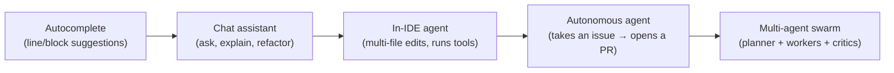
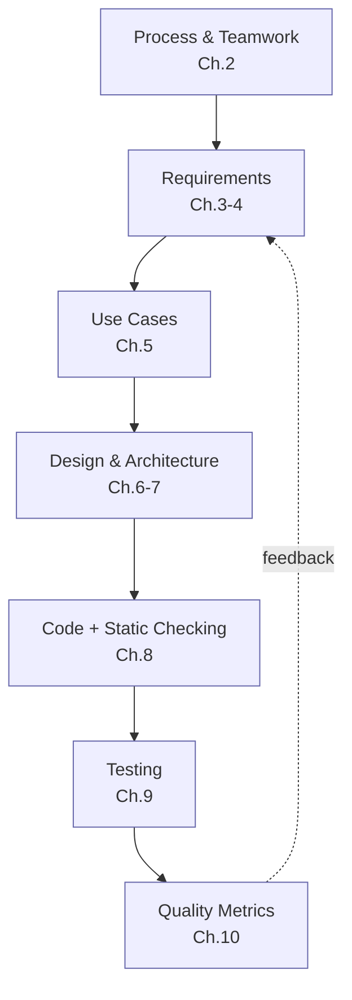

# Chapter 11 — Software Engineering in the Age of AI

> **Where we are.** Every previous chapter described a durable engineering discipline —
> process, requirements, design, checking, testing, metrics, teamwork. This chapter asks
> what happens to those disciplines when generative AI and **coding agents** can draft
> code, tests, requirements, and designs in seconds. We separate what genuinely changes
> from what stubbornly does not, walk the whole lifecycle stage by stage, look honestly at
> the *evidence* (which is more mixed than the marketing), and close with the **o16g
> "Outcome Engineering" manifesto** — a recent, provocative attempt to redefine the
> profession for the agentic era.

The headline claim of the moment is that AI writes the code now. The more useful claim is
this: **AI changes where the hard part lives.** For decades the bottleneck was *producing*
correct code fast enough. As producing gets cheap, the bottleneck moves to *deciding what
to build* and *proving it works* — which are exactly the activities this book has been
teaching. The engineer who internalized Chapters 1–10 is not made obsolete by agents; they
are the person best positioned to *direct* them.

## 11.1 What AI Changes — and What It Doesn't

### 11.1.1 Essential vs. accidental complexity, revisited

Recall from Chapter 1 the split between **essential** complexity (inherent in the problem)
and **accidental** complexity (from our tools and toil). Generative AI is a spectacular
weapon against *accidental* complexity: boilerplate, glue code, format conversions, first
drafts of tests, "how do I call this API" friction. It is far weaker against *essential*
complexity: deciding what the system should actually do, resolving conflicting goals,
choosing an architecture whose likely changes are cheap. That boundary is the single most
important idea in this chapter. **Delegate the toil; own the essence.**

### 11.1.2 The four pressures still hold

The book's four cross-cutting pressures do not go away — AI just shifts them:

- **Software is complex.** Agents can *generate* complexity faster than ever, including
  accidental complexity you did not ask for. Architecture (Chapters 6–7) matters *more*.
- **Requirements change.** AI lowers the cost of *responding* to change, which raises the
  premium on knowing *which* change is worth making (Chapters 3–4).
- **Defects are inevitable.** AI produces plausible-looking defects at scale. Reviews,
  static checking, and tests (Chapters 8–9) become the load-bearing walls.
- **Teams need coordination.** "Teams" now include non-human members. Coordinating a
  *swarm* of agents is a new and unsolved organizational problem (see §11.4).

### 11.1.3 A ladder of assistance: from autocomplete to agents

"AI coding" is not one thing. It helps to name the rungs, because the engineering
questions differ at each:

As you climb the ladder, the human's job moves from *typing* toward *specifying,
supervising, and verifying* — and the cost of a confident-but-wrong output rises, because
more happens between your instruction and your review.

### 11.1.4 The productivity paradox

Does AI make developers faster? The honest answer is *it depends, and the evidence is
mixed enough to demand humility.*

- **Perceived gains are large.** In field studies, a majority of developers report feeling
  more productive with tools like GitHub Copilot, and vendors cite eye-catching numbers.
- **Measured gains are smaller and sometimes negative.** In a 2025 randomized controlled
  trial, METR had experienced open-source developers do real tasks in repositories they
  knew well. Developers *predicted* AI would make them ~24% faster; in fact they were about
  **19% slower** with AI — and still *believed* they'd been faster afterward. The slowdown
  came largely from the overhead of **reviewing and integrating** generated output.

> **Principle.** Perceived productivity is not measured productivity. On familiar,
> high-standards code, the time you save typing can be swamped by the time you spend
> verifying what the agent produced. *Verification is the new bottleneck* — a theme this
> whole chapter returns to.

The lesson is not "AI is useless" — gains are real for boilerplate, unfamiliar APIs,
greenfield prototypes, and well-specified narrow tasks. The lesson is that **leverage
scales with the operator's judgment**, and that you must *measure* impact rather than trust
the feeling of speed (a direct application of Chapter 10).

## 11.2 AI Across the Lifecycle

Here we walk the lifecycle, mapping AI's role onto each chapter's discipline. For each
stage: *what AI does well now*, *where it fails*, and *what fundamental the human still
owns.*

### 11.2.1 Process and teamwork (Chapter 2)

AI compresses many process activities: drafting sprint plans, summarizing standups,
writing retro notes, triaging issues, generating first-pass estimates. Agents can now take
a ticket and open a pull request unattended, which strains the assumptions of Scrum and XP
— what is a "sprint" when a swarm can attempt fifty backlog items overnight?

- **Fails at:** judgment about *value* and *sequencing*; reading the human dynamics of a
  team; owning accountability for what ships.
- **Human owns:** the definition of done, the choice of what to build next, and
  responsibility. The agile value of "working software as the measure of progress" gets
  *sharper*, not softer — see the manifesto's "verified reality" in §11.4.

### 11.2.2 Requirements (Chapter 3)

Large language models are genuinely useful for **elicitation and drafting**: turning
interview notes, tickets, and support logs into candidate user stories, acceptance
criteria (Given/When/Then), and edge-case lists. Studies report LLM-drafted requirements
that reviewers rate as *more complete* and better aligned than hand-written first drafts,
produced far faster and cheaper.

- **Fails at:** knowing what users actually *need* versus what is *plausible*; an LLM will
  cheerfully invent requirements that sound reasonable and are wrong (**hallucinated
  requirements**), and its fluency can manufacture false consensus.
- **Human owns:** talking to real stakeholders, resolving conflicting goals (Chapter 3's
  goal hierarchies), and *validating* that a story reflects a real need. Use AI to widen
  the net of candidate requirements; use humans to decide which are true.

### 11.2.3 Estimation and analysis (Chapter 4)

AI can suggest story-point estimates from historical data and surface comparable past
work. But recall *why* we estimate in Chapter 4: story points model **human uncertainty**
and drive **prioritization**, not stopwatch time. When agents do the building, the
estimation question shifts from "how many engineer-hours?" toward "how much **compute/
budget**, and is the outcome worth it?" — precisely the manifesto's *cost, not time*
reframing (§11.4). MoSCoW, value/cost/risk, and Kano analysis remain the right tools; the
"cost" axis just gets a new currency.

### 11.2.4 Use cases (Chapter 5)

Given a goal and a happy path, models are good at enumerating **alternative flows** and
exception cases — exactly the tedious part of use-case writing that people skip. That
coverage is valuable. But an agent cannot tell you which actor *goals* matter, and it will
pad use cases with flows no user will ever take.

- **Human owns:** the actor–goal list (what the system is *for*) and pruning generated
  flows down to the ones that carry real risk or value.

### 11.2.5 Design and architecture (Chapters 6–7)

This is where the human-owned layer is thickest. AI can propose class structures, generate
**Architecture Decision Records (ADRs)**, suggest applicable patterns from Chapter 7, and
even prototype competing designs to compare. Research on multi-agent systems that go from
requirements to candidate architectures is active but early, and leans on role
specialization to fight hallucination.

- **Fails at:** the *significant, expensive-to-change decisions* that define architecture
  (Chapter 6); it has no stake in your five-year maintenance cost and cannot feel the pain
  of high coupling.
- **Human owns:** modularity, coupling/cohesion trade-offs, and choosing which likely
  changes to make cheap. Let AI *draft and compare* designs; keep the *decision* and its
  rationale human and written down.

### 11.2.6 Static checking and code review (Chapter 8)

AI cuts both ways here, sharply. On one hand, AI reviewers and smarter static analyzers
catch real bugs, explain them, and suggest fixes, and teams report faster review cycles. On
the other hand, **most code under review is now itself AI-generated**, which inverts the
problem from Chapter 8: the scarce resource, *reviewer trust and attention*, is now spent
on machine output produced faster than humans can vet it.

> **Pitfall.** A 2023 controlled study found developers with an AI assistant wrote
> *less secure* code while being *more confident* it was secure — a false sense of safety.
> Static analysis and human review are not optional overhead in the AI era; they are the
> brakes that make the speed usable.

- **Human owns:** deciding *intent and trust* (does this change do what we meant?), and
  keeping review standards from eroding under volume. Precision/recall trade-offs for
  analyzers (Chapter 8) matter more as more code flows through them.

### 11.2.7 Testing (Chapter 9)

Testing is where agentic AI has advanced most measurably. Benchmarks like **SWE-bench**
(fix a real GitHub issue) and **SWT-bench** (generate a bug-reproducing test) have driven
rapid progress in automated **test generation** and **program repair**; agents now resolve
a large and growing fraction of real issues end to end. Models are also strong at
generating unit tests, property-based tests, and boundary cases (Chapter 9's black-box
techniques).

But the deepest problem in testing survives untouched: the **oracle problem**. A generated
test encodes *what the model thinks correct behavior is* — which may simply mirror a
misunderstanding also baked into the generated code. Coverage numbers can look great while
the tests assert the wrong thing.

- **Human owns:** the **oracle** — the specification of correct behavior — and the coverage
  *criteria* that decide when testing is enough (statement/branch/MC/DC, §9.3–9.5).
  Generated tests are a starting point to be reviewed, not ground truth.

### 11.2.8 Quality and metrics (Chapter 10)

AI forces a reckoning with **what we measure**. Lines of code and commit counts were always
weak proxies; when a machine emits thousands of lines on request, they become actively
misleading. Independent analyses report that as AI assistance spread (2021→2024), the share
of **duplicated/cloned** code rose while **refactoring** fell — a maintainability warning
sign that raw output volume hides.

- **Human owns:** choosing metrics that resist gaming (Chapter 10's Goodhart's-Law
  discipline) and that measure **outcomes** — defect-removal efficiency, customer-found
  defects, DORA delivery metrics (Chapter 12), verified value delivered — rather than agent *activity*.
  This is the empirical backbone of Outcome Engineering (§11.4).

### 11.2.9 The team project (Appendix A)

In your own project, treat agents as fast, tireless, over-confident junior teammates. Let
them scaffold, draft tests, and explain unfamiliar code — but require the same evidence you
would from a human: a green test suite, a passing review, and a metric that moved. Record
*where* you used AI and *how you verified it*; that provenance is part of honest
engineering (and of your final report).

## 11.3 The Evidence: Productivity, Quality, Security

A balanced reading of the current research:

| Dimension | What the evidence suggests | Caveat |
|-----------|---------------------------|--------|
| **Productivity** | Real gains on boilerplate, unfamiliar APIs, greenfield, narrow well-specified tasks. | On familiar, high-standards code, a 2025 RCT found a ~19% *slowdown*; perception overstates gains. |
| **Quality** | Faster first drafts; good at tests and explanations. | Rising code duplication and falling refactoring point to maintainability debt. |
| **Security** | Analyzers + AI review can catch known bug patterns. | ~40% of AI-generated programs in one study contained vulnerabilities; users felt *more* secure while being *less* so. |

The through-line: **AI is a power tool, and a power tool amplifies the operator.** In
skilled hands with strong verification (specs, tests, reviews, metrics), it is a real
multiplier. Without those disciplines, it multiplies *output* while quietly degrading
*quality* — and the operator won't feel it happening.

> **Principle.** In the AI era, the fundamentals in this book are not obsolete — they are
> your *verification layer*. Specs say what "correct" means; tests and reviews check it;
> metrics prove it in production. That layer is what turns fast generation into trustworthy
> software.

## 11.4 Outcome Engineering: The o16g Manifesto

In 2026, Cory Ondrejka (co-creator of Second Life; former engineering leader at Google and
Meta; CTO of Onebrief) published the **o16g manifesto** — *Outcome Engineering* — arguing
that agentic development demands a new frame. Its thesis: **"It was never about the code."**
Code is "the incantation transforming computation into magic," a *mechanism* for delivering
an idea. Once agents remove the constraint of human typing bandwidth, the manifesto argues,
creation is limited by the *cost of compute*, not human capacity — and the profession
should move "beyond software engineering" toward engineering **outcomes**.

It is organized around four shifts and **16 principles** in two parts. Whatever you make of
its rhetoric, its principles map with surprising directness onto the disciplines in this
book — which is itself an argument that the fundamentals endure.

**The four shifts:** *Creation, not code. Cost, not time. Capacity not backlog. Certainty,
not vibes.*

### Part I — The Goals ("superpowered creation")

1. **The Voyage — Human Intent.** Agents explore paths; humans choose the destination.
   Don't abdicate vision to the machine. *(This book: requirements and goals, Ch. 3.)*
2. **The Truth — Verified Reality is the Only Truth.** Code is a vanity metric; grade agents
   on the verified rate of positive change delivered, not lines written. *(Testing &
   metrics, Ch. 9–10.)*
3. **The Teamwork — No More Single-Player Mode.** Outcome engineering is a team sport;
   define explicit protocols for debate, decision, and delivery. *(Process, Ch. 2.)*
4. **The Liberation — The Backlog is Dead.** Never reject an idea for lack of *time*, only
   lack of *budget*; manage to cost, not capacity. *(Prioritization reframed, Ch. 4.)*
5. **The Joy — Unleash the Builders.** Write code only where it brings value/joy; delegate
   the toil. *(Essential vs. accidental complexity, Ch. 1.)*
6. **The Map — No Wandering in the Dark.** Never dispatch an agent without context; map the
   territory before building. *(Architecture description, Ch. 6.)*
7. **The Tech Island — Build It All.** When code is the cheapest resource, build to answer
   questions and test hypotheses. *(Prototyping to reduce risk, Ch. 2.)*
8. **The Artifacts — Failures are Artifacts.** Don't just roll back; dissect the failure and
   debug the *decision*, not only the code. *(Retrospectives & post-mortems, Ch. 2, 8.)*

### Part II — The Building ("the iron price")

9. **The Orchestration — Agentic Coordination is a New Org.** Scaling agents mirrors scaling
   people, "faster, weirder, and harder"; design the org chart for the swarm. *(Team
   structure, Ch. 2 / Appendix A.)*
10. **The Law — Code the Constitution.** Encode mission, vision, and rules into the
    environment so agents can parse intent; ambiguity is the enemy of alignment.
    *(Specifications & acceptance criteria, Ch. 3, 5.)*
11. **The Graph — All the Context, Everywhere.** Embed context into the infrastructure (a
    knowledge graph), not just the prompt. *(Architectural views & documentation, Ch. 6.)*
12. **The Order — Priorities Drive Compute.** Compute is still a cost; always know the next
    most important task. *(Value/cost/risk prioritization, Ch. 4.)*
13. **The Documentation — Show Your Work.** Code is the *what*; reasoning is the *why* —
    require agents to record discoveries and rejected paths. *(ADRs & rationale, Ch. 6.)*
14. **The Immune System — Continuous Improvement.** Repeating a mistake is a system failure;
    spend compute on the post-mortem and inoculate against recurrence. *(Process
    improvement & metrics, Ch. 2, 10.)*
15. **The Gate — Risk Stops the Line.** Make risk a *blocking* function; if risk is unknown
    or unmitigated, the line stops. *(Static checking as a quality gate, Ch. 8.)*
16. **The Validation — Audit the Outcomes.** Trust is a vulnerability; models drift, so
    continuously audit agents against the domain. *(Test adequacy & monitoring, Ch. 9–10.)*

### A reading: what's strong, what's open

**What's compelling.** The manifesto's center of gravity — *verified reality over vanity
metrics*, *outcomes over activity*, *encode intent explicitly*, *make risk a blocking
gate*, *audit continuously* — is essentially this book's quality philosophy, restated for a
world where a machine writes the first draft. Principles 2, 10, 14, 15, and 16 are almost a
summary of Chapters 8–10. That convergence is the point: **when generation is cheap,
specification and verification become the whole game.**

**What's open to challenge.** Treat it as a provocation, not gospel:

- *"The backlog is dead / cost not capacity"* assumes compute is cheap and value is easy to
  price. Prioritization under scarcity (Chapter 4) does not vanish; its currency changes.
- *"Certainty, not vibes"* is a high bar. The oracle problem (§11.2.7) means some outcomes
  remain expensive or impossible to verify automatically; "verified reality" has real
  limits.
- The **productivity paradox** (§11.1.4) cautions against assuming agents are a pure
  accelerator; the verification bottleneck can dominate.
- **Deskilling risk:** if engineers stop writing and reviewing code closely, who retains the
  judgment to *audit the outcomes*? The manifesto's own Principle 16 depends on expertise it
  could erode.

Held critically, Outcome Engineering is a useful lens: it names the shift from *producing*
software to *directing and verifying* its production — which is exactly the shift this
chapter has been describing.

## 11.5 Principles for the AI-Augmented Engineer

Synthesizing the evidence and the manifesto into working advice:

1. **Own intent and verification.** Choose the destination and define "correct"; let agents
   explore paths. You are accountable for what ships (Chapter 1's ethics do not delegate).
2. **Keep the fundamentals.** You cannot safely accept what you cannot evaluate. Understand
   the design, the tests, and the metrics well enough to catch a confident wrong answer.
3. **Shift your effort up the stack.** Spend the time AI frees on *specifying* (clear
   requirements, acceptance criteria, ADRs) and *checking* (reviews, coverage, metrics) —
   not on generating more code.
4. **Manage the new risks.** Security defects, license/provenance of generated code,
   hallucination, over-trust, and skill atrophy are now first-class engineering concerns.
5. **Measure outcomes, not activity.** Judge yourself and your agents by verified value
   delivered and defects escaped — never by lines or PR counts.

## 11.6 Conclusion

AI does not repeal the four pressures of software engineering; it *relocates* their weight.
Producing code gets cheaper, so **deciding what to build and proving it works** — the
subject of every chapter in this book — becomes the differentiator. The disciplines you
learned are not made quaint by agents; they are promoted. Requirements become the prompt.
Specifications become the constitution. Tests and reviews become the trust layer over a
firehose of generated code. Metrics become the proof that an *outcome*, not just an output,
was delivered.

The o16g manifesto pushes this to its edge — *it was never about the code* — and whether or
not you accept its every claim, it points where the profession is heading: engineers who
direct fleets of agents toward well-specified, rigorously verified outcomes. That job is not
less engineering. It is *more* of the hardest, most human parts of it.

---

- **Key takeaways** are summarized above in §11.6.
- Continue to the [Exercises](exercises.md).
- Apply it with this chapter's [project guide](project.md).
- Go deeper with the [Open Resources](resources.md) for this chapter.
