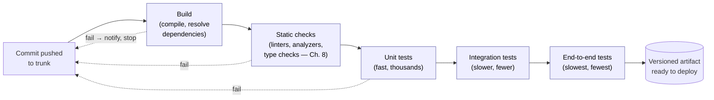

# Chapter 12 — Delivery: CI/CD, DevOps, and Evolution

> **Where we are.** Chapter 11 asked how AI changes the practice of software engineering;
> this final chapter asks a question the first ten
> chapters quietly deferred. Chapters 1–10 taught you how to *build* software — process,
> requirements, design, patterns — and how to *verify* it with reviews, tests, and metrics.
> But a verified commit sitting in a repository helps no one. This chapter covers the
> stretch of engineering between "the code is written" and "users are running it," and then
> the longer stretch after that: what happens to code once it has been in production for
> years. **Delivery** is where every earlier discipline either becomes real or stays
> theoretical.

Delivery used to be an afterthought — a thing operations people did after engineering was
"done." Two shifts ended that. First, software moved to the cloud, where releasing stopped
being a rare, ceremonial event and became something a team might do dozens of times a day.
Second, a body of research (§12.5) showed that *how* a team delivers predicts its
performance better than almost anything else it does. The umbrella term for the resulting
culture is **DevOps**: the idea that developing software and operating it are one
discipline, practiced by one team, with shared tools and shared accountability. This
chapter walks the pipeline from commit to production, studies two of the most instructive
deployment disasters on the public record, and closes with the fate that awaits all
successful code — becoming legacy.

> **Principle.** Undeployed code is inventory, not value. Every practice in this chapter
> exists to shrink the time and the risk between *writing* a change and *learning* what it
> does in the hands of real users — the same short-feedback bet Chapter 2 made about
> process, now applied to the machinery of release itself.

## 12.1 SaaS and the Cloud

### 12.1.1 From Shipped Artifact to Running Service

For most of software history, delivering software meant producing an **artifact** — a
binary on tape, a shrink-wrapped CD, an installer download — that customers took away and
ran on *their* machines. The vendor's job ended at the factory gate. Under that model,
releases are naturally rare and heavy: every artifact that leaves the building is
effectively unpatchable for months, so it must be as close to perfect as testing can make
it, and mistakes are answered with recalls, patch disks, and support calls.

**Software as a service (SaaS)** inverts the arrangement: the software runs on machines
the *vendor* controls, and users reach it over the network, usually through a browser or a
thin client. Nothing ships. That single change rearranges almost everything downstream.
There is exactly one version in production, not a museum of old installs to support. The
vendor sees real usage directly — logs, errors, performance — instead of hearing about it
through support tickets. And because the vendor owns the machines, an update is no longer
a request to thousands of customers; it is an internal operation that can happen at any
time, invisibly, many times a day.

The pull toward SaaS is not only the vendor's. Users get real benefits from the same
arrangement: their data lives on the service, so a stolen laptop or a dead phone loses a
device, not the work; several people can collaborate on the *same* data at once instead of
emailing copies back and forth; and datasets that are large or constantly changing can
live in one central, managed place rather than being squeezed onto whatever machine each
user happens to own. For a whole class of applications — shared documents, shared
calendars, anything with one truth that many people touch — the service model is not just
cheaper to operate; it is a better product.

On the user's side of the wire, the near-universal thin client is the **browser**: a
program every device already has, speaking a front-end stack of **HTML** for the
document's structure, **CSS** for its presentation, and **JavaScript** for behavior that
runs on the client — while the server side can be written in whatever language the team
prefers, because the browser never sees it. Native mobile apps are the sibling front end,
trading the browser's universality for tighter platform integration; either way, the
architecture is the same service behind a thin client.

### 12.1.2 Multi-Tenancy and Horizontal Scaling

Running the software yourself raises a design question: does each customer get their own
copy? In a **multi-tenant** design, one running instance of the system serves many
customers — *tenants* — whose data is kept logically separate inside shared
infrastructure. Multi-tenancy is what makes SaaS economical: one fleet, one deployment,
one upgrade for everyone, with the cost of operations amortized across all tenants. The
price is that isolation becomes a software problem. A bug that leaks one tenant's data to
another, or one tenant's heavy load that starves the rest (the "noisy neighbor"), are
failure modes a shipped artifact simply could not have.

Serving many tenants also means serving unpredictable load, and the cloud's answer is
**horizontal scaling**: instead of buying a bigger machine (*vertical* scaling), you run
more copies of the same service behind a load balancer and add or remove copies as demand
moves. Horizontal scaling only works if any copy can serve any request — which is exactly
why the statelessness convention of RESTful design matters
([§7.5.4](../07-architectural-patterns/#754-restful-apis)). A service that keeps
per-client session state on one server has silently welded each user to that server;
a stateless one lets the platform treat servers as interchangeable, replaceable cattle.
Architecture decisions from Chapter 7 are, it turns out, *delivery* decisions too.

### 12.1.3 What the Cloud Does to the Iron Triangle

Recall the iron triangle of Chapter 1
([§1.5](../01-introduction/#15-balancing-constraints-the-iron-triangle)): scope, schedule,
and cost constrain each other, and the classic pressure point was the *release date* — a
single, high-stakes deadline toward which scope was cut and quality was crunched. SaaS
dissolves that pressure point. When deploying is cheap and continuous, **release stops
being an event and becomes a decision** — a small, revocable, per-feature decision made
many times a week. You no longer ask "what can we finish by the ship date?" but "is this
one change ready to meet users now?" Schedule pressure does not vanish; it decomposes into
many tiny pressures, each too small to justify heroics.

That is the economic root of the **deploy-early culture**. Teams that deploy each small
change as it is finished get feedback while the change is still fresh in their heads, keep
the gap between "works on my machine" and "works in production" permanently small, and
never build up a terrifying pile of unreleased work whose first contact with reality is a
big bang — the same pathology, at the release level, that
[§2.4.1](../02-software-development-processes/#241-the-perils-of-big-bang-integration-and-testing)
diagnosed at the integration level. The rest of this chapter is the machinery that makes
deploying early *safe* rather than merely brave.

### 12.1.4 The Cloud Landscape: Providers, Components, and Responsibility

The vendor-controlled machines of §12.1.1 have to live somewhere, and today they mostly
live in a **public cloud**: vast provider-owned datacenters whose capacity is rented out
over the network, by the hour or by the request. The market is led by Amazon Web Services
(AWS), Google Cloud, and Microsoft Azure, with a long tail of smaller providers —
DigitalOcean, Linode, Hetzner — that trade breadth of catalog for simplicity and price.[^1]
Hold the names loosely: provider names and product lists date quickly, but the concepts
beneath them do not. Every cloud, whatever its branding, sells the same four component
families. **Compute** is processing capacity — virtual machines, containers, or functions
that run your code. **Storage** is durable data — disks, object stores, managed databases.
**Network** is the connective tissue — private networks, load balancers, DNS — that lets
those pieces reach each other and the world. And **security and identity** is the control
plane over the other three: who, and which programs, may do what to which resources.

The cloud's economic promise is threefold. You pay only for what you use, turning a large
up-front hardware purchase into a metered utility bill. You can place your system in
regions around the world, near your users, without signing a lease on another continent.
And the hardware is someone else's problem — provisioning, failed disks, power, cooling,
and physical security are all handled below the waterline of the service you rent.

What the provider explicitly does *not* handle is captured by the **shared responsibility
model**: the provider secures the cloud — the facilities, the hardware, the hypervisor —
while you secure what is *in* it — your operating-system configuration, your code, your
data, and who can access all three.[^2] This is a legal line as much as a practical one, and
teams forget it at their peril: a world-readable storage bucket full of customer records
is *your* breach, however secure the datacenter around it was.

None of this makes the cloud automatic. The alternatives — **on-premises** servers you
own, or rented space and machines in a shared datacenter (**co-location**) — never went
away, and the honest question is when each wins. Cloud makes clear sense when you do not
yet know what hardware you need, when demand is spiky or unpredictable (provision for the
spike and pay for it forever, or scale for the hour it lasts), when speed to a first MVP
matters more than unit cost, and when a small team has no one to spare for operations.

> **Case study.** *Cloud repatriation.* The trade cuts the other way, too. In 2022–23,
> 37signals — the company behind Basecamp — publicly moved its products off the cloud and
> onto purchased hardware, documenting seven-figure annual savings for workloads that were
> steady and predictable rather than spiky.[^3]<!-- -->[^4] And Amazon's own Prime Video team published an
> account of cutting the cost of one audio/video monitoring service by roughly 90 percent —
> by moving it *away* from a serverless, distributed-microservices design and back into a
> monolith-style process.[^5] The lesson is not "the cloud is over"; it is that the cloud is a
> *cost-and-flexibility trade*, not an axiom. Elastic, uncertain load is where renting
> wins; steady, predictable load is where owning wins. Run the numbers, not the fashion.

### 12.1.5 Containers, Clusters, and Kubernetes

The unit of cloud deployment that has won in practice is the **container**: a package
containing an application plus everything it needs to run — language runtime, libraries,
configuration — isolated from other software on the same machine while *sharing the host
operating system's kernel*. Sharing the kernel is what distinguishes a container from a
**virtual machine**, which carries an entire guest operating system of its own: a
container starts in seconds rather than minutes, and a single host can run dozens of them.[^6]
The container **image** is the immutable, versioned artifact that a CI pipeline (§12.2.2)
builds exactly once and then deploys everywhere — the same byte-for-byte thing on a
laptop, in the test environment, and in production, which retires "works on my machine"
as a category of excuse.

One host is rarely enough, so containers are run on a **cluster**: a set of
network-connected machines managed as a single pool of compute, storage, and memory. And
the de-facto standard software for managing that pool is **Kubernetes**, often described
as the *operating system for the cloud*: just as an OS schedules processes onto CPU cores,
Kubernetes schedules containers onto the machines of a cluster.[^7] Around that core job it
handles **ingress** (routing incoming traffic to the right containers), scaling the number
of running copies up and down with demand, restarting containers that crash or fail health
checks, and attaching storage to containers that need it — the operational chores of
§12.1.2's horizontal scaling, automated.

Honesty requires a caveat: Kubernetes earns its considerable complexity at fleet scale.
For a small team — certainly for a class project — a single container on one host, or a
platform-as-a-service that runs your container for you, delivers most of the benefit at a
small fraction of the operational cost. Learn what Kubernetes is for; reach for it when
you have the problem it solves.

### 12.1.6 Distributed Trade-Offs: The CAP Theorem

Horizontal scaling (§12.1.2) eventually reaches the data layer, and the moment state is
*replicated* — living on more than one machine — a hard theoretical limit applies. Eric
Brewer's **CAP theorem** concerns three properties of a distributed data system:
**consistency** (every read sees the most recent write), **availability** (every request
receives a response), and **partition tolerance** (the system keeps operating when the
network splits and some machines cannot reach others).[^8] The theorem says you cannot
guarantee all three at once: when a partition happens, a system can preserve at most two.[^9]

Since partitions are a fact of real networks — switches fail, cables get cut, datacenters
lose connectivity — partition tolerance is not really optional, and the practical content
of the theorem is a forced choice *during* a partition: consistency or availability. A
replica that cannot reach the others can either refuse to answer (staying consistent but
unavailable) or answer from possibly stale data (staying available but inconsistent).
Which to sacrifice is a *requirements* question, not a technical one. A bank chooses
consistency: better to refuse service for a minute than to show two customers different
balances for the same account. A social feed chooses availability: a like count that is a
few seconds stale harms no one, but an unreachable feed is a product failure.

| System | Under partition, it keeps… | What users see |
|---|---|---|
| Bank ledger | Consistency | Brief "service unavailable" — never a wrong balance |
| Social feed | Availability | The feed always loads; counts may lag and converge later |

The theorem is why architecture and delivery keep meeting in this chapter: the shared-data
pattern ([§7.2.1](../07-architectural-patterns/#721-the-shared-data-pattern)) put one
authoritative store at the center of a system, and scaling that store horizontally
(§12.1.2) replicates it — at which point CAP stops being theory and becomes a decision
your team must make on purpose, per feature, with the requirements in hand.

## 12.2 Continuous Integration Pipelines

Chapter 2 introduced **continuous integration (CI)** as an XP engineering practice:
everyone merges into a shared mainline many times a day, and an automated build-and-test
run verifies each merge
([§2.3.4](../02-software-development-processes/#234-a-scrumxp-hybrid)). That definition
told you *what* CI is and *why* it exists — to surface integration mismatches one small
change at a time instead of all at once. This section goes deeper: what the automation
actually consists of, what branching discipline it demands, and what social contract makes
it work.

### 12.2.1 Trunk-Based Development

CI is first a *branching* policy, and only second a server. In **trunk-based
development**, the whole team commits to a single shared mainline (the *trunk*), directly
or through short-lived branches that live hours to a couple of days before merging. The
alternative — **long-lived feature branches**, where each developer or feature camps on
its own branch for weeks — feels safer because nobody's half-done work disturbs anyone
else. But the safety is an illusion with interest due at merge time: the longer two
branches evolve apart, the more their eventual merge resembles the big-bang integration of
[§2.4.1](../02-software-development-processes/#241-the-perils-of-big-bang-integration-and-testing),
with conflicting assumptions surfacing all at once, weeks after they were made.

The deeper point is that *integration risk grows with divergence*, and divergence grows
with time. Trunk-based development keeps divergence permanently small by construction.
Merging several times a day means each merge carries at most a few hours of divergence —
small enough that conflicts are rare, and trivial when they occur. The obvious objection —
"how do I commit work that isn't finished?" — has a standard answer you will meet in
§12.3.2: hide unfinished work behind a **feature flag** so it can be *integrated* without
being *released*. Integration and release become independent decisions, which is one of
the most useful separations in this whole chapter.

### 12.2.2 The Stages of a Pipeline

A **CI pipeline** is the automated gauntlet every commit runs before it is declared good.
The pipeline is where earlier chapters' verification techniques stop being activities a
diligent person might perform and become *gates no change can skip*. A typical pipeline
runs stages in increasing order of cost, failing fast on the cheap ones:

Each stage earns its position. The **build** proves the change even compiles and its
dependencies resolve — the cheapest possible check, so it runs first. **Static checks**
run the automated analysis of Chapter 8
([§8.4](../08-static-checking/#84-automated-static-analysis)) — linters, type checkers,
style and bug-pattern analyzers — catching whole classes of defects without executing a
line. Then the **tests by level** from Chapter 9 run in pyramid order: unit tests first
because they are fast and localize failures precisely, then integration, then a thin layer
of end-to-end tests. If everything passes, the pipeline produces a **versioned artifact**
— a container image, a package, a binary — that is stored and never rebuilt. This last
rule matters more than it looks: the artifact you tested is *byte-for-byte* the artifact
you will deploy. Rebuilding "the same code" later invites the possibility that a changed
compiler, dependency, or build machine produces something subtly different from what
passed the tests. Mature pipelines add one more gate on the far side of deployment itself:
a **smoke-test stage** — a fast is-it-alive check (does the service start, answer a
trivial request, reach its database?) run against the newly deployed version, gating the
rollout before real traffic widens onto it (the testing levels these stages draw on are
[Chapter 9](../09-testing/#92-levels-of-testing)'s).

### 12.2.3 Broken-Build Discipline

A pipeline is only as good as the team's response when it turns red. The working culture
of CI rests on a small social contract. First, **a red mainline is everyone's emergency**:
when the trunk build breaks, fixing it (or reverting the breaking commit) takes priority
over new work, because every hour the build stays red, every other developer is either
blocked or building on sand. Second, **never commit onto a broken build** — you would be
stacking unverified change on unverified change, exactly the divergence CI exists to
prevent. Third, **do not leave a broken build overnight**; revert if you cannot fix
quickly. Reverting is not an insult. It is the cheap, always-available path back to a
known-good state, and teams that treat it as routine stay green far more than teams that
treat it as defeat.

The metaphor that captures all of this: *the build is the team's heartbeat*. When it is
green and beating steadily, every developer enjoys a continuous, machine-checked guarantee
that the shared codebase works, and can move fast on top of it. When it is red, the team
has no pulse — nobody actually knows whether the system works — and everything else should
stop until it does.

> **Pitfall.** *The flaky test.* A test that fails intermittently without a code change is
> more corrosive than a test that always fails, because it teaches the team to ignore red.
> Once "just re-run it, that one's flaky" enters the vocabulary, the build has stopped
> being a heartbeat and become a slot machine, and real failures start slipping through on
> the same shrug. Quarantine flaky tests immediately, fix or delete them promptly, and
> treat their existence as a defect in the suite.
> [§9.2.4](../09-testing/#924-case-study-test-early-and-often--the-testing-pyramid)
> catalogs the usual causes — races, shared state, order dependence, unstable externals —
> and their fixes.

### 12.2.4 Keeping Pipelines Fast

Pipeline speed is not a convenience; it is load-bearing. Developers are supposed to merge
several times a day and to *wait for green* before moving on. If the pipeline takes an
hour, they will not wait — they will batch up bigger changes to amortize the wait,
which re-creates precisely the large, risky merges CI exists to eliminate. A useful
target is roughly ten minutes from push to verdict for the merge-blocking stages.[^10]

Achieving that is the testing pyramid of
[§9.2.4](../09-testing/#924-case-study-test-early-and-often--the-testing-pyramid) applied
as an engineering budget: push checks *down* the pyramid, where they are fast, and keep
the slow end-to-end layer thin. Beyond that, run independent stages in parallel, cache
dependencies and build outputs so unchanged parts are not rebuilt, and split the pipeline
into a fast merge-blocking core plus deeper suites (full end-to-end runs, performance
tests, long fuzzing) that run continuously against the trunk without holding up merges. A
slow pipeline is not a tooling annoyance to live with; it is a process defect that quietly
changes how your team behaves.

## 12.3 Continuous Deployment

### 12.3.1 Delivery versus Deployment

Two similar terms name genuinely different commitments. **Continuous delivery** means
every change that passes the pipeline yields an artifact that is *proven deployable* —
the release decision is a business choice, but it is always available, at the push of a
button, with no additional engineering work. **Continuous deployment** goes one step
further: every change that passes the pipeline *is deployed to production automatically*,
with no human in the loop. Delivery makes release *possible* at any moment; deployment
makes it *actual* at every moment.

Continuous deployment sounds reckless until you notice what it forbids. If every green
commit goes to production, then there is no such thing as a "safe to merge but not ready
to ship" change without a flag, no manual pre-release checklist to lean on, and no
batching of changes into a big release whose failures cannot be attributed. Every safety
property must be automated, because automation is all there is. Teams that adopt it report
a paradoxical result that §12.5 will make precise: deploying *more often* makes each
deployment *less* risky, because each one is smaller, better attributed, and easier to
undo.

### 12.3.2 Deployment Strategies

However often you deploy, *how* you swap new code into a live system determines the blast
radius when something is wrong. Three strategies dominate practice.

**Blue-green deployment** runs two identical production environments. At any moment one
(say, *blue*) serves all traffic while the other (*green*) sits idle. To release, you
deploy the new version to the idle environment, verify it there against production
conditions, then switch the router so all traffic flows to it. The old environment stays
warm, so if the new version misbehaves, recovery is one router change back. You pay for
this in doubled infrastructure and in the care demanded by anything stateful: a database
schema shared by both environments must remain compatible with both versions during the
switch.

**Canary deployment** releases the new version to a small slice of traffic first — one
server, one percent of users, one region — and watches error rates, latency, and business
metrics before widening. The name comes from the caged canary that warned miners of gas:
the small exposed population absorbs the harm and sounds the alarm while the damage is
still bounded. Large operators generalize canaries into **staged rings**: the change rolls
to ring after ring — internal users, then a small public slice, then broader populations —
with automated health checks gating each promotion and halting the rollout on regression.
The essential idea is *progressive exposure*: no change reaches everyone until it has
demonstrably survived contact with someone.

**Feature flags** decouple deployment from release in code rather than in infrastructure.
A **feature flag** (or *feature toggle*) is a runtime conditional that turns a code path
on or off without redeploying. Flags are what make trunk-based development livable —
unfinished work merges dark, disabled — and they enable per-user, per-tenant, or
percentage rollouts of a single feature, plus instant disablement when a feature
misbehaves: a **kill switch**. But flags are conditional logic multiplying in your
codebase, and they demand hygiene. Every flag should have an owner, an intended lifespan,
and a removal date; a retired flag's code — both the dead branch and the conditional —
should be deleted promptly. A stale flag is dormant behavior sitting in production waiting
for someone to trip it, a danger the first case study below turns from hypothetical to
historical.

### 12.3.3 Rollback versus Roll-Forward

When a deployment goes wrong, you have two exits. **Rollback** returns production to the
previous version; **roll-forward** ships a new fix on top of the broken state. Rollback is
usually faster and requires no new (unverified) code, so mature teams treat it as the
default reflex. But a rollback path is a *mechanism*, and Chapter 9's lesson applies to
mechanisms too: an untested rollback is a rumor, not a capability. Version skew can make
the old code unable to read data the new code wrote; a config change may have accompanied
the code; the "previous artifact" may no longer exist. Teams that take this seriously
rehearse rollback routinely — some by making it the *normal* end of every canary that
fails a health check, so the path is exercised weekly rather than discovered during a
crisis. And some changes cannot be rolled back at all (an irreversible data migration, a
security fix you must not un-ship), which is why roll-forward speed — how fast your
pipeline can carry a one-line fix to production — is itself a safety property.

### 12.3.4 When Deployment Goes Wrong: Two Case Studies

The two case studies below are, respectively, the strongest argument on record *for*
deployment automation and the strongest argument that automation *alone* is not safety.
They are worth studying closely, and honestly, from the primary sources.

> **Case study.** *Knight Capital, August 1, 2012.* Knight Capital was one of the largest
> equity market makers in the United States. When the New York Stock Exchange launched its
> Retail Liquidity Program, Knight updated SMARS — its automated order router — to
> participate. What follows is drawn from the findings in the SEC's later enforcement
> order (Release No. 34-70694, October 2013).[^11]
>
> The new code reused a **feature flag** that had previously activated "Power Peg,"
> defunct order-routing functionality unused since 2003, whose dead code had been left in
> SMARS. Worse, the safety counter that once told Power Peg to stop when orders were
> filled had been inadvertently disabled in 2005, when the counter was moved elsewhere in
> the code and Power Peg was never retested. In the week before launch, a technician manually
> copied the new code onto SMARS's eight production servers — and missed one. No second
> person reviewed the deployment; there was no automated, repeatable deployment process
> to make the eight servers provably identical.
>
> On the morning of August 1, orders routed to the un-updated eighth server hit the
> repurposed flag and woke the old Power Peg code, which began generating child orders
> continuously, never tracking fills, never stopping. Ninety-seven automated email messages
> referencing the Power Peg error had gone out *before the market opened*; no one acted on
> them — they were not designed as alerts, and they went to a group of personnel rather
> than to an owner with a duty to respond. In the
> roughly forty-five minutes that followed, Knight executed about four million trades
> across 154 stocks — on the order of 397 million shares — and, during diagnosis,
> engineers made the situation worse: suspecting the new code, they *rolled it back* on
> the seven correct servers, which put the repurposed flag's old behavior in force on all
> eight. There was no procedure for halting the system's aberrant activity and no
> documented incident-response plan. The loss exceeded $460 million. Knight survived only
> through an emergency investment and was merged away within a year;[^12] the SEC fined it
> $12 million for violating market-access risk-control and related rules.
>
> A note on honesty: the SEC order is an enforcement action about risk controls, and the
> deployment details above are findings within it — the record shows a chain of process
> failures, not the folklore version in which "one line of config" destroyed a company.
> The lessons are about the chain. Deployment must be automated, repeatable, and
> *verified* — an all-servers-identical check would have caught the eighth server in
> seconds. Never repurpose an old flag; delete dead code rather than leaving it armed.
> Alerts without owners are noise. Rollback is only a safety mechanism if it has been
> tested as one — here it was the step that completed the disaster. And a kill switch is
> not an operational nicety; it is a requirement.

> **Case study.** *CrowdStrike, July 19, 2024.* CrowdStrike's Falcon sensor is endpoint
> security software that runs inside the Windows kernel — the most privileged, least
> forgiving place code can live. To respond to new threats quickly, CrowdStrike ships
> "Rapid Response Content": threat-detection configuration delivered to all customers
> through a fully automated global push. The account below follows CrowdStrike's own
> external root-cause analysis, published in August 2024.[^13]
>
> In February 2024, sensor version 7.11 added a new content type defined with twenty-one
> input fields. The code that supplied those inputs provided twenty.
> The mismatch stayed latent for months because both the tests and all earlier content of
> that type used a wildcard match for the twenty-first field, so the missing input was
> never read. On July 19, a new content instance — Channel File 291 — used a non-wildcard
> twenty-first field for the first time. Reading the field that was not there caused an
> out-of-bounds memory read inside the kernel, crashing Windows. Because the sensor loads
> at boot, the machine crashed again on restart: a boot loop. The automated Content
> Validator that should have rejected the bad content had a bug of its own and passed it.
>
> The push was global and simultaneous. Within hours, roughly 8.5 million Windows
> machines (Microsoft's estimate) were down: airlines (Delta alone cancelled on the order
> of 7,000 flights), hospitals, banks, broadcasters, emergency services.[^14]<!-- -->[^15] Damage
> estimates ran into the billions — direct losses for the Fortune 500 alone were estimated
> at $5.4 billion, only a fraction of it insured.[^16] Recovery was brutal precisely
> because the machines could not boot: in many cases a human had to start each machine in
> safe mode and delete the file by hand.[^17]
> CrowdStrike's committed remediations read like this chapter's outline: staged canary
> rings for content, customer control over update cadence, a hardened validator, bounds
> checking in the interpreter, and more diverse testing.
>
> The lessons generalize far beyond security software. **Config and content are code**:
> anything that changes the behavior of a running system deserves the same testing,
> staging, and progressive rollout as a code change, no matter how routine its format. A
> fully automated pipeline without progressive exposure is not safety — it is a machine
> for shipping a defect to every user on Earth at once. Validators are code too, with
> false negatives of their own ([§8.4.2](../08-static-checking/#842-false-positives-and-false-negatives));
> a gate you never test is a gate you cannot trust. Design for a bounded blast radius
> *before* you need one. And recovery paths must be designed for the worst case — a fix
> pushed over the network is useless to a machine that cannot boot to receive it.

Read as a pair, the two cases bracket this chapter's argument. Knight shows what manual
deployment costs: without automation, you cannot even guarantee that eight servers run
the same code. CrowdStrike shows what automation without staging costs: with a perfect
distribution machine and no progressive rollout, one latent defect reached the whole
world before anyone could react. Twelve years apart, the timelines rhyme — about
forty-five minutes for Knight's loss, about eighty minutes from CrowdStrike's push to its
reversion.[^18] Automation sets the *speed* of your outcomes; only progressive exposure and tested
recovery decide their *sign*.

## 12.4 Continuous Security Pipelines

Chapter 8 taught static analysis as a practice; the pipeline is where it becomes policy.
Modern teams extend the CI pipeline of §12.2 into a **continuous security pipeline** —
a set of automated gates that check not just whether the code works, but whether it is
safe to expose to an adversarial world. Three scanner families divide the work.

### 12.4.1 SAST, DAST, and SCA

**Static application security testing (SAST)** is the security-focused end of the static
analysis you met in [§8.4](../08-static-checking/#84-automated-static-analysis): tools
that examine source code without running it, hunting injection flaws, unsafe
deserialization, buffer misuse, and other vulnerable *patterns*. Everything Chapter 8 said
about false positives and false negatives applies with interest — a noisy SAST gate
that developers learn to rubber-stamp protects no one.

**Dynamic application security testing (DAST)** attacks the *running* application from
outside, the way an adversary would: probing endpoints with malformed inputs, injection
payloads, and authentication bypasses, knowing nothing about the source. SAST and DAST
are complementary the way white-box and black-box testing were in Chapter 9: SAST sees
code paths DAST may never reach; DAST sees emergent, deployed behavior — server
configuration, header mistakes, the composition of services — that no source scan can.[^31]

**Software composition analysis (SCA)** examines neither your code nor your running app
but your *dependency manifest*: the inventory of third-party packages your build pulls
in, checked against databases of known vulnerabilities. SCA exists because of an
uncomfortable arithmetic: in a typical modern application, code you wrote is a thin layer
atop orders of magnitude more code you imported. You ship your dependencies. Their
vulnerabilities are your vulnerabilities, and no review of *your* code will find them.

### 12.4.2 Dependencies and the Supply Chain

Because dependencies drift out of date on their own — vulnerabilities are discovered in
versions you already ship — SCA cannot be a one-time gate; it must run continuously. The
practical pattern is the **automated update bot** (GitHub's Dependabot is the archetype):
a service that watches vulnerability databases and your manifests, and when a dependency
needs bumping, *opens a pull request* that updates it.[^19] The elegance is in what happens
next: your CI pipeline runs on that PR like any other, so the same suite that protects
you from your own mistakes now proves the upgrade is safe to merge. The stronger your
pipeline, the cheaper staying current becomes — one more return on the investment of
§12.2.

The wider issue is **supply-chain risk**: your build is only as trustworthy as everything
it downloads. Attackers have learned to poison the well — **typosquatting** packages
whose names are one keystroke from a popular library, or compromising a legitimate
package's maintainer account and publishing a malicious release. The 2020 SolarWinds
attack planted malicious code inside a vendor's *build process*, so customers received a
compromised product signed with authentic signatures;[^20] the 2016 left-pad incident
showed the fragility side, when the removal of an eleven-line package briefly broke
builds across the industry.[^21]<!-- -->[^22] Defenses are accumulating — lockfiles that pin exact versions,
cryptographic signing and provenance attestation for artifacts (the SLSA framework),[^32]
and a **software bill of materials (SBOM)** enumerating everything inside a release[^33] — but the
first defense is the cultural one: treat adding a dependency as an engineering decision
with a threat model, not a free lunch.

### 12.4.3 Secrets and Gate Placement

One more scanner earns its place in every pipeline: **secrets scanning**, which searches
commits for credentials — API keys, tokens, passwords, private keys — before they enter
history. A secret pushed to a repository must be treated as compromised the moment it
lands, because git history is effectively permanent and harvesting bots scan public
commits continuously. Rotating a leaked credential is painful; a pre-commit or
pre-receive scan that blocks the leak is nearly free.

Placement follows one principle: **run each gate at the earliest point it can give a
correct answer**. Secrets scans and SAST need only source, so they run at commit time,
inside the fast merge-blocking core. SCA needs the resolved dependency set, so it runs at
build time — and again on a schedule, since the world's knowledge of your dependencies
changes while your code does not. DAST needs a running system, so it runs against a
staging deployment, after the artifact exists. The result is defense in depth through the
pipeline itself: by the time an artifact reaches production, it has been examined as
source, as a composition, and as a running target.

## 12.5 DORA Metrics

### 12.5.1 The Four Keys

How would you know whether any of this is working? Chapter 10 warned that most metrics
programs fail by measuring what is easy instead of what matters. The delivery world has an
unusually good answer, produced by the **DORA** research program (DevOps Research and
Assessment) — a multi-year academic effort, surveying tens of thousands of professionals,
published in the annual *State of DevOps* reports and the book *Accelerate* (Forsgren,
Humble, and Kim).[^23]<!-- -->[^24] Its core finding is a set of four outcome measures — the **four keys** —
that jointly predict software-delivery performance:

1. **Deployment frequency** — how often your team deploys to production.
2. **Lead time for changes** — how long a commit takes to reach production.
3. **Change failure rate** — what fraction of deployments cause a failure in production
   (an incident, a rollback, a hotfix).
4. **Failed-deployment recovery time** — when a deployment does cause a failure, how long
   restoring service takes.[^25]

Notice the shape: the first two measure **throughput** (how fast value moves), the second
two measure **stability** (how safely it moves). All four are *outcomes* of your whole
delivery system, not activities within it — which is exactly what makes them worth
watching.

### 12.5.2 Why Paired Metrics Resist Gaming

Chapter 10 introduced Goodhart's Law
([§10.1.2](../10-quality-metrics/#1012-selecting-useful-metrics)): when a measure becomes
a target, people optimize the measure rather than the goal, and the chapter's advice was
to pair each metric with a counter-metric that degrades when someone cheats. The four
keys are that advice, institutionalized. Try to game throughput — deploy half-baked
changes constantly — and change failure rate rises to expose you. Try to game stability —
deploy once a quarter after months of manual checking — and deployment frequency and lead
time collapse. Each pair is the other pair's counter-metric. A team can only improve all
four *together* by actually getting better at delivery: smaller changes, stronger
pipelines, faster recovery. There is no cheap move that improves the whole dashboard,
which is precisely the property §10.1.2 said to look for.

### 12.5.3 What the Research Found

Two findings from the DORA research deserve to reshape your intuitions. First, the spread
between the best and the rest is not incremental — it is multiplicative. Across survey
years, **elite** performers deploy on demand (many times per day) where **low** performers
deploy between once a month and once every six months; elite lead times are under a day
against months; elite recovery times are under an hour against a week or more — differences
of orders of magnitude on the throughput measures, with change failure rates
lower as well.[^23]

Second — and this is the finding that overturned decades of folklore — **speed and
stability correlate positively**.[^23] The traditional assumption was a trade-off: move fast
*or* be careful. The data say the teams that deploy most often are *also* the teams that
break production least and recover fastest. The mechanism should be familiar by now: high
frequency forces small changes; small changes are easier to review
(Chapter 8), test (Chapter 9), and attribute; attribution makes recovery fast; and fast,
safe recovery removes the fear that drives batching. Slow, careful, big-batch releases are
not the cautious choice — they are the risky one wearing caution's clothes.

### 12.5.4 Measuring Your Own Four Keys

A student team can measure all four keys with data it already has, and the exercise is
worth doing precisely because the numbers will be humbler than the elite benchmarks.
Define "production" honestly — your deployed demo environment, or your instructor-facing
release — then: **deployment frequency** is a count of deploy events per week, from your
pipeline's history. **Lead time** is deploy timestamp minus commit timestamp, medianed
over recent changes (`git log` and your CI dashboard give you both ends). **Change
failure rate** requires a log discipline: record each deploy and whether it needed a
revert or hotfix; failures divided by deploys. **Recovery time** is the gap from noticing
a bad deploy to restored service, from the same log. Review the four numbers at your
retrospective, and resist the urge to set targets — use them, in GQM fashion (Chapter
10), to ask *why* lead time is three days and *which* stage of your pipeline the time
hides in.

## 12.6 Legacy Code, Refactoring, and Technical Debt

Deployment is not the end of the story; it is the beginning of the longest phase of a
successful system's life. Most professional effort goes not into new systems but into
**evolving** ones that have been in production for years — and this section is about the
code you will inherit.

The industry has names for that work. **Corrective maintenance** fixes defects.
**Adaptive maintenance** responds to a changing environment — a new OS version, a
deprecated API, a new regulation — where the code did nothing wrong but the world moved.
**Perfective maintenance** adds the features and improvements users keep asking a living
system for. And **preventative maintenance** — refactoring, debt paydown — improves
structure now so that all the other kinds stay affordable later. The standard industry
rule of thumb is that maintenance, taken together, consumes roughly 60 percent of a
system's lifetime cost.[^26] Read that number again: the phase this book spent eleven chapters
preparing you for is the *minority* of the money, which is reason enough to treat evolving
code as the main event of an engineering career rather than the cleanup after it.

### 12.6.1 What Makes Code Legacy

Colloquially, "legacy" means old. The working definition that matters is different:
**legacy code is code without tests** — or, in its more visceral form, *code you are
afraid to change*. Age is incidental. A module written last month with no tests, no
documentation, and one departed author is legacy; a fifteen-year-old module with a
thorough suite is not, because the suite makes change safe. The defining property is that
*the system's actual behavior is not pinned down anywhere except in the code itself* —
so any change might break something, you cannot know what, and you cannot know cheaply.
Fear sets in, fear breeds avoidance, avoidance means changes are bolted on in the least
invasive (and least clean) way possible, and the code gets worse precisely because
everyone is being careful. Breaking that spiral is a skill, and it starts with an
inversion of the testing you learned in Chapter 9.

The tests-first definition comes from Michael Feathers, whose *Working Effectively with
Legacy Code* also names the only two ways there are to change legacy code.[^27] **Edit and
pray**: study the code, make the change, look around manually for anything you broke,
deploy, and hope. **Cover and modify**: first build tests that cover the code you must
touch, then make the change and let the tests detect any behavior you altered without
meaning to. This book has been teaching the second way all along; here it finally gets its
name. Cover-and-modify starts with a search, not an edit: locate your **change points** —
the specific places in the code where your change must actually land — because those are
the places the test coverage has to grip before you touch anything. The next two
subsections are cover-and-modify in practice.

### 12.6.2 Characterization Tests

Chapter 9's tests were built from a *specification*: the oracle
([§9.1.4](../09-testing/#914-test-oracles-evaluating-the-response-to-a-test)) told you
what the right answer *should* be. Legacy code has no trustworthy spec — the comments
lie, the documentation describes version 2, and the original requirements are three
pivots old. So you flip the direction of inference. A **characterization test** documents
what the code *actually does now*: you call the function with an input, observe the
output, and write that observation down as the expected value. The running system itself
becomes the oracle.

This feels like cheating — you are asserting the code does whatever it does, bugs
included. But the goal is not to verify correctness; it is to **pin down current
behavior** so that your upcoming changes cannot alter it *unknowingly*. Users, and other
code, may well depend on the current behavior, strange corners and all. The practical
loop: write a test with a deliberately wrong expected value, run it, read the actual
value from the failure message, and promote that actual value into the assertion. Probe
the edges — empty inputs, nulls, boundary values — until you have a net of pinned
behavior around everything your change might disturb. When a characterization test
exposes something that is plainly a bug, resist fixing it in the same breath: record it,
finish building the net, and change behavior as its own deliberate, separately reviewed
step. One commit should refactor *or* fix, never ambiguously both.

Characterizing assumes you can find your way around, and with an inherited codebase that
takes a deliberate workflow. Read what the previous team left behind first — the tests
above all (a passing test is documentation that cannot drift out of date), then any design
documents. On documentation, note the distinction: an architecture description
([§6.5](../06-design-and-architecture/#65-describing-system-architecture)) is the *formal*
design artifact, but tests, commit history, and mockups are living *informal*
documentation, and agile teams weight the informal kind heavily precisely because it stays
closer to the code. Next, generate a class or dependency diagram — most languages have
tools that extract one — to see the shape of the system before you dive into any single
file. Then get the application and its test suite running *locally*, against a cloned or
fixture copy of the database, before touching anything: a system you cannot run is a
system you cannot characterize. Only then write characterization tests at your intended
change points, and begin.

### 12.6.3 Refactoring Under Green Tests

With behavior pinned, you can refactor. Chapter 2 introduced **refactoring** inside the
red–green–refactor loop
([§2.3.2](../02-software-development-processes/#232-testing-make-it-central-to-development)):
improving the design of existing code without changing its behavior, protected by green
tests. In legacy work, the loop is the same but the entry point differs — you had to
*build* the green net first — and the discipline must be stricter, because the code fights
back. The craft is to move in steps so small that each one is obviously
behavior-preserving — rename, extract a function, inline a variable, move a method —
running the suite after every step. If the bar goes red, the *last* step is the culprit;
undo it and take a smaller one. Named, catalogued refactoring moves (Fowler's catalog is
the standard reference) matter because each has known mechanics and known traps; a
sequence of safe moves composes into a transformation you would never dare attempt as one
leap.[^28]

Where should you aim the moves? **Code smells** are surface symptoms that *suggest* — not
prove — a deeper design problem: a long method, a large class that does too many things, a
stretch of duplicated code, **magic numbers** (unexplained literals like `65` scattered
through the logic), deeply nested conditionals, a long parameter list. A smell is a prompt
to look closer, not a verdict; sometimes the long method really is the clearest way to
write that logic. For functions in particular, a compact health checklist is **SOFA**:
keep each function **S**hort, doing **O**ne thing, taking **F**ew arguments, and written
at a single level of **A**bstraction. Some smells can even be measured: cyclomatic
complexity counts the independent decision paths through a function — built on the
control-flow analysis of [Chapter 9](../09-testing/#931-control-flow-graphs) — turning
"this method feels tangled"
into a number a pipeline can watch.

The named moves map onto the smells. Beyond rename, extract, inline, and move: **replace
magic number with named constant** (`speed > SPEED_LIMIT` explains itself; `speed > 65`
does not); **introduce guard clauses** — early returns for the exceptional cases — to
flatten deeply nested conditionals; **remove duplication**, applying Chapter 6's DRY
principle, while staying alert for code that merely *looks* similar but serves different
purposes; **decompose large class**, splitting along clusters of fields and methods that
change together; **replace temp with query**, turning a scattered computed variable into
one well-named method; and **introduce parameter object**, bundling arguments that always
travel together into a single type that can then attract the behavior that uses it.

Legacy code adds a chicken-and-egg problem the catalog alone cannot solve: the worst code
cannot be tested without refactoring (dependencies are hard-wired, everything talks to the
database) and cannot be safely refactored without tests. The escape is a minimal set of
low-risk *enabling* changes — introduce a parameter, extract an interface for a hard-wired
dependency so a test double (Chapter 9) can stand in — done with extreme care, exactly to
the point where a test can grip, and no further.

### 12.6.4 Technical Debt

The economics underneath all of this has a name. **Technical debt** is the metaphor for
the future cost incurred when you take a shortcut today: like financial debt, it lets you
move faster *now* in exchange for **interest** — and the interest is that *every future
change to that code costs more* than it would have.[^29] The metaphor's precision is its
virtue. Debt is not simply "bad code"; it is a *deal*, and sometimes a good one.
**Deliberate debt** is a conscious trade — "we hard-code the tax rule to make the pilot;
we log a ticket to generalize it" — the engineering equivalent of a startup loan, rational
whenever learning fast matters more than building clean, *provided you track it and
service it*. **Inadvertent debt** is the interest you pay on shortcuts you never knew you
took — from inexperience, from requirements that shifted under a once-correct design, or
from Chapter 1's crunch pitfall, where scope silently absorbed through overtime gets paid
for later in weakened structure. Nobody chose it, so nobody tracks it, so it compounds.

Unmanaged, debt's interest payments consume a team's entire capacity: each feature takes
longer, which raises pressure, which invites new shortcuts, which raises interest again.
The management is not "never borrow" — it is to borrow knowingly, keep the debts visible
(a debt register in the backlog, reviewed like any other work), and pay down principal
where you actually pay interest: the high-churn code you touch weekly, not the ugly module
nobody has opened in years. Refactoring (§12.6.3) is the repayment mechanism, and the
pipeline (§12.2) is what makes repayment safe enough to do continuously.

### 12.6.5 Strangler Fig versus Big-Bang Rewrite

What about a system so far gone that the team wants to start over? Chapter 2's troubled
browser rewrite
([§2.6.3](../02-software-development-processes/#263-a-troubled-project)) showed how a
**big-bang rewrite** concentrates risk: you discard the accumulated knowledge embedded in
code that handles a thousand edge cases, you run two systems (one frozen, one imaginary)
for the duration, and the new system's first real validation comes at the end, all at
once. The delivery-era alternative is the **strangler fig** pattern, named for the fig
that grows around a host tree, roots itself, and gradually replaces the host it envelops.[^30]
You place an interception layer — a routing facade — in front of the legacy system, then
peel off one capability at a time: build the new implementation, route that slice of
traffic to it, verify it in production (a canary, §12.3.2, at the granularity of a
feature), and retire the old code path. At every moment, you have one *working* system —
part old, part new — and every increment of the rewrite is validated by real use within
weeks of being written. The rewrite becomes a sequence of small, reversible deployments
instead of one giant unreversible bet: the whole argument of this chapter, applied to the
biggest change a team ever makes.

Modern tooling has also shifted the *comprehension* half of legacy work. Understanding
what a gnarly function actually does — the prerequisite for characterizing it — has always
been the slowest, loneliest part of the job. AI assistants
([§11.2](../11-ai-across-the-lifecycle/#112-ai-across-the-lifecycle)) are genuinely strong
here: summarizing an unfamiliar module, proposing what a function's edge cases might be,
drafting candidate characterization tests for you to verify against the running code. The
verification discipline of Chapter 11 still governs — an AI's *account* of legacy behavior
is a hypothesis, and the running system remains the only oracle — but as a hypothesis
generator for code no living person understands, it removes a real bottleneck.

## 12.7 Conclusion

Delivery is the connective tissue of everything this book has taught. The CI pipeline of
§12.2 is Chapters 8 and 9 made *mandatory*: reviews, static analysis, and tests by level,
converted from practices a diligent team performs into gates no change can bypass. The
DORA four keys of §12.5 are Chapter 10 made *honest*: outcome metrics, paired against
their own counter-metrics, measuring the whole system rather than rewarding activity.
Continuous deployment of §12.3 is Chapter 2's short-cycle bet made *physical*: the same
argument that favored small iterations over big-bang phases favors small deployments over
big releases, with Knight Capital and CrowdStrike as the permanent record of what happens
at either failed extreme — no automation, and automation without staging. And the
evolution practices of §12.6 are where Chapter 6's "design for change" either pays its
dividend or collects its debt: systems built with seams, interfaces, and tests bend under
years of change; systems without them become the legacy code someone else must
characterize, strangle, and replace.

If the chapter compresses to one sentence, it is this: **make change small, make its path
to users automatic and progressively exposed, watch the outcomes, and keep the code
changeable** — because the one certainty about a successful system is that it will have
to change for longer than anyone who built it expects.

---

### Sources

[^1]: Synergy Research Group, *Cloud Market Share Trends — Big Three Together Hold 63%* (2025). [srgresearch.com](https://www.srgresearch.com/articles/cloud-market-share-trends-big-three-together-hold-63-while-oracle-and-the-neoclouds-inch-higher).
[^2]: Amazon Web Services, *Shared Responsibility Model*. [aws.amazon.com](https://aws.amazon.com/compliance/shared-responsibility-model/).
[^3]: David Heinemeier Hansson (37signals), *Why we're leaving the cloud* (2022). [world.hey.com/dhh](https://world.hey.com/dhh/why-we-re-leaving-the-cloud-654b47e0).
[^4]: David Heinemeier Hansson (37signals), *We have left the cloud* (2023). [world.hey.com/dhh](https://world.hey.com/dhh/we-have-left-the-cloud-251760fb).
[^5]: Marcin Kolny (Prime Video Tech), *Scaling up the Prime Video audio/video monitoring service and reducing costs by 90%* (2023). [web.archive.org](https://web.archive.org/web/20230504060528/https://www.primevideotech.com/video-streaming/scaling-up-the-prime-video-audio-video-monitoring-service-and-reducing-costs-by-90) (original post now offline).
[^6]: Amazon Web Services, *What's the Difference Between Containers and Virtual Machines?* [aws.amazon.com](https://aws.amazon.com/compare/the-difference-between-containers-and-virtual-machines/).
[^7]: Cloud Native Computing Foundation, *CNCF Annual Survey 2023* (2023). [cncf.io](https://www.cncf.io/reports/cncf-annual-survey-2023/).
[^8]: Eric Brewer, *Towards Robust Distributed Systems* (PODC keynote, 2000). [people.eecs.berkeley.edu](https://people.eecs.berkeley.edu/~brewer/cs262b-2004/PODC-keynote.pdf).
[^9]: Seth Gilbert and Nancy Lynch, *Brewer's Conjecture and the Feasibility of Consistent, Available, Partition-Tolerant Web Services* (ACM SIGACT News, 2002). [doi.org](https://doi.org/10.1145/564585.564601).
[^10]: Martin Fowler, *Continuous Integration* (2006; revised 2024). [martinfowler.com](https://martinfowler.com/articles/continuousIntegration.html).
[^11]: U.S. Securities and Exchange Commission, *In the Matter of Knight Capital Americas LLC*, Exchange Act Release No. 34-70694 (2013). [sec.gov](https://www.sec.gov/litigation/admin/2013/34-70694.pdf).
[^12]: CNNMoney, *Knight Capital in $400 million rescue agreement* (2012). [money.cnn.com](https://money.cnn.com/2012/08/06/investing/knight-capital-agreement/index.htm).
[^13]: CrowdStrike, *External Technical Root Cause Analysis — Channel File 291* (2024). [crowdstrike.com](https://www.crowdstrike.com/wp-content/uploads/2024/08/Channel-File-291-Incident-Root-Cause-Analysis-08.06.2024.pdf).
[^14]: David Weston (Microsoft), *Helping our customers through the CrowdStrike outage* (2024). [blogs.microsoft.com](https://blogs.microsoft.com/blog/2024/07/20/helping-our-customers-through-the-crowdstrike-outage/).
[^15]: Delta Air Lines, *Form 8-K* (October 2024). [sec.gov](https://www.sec.gov/Archives/edgar/data/27904/000168316824005369/delta_8k.htm).
[^16]: Parametrix, *CrowdStrike to cost Fortune 500 $5.4 billion; insured loss range of $540 million to $1.08 billion* (2024). [parametrixinsurance.com](https://www.parametrixinsurance.com/in-the-news/crowdstrike-to-cost-fortune-500-5-4-billion-insured-loss-range-of-540-million-to-1-08-billion).
[^17]: CrowdStrike, *Falcon Content Update Remediation and Guidance Hub* (2024). [crowdstrike.com](https://www.crowdstrike.com/falcon-content-update-remediation-and-guidance-hub/).
[^18]: CrowdStrike, *Preliminary Post Incident Review — Falcon Content Update for Windows Hosts* (2024). [crowdstrike.com](https://www.crowdstrike.com/en-us/blog/falcon-content-update-preliminary-post-incident-report/).
[^19]: GitHub, *Dependabot documentation*. [docs.github.com](https://docs.github.com/en/code-security/dependabot).
[^20]: CISA, *Alert AA20-352A: Advanced Persistent Threat Compromise of Government Agencies, Critical Infrastructure, and Private Sector Organizations* (2020). [cisa.gov](https://www.cisa.gov/news-events/cybersecurity-advisories/aa20-352a).
[^21]: npm, *kik, left-pad, and npm* (2016). [blog.npmjs.org](https://blog.npmjs.org/post/141577284765/kik-left-pad-and-npm).
[^22]: The Register, *How one developer just broke Node, Babel and thousands of projects in 11 lines of JavaScript* (2016). [theregister.com](https://www.theregister.com/2016/03/23/npm_left_pad_chaos/).
[^23]: DORA, *Accelerate State of DevOps Report 2019* (2019). [dora.dev](https://dora.dev/research/2019/dora-report/).
[^24]: Nicole Forsgren, Jez Humble, and Gene Kim, *Accelerate: The Science of Lean Software and DevOps* (IT Revolution Press, 2018). [itrevolution.com](https://itrevolution.com/product/accelerate/).
[^25]: DORA, *DORA's software delivery metrics: the four keys*. [dora.dev](https://dora.dev/guides/dora-metrics-four-keys/).
[^26]: Robert L. Glass, *Frequently Forgotten Fundamental Facts about Software Engineering* (IEEE Software, 2001). [doi.org](https://doi.org/10.1109/MS.2001.922739).
[^27]: Michael Feathers, *Working Effectively with Legacy Code* (Prentice Hall, 2004). [informit.com](https://www.informit.com/store/working-effectively-with-legacy-code-9780131177055).
[^28]: Martin Fowler, *Catalog of Refactorings*. [refactoring.com](https://refactoring.com/catalog/).
[^29]: Ward Cunningham, *The WyCash Portfolio Management System* (OOPSLA experience report, 1992). [c2.com](http://c2.com/doc/oopsla92.html).
[^30]: Martin Fowler, *StranglerFigApplication* (2004). [martinfowler.com](https://martinfowler.com/bliki/StranglerFigApplication.html).
[^31]: OWASP Foundation, community references for the scanner families:
[Source Code Analysis Tools (SAST)](https://owasp.org/www-community/Source_Code_Analysis_Tools),
[Vulnerability Scanning Tools (DAST)](https://owasp.org/www-community/Vulnerability_Scanning_Tools),
and [Component Analysis (SCA)](https://owasp.org/www-community/Component_Analysis).
[^32]: OpenSSF, *SLSA — Supply-chain Levels for Software Artifacts*. [slsa.dev](https://slsa.dev/).
[^33]: CISA, *Software Bill of Materials (SBOM)*. [cisa.gov/sbom](https://www.cisa.gov/sbom).

---

- **Key takeaways** are summarized above in §12.7.
- Continue to the [Exercises](exercises.md).
- Go deeper with the [Open Resources](resources.md) for this chapter.
