# Appendix A — The Team Project

> **Where we are.** The chapters of this book each teach a discipline in isolation:
> process, requirements, design, testing, metrics. This appendix is where those
> disciplines stop being separate lessons and become one experience. Over a semester you
> and three or four teammates will build a real, working software system for a real user,
> and you will do it by *practicing* — not just reading about — every idea in the book.
> The project is the spine that the concepts hang from, and it is deliberately structured
> around four deliverables: a **proposal**, two **status reports** (a skeletal system,
> then a viable one), and a **comprehensive final report**.

A course project is not a bigger homework assignment. Homework has a known answer, a
solitary author, and a deadline measured in days. A project has an ambiguous goal, a
shifting scope, several authors who must agree, and a horizon measured in months. That is
precisely the point. Everything that makes software *engineering* hard — coordination,
changing requirements, complexity that outgrows any one head — only appears at team scale
and project length. You cannot learn it from a problem set. You can only learn it by
living through a small, safe version of the real thing, which is what this appendix is
for.

## A.1 Overview

### A.1.1 Goals for a Project

Before you choose *what* to build, be clear about *why* you are building it. The project
has three goals, and they sometimes pull in different directions.

The first goal is **to ship something real**. By the end of the term you should have a
system that a genuine user can run and benefit from — not a demo that works only on your
laptop with the right input typed carefully. "Real" is the standard because only a real
system exposes the problems this book is about. A toy that no one depends on never forces
you to handle bad input, never accumulates the kind of coupling that makes change
expensive, and never generates the defect data you will analyze in Chapter 11.

The second goal is **to practice the disciplines deliberately**. It is entirely possible
to ship a working system by heroics — one strong programmer, many late nights, no tests,
no design. Company A in Chapter 1 did exactly that, and it worked for three months. The
project asks more of you: to write down requirements before coding them, to sketch an
architecture before committing to it, to write tests that make change safe, and to
measure your own process. You are being graded not only on the artifact but on the
*engineering* that produced it.

The third goal is **to learn to work as a team** — which is a skill, not a personality
trait, and one that employers consistently rank among the attributes they most want to
see in new graduates.[^1] A team that communicates well and distributes work fairly will
out-build a team of stronger individuals who do not.

> **Tip.** Pick a project you can *finish*, not one you can *imagine*. A scheduling tool
> for a campus club that you complete, test, and measure teaches you more than an
> ambitious "social network for X" that stalls at 40 percent. Scope is a design decision;
> make it early and make it small.

Choose a problem with a real user you can talk to — a campus office, a club, a small
nonprofit, a lab, even a specific classmate with a recurring annoyance. A reachable user
is worth more than an exciting idea, because Chapters 3 through 5 all depend on being able
to *ask someone* what they need and to *show someone* what you built.

### A.1.2 The Team Experience

Most of the difficulty in a team project is not technical. It is human: who does what,
how you keep each other informed, and what happens when someone does not deliver. Address
these on purpose, in the first week, because the default — hoping it works out — reliably
does not.

**Roles.** A team of four or five does not need a rigid hierarchy, but it does need
*ownership* so that every important responsibility has exactly one name attached to it. A
lightweight set of roles that maps onto the process in Chapter 2:

- A **coordinator** (or Scrum-style facilitator) who runs standups, keeps the board
  honest, and unblocks people. It is a servant job that rotates well, not a boss.
- A **customer liaison** who owns the relationship with your real user, schedules the
  conversations, and speaks for the user when the team debates priorities (Chapters 3–4).
- An **architecture/integration owner** who keeps the pieces fitting together and guards
  the module boundaries you agreed on (Chapters 6–7).
- A **quality owner** who sets up CI, keeps the test suite green, and watches the metrics
  (Chapters 8–11).

Everyone writes code and everyone tests; roles say who *worries* about a concern, not who
is allowed to touch it. Rotate at least once mid-semester so no one graduates having only
ever done one thing.

**Communication.** Agree on three channels and their purpose: a *synchronous* one for
fast questions (chat), an *asynchronous* one of record for decisions (issues, a shared
doc, or pull-request discussion), and a *recurring* meeting — even fifteen minutes twice a
week — where each person answers the three standup questions: what I finished, what I am
doing next, what is blocking me. Write decisions down where the whole team can find them
later. An architecture chosen in a hallway and remembered by one person is a liability.

> **Pitfall.** The most common failure mode is silent divergence: two people build against
> different assumptions for a week because neither surfaced a question. Cheap, frequent
> communication is not overhead — it is how you keep a small mistake from compounding into
> a week of rework. Software is discrete (Chapter 1): a wrong assumption does not degrade
> gracefully, it just breaks.

**Psychological safety.** Cheap communication only happens where people feel safe doing
it. **Psychological safety** is the shared belief that you can raise a problem, admit a
mistake, or ask a "basic" question without being punished or embarrassed for it — and it
is the research-backed foundation of team performance, not a soft nicety.[^2] Google's
Project Aristotle, a multi-year study of 180 of its own teams, found psychological
safety the most important of the dynamics that set effective teams apart — ahead of who
was on them.[^3] Its absence has recognizable symptoms: standups where everyone is silently "fine,"
deadlines that arrive with surprises because nobody said they were behind, one teammate
redoing others' work instead of raising the issue. You build it with concrete
habits, not slogans. Whoever is leading admits their own mistakes *first*, which licenses
everyone else's honesty. Thank people for surfacing bad news early — early is exactly
when bad news is cheap, and the thanks is what makes it happen again. And critique the
work, never the person: "this function needs tests" opens a discussion; "you never test
anything" closes one. The trust these habits produce has a name — **vulnerability-based
trust**, built by admitting what you do not know — and it is precisely what this
appendix's peer-feedback rituals (the visible board, the weekly log, the team reviews)
are training you in.[^4]

**Conflict and uneven contribution.** Disagreement about *technical direction* is healthy
and should be resolved with evidence: a spike, a small experiment, a look at the metrics.
Make the call, write down *why*, and move on. Do not let a decision stay open because the
team is avoiding the discomfort of choosing.

Uneven *contribution* is the harder problem, and every team hits some version of it. Deal
with it early, factually, and kindly. When someone is behind, the first assumption should
be a fixable cause — they are blocked, over-committed in another course, or unclear on the
task — not a character flaw. Make work *visible* (a board where every task has an owner and
a status makes contribution impossible to fake or to overlook), so that "who is doing what"
is a matter of record rather than resentment. If a genuine imbalance persists after you
have raised it directly, escalate to your instructor *early* rather than absorbing it into
a bitter final week. Most course rubrics — including the final report in this appendix —
include an individual-contribution component so that fair effort is recognized
and free-riding is not.

> **Tip.** Keep a shared, running log of who did what, updated weekly, not reconstructed
> from memory at the end. It makes the individual-contributions section of your final
> report honest and painless, and it turns a potential argument into a lookup.

### A.1.3 Coupling the Classroom and Project Experiences

This course is designed as **two parallel tracks** — a concepts track (the chapters) and a
project track (this appendix) — that are *tightly coupled early and deliberately loosened
later*. Understanding that shape will help you plan your semester.

For the first four weeks the tracks move in lockstep, because that is when a mistake is
cheapest to correct and when you most need the theory to steer the project. In week 1 you
form teams alongside Chapter 1. In week 2 you choose a process and stand up your
repository and board alongside Chapter 2. In week 3 you write your **proposal** while
Chapter 3 teaches user requirements, so the requirements you write are the *real* ones for
*your* system, not exercises. In week 4 you build and estimate a backlog while Chapter 4
teaches analysis and prioritization. The lecture on Monday is the technique; the project on
Friday is the practice. Learning and doing reinforce each other while the stakes are low.

After the requirements are stable, the coupling loosens on purpose. The concepts track
keeps advancing on its own schedule — design and patterns (Chapters 6–7), static checking
and testing (Chapters 8–9), metrics (Chapter 11) — while your team iterates at whatever
cadence fits your process and your lives. You will pull each concept into the project as
you need it rather than exactly the week it is lectured, which is how real engineering
works: you learn a technique when a problem demands it. The **status reports** in weeks 7
and 11 are the checkpoints that keep the loosely-coupled tracks from drifting too far
apart, and the **final report** in week 14 is where everything reconverges.

The full week-by-week mapping lives in the
[course plans](../../curriculum/course-plan.md); the timeline below shows how the
four project deliverables sit on top of it. Courses that run the project on a sprint
cadence should read [Running the Project on Two-Week Sprints](two-week-sprints.md), which
overlays these same four milestones on a two-week rhythm.

```mermaid
gantt
    title Team project across ~15 weeks (deliverables in bold)
    dateFormat  X
    axisFormat  W%d
    section Concepts (tightly coupled)
    Ch.1 Intro / teams        :done, 0, 1
    Ch.2 Process              :done, 1, 1
    Ch.3 Requirements         :active, 2, 1
    Ch.4 Analysis / estimate  :3, 1
    section Concepts (loosely coupled)
    Ch.5 Use cases            :4, 1
    Ch.6-7 Design & patterns  :5, 2
    Ch.8-9 Checking & testing :8, 3
    Ch.11 Metrics             :11, 2
    section Project deliverables
    Proposal (A.2)            :milestone, crit, 3, 0
    Skeletal — Status 1 (A.3) :milestone, crit, 7, 0
    Viable — Status 2 (A.4)   :milestone, crit, 11, 0
    Final report + demo (A.5) :milestone, crit, 14, 0
```

## A.2 Project Proposal

The **proposal** (due around week 3) is where your team commits to a problem, a user, and
a plausible scope. Its job is not to lock you into a fixed specification — requirements
*will* change, and that is normal (Chapter 1) — but to prove that you have found a real
problem worth solving and have thought hard enough about it to begin.

A good proposal answers five questions concretely:

1. **What problem, for whom?** A two-or-three-sentence problem statement and the specific
   user or stakeholders it serves. Name a real person or office you can talk to. Vague
   users ("students") produce vague requirements; specific users ("the intramural sports
   coordinator in the rec center") produce testable ones (Chapter 3).
2. **What will it do?** A short list of the most important user stories or features, in
   the users' language, prioritized (MoSCoW or must/should/could is enough this early).
   This is your first backlog, and Chapter 4 will teach you to refine and estimate it.
3. **What will you build it with?** Your intended architecture in broad strokes and your
   technology choices, with a sentence of *why* for each significant one. You are not
   committing forever; you are showing you have a feasible path (Chapter 6).
4. **How will you work?** Your process (Scrum, XP, or a hybrid), your cadence, your tools
   (repo, board, CI), and your initial roles (Chapter 2, §A.1.2).
5. **What could go wrong?** The two or three biggest risks — a hard integration, an
   unavailable data source, an unfamiliar framework — and how you will probe them early. A
   risk you name in week 3 is a task; a risk you ignore is a week-13 emergency.

Keep it short — two to four pages. A proposal that is long is usually hiding uncertainty
behind volume. Use the [project proposal template](../../templates/project-proposal.md) as
your starting form; copy it into your repository and fill it in.

> **Pitfall.** Proposing a scope you cannot finish is the single most common — and most
> punishing — mistake. When in doubt, halve the feature list. A smaller system built well,
> tested, and measured earns more than a larger one left broken. You can always add scope
> in a later iteration; you cannot recover the weeks a doomed scope will cost you.

## A.3 Skeletal System: Status Report 1

By around week 7 your team delivers a **skeletal system** — a *walking skeleton* — and
reports on it. A walking skeleton is a tiny implementation that exercises the system
**end to end**: a real request enters through the real interface, flows through each
architectural layer, touches the real database or service, and produces a real response —
but does almost nothing useful yet.[^5] If your app is a web tool, the skeleton might let a
user log in, create one empty record, and see it listed. That is all. The value is not in
*what* it does but in the fact that *every connection is proven to work*.

The skeletal milestone exists because integration is where projects die. A team can build
five beautiful components in isolation and discover in week 12 that they cannot be wired
together — the assumptions do not match, the interfaces do not line up, the deployment
does not deploy. The walking skeleton forces that discovery into week 7, when it is cheap.
It also stands up the machinery you will rely on all term: the repository, the build, the
test harness, and continuous integration (Chapter 13) so that every commit is checked. From
this point on you are *always* looking at a running system and fleshing it out, never
assembling a pile of parts at the end and praying.

Your Status Report 1 should therefore demonstrate:

- A running, deployed (or trivially runnable) system a grader can exercise, however thin.
- The **architecture** made real: the modules and their interfaces from your Chapter 6–7
  design, now visible in code, with a current diagram (note where reality diverged from the
  proposal, and why).
- Working CI that builds the system and runs at least one genuine end-to-end test.
- An honest status: what is done, what changed since the proposal, what is blocked, and
  your plan for the viable system.

Use the [status report template](../../templates/status-report.md) and mark it as report 1.

> **Tip.** Build the skeleton along the *riskiest* path first, not the easiest. If a
> third-party integration or an unfamiliar deployment worries you, make *that* the thread
> the skeleton walks. The whole point is to buy down risk early, so aim the skeleton at
> the thing most likely to hurt you. Deployment itself is usually that thing — Chapter 13
> shows how to make it boring.

## A.4 Viable System: Status Report 2

By around week 11 you deliver a **viable system** — a *minimum viable product* — and report
on it again. "Viable" is the key word and a high bar: this is a system that a real user
could actually use to accomplish the core task, end to end, even if it is missing polish,
secondary features, and edge-case handling. Where the skeleton proved the *structure*
works, the viable system proves the *value* is there: it does the one or two most important
things a user came for, and does them correctly.

Getting from skeleton to viable is the main building phase, and it is where the whole book
comes together. You will flesh out the modules behind the interfaces the skeleton
established. You will apply architectural patterns (Chapter 7) where they earn their
keep — and resist them where they do not. Above all, you will now be **testing in earnest**
(Chapter 9): the features a user depends on need black-box tests derived from their
requirements and enough white-box coverage that you can change code without fear. A viable
system without tests is just a demo that will break the first time you touch
it.

Your Status Report 2 should demonstrate:

- The **must-have** user stories from your backlog, working end to end for a real user.
- A test suite with a stated **coverage** target and the current numbers (Chapter 9), run
  automatically in CI.
- An architecture description updated to match what you actually built.
- Early **metrics** (Chapter 11): velocity across your iterations, open/closed defect
  counts, build health — whatever your process produces. You will analyze these more
  rigorously for the final report; start collecting now.
- A candid gap analysis: what is left for the remaining weeks, reprioritized in light of
  what you learned.

Use the same [status report template](../../templates/status-report.md), marked as report 2.

> **Pitfall.** Do not confuse "viable" with "feature-complete." The temptation at week 11
> is to have many half-finished features. Resist it. One fully working, tested,
> user-usable path beats five stubs. Cut scope ruthlessly (the iron triangle from Chapter
> 1 is real: fix time and cost, flex scope) so that what you *do* ship is genuinely usable.

## A.5 Comprehensive Final Report

The **final report and demo** (around week 14, with presentations in week 15) is where you
deliver the finished system and step back to tell its whole story — as engineers, with
evidence. It is both the capstone artifact and the primary thing you are assessed on,
because it is where you demonstrate that you *engineered* the software rather than merely
producing it.

A comprehensive report ties the entire book together, with one section per major
discipline. It should cover:

- **The problem and users** — what you set out to solve and for whom, and how that
  understanding evolved since the proposal (Chapters 1, 3).
- **Requirements** — the user stories and use cases you ultimately built, prioritized, with
  an honest note on what changed and why (Chapters 3–5).
- **Architecture** — the system's structure with a current diagram, the key design
  decisions, and the trade-offs behind them, using the vocabulary of cohesion, coupling,
  and patterns (Chapters 6–7).
- **Process** — how you actually worked: your iterations, what your board and standups
  looked like, and where your process adapted (Chapter 2).
- **Testing and quality metrics** — your test strategy, coverage achieved, defect data, and
  what the numbers *mean*, analyzed with sound statistics rather than a single hand-picked
  figure (Chapters 9 and 11).
- **Results** — what works, what does not, and how you know; measured against the goals you
  set in the proposal.
- **Retrospective** — the honest lessons: what you would do differently, where estimates
  were wrong, what surprised you. Graders reward insight here, not spin.
- **Individual contributions** — a fair account of who did what, backed by your running log
  and your version-control history.

How it is assessed: rubrics vary, but a strong report is judged on the **quality of the
shipped system** (does it work, for a real user?), the **engineering evidence** (are the
requirements, architecture, tests, and metrics real and coherent, or decorative?), and the
**honesty and depth of reflection** (do you understand *why* things went as they did?). A
modest system reported on with rigor and insight routinely outscores an ambitious one
reported on with hand-waving. Use the
[final report template](../../templates/final-report.md) as your structure.

> **Tip.** Write the retrospective for the *next* team — yourselves in a future course, or
> the students who inherit your repo. The most valuable sentences in an engineering report
> are the ones that begin "if we did this again, we would…". They prove you learned
> something the deliverable alone cannot show.

## A.6 Conclusion

The team project is where this book stops being a set of ideas and becomes a way of
working. Each of the four deliverables — proposal, skeletal system, viable system, final
report — forces a specific engineering discipline at the moment it matters most: commit to
a real problem, prove the structure integrates, prove the value is usable, and account for
the whole with evidence. Do them honestly and you will finish the semester having *done*
software engineering — on a team, under changing requirements, at a scale that would have
defeated improvisation. That experience, more than any exam, is what makes an engineer.

---

### Sources

[^1]: National Association of Colleges and Employers, *Job Outlook 2025* (2025). [naceweb.org](https://www.naceweb.org/docs/default-source/default-document-library/2025/publication/research-report/2025-nace-job-outlook-jan-2025.pdf).

[^2]: Amy C. Edmondson, *Psychological Safety and Learning Behavior in Work Teams*, Administrative Science Quarterly 44(2) (1999). [doi.org](https://doi.org/10.2307/2666999).

[^3]: Google re:Work, *Guide: Understand Team Effectiveness* (2016). [rework.withgoogle.com](https://rework.withgoogle.com/intl/en/guides/understand-team-effectiveness).

[^4]: Patrick Lencioni, *The Five Dysfunctions of a Team* (2002). [tablegroup.com](https://www.tablegroup.com/vulnerability-based-trust/).

[^5]: Alistair Cockburn, *Crystal Clear: A Human-Powered Methodology for Small Teams* (2004). [alistair.cockburn.us, archived](https://web.archive.org/web/20081017110100/http://alistair.cockburn.us/Walking+skeleton).

---

- **Key takeaways** are summarized above in §A.6.
- Continue to the [Exercises](exercises.md).
- Go deeper with the [Open Resources](resources.md) for this appendix.
- Running on sprints? See [Running the Project on Two-Week Sprints](two-week-sprints.md).
- Templates: [idea pitch](../../templates/idea-pitch.md) ·
  [proposal](../../templates/project-proposal.md) ·
  [sprint report](../../templates/sprint-report.md) ·
  [status report](../../templates/status-report.md) ·
  [team review](../../templates/team-review.md) ·
  [final report](../../templates/final-report.md) ·
  [individual write-up](../../templates/individual-writeup.md).
