# Running the Project on Two-Week Sprints

> **Where we are.** [Appendix A](./) structures the team project around four
> deliverables: a proposal (§A.2), a skeletal system (§A.3), a viable system (§A.4), and a
> comprehensive final report (§A.5). This page is an adaptation guide for courses that run
> the project on a **two-week sprint cadence** with a **cross-team customer model** — say,
> a 16-week semester with four build sprints. Nothing about the four milestones changes;
> they simply become **checkpoints you reach via sprints** rather than dates you aim at
> directly. If your course uses this variant, read Appendix A first, then use this page as
> your operating schedule.

## Dual hats: every team is both customer and developer

The single hardest thing to make real in a classroom project is the **gap between the
customer and the developers**. When a team builds its own idea, requirements work becomes
theater: everyone already "knows" what the product should do, elicitation is a
conversation with yourself, and acceptance means grading your own homework. Courses solve
this in different ways — some recruit external or industrial customers,[^1] some rotate a
customer role among students each sprint.[^2] This variant uses a **swap**:

- Every team **authors a project pitch** — and *another team builds it*.
- Every team **is assigned a different team's pitch** — and builds *that*, all semester.
- **You never build your own idea.**

So each team wears two hats for the whole term:

- **The developer hat.** For the project you were assigned, you are the engineering team:
  you elicit requirements from your customer, maintain the backlog, build, test, deploy,
  and demo — everything in the sprint tables below.
- **The customer hat.** For the idea you pitched, you are the customer: you answer the
  developers' questions, help select and prioritize stories at sprint planning
  ([§2.2.2](../02-software-development-processes/#222-scrum-accountabilities) — you are,
  functionally, their product owner's voice of the customer), attend their Demo Days, and
  give honest feedback on whether what shipped is what you meant.

> **Principle.** The swap makes Chapter 3 real. The developers genuinely *do not know*
> what the customer wants — the idea lives in another team's heads. Tacit knowledge, the
> unstated obvious, solutions masquerading as needs ([§3.1.2](../03-user-requirements/#312-requirements-challenges))
> stop being textbook warnings and start being Tuesday. And because the customer did not
> build the thing, their acceptance at Demo Day is honest in a way self-assessment never is.

Practical mechanics that make the swap work:

- **A standing channel per developer–customer pair** (a shared chat channel works well).
  Developers post what shipped and the deployed URL each sprint; customers respond with
  feedback and priorities. Silence from the customer hat is a failure of that hat.
- **A customer meeting inside every sprint planning** ([the cadence below](#every-sprint-the-common-cycle)):
  the developers bring candidate stories; the customer says which matter most and why.
- **Customer feedback closes every demo.** It goes on the record (the
  [team review template](../../templates/team-review.md) has a section for it) and feeds
  the next sprint's backlog.

## The cadence

The semester has two phases.

**Sprint 0 — onboarding (about four weeks).** Before a team can sprint, it needs a
problem, a customer, a backlog, and a running skeleton. Sprint 0 is a sequence of four
roughly one-week deliverables — pitches, the swap and selection, stories and sketches, and
a first deployment — that ends with the walking skeleton of §A.3 live on a real URL.
Sprint 0 is deliberately *not* a build sprint: its job is to make the first build sprint
possible.

**Sprints 1–4 — building (eight weeks).** Four two-week build cycles. Each sprint ends
with two events:

- **Demo Day** — the sprint review of
  [§2.2.3](../02-software-development-processes/#223-scrum-events): the team demonstrates
  the deployed system to the class and to its customer, and the feedback goes straight
  into the next sprint's backlog.[^3]
- **A team and customer review** — the retrospective half of the cycle, recorded with the
  [team review template](../../templates/team-review.md), plus peer evaluations.

The build sprints also carry a deliberate **engineering-hardening arc**: each sprint adds
one layer of the delivery pipeline from [Chapter 13](../13-delivery/), so that by the end
of the term the team is operating a small but genuinely professional SaaS delivery
process. The milestones overlay the cadence as before: Sprint 0-3 *is* the
skeletal-system checkpoint (§A.3); the end of Sprint 2 should look like the viable system
(§A.4); Sprint 4 rolls into the final report, presentations, and individual write-ups
(§A.5).

```mermaid
gantt
    title A 16-week semester on two-week sprints
    dateFormat  X
    axisFormat  W%d
    section Onboarding
    Sprint 0-0 pitches        :done, 2, 1
    Sprint 0-1 swap and selection :done, 3, 1
    Sprint 0-2 stories and UI :4, 1
    Sprint 0-3 deploy         :5, 1
    section Building
    Sprint one (CI, tests, deploy)   :6, 2
    Sprint two (add CD)              :8, 2
    Sprint three (lint, dep scans)   :10, 2
    Sprint four (fix all, ship)      :12, 2
    section Milestones
    Skeletal (A.3)          :milestone, crit, 6, 0
    Viable / MVP (A.4)      :milestone, crit, 10, 0
    Final report and demo (A.5) :milestone, crit, 14, 0
```

The exact weeks flex with a given calendar (breaks, exams); what does not flex is the
*order* and the rule that every build sprint ends with a demo of deployed software.

## Sprint 0: from pitch to deployed skeleton

| Sprint | Deliverable | Read first | Done means |
|--------|-------------|------------|------------|
| **0-0** | **Idea pitches — customer hat.** Every member pitches at least one project idea in Shape Up pitch form: problem, appetite, rough solution, rabbit holes, no-gos.[^4] You are writing the pitch **another team will build**; you will be its customer. | [§2.8](../02-software-development-processes/#28-shape-up-fixed-time-variable-scope) on pitches and appetite | Each [idea pitch](../../templates/idea-pitch.md) names a real, reachable user, fits on a page, and is clear enough for strangers to build from. |
| **0-1** | **The swap + selection.** Pitches are exchanged across teams (however your course assigns them). The developer team reads its assigned pitch, meets its customer, and records scope decisions — what the first version will and won't attempt, and why ([§4.4.3](../04-requirements-analysis/#443-balancing-value-cost-and-risk)) — then completes the proposal (§A.2) *with the customer's sign-off*. | [§3.1](../03-user-requirements/#31-what-is-a-requirement) — you are now on the far side of the requirements gap | [Project proposal](../../templates/project-proposal.md) + decision notes, acknowledged by the customer team. |
| **0-2** | **User stories + lo-fi UI — elicited, not invented.** The first backlog as INVEST-shaped stories with **Gherkin acceptance criteria** ([§3.4.1](../03-user-requirements/#341-guidelines-for-effective-user-stories)), plus storyboards of the main flows ([§3.5.3](../03-user-requirements/#353-storyboards-drawing-the-scenario)) — built from interviews with your customer team, and walked past them before it counts. | [§3.3](../03-user-requirements/#33-eliciting-user-needs) on elicitation; [§3.4–3.5](../03-user-requirements/#34-writing-requirements-stories-and-features) | Must-have stories are testable and customer-prioritized; a stranger can follow the sketched flow. |
| **0-3** | **Initial view, DEPLOYED.** The walking skeleton of §A.3: one thin path, end to end, live on a real URL — "get one piece done" ([§2.8](../02-software-development-processes/#28-shape-up-fixed-time-variable-scope)).[^5] | §A.3; [Chapter 13](../13-delivery/) on deployment | [Status report](../../templates/status-report.md) 1; a grader can open the URL and exercise one real path. |

## Sprints 1–4: build cycles with a hardening arc

Every build sprint runs the same [common cycle](#every-sprint-the-common-cycle); each one
also *adds* a permanent layer of engineering infrastructure. Once added, a layer stays: a
Sprint 3 team is still running everything it set up in Sprints 1 and 2.

| Sprint | New engineering focus | Where the book teaches it | Milestone |
|--------|----------------------|---------------------------|-----------|
| **1** | **Test-driven features, coverage, CI, production deploy.** Every feature lands with unit/integration tests (TDD, and BDD with executable Gherkin scenarios); the suite holds a coverage floor (~80%); a **CI pipeline** runs the tests and reports coverage on every commit and performs automated (e.g., AI-assisted) review on every pull request; the app is live in production. | TDD/BDD: [§2.3.2](../02-software-development-processes/#232-testing-make-it-central-to-development), [§3.4.1](../03-user-requirements/#341-guidelines-for-effective-user-stories), [§9.2.3](../09-testing/#923-functional-system-and-acceptance-testing) · coverage: [§9.3](../09-testing/#93-code-coverage-i-white-box-testing) with the [§9.1.3](../09-testing/#913-test-adequacy-deciding-when-to-stop) pitfall · CI: [§13.2](../13-delivery/#132-continuous-integration-pipelines) · review on PRs: [§8.3](../08-static-checking/#83-code-reviews-check-intent-and-trust), AI review [§12.2.6](../12-ai-across-the-lifecycle/#1226-static-checking-and-code-review-chapter-8) | Velocity established |
| **2** | **Continuous deployment.** Merging to main *is* the release: a **CD pipeline** automatically deploys every merged change to production. This is the sprint where the team feels why the pipeline's checks exist — read the two §13.3 case studies *before* wiring it up. | [§13.3](../13-delivery/#133-continuous-deployment) — delivery vs. deployment, and the Knight Capital / CrowdStrike case studies | ≈ Viable system (§A.4) |
| **3** | **Static analysis + supply-chain security.** The pipeline gains **linting** with reports and **dependency-vulnerability scanning** (Dependabot-style); the deployment gets production polish (e.g., a real domain). Findings are triaged, not ignored — they become backlog items. | linting & analyzers: [§8.4](../08-static-checking/#84-automated-static-analysis) · dependency/supply chain: [§13.4](../13-delivery/#134-continuous-security-pipelines) · triage & false positives: [§8.4.2](../08-static-checking/#842-false-positives-and-false-negatives) | Quality data flowing |
| **4** | **Pay the debt, ship the story.** Close out: **all** open vulnerability and linter findings fixed — a real, bounded exercise in technical-debt paydown — plus a short **marketing video** that sells the product to its users, and the final demo path polished. | debt paydown & refactoring under green tests: [§13.6](../13-delivery/#136-legacy-code-refactoring-and-technical-debt) · communicating value: §A.5 | Final report & presentations |

> **Why this order.** It is Chapter 13's argument enacted: first make the checks
> automatic (CI), then make release boring (CD), then widen the net (lint, dependencies),
> then pay down what the net caught. A team that tries to bolt all four layers on in the
> last sprint learns the Knight Capital lesson the hard way.

## Every sprint: the common cycle

These run every sprint, regardless of number — each is a book discipline in miniature:

- **Backlog grooming and prioritization, MVP-first.** Groom the backlog, mark the
  **MVP** stories, and prioritize — MVP marking is MoSCoW's *must-have* line
  ([§4.4.1](../04-requirements-analysis/#441-must-should-could-wont-moscow-prioritization));
  with only four build sprints, the appetite is fixed and scope is the variable
  ([§4.2.4](../04-requirements-analysis/#424-appetite-fixed-time-variable-scope)).
- **Planning Poker for sizing** ([§4.3.1](../04-requirements-analysis/#431-wideband-delphi-and-planning-poker));
  split stories until they are small, testable, and assignable —
  INVEST ([§3.4.1](../03-user-requirements/#341-guidelines-for-effective-user-stories)).
- **A customer meeting** to confirm which stories this sprint serves the customer's goals
  ([§2.2.3](../02-software-development-processes/#223-scrum-events) sprint planning,
  with the dual-hat customer in the product-owner conversation).
- **Every story has an owner and tests**; features are built full-stack with unit *and*
  integration tests ([§9.2](../09-testing/#92-levels-of-testing)), red–green–refactor
  ([§2.3.2](../02-software-development-processes/#232-testing-make-it-central-to-development))
  — keeping the small tidy-as-you-go refactors of each red–green cycle every sprint,
  while *large, structural* refactoring is deliberately deferred to the end-of-term debt paydown
  ([§13.6](../13-delivery/#136-legacy-code-refactoring-and-technical-debt)).
- **Branches, protected main, reviewed merges.** Work on branches, merge to main
  frequently, and let branch protection force a review of every merge — modern code
  review as a gate ([§8.3](../08-static-checking/#83-code-reviews-check-intent-and-trust),
  [§13.2](../13-delivery/#132-continuous-integration-pipelines)).
- **Acceptance criteria live on the cards as Gherkin scenarios**
  ([§3.4.1](../03-user-requirements/#341-guidelines-for-effective-user-stories)) and are
  demoed as passing behavior at Demo Day
  ([§9.2.3](../09-testing/#923-functional-system-and-acceptance-testing)).
- **Release discipline.** Tag the repository at each sprint boundary (and push the tags);
  the tag is the auditable "what shipped this sprint."
- **Document your AI use.** Keep a running record (e.g., in the README) of where AI
  assisted the work, with links to the transcripts — provenance and honest verification
  are part of professional AI-assisted engineering
  ([§12.2.9](../12-ai-across-the-lifecycle/#1229-the-team-project-appendix-a) and the
  AI-use-policy exercise in Chapter 12).
- **Peer evaluations** after every sprint — honest, specific, delivered to teammates
  (§A.1.2; recorded via the [team review](../../templates/team-review.md)).

## Demo Day rules

Demo Day is the sprint review, and four rules keep it honest:

1. **Demo deployed software from the main branch — not slides.** Share the production
   URL first, so the audience can follow along; the demo runs against the same URL a
   grader can visit five minutes later. If it is not on main and deployed, it did not
   ship this sprint.
2. **Walk the work, then prove it.** Say what the application is and why it exists, walk
   the completed stories on the board, demo each in production — and show the tests that
   back each one ([§9.2.3](../09-testing/#923-functional-system-and-acceptance-testing):
   the Gherkin scenarios *are* the acceptance evidence).
3. **Anyone on the team can drive.** If only one person can operate the system, that is a
   bus-factor problem the demo just exposed.
4. **End with customer feedback — and a failed demo is information, not shame.** The
   customer's reaction goes on the record and into the backlog. A demo that breaks in
   public tells the team exactly where the system is fragile, two weeks before it would
   have cost more. The only shameful demo is a staged one.

## Appetite per sprint

Each sprint is a **fixed two-week box**: time and team size are constants, so scope is
the only variable
([§4.2.4](../04-requirements-analysis/#424-appetite-fixed-time-variable-scope)).[^6] Plan
each sprint by appetite — "what is the best version of this we can demo in two weeks?" —
rather than by estimate. When the box gets tight, practice **scope hammering**: shrink
the task, not the deadline.[^7] Mark nice-to-haves with a `~` on your board when you write
them down, so that cutting them at crunch time is a pre-authorized decision instead of a
mid-sprint argument — and keep a few pre-groomed extras ready so a member who finishes
early has a next story waiting. A team that ends every sprint with a working demo and a
short list of consciously dropped `~` items is executing well; a team that ends with five
features at 80 percent is not.

## Team and customer reviews

Every cycle ends with a recorded review, using the
[team review template](../../templates/team-review.md): a keep/change/try retrospective,
peer contribution ratings with evidence, and the customer feedback captured from Demo
Day — which, under the dual-hat model, your team also *gives* to another team wearing
your customer hat. The mechanism that makes retrospectives compound rather than repeat is
the **one committed improvement**: each review the team commits to exactly *one* checkable
change, and the next review's first question is whether it stuck. One improvement per
cycle, actually carried out, beats five that evaporate.

> **Graduate research track.** Courses that attach a graduate research component to the
> project can align it to the same cadence: the **research topic and thesis statement**
> are due with Sprint 0-3, so the investigation runs alongside the build sprints instead
> of colliding with finals. For topics on AI and software engineering, the
> [open resources for Chapter 12](../12-ai-across-the-lifecycle/resources.md) — capability
> evaluations, delivery-performance research, coding benchmarks — make a solid starter
> bibliography.

## End of term

The final two weeks reconverge on §A.5: teams give **final presentations** with a live
demo of the deployed system, submit the comprehensive final report, and each member
submits an [individual write-up](../../templates/individual-writeup.md) — what you built,
what you learned, and an honest self-assessment. The marketing video from Sprint 4 doubles
as the presentation's opening exhibit. If you kept your sprint reports and review records
current, the final report is an act of assembly, not archaeology: the velocity data,
coverage and vulnerability trends, scope cuts, and retrospective insights are already
written down, one sprint at a time.

---

### Sources

[^1]: Nayla Nasir, Muhammad Usman, Jürgen Börstler, and Nina Dzamashvili Fogelström, *Software engineering team project courses with industrial customers: Students' insights on challenges and lessons learned*, Journal of Systems and Software (2025). [sciencedirect.com](https://www.sciencedirect.com/science/article/pii/S0164121225001098).

[^2]: Austin Z. Henley, *The design of software engineering course projects* (2025). [austinhenley.com](https://austinhenley.com/blog/groupprojects.html).

[^3]: Ken Schwaber and Jeff Sutherland, *The Scrum Guide* (2020). [scrumguides.org](https://scrumguides.org/scrum-guide.html).

[^4]: Ryan Singer, *Shape Up: Stop Running in Circles and Ship Work that Matters*, ch. 6 "Write the Pitch" (2019). [basecamp.com/shapeup](https://basecamp.com/shapeup/1.5-chapter-06).

[^5]: Ryan Singer, *Shape Up*, ch. 11 "Get One Piece Done" (2019). [basecamp.com/shapeup](https://basecamp.com/shapeup/3.2-chapter-11).

[^6]: Ryan Singer, *Shape Up*, ch. 3 "Set Boundaries" (2019). [basecamp.com/shapeup](https://basecamp.com/shapeup/1.2-chapter-03).

[^7]: Ryan Singer, *Shape Up*, ch. 14 "Decide When to Stop" (2019). [basecamp.com/shapeup](https://basecamp.com/shapeup/3.5-chapter-14).

---

- Back to [Appendix A — The Team Project](./).
- See the [course plans](../../curriculum/course-plan.md) for week-by-week schedules,
  including the two-week-sprint variant.
