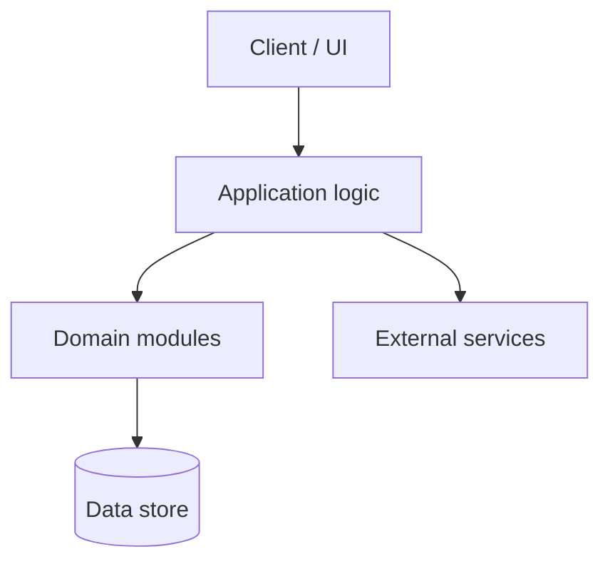

# Final Report — <Team / Project Name>

> **How to use this template.** Copy this file into your repository (for example,
> `docs/final-report.md`), delete these instruction blockquotes, and replace every _italic
> prompt_ with your own content. This is your capstone artifact and the main thing you are
> assessed on — see [Appendix A, §A.5](../chapters/appendix-a-team-project/README.md). It
> should tie the whole course together: requirements (Ch. 3–5), architecture (Ch. 6–7),
> process (Ch. 2), testing (Ch. 9), and metrics (Ch. 10). Reward comes from working
> software, real engineering evidence, and honest reflection.

| Field | Value |
|-------|-------|
| Team | _…_ |
| Members | _…_ |
| Date | _YYYY-MM-DD_ |
| Repository | _URL_ |
| How to run / try it | _URL or steps_ |
| Demo | _link to video or slides, if any_ |

## 1. Problem and users

_What problem did you set out to solve, and for whom? How did that understanding evolve
from the proposal to now? Name your real user(s) and stakeholders (Chapters 1, 3)._

## 2. Users and requirements

_The requirements you ultimately built. Present the final, prioritized user stories / use
cases, and be honest about what changed since the proposal and why (Chapters 3–5)._

| Priority | User story / use case | Delivered? | Notes |
|----------|-----------------------|-----------|-------|
| Must | _…_ | Yes / Partial / No | _…_ |
| Should | _…_ | | |
| Could | _…_ | | |

- **What changed since the proposal, and why:** _…_

## 3. Architecture

_Describe the system's structure and the reasoning behind it (Chapters 6–7). Discuss key
design decisions in the vocabulary of cohesion, coupling, and patterns, and the trade-offs
you accepted._

_Diagram placeholder — paste a current Mermaid diagram or link to `assets/diagrams/…`:_

- **Major components and responsibilities:** _…_
- **Key decisions and trade-offs:** _…_
- **Patterns used, and why:** _…_

## 4. Process used

_How you actually worked (Chapter 2) — not the idealized version. Your iterations, cadence,
board, standups, and where your process adapted mid-project._

- **Process and cadence:** _…_
- **What worked / what you changed:** _…_
- **Tools:** _repo, board, CI_

## 5. Testing and quality metrics

_Your test strategy and the evidence behind your quality claims (Chapters 9–10)._

- **Test strategy:** _unit / integration / end-to-end; black-box and white-box (Ch. 9)_
- **Coverage achieved:** _target vs. actual_
- **Defect data:** _found, fixed, open; where they clustered_
- **Analysis:** _what the numbers mean — analyze honestly with sound statistics (Ch. 10),
  don't cherry-pick a single flattering figure_

| Metric | Value | What it tells us |
|--------|-------|------------------|
| Test coverage | _…_ | _…_ |
| Velocity (per iteration) | _…_ | _…_ |
| Open / closed defects | _…_ | _…_ |
| _other_ | _…_ | _…_ |

## 6. Results

_What works, what does not, and how you know — measured against the "definition of done"
from your proposal. Be specific and evidence-based._

- **Goals met:** _…_
- **Goals not met, and why:** _…_
- **Evidence:** _screenshots, logs, test output, user feedback_

## 7. Retrospective

_The honest lessons. What surprised you, where estimates were wrong, what you would do
differently. Write for the next team — the most valuable sentences begin "if we did this
again, we would…". Insight is rewarded here, not spin._

- **What went well:** _…_
- **What went poorly:** _…_
- **What we'd do differently:** _…_
- **Biggest lesson about software engineering:** _…_

## 8. Individual contributions

_A fair account of who did what, backed by your running log and version-control history.
Keep it factual._

| Member | Primary responsibilities | Notable contributions | Rough share |
|--------|--------------------------|-----------------------|-------------|
| _…_ | _…_ | _…_ | _…%_ |
| _…_ | _…_ | _…_ | _…%_ |

- **Notes on collaboration:** _how work was divided and reviewed; how conflicts or
  imbalances were handled_

## 9. Appendix (optional)

_Links to the proposal, both status reports, the backlog, and any supporting data or
diagrams._
