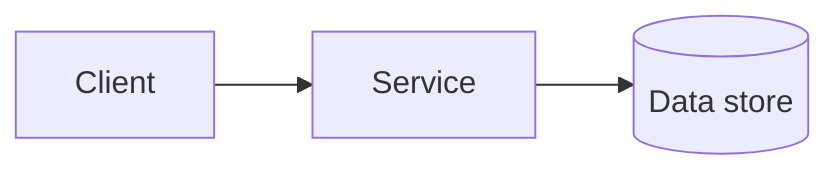

# Status Report <1 | 2> — <Team / Project Name>

> **How to use this template.** Copy this file into your repository (for example,
> `docs/status-1.md`), delete these instruction blockquotes, and fill in every _italic
> prompt_. Use **Report 1** for the *skeletal system* / walking skeleton
> ([Appendix A, §A.3](../chapters/appendix-a-team-project/)) and **Report 2** for
> the *viable system* / MVP ([§A.4](../chapters/appendix-a-team-project/)). Be
> honest: graders reward a clear-eyed status over an optimistic one.

| Field | Value |
|-------|-------|
| Report number | _1 (skeletal) / 2 (viable)_ |
| Team | _…_ |
| Date | _YYYY-MM-DD_ |
| How to run / try it | _URL or one-line command a grader can use_ |

## 1. Summary

_Two or three sentences: where the project stands and the single most important thing to
know since the last checkpoint._

## 2. What works right now

_Describe what a user can actually do end to end today._

- **Report 1 (skeletal):** _which single path runs end to end through every layer?_
- **Report 2 (viable):** _which must-have user stories work end to end for a real user?_

| Feature / story | Status | Evidence (link, screenshot, test) |
|-----------------|--------|-----------------------------------|
| _…_ | Done / Partial / Not started | _…_ |
| _…_ | | |

## 3. Architecture (current)

_Show the system as it actually is now, not as proposed. Note where reality diverged from
the plan and why (Chapters 6–7)._

_Diagram placeholder — paste a Mermaid diagram or link to `assets/diagrams/…`:_

- **Key decisions since last report:** _…_
- **Divergence from proposal / previous report:** _…_

## 4. Process and progress

_How the team worked this period (Chapter 2)._

- **Iterations completed:** _…_
- **Velocity / throughput:** _stories or points per iteration_
- **Board snapshot:** _link_

## 5. Testing and quality (Report 2 emphasizes this)

_See Chapters 8–9._

- **CI status:** _passing? link to the pipeline_
- **Tests:** _how many, what kind (unit / integration / end-to-end)_
- **Coverage:** _target and current number_ (Report 1: at least one real end-to-end test)

## 6. Metrics so far (Report 2)

_Early numbers you are collecting for the final report (Chapter 10)._

- **Defects:** _open / closed_
- **Build health:** _…_
- **Other:** _…_

## 7. Risks, blockers, and changes

_What is threatening the plan, what is blocking you, and what you decided to change._

| Item | Impact | Action / owner |
|------|--------|----------------|
| _…_ | _…_ | _…_ |

## 8. Plan for next milestone

_Concrete, prioritized next steps toward the next deliverable._

- _…_
- _…_

## 9. Individual contributions this period

_Keep this current every report so the final one is honest._

| Member | What they did this period |
|--------|---------------------------|
| _…_ | _…_ |
